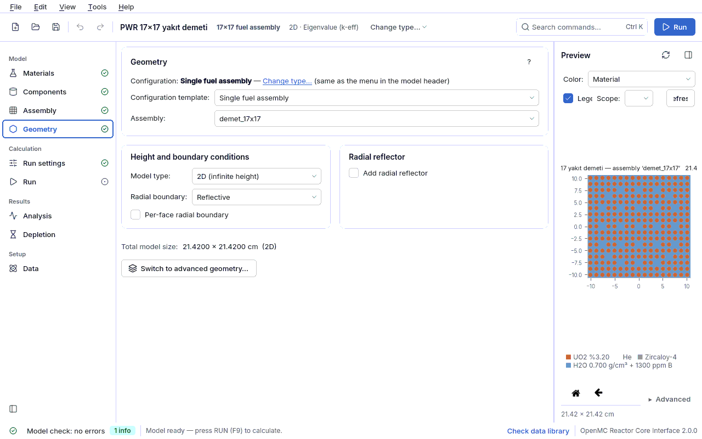

<div align="center">

# OpenMC Reactor Core Interface

**From a single fuel pin to a full core, from depletion to shielding — build OpenMC models in one
desktop application, see them before you run, compute, and read the results.**

[](CHANGELOG.md)
[](https://docs.openmc.org)
[](https://www.python.org)
[](https://doc.qt.io/qtforpython-6/)
[](INSTALL.md)
[](docs/IZLENEBILIRLIK.md)
[](LICENSE)

[Türkçe](README.md) · **English**


</div>

---

## Contents

- [Why?](#why)
- [Features](#features)
- [Installation](#installation)
- [Quick start](#quick-start)
- [⚠ DRAW FIRST, THEN RUN](#-draw-first-then-run)
- [Known pitfalls](#known-pitfalls)
- [Verification and validation](#verification-and-validation)
- [Documentation](#documentation)
- [Limitations and disclaimer](#limitations-and-disclaimer)
- [License and acknowledgements](#license-and-acknowledgements)

## Why?

OpenMC is a powerful Monte Carlo transport code, but building a reactor model in a Python script,
catching geometry errors before a run and normalising results correctly costs students and
researchers a lot of time. This application:

- builds the model **with forms and a geometry tree** and **validates every change immediately**;
- **draws the geometry before you run** — overlaps and undefined regions are flagged;
- starts the run, follows progress and convergence, and shows **results in physical units**;
- also exports the model as an **equivalent, readable OpenMC Python script** (the builder and the
  script give the same k; this is locked by tests).

## Features

| Area | What you get |
|---|---|
| **Modelling** | Material library and **material assistant** (%TD, enrichment, ppm boron, MOX, IAPWS-IF97 water density, personal library); fuel pin, plate, square/hexagonal assembly, full core, control rods and drums, axial layers; **flexible geometry tree**; **TRISO** compacts and pebbles; start From scratch / From template / From example |
| **Preview and viewer** | Drawing in a background process (the UI never freezes), part/assembly/node scope, material/cell/**overlap** modes, mesh tally overlay, 3D view |
| **Calculation** | Eigenvalue and fixed source; photon transport and temperature treatment; mesh and surface tallies; **weight windows (MAGIC)**; critical boron/rod search; run queue, history, comparison, SLURM scripts |
| **Results** | k-eff and convergence (Shannon entropy); **pin power table**, F_ΔH / F_q, quarter folding, CSV; **local k map** and per-assembly k∞ wizard; spectrum, **four factors**, spectral indices; mesh maps and **VTK** (ParaView) |
| **Depletion** | 8 integrators, cooling steps, restart, MicroXS fast mode, per-step pin power; **ring/axial region subdivision** (Gd pins); activity, decay heat, photon source; **branch tables** |
| **Advanced analysis** | Reactivity coefficients and critical search; **point kinetics** (β_eff, Λ via IFP; Inhour); **group constants** (openmc.mgxs), multigroup MC and **random ray** |
| **Compliance and traceability** | Profile checks and an HTML/PDF report annex for every run; **NUREG/CR-6698** bias and USL; reproducibility capsule (`kapsul.json`) |
| **Usability** | Turkish and English UI; light/dark theme; command palette; user guide with 21 lessons; **Data page** (pick or download a nuclear data library) |

<table>
<tr>
<td width="50%"><br><sub>Geometry with live preview</sub></td>
<td width="50%"><br><sub>Local k map (quarter core, assembly level)</sub></td>
</tr>
<tr>
<td width="50%"><br><sub>Mesh tally map and VTK export</sub></td>
<td width="50%"><br><sub>Depletion settings and region subdivision</sub></td>
</tr>
</table>

## Installation

**Requirements:** Linux x86-64 (glibc ≥ 2.28; Ubuntu 22.04/24.04 and Fedora are the targets),
~2 GB disk for the application + ~13 GB for nuclear data.

**A. Single-file installer** — no conda, no root, installs offline:

```bash
paket/constructor/uret.sh                                # builds the installer -> dist/ (once)
bash dist/openmc-arayuz-3.0.0-Linux-x86_64.sh            # default target: ~/openmc-arayuz
~/openmc-arayuz/bin/openmc-arayuz                        # start (also added to the menu)
```

**B. Developer setup (conda):** environment, running from the source tree, tests and
troubleshooting, step by step: **[INSTALL.md](INSTALL.md)**.

Nuclear data is **not** bundled. On first launch the **Data** page opens: pick a folder that
contains `cross_sections.xml`, or download one of the official libraries (ENDF/B-VIII.0, JEFF,
JENDL …) from within the application.

## Quick start

```bash
./calistir.sh                              # start screen: From scratch / template / example
./calistir.sh ornekler/pwr_17x17.json      # open an example as a copy
OPENMC_ARAYUZ_DIL=en ./calistir.sh         # English interface
```

1. Start **From scratch**; the step guide takes you through materials → parts → assemblies → geometry.
2. Once the preview is drawn and validation is clean, **Run** (F9) is enabled.
3. Results are on the Run and Analysis pages; reports and CSV files are saved from there.

It also works without the interface:

```bash
openmc-arayuz-kosu ornekler/pwr_pinhucre.json                 # validate + run + summary
openmc-arayuz-kosu ornekler/pwr_17x17.json --betik model.py   # write the equivalent OpenMC script
```

Step-by-step lessons: **[user guide](docs/kilavuz/en/00-giris.md)**.

## ⚠ DRAW FIRST, THEN RUN

The **RUN button stays disabled** until the geometry preview has been produced and validation
errors are fixed — this prevents hours of running a wrong geometry. Details:
[guide §6.4](docs/kilavuz/en/06-sonuclar.md#64-plot-first-then-run).

## Known pitfalls

Measured traps such as data library temperature ranges (water S(α,β) only 284–800 K), hexagon
orientation, cladding apothem, the z range of the source box and silent acceptances in the
OpenMC API: [guide §6.5](docs/kilavuz/en/06-sonuclar.md#65-known-pitfalls).

## Verification and validation

Every number is measured and documented with its source (ENDF/B-VIII.0, OpenMC 0.16.0).

| Check | Result |
|---|---|
| Reference PWR pin cell k∞ (anchor) | within 1.3570 ± 0.0020; checked in every full suite |
| Godiva (HEU-MET-FAST-001) | 0.99957 ± 0.00054 (experiment 1.0000 ± 0.0010) |
| Builder ↔ exported script | same model, same k (difference ≤ 1e-13) |
| V&V set | 49 critical experiments; USL = 0.9275 for the LEU oxide thermal subset (n = 24, NUREG/CR-6698) |
| Analytic checks | Bateman, Co-60 decay heat, one/multi-group kinetics, surface current balance, ring volume, 2-group k∞ |
| Test suite | 1618 tests (Monte Carlo included), 91.8 % coverage; 98 requirements in the traceability matrix |

Details: [docs/VV.en.md](docs/VV.en.md) · [docs/IZLENEBILIRLIK.md](docs/IZLENEBILIRLIK.md) ·
[CHANGELOG.md](CHANGELOG.md) ("what we verified / what we did not").

## Documentation

| Document | Contents |
|---|---|
| [User guide](docs/kilavuz/en/00-giris.md) · [TR](docs/kilavuz/tr/00-giris.md) | Page-by-page guide and 21 lessons |
| [INSTALL.md](INSTALL.md) · [KURULUM.md](KURULUM.md) | Installation, nuclear data, tests, troubleshooting |
| [docs/VV.en.md](docs/VV.en.md) · [TR](docs/VV.md) | Verification and validation: C/E, AOA, bias, USL |
| [docs/STANDARTLAR.en.md](docs/STANDARTLAR.en.md) · [TR](docs/STANDARTLAR.md) | Standards and compliance matrix |
| [docs/ORNEKLER.en.md](docs/ORNEKLER.en.md) · [TR](docs/ORNEKLER.md) | Example models, their sources and measured results |
| [docs/GEOMETRI_MODELI.en.md](docs/GEOMETRI_MODELI.en.md) | Geometry tree (user-facing summary) |
| [docs/TEKNIK_NOTLAR.en.md](docs/TEKNIK_NOTLAR.en.md) | Technical notes and measurements |
| [docs/SOZLUK.md](docs/SOZLUK.md) | Binding TR → EN terminology |
| [CHANGELOG.md](CHANGELOG.md) · [Release notes](docs/SURUM_NOTLARI.md) | Changes and verification summary |

## Limitations and disclaimer

- This is an **education and research tool; it is not a certification, licensing or
  criticality-safety approval tool.** The compliance checks produce the evidence that standards ask
  for and show what is missing; they do not replace it.
- Linux only. Tests in real distribution containers, a real library download and other open points
  are listed in [CHANGELOG.md](CHANGELOG.md) ("what we did not verify").
- Nuclear data libraries are subject to their own licenses and are not included in the repository.

## License and acknowledgements

Copyright © 2026 Enes. **All rights reserved** — see [LICENSE](LICENSE) for the terms of use;
third-party components: [THIRD_PARTY_LICENSES.md](THIRD_PARTY_LICENSES.md).

Built on [OpenMC](https://github.com/openmc-dev/openmc) (MIT), Qt for Python
([PySide6](https://doc.qt.io/qtforpython-6/), LGPL) and the scientific Python ecosystem.
Validation cases rely on ICSBEP definitions and inputs from
[mit-crpg/benchmarks](https://github.com/mit-crpg/benchmarks) (MIT).
