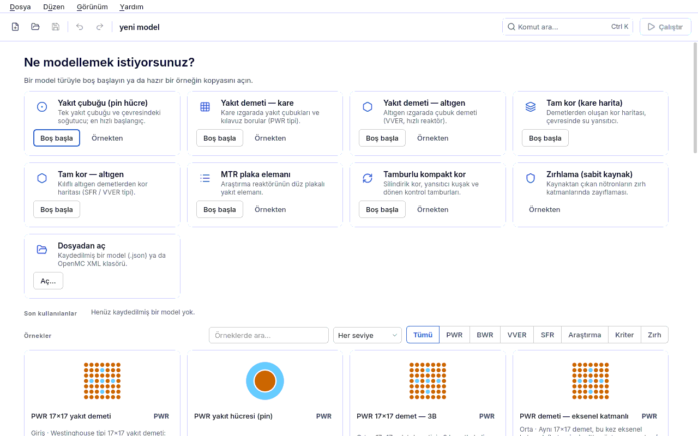
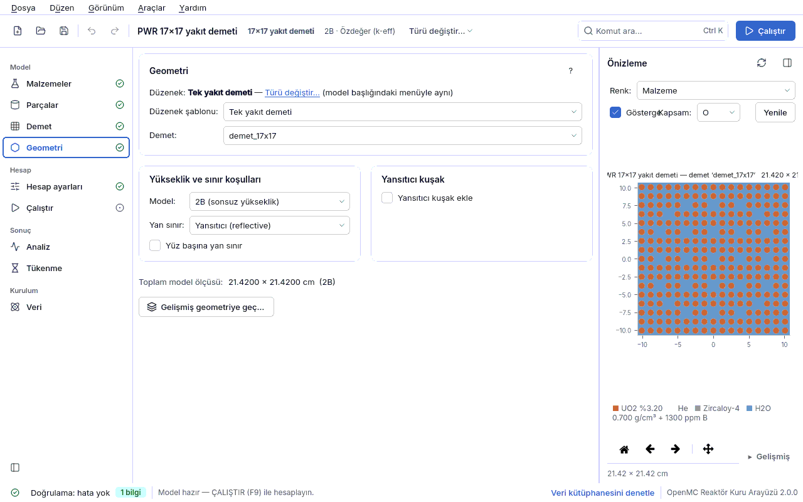
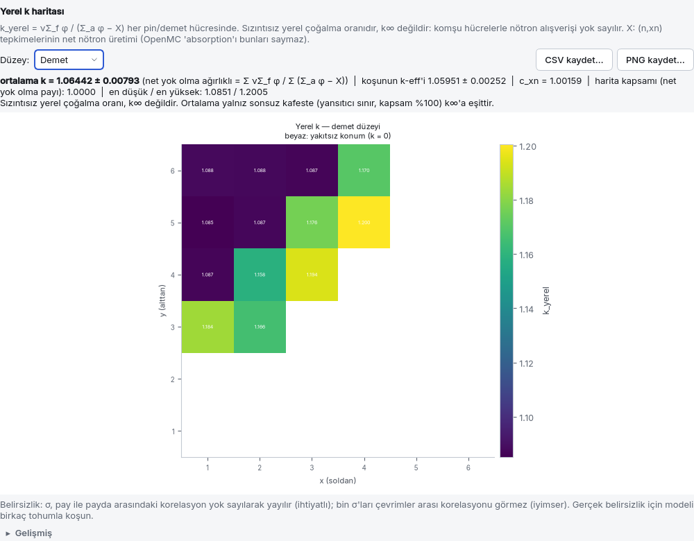
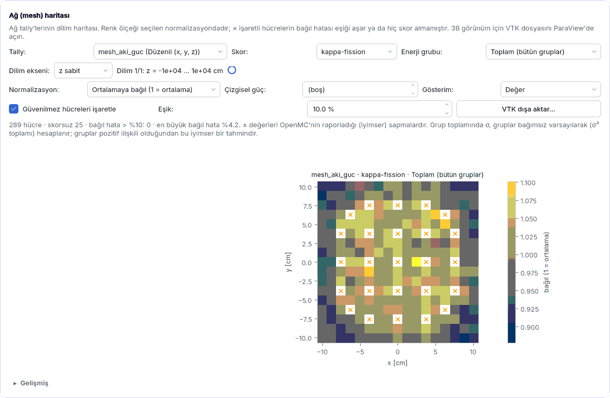
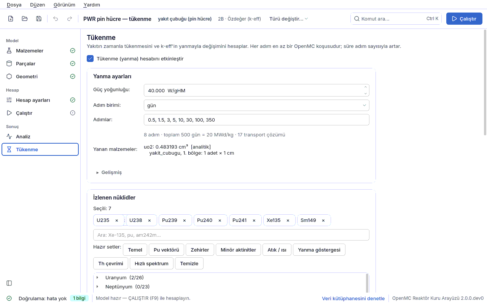

<div align="center">

# OpenMC İnput Kurulum ve Çözüm Arayüzü

**Yakıt çubuğundan tam kora, tükenmeden zırhlamaya — OpenMC modellerini tek bir masaüstü
uygulamasında kurun, çalıştırmadan önce görün, hesaplayın ve sonuçlarını okuyun.**

[](CHANGELOG.md)
[](https://docs.openmc.org)
[](https://www.python.org)
[](https://doc.qt.io/qtforpython-6/)
[](KURULUM.md)
[](docs/IZLENEBILIRLIK.md)
[](LICENSE)

**Türkçe** · [English](README.en.md)



</div>

---

## İçindekiler

- [Neden?](#neden)
- [Özellikler](#özellikler)
- [Kurulum](#kurulum)
- [Hızlı başlangıç](#hızlı-başlangıç)
- [⚠ ÖNCE ÇİZ, SONRA ÇALIŞTIR](#-önce-çiz-sonra-çalıştır)
- [Bilinen tuzaklar](#bilinen-tuzaklar)
- [Doğrulama ve geçerleme](#doğrulama-ve-geçerleme)
- [Belgeler](#belgeler)
- [Sınırlamalar ve sorumluluk reddi](#sınırlamalar-ve-sorumluluk-reddi)
- [Lisans ve teşekkür](#lisans-ve-teşekkür)

## Neden?

OpenMC güçlü bir Monte Carlo taşınım kodudur; ama bir reaktör modelini Python betiğiyle kurmak,
geometri hatasını koşudan önce yakalamak ve sonuçları doğru normalize etmek öğrenci ve
araştırmacılar için ciddi zaman alır. Bu uygulama:

- modeli **formlarla ve bir geometri ağacıyla** kurar, her değişikliği **anında doğrular**;
- geometriyi **çalıştırmadan önce çizer** — çakışma ve tanımsız bölgeleri işaretler;
- koşuyu başlatır, ilerlemeyi ve yakınsamayı izler, **sonuçları fiziksel birimleriyle** gösterir;
- kurduğu modeli **eşdeğer, okunabilir bir OpenMC Python betiği** olarak da dışa aktarır
  (kurucu ile betik aynı k'yı verir; testle kilitlidir).

## Özellikler

| Alan | Neler var |
|---|---|
| **Modelleme** | Malzeme kütüphanesi ve **malzeme asistanı** (%TD, zenginlik, ppm bor, MOX, IAPWS-IF97 su yoğunluğu, kişisel kütüphane); yakıt çubuğu, plaka, kare/altıgen demet, tam kor, kontrol çubuğu ve tamburu, eksenel katmanlar; **esnek geometri ağacı**; **TRISO** kompakt ve pebble; Sıfırdan / Şablondan / Örnekten başlangıç |
| **Önizleme ve görüntüleyici** | Arka plan sürecinde çizim (arayüz donmaz), parça/demet/düğüm kapsamı, malzeme/hücre/**çakışma** kipleri, mesh tally bindirmesi, 3B görünüm |
| **Hesap** | Özdeğer ve sabit kaynak; foton taşınımı ve sıcaklık işleme; mesh ve yüzey tally'leri; **ağırlık penceresi (MAGIC)**; kritik bor/çubuk araması; koşu kuyruğu, geçmiş, karşılaştırma, SLURM betiği |
| **Sonuçlar** | k-eff ve yakınsama (Shannon entropisi); **pin gücü tablosu**, F_ΔH / F_q, çeyrek katlama, CSV; **yerel k haritası** ve demet k∞ sihirbazı; spektrum, **dört faktör**, spektral indeksler; mesh haritası ve **VTK** (ParaView) |
| **Tükenme** | 8 entegratör, soğuma adımları, kaldığı yerden sürdürme, MicroXS hızlı kip, adım başına pin gücü; **halka/eksenel bölge bölme** (Gd pinleri); aktivite, bozunma ısısı, foton kaynağı; **dal tabloları** |
| **İleri analiz** | Reaktivite katsayıları ve kritik arama; **nokta kinetiği** (IFP ile β_eff, Λ; Inhour); **grup sabitleri** (openmc.mgxs), çok gruplu MC ve **random ray** |
| **Uygunluk ve izlenebilirlik** | Her koşuya profil denetimi ve HTML/PDF rapor eki; **NUREG/CR-6698** yanlılık ve USL; tekrarlanabilirlik kapsülü (`kapsul.json`) |
| **Kullanım** | Türkçe ve İngilizce arayüz; açık/koyu tema; komut paleti; kılavuz ve 21 ders; **Veri sayfası** (nükleer veri kütüphanesi seçimi/indirme) |

<table>
<tr>
<td width="50%"><br><sub>Geometri ve canlı önizleme</sub></td>
<td width="50%"><br><sub>Yerel k haritası (çeyrek kor, demet düzeyi)</sub></td>
</tr>
<tr>
<td width="50%"><br><sub>Mesh tally haritası ve VTK dışa aktarma</sub></td>
<td width="50%"><br><sub>Tükenme ayarları ve bölge bölme</sub></td>
</tr>
</table>

## Kurulum

**Gereken:** Linux x86-64 (glibc ≥ 2.28; Ubuntu 22.04/24.04 ve Fedora hedeflenir), ~2 GB disk
(uygulama) + nükleer veri için ~13 GB.

**A. Tek dosya kurulum paketi** — conda gerekmez, kök yetkisi istemez, çevrimdışı kurulur:

```bash
paket/constructor/uret.sh                                # paketi üretir -> dist/ (bir kez)
bash dist/openmc-arayuz-3.0.0-Linux-x86_64.sh            # varsayılan hedef: ~/openmc-arayuz
~/openmc-arayuz/bin/openmc-arayuz                        # başlat (menüye de eklenir)
```

**B. Geliştirici kurulumu (conda):** ortam, kaynak ağacından çalıştırma, testler ve sorun giderme
için adım adım: **[KURULUM.md](KURULUM.md)**.

Nükleer veri pakete **girmez**. İlk açılışta **Veri** sayfası açılır: `cross_sections.xml` içeren
bir klasör seçin ya da ENDF/B-VIII.0, JEFF, JENDL gibi resmî kütüphanelerden birini uygulamanın
içinden indirin.

## Hızlı başlangıç

```bash
./calistir.sh                              # başlangıç ekranı: Sıfırdan / Şablondan / Örnekten
./calistir.sh ornekler/pwr_17x17.json      # bir örneği kopya olarak aç
```

1. **Sıfırdan** başlayın; aşama rehberi sizi malzeme → parça → demet → geometri sırasıyla götürür.
2. Önizleme çizilip doğrulama temizlenince **Çalıştır** (F9) açılır.
3. Sonuçlar Çalıştır ve Analiz sayfalarında; rapor ve CSV'ler aynı yerden kaydedilir.

Arayüz olmadan da çalışır:

```bash
openmc-arayuz-kosu ornekler/pwr_pinhucre.json                 # doğrula + koş + özet
openmc-arayuz-kosu ornekler/pwr_17x17.json --betik model.py   # eşdeğer OpenMC betiği yaz
```

Adım adım dersler için: **[kullanım kılavuzu](docs/kilavuz/tr/00-giris.md)**.

## ⚠ ÖNCE ÇİZ, SONRA ÇALIŞTIR

Geometri önizlemesi üretilmeden ve doğrulama hataları giderilmeden **ÇALIŞTIR düğmesi
etkinleşmez**: yanlış geometriyle saatlerce koşmayı önler. Ayrıntı:
[kılavuz §6.4](docs/kilavuz/tr/06-sonuclar.md#64-önce-çiz-sonra-çalıştır).

## Bilinen tuzaklar

Veri kütüphanesi sıcaklık aralıkları (su S(α,β) yalnız 284–800 K), altıgen yönelim, kılıf
apotemi, kaynak kutusunun z aralığı ve OpenMC API'sinin sessiz kabulleri gibi ölçümle bulunmuş
tuzaklar: [kılavuz §6.5](docs/kilavuz/tr/06-sonuclar.md#65-bilinen-tuzaklar).

## Doğrulama ve geçerleme

Her sayı ölçülmüştür ve kaynağıyla belgelenmiştir (ENDF/B-VIII.0, OpenMC 0.16.0).

| Denetim | Sonuç |
|---|---|
| Referans PWR pin hücresi k∞ (çapa) | 1.3570 ± 0.0020 bandında; her tam süitte denetlenir |
| Godiva (HEU-MET-FAST-001) | 0.99957 ± 0.00054 (deney 1.0000 ± 0.0010) |
| Kurucu ↔ dışa aktarılan betik | aynı model, aynı k (fark ≤ 1e-13) |
| V&V kümesi | 49 kritik deney; LEU oksit termal alt küme için USL = 0.9275 (n = 24, NUREG/CR-6698) |
| Analitik denetimler | Bateman, Co-60 bozunma ısısı, tek/çok grup kinetik, yüzey akımı dengesi, halka hacmi, 2 grup k∞ |
| Test süiti | 1618 test (Monte Carlo dahil), kapsam %91.8; 98 gereksinim izlenebilirlik matrisinde |

Ayrıntılar: [docs/VV.md](docs/VV.md) · [docs/IZLENEBILIRLIK.md](docs/IZLENEBILIRLIK.md) ·
[CHANGELOG.md](CHANGELOG.md) ("neyi doğruladık / neyi doğrulamadık").

## Belgeler

| Belge | İçerik |
|---|---|
| [Kullanım kılavuzu](docs/kilavuz/tr/00-giris.md) · [EN](docs/kilavuz/en/00-giris.md) | Sayfa sayfa anlatım ve 21 ders |
| [KURULUM.md](KURULUM.md) · [INSTALL.md](INSTALL.md) | Kurulum, nükleer veri, testler, sorun giderme |
| [docs/VV.md](docs/VV.md) · [EN](docs/VV.en.md) | Doğrulama ve geçerleme: C/E, AOA, yanlılık, USL |
| [docs/STANDARTLAR.md](docs/STANDARTLAR.md) · [EN](docs/STANDARTLAR.en.md) | Standartlar ve uygunluk matrisi |
| [docs/ORNEKLER.md](docs/ORNEKLER.md) · [EN](docs/ORNEKLER.en.md) | Örnek modeller, kaynakları ve ölçülen sonuçlar |
| [docs/GEOMETRI_MODELI.md](docs/GEOMETRI_MODELI.md) | Geometri ağacının tasarımı |
| [docs/TEKNIK_NOTLAR.md](docs/TEKNIK_NOTLAR.md) | Ayrıntılı teknik notlar, ölçümler, kod haritası |
| [docs/SOZLUK.md](docs/SOZLUK.md) | Bağlayıcı TR → EN terim sözlüğü |
| [CHANGELOG.md](CHANGELOG.md) · [Sürüm notları](docs/SURUM_NOTLARI.md) | Değişiklikler ve doğrulama özeti |

## Sınırlamalar ve sorumluluk reddi

- Bu uygulama bir **eğitim ve araştırma aracıdır; sertifika, lisanslama ya da kritiklik güvenliği
  onayı aracı değildir.** Uygunluk denetimleri standartların isteyeceği kanıtı üretir ve eksikleri
  gösterir; yerine geçmez.
- Yalnız Linux desteklenir. Gerçek dağıtım kapsayıcılarında ve gerçek kütüphane indirmesiyle yapılan
  denemeler ile diğer açık noktalar: [CHANGELOG.md](CHANGELOG.md) "Neyi doğrulamadık".
- Nükleer veri kütüphaneleri kendi lisanslarına tabidir ve depoya dahil değildir.

## Lisans ve teşekkür

Copyright © 2026 Enes. **Tüm hakları saklıdır** — kullanım koşulları için [LICENSE](LICENSE);
üçüncü taraf bileşenler: [THIRD_PARTY_LICENSES.md](THIRD_PARTY_LICENSES.md).

Bu çalışma [OpenMC](https://github.com/openmc-dev/openmc) (MIT), Qt for Python
([PySide6](https://doc.qt.io/qtforpython-6/), LGPL) ve bilimsel Python ekosistemi üzerine kuruludur.
Geçerleme vakaları ICSBEP tanımlarına ve [mit-crpg/benchmarks](https://github.com/mit-crpg/benchmarks)
(MIT) depo girdilerine dayanır.
