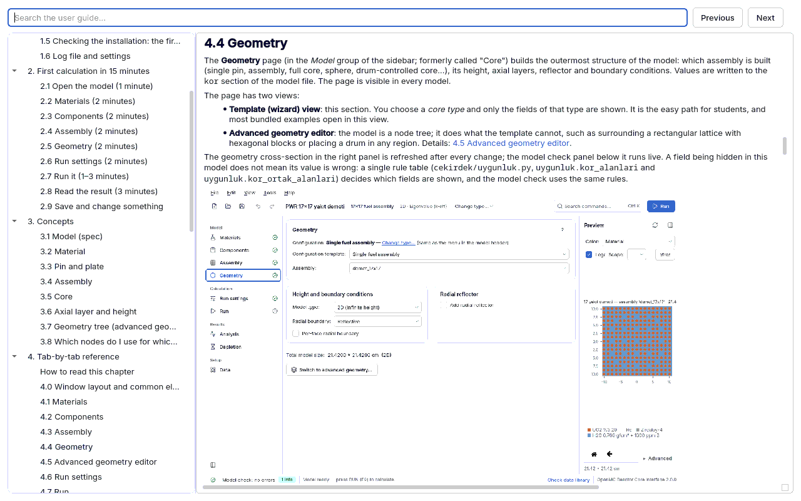

<a id="giris"></a>
# 0. Who this guide is for and how to read it

This guide was written so that you can use the OpenMC Reactor Core Interface ("the interface")
**without asking anyone**. The intended reader is a university student taking a reactor physics
course or a researcher running Monte Carlo transport calculations. You do not need to know OpenMC
beforehand; basic reactor physics concepts (k-eff, reactivity, neutron spectrum) are assumed.
For any unfamiliar term see [10. Glossary](10-sozluk.md#sozluk).

The guide is also the program's **user manual**: it describes the intended use, the limits,
the input definition, the meaning of the messages and worked example problems in one place (a
user document in the sense of ANSI/ANS-10.5; see [YAZILIM_KALITE.md](../../YAZILIM_KALITE.md)).



## 0.1 What the program does and does not do

**It does.** You build every model parameter, from materials to the core, in one interface; the
geometry is drawn and checked **before running**; the calculation is started from the same place
and the results are read there. The interface does not edit OpenMC objects directly but a
checkable **JSON model definition** (spec); the spec is the single source of truth:

```
spec (JSON) --> builder --> openmc.Model --> XML --> openmc
     +--------> script generator --> model.py (stand-alone OpenMC script)
```

Supported work: eigenvalue (k-eff) and fixed source calculations; pin cell, square/hexagonal
assembly, square/hexagonal full core, MTR plate-type fuel element, compact drum-controlled core,
spherical assembly and the **advanced geometry tree** (surrounding a square core with a hexagonal
ring, placing a drum in any region and so on); axial layers; control rods and drums; power
distribution and peaking factors; reactivity coefficient sweeps and critical search; depletion
(burnup); benchmark C/E comparison; result **conformity check** and report.

**It does not.** It does not write raw CSG (surface and region expressions) or read DAGMC/CAD
geometry; it does no transient or thermal-hydraulic calculation; it applies no dose conversion
coefficients; it depletes only in eigenvalue mode; it does not run across nodes with MPI (one
node with OpenMP). Full list: [Known limits](06-sonuclar.md#bilinen-sinirlar).

**It certifies nothing.** The tool cannot approve an analysis as "compliant with a standard".
What it does is **produce the evidence** that standards and good practice ask for and **make the
gaps visible**. An organisation that wants to use it for licensing or safety analysis needs its
own quality assurance programme and its own validation report. See
[7.3 What it shows and what it does not](07-uygunluk.md#ne-kanitlar).

## 0.2 Intended use and limits

| | |
|---|---|
| Use | Education (courses, laboratories), research, preliminary design and method comparison |
| Software class | **Non-safety-related** scientific software (ANSI/ANS-10.4 framework) |
| Validated environment | OpenMC 0.16.0, ENDF/B-VIII.0 (HDF5, 294 K and above), Linux |
| Input | Model file (`*.json`, schema version 3); written in the interface or by hand |
| Output | Run directory (`model.xml`, `spec.json`, `kapsul.json`, `statepoint.*.h5`, `kosu.log`), report (PDF/HTML), Python script |
| Verification | Regression anchor, benchmark set C/E, analytical tests ([7.4 V&V](07-uygunluk.md#vv)) |

Results are defensible only in this environment and for the applications the benchmark set
represents; with another library or OpenMC version the benchmark set must be run again.

## 0.3 Map of the guide

| Chapter | Read it when |
|---|---|
| [1. Installation and first start](01-kurulum.md#kurulum) | The program is not installed yet or nuclear data is missing |
| [2. First calculation in 15 minutes](02-ilk-hesap.md#ilk-hesap) | You are new: a PWR assembly calculation from start to finish |
| [3. Concepts](03-kavramlar.md#kavramlar) | What material, pin, assembly, core and geometry tree mean; how to build which arrangement |
| [4. Tab-by-tab reference](04-sekmeler.md#sekmeler) | The meaning, unit, typical range and common mistakes of a field |
| [5. Guided lessons](05-dersler.md#dersler) | You want to work step by step through an example file and see the expected result |
| [6. Interpreting results](06-sonuclar.md#sonuclar) | k-eff ± σ, source convergence, power distribution, known pitfalls |
| [7. Conformity check and V&V](07-uygunluk.md#uygunluk-denetimi) | What the conformity card says; USL, AOA; what it shows and what it does not |
| [8. Terminal and HPC use](08-terminal.md#terminal) | Running without the interface, scripts, reports, clusters |
| [9. Troubleshooting](09-sorun-giderme.md#sorun-giderme) | You see an error or a warning: cause and fix |
| [10. Glossary](10-sozluk.md#sozluk) | Turkish-English term equivalents |

You do not need to read the guide from cover to cover. Suggested path: **2 → 3 → the lesson you
care about (5) → 4 and 9 when needed**. Chapter 4 is a reference chapter; go there when you
wonder about a field on the screen.

## 0.4 Opening the guide in the program

- **Help menu → User guide**: opens the guide at the beginning.
- **F1**: opens the section of the page you are on (context help).
- The **"?"** buttons next to fields and cards, and the model check findings, open the related
  section.
- **Ctrl+K** (command palette) also searches the guide.

The guide window works offline (no internet needed). It has the contents on the left and a
search box at the top: **Enter** or **F3** jumps to the next match, **Shift+F3** to the previous
one; all matches are highlighted. The language of the guide is the interface language
(**View → Language**); if the English version of a section is not available yet, the Turkish one
is shown and a warning line appears at the top of the window.

The source text is Markdown under `docs/kilavuz/tr/` and `docs/kilavuz/en/`; it can also be read
on GitHub. The HTML and PDF versions are produced with `araclar/kilavuz.sh`
(see [8. Terminal and HPC use](08-terminal.md#terminal)).

## 0.5 Conventions

| Notation | Meaning |
|---|---|
| **Run settings** | A page, card, button or field label in the interface (as written on screen) |
| **File → Save as** | Menu path |
| **F9**, **Ctrl+K** | Keyboard shortcut |
| `ayarlar.parcacik` | A key in the model file (JSON); a dot means a nested dictionary, `[]` a list |
| `ornekler/pwr_17x17.json` | A file in the repository (examples open as copies and are never overwritten) |
| `openmc-arayuz-kosu ...` | Terminal command |

JSON keys and identifiers are Turkish ASCII words (for example `ayarlar` = settings, `parcacik` =
particles); they are not translated because they are part of the file format.

Numerical conventions:

- The decimal separator is a **point** (1.18443); the number boxes in the interface also use the
  point.
- Unless stated otherwise, an uncertainty is the **1σ standard uncertainty** (not an "error");
  `k = 1.18443 ± 0.00088` is not a confidence interval.
- **pcm** is always given with its definition: either **Δk × 10⁵** (a k difference) or
  **Δρ × 10⁵** (a reactivity difference, ρ = (k − 1)/k). The two are not the same; the guide says
  which one is meant.
- Length in cm, temperature in K, angle in degrees, energy in eV (unless stated otherwise).
- The measured numbers in the guide (k-eff, F_ΔH, critical boron...) are taken from the documents
  in the repository (`docs/VV.md`, `docs/ORNEKLER.md`, `docs/TEKNIK_NOTLAR.md`) and from the `referans.olcum`
  field of the examples; small differences in the last digits on your machine are statistical.

## 0.6 Message levels

The guide and the interface use three finding levels:

- **error** — prevents running; the model or the data is wrong or incomplete.
- **warning** — you can run, but the result may be biased or unexpected; read the cause.
- **info** — only draws attention.

When you do not understand a finding, look it up in [9. Troubleshooting](09-sorun-giderme.md#bulgu-turleri)
by the finding's **location** code (for example `malzeme:uo2`, `kor`, `ayarlar`).
