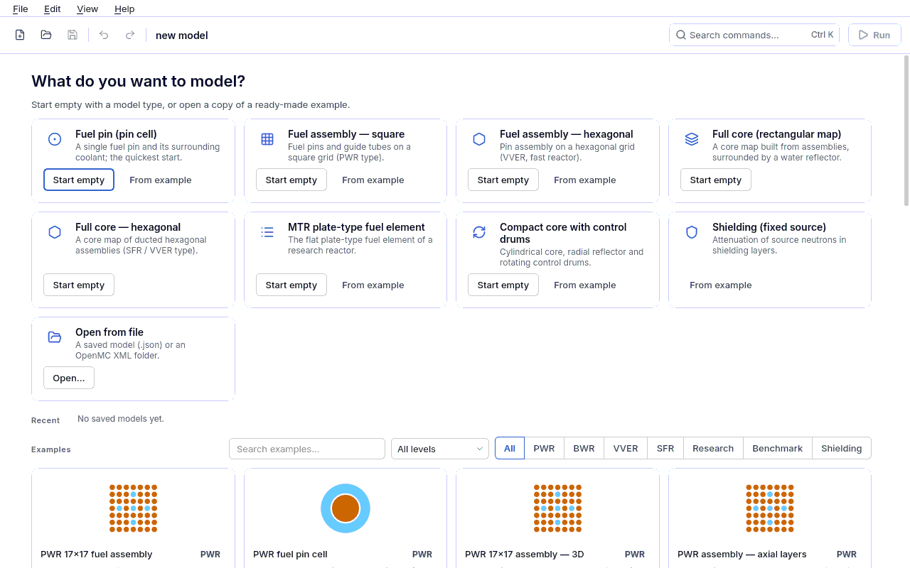

<a id="kurulum"></a>
# 1. Installation and first start

This chapter covers installing the program from scratch, downloading the nuclear data and the
**Start** screen shown at first start. The full text of the steps is in
[KURULUM.md](../../../KURULUM.md) in the repository; here you also find **why** each step is
needed and how to check it.

## 1.1 Requirements

| | |
|---|---|
| Operating system | Linux (developed on Ubuntu 22.04 / 24.04). On Windows via **WSL2** (Ubuntu); the WSLg support of Windows 11 is enough for the graphical window. macOS has not been tested. |
| Disk | ~20 GB free space (~13 GB once the nuclear data is unpacked) |
| Memory | 8 GB is enough; 16 GB is comfortable for 17x17 assemblies and 3D models |
| Internet | Only for the data download (once, a few GB) |

The program runs in a **conda environment**: OpenMC is not published on PyPI, it comes from conda-forge.

## 1.2 Installation steps

**1. Conda (Miniforge).** Skip if you already have conda/mamba.

```bash
curl -L -O https://github.com/conda-forge/miniforge/releases/latest/download/Miniforge3-Linux-x86_64.sh
bash Miniforge3-Linux-x86_64.sh        # accept the defaults, then close and reopen the terminal
```

**2. Environment.** In the repository folder:

```bash
conda env create -f environment.yml    # OpenMC 0.16.0 + PySide6 + matplotlib ... (a few minutes)
conda activate openmc-env
pip install -e . --no-deps             # commands: openmc-arayuz, openmc-arayuz-kosu
```

`--no-deps` is given on purpose: all dependencies were installed by `environment.yml`; letting
pip look for OpenMC on PyPI breaks the installation.

**3. Nuclear data** (see [1.3](#nukleer-veri) below):

```bash
./veri_indir.sh --bashrc
```

When it finishes, **open a new terminal** (or `source ~/.bashrc`) and run `conda activate openmc-env`.

**4. Check and start:**

```bash
pytest -m hizli -n auto -q          # fast test suite; ends with "passed", 0 failed
./calistir.sh                       # the interface opens (or: openmc-arayuz)
./calistir.sh ornekler/pwr_17x17.json   # directly with an example (opened as a copy)
```

Before opening, `calistir.sh` checks the environment: is the `openmc` command on PATH, is
`OPENMC_CROSS_SECTIONS` set, is there a graphical session, is the depletion chain complete. If
something is missing it tells you what to do (see
[9.4 Installation and environment problems](09-sorun-giderme.md#kurulum-sorunlari)).

<a id="nukleer-veri"></a>
## 1.3 Nuclear data and depletion chain

A Monte Carlo calculation reads the **cross sections** of the nuclides from a library. This
program is validated with the OpenMC HDF5 version of the **ENDF/B-VIII.0** library (all
measurement anchors and benchmark results were obtained with it). The data does not ship with
the program (~13 GB unpacked); install it in one of two ways: the **Data** page in the interface
or `veri_indir.sh`. Both use **the same code** (`cekirdek/veri_indir.py`).

| Data | Size | Used for |
|---|---|---|
| ENDF/B-VIII.0 HDF5 cross sections (`endfb-viii.0-hdf5/cross_sections.xml`) | archive 3.4 GB, ~13.7 GB unpacked | every calculation |
| Depletion chains: ENDF/B-VIII.0 thermal + fast (3820 nuclides) | ~27 MB each | depletion |
| CASL thermal + fast (228 nuclides) | ~1 MB each | quick preliminary depletion studies |

### The Data and libraries page

The **Setup › Data** page at the bottom of the sidebar. If the program opens without finding any
data, this page opens **by itself** with a "Before you start: nuclear data" banner at the top;
the banner disappears once data is selected, and **Go to the start screen** takes you on to
building a model. While data is missing, the model check strip shows the error
`Data library · nuclear data library not found` and **Run is disabled**; **Go to finding** on the
strip brings you to this page.

- **Requirements** — the OpenMC executable and its version (`openmc --version`), the OpenMC
  Python API (same version as the executable?), HDF5 (h5py), the cross section library and the
  depletion chain in one table: ✓ ok, ! warning, ✗ missing; for a missing item it says what to do.
- **Choose folder** — if a library is already on your computer, choose the folder that contains
  `cross_sections.xml` (or its parent). **Check and use** reads the XML and shows the number of
  neutron nuclides, S(α,β) tables and photon elements, sample temperature ranges (U235, H1,
  water S(α,β)) and entries whose file is missing. A folder with missing files (a half-unpacked
  archive) is **not accepted**. The depletion chain is chosen separately; the fast and CASL
  chains are read from the same folder as the thermal chain.
- **Download library** — the 12 libraries on the official openmc.org list (ENDF/B-VII.1,
  ENDF/B-VIII.0, ENDF/B-VIII.1, JEFF-3.3, JEFF-4.0, JENDL-5, the LANL and NEA versions,
  FENDL-3.2): archive size, temperatures, content and usage note, link to the evaluation page.
  Chain boxes (ENDF/B-VIII.0 thermal/fast, CASL thermal/fast), target folder (default
  `~/nucdata`), required and free disk space. The download runs **in the background** (the
  interface does not freeze); after **Cancel** the partial file stays and the button becomes
  **Resume** — it continues where it stopped.

The choice is written to `~/.config/openmc_arayuz/veri.json` and **persists**; no environment
variable is needed. Run, depletion and preview subprocesses get the same path.

**Which data is used (order).** (1) If the `OPENMC_CROSS_SECTIONS` environment variable is set,
**that one** (even if the file is missing; the page notes this, and your choice is not used until
the variable is removed), (2) the choice on the Data page, (3) `~/nucdata/*/cross_sections.xml`
or `~/.local/share/openmc_arayuz/nucdata/*/cross_sections.xml` — with several candidates
`endfb-viii.0-hdf5` is chosen; without it the program **does not choose by itself**, the page
and the model check strip say "several libraries found" and ask you to choose. While an
automatically found candidate is used, the strip shows an **info** finding and the report says
"automatically found candidate". If the ENDF/B-VIII.0 chain is combined with another library
(e.g. JENDL-5), Requirements shows a warning. For the chain the same order
starts with `OPENMC_CHAIN_FILE`; without a choice the `chain/` folder next to the library is
used. The report, the experiment capsule and the model check all read from this single resolver
(`cekirdek/veri_yolu.py`).

**Security and integrity.** Only `https` and the domains in the catalogue (`anl.box.com`,
`anl.app.box.com`, `public.boxcloud.com`); every redirect is checked too. The byte count is
compared with the catalogue and the sha256 (when known); the file is first written as `.part` and
moved into place only after it checks out. **openmc.org does not publish sha256 values:** the
chains' sha256 was measured once in this project and is kept in the catalogue; for libraries only
the byte count is checked and the computed sha256 is written to the `KAYNAK.json` receipt in the
installed folder (`sha256_dogrulandi: false`); the page and `veri_indir.sh` state this with the
label "no sha256: size checked only". When unpacking, links (symlink/hardlink), absolute paths and members containing
`..` are rejected; the unpacked size and member count are limited; unpacking stops if the disk
runs low; a corrupt archive is deleted (and downloaded again). System directories (`/usr`,
`/etc` …), the home directory itself, `~/.ssh`, `~/.gnupg` and folders other users can write to
cannot be chosen as the target; partial files stay in a `.indirilen/` folder only you can read.
When the program is opened with a project file from the command line and data is missing, the
page does not open; only a notification appears.

The catalogue is `cekirdek/veri_katalogu.json`: source `https://openmc.org/data` (access date,
the sha256 of the source file and the measurement method are written in the catalogue). Licence:
the openmc.org page states no separate licence for the libraries; the distribution terms of the
source evaluation (ENDF/B, JEFF, JENDL …) apply — check the evaluation page before use.

### From the terminal: `veri_indir.sh`

```bash
./veri_indir.sh --liste                                # catalogue
./veri_indir.sh                                        # ENDF/B-VIII.0 + 4 chains -> ~/nucdata
./veri_indir.sh --hedef /baska/disk/nucdata --bashrc   # to another disk
./veri_indir.sh --kutuphane jendl-5                    # another library
./veri_indir.sh --yalniz-zincir                        # chains only (~57 MB)
```

When it finishes, the script writes the choice to the application settings. `--bashrc` also adds
two environment variables to `~/.bashrc` (needed only if you use `openmc` from the terminal):

```
OPENMC_CROSS_SECTIONS = ~/nucdata/endfb-viii.0-hdf5/cross_sections.xml
OPENMC_CHAIN_FILE     = ~/nucdata/chain/chain_endfb80_thermal.xml
```

- The interface **chooses** the chain for each model itself (thermal or fast; see
  [4.9 Depletion](04i-tukenme.md#tukenme)); `OPENMC_CHAIN_FILE` only sets the chains' folder.

**A partial download is not accepted.** (The first download in this project silently stopped at
13%; the file name and location were right, nobody looking at it could have seen the problem.) If
the download is interrupted, start it again; it resumes. The interface also shows a partial chain
as an **error** in the model check panel and does not start depletion.

> **WMP (windowed multipole) data is deliberately not downloaded.** The 1.7 GB file on
> openmc.org is the complete ENDF/B-VII.1 library; mixing it with VIII.0 cross sections would
> combine two different evaluations in one model.

**Temperature range.** The neutron data covers 250–2500 K, but for example **S(α,β) for water
covers only 284–800 K**. A material temperature or temperature sweep outside this range gives a
warning/error in the model check (see [6.5 Known pitfalls](06-sonuclar.md#tuzaklar)).

<a id="baslangic"></a>
## 1.4 First start: the Start screen

When the program opens without a model, the **"What would you like to model?"** screen appears.
No example is loaded automatically; you choose one of three ways:

| Way | Where | What it builds |
|---|---|---|
| **From scratch** | first card: core type selector + **Start from scratch** | A truly empty model: no materials, components, assemblies or geometry; only the core type is set. |
| **From template** | **From template** on the type cards | The working, simple model of that type (formerly "Start empty"). |
| **From example** | **From example** on the type cards, or the gallery below | An unsaved copy of a ready-made example. |



**From scratch.** Choose a core type (fuel pin, single fuel assembly, full core with a square or
hexagonal map, MTR plate-type fuel element) and press **Start from scratch**. The editor opens
on the **Materials** page and a **step guide** appears above the validation strip:

| Step | Page | Counts as done when |
|---|---|---|
| 1. **Add materials** | Materials | there is at least one material (fuel, cladding, coolant from the library) |
| 2. **Add a component** | Components | there is at least one pin (a plate-type element for the plate type) |
| 3. **Build an assembly** (assembly and full-core types only) | Assembly | there is at least one assembly |
| 4. **Build the geometry** | Geometry | the cell fill is chosen / the core map is filled |

Clicking a step opens its page; a finished step is marked with ✓, the next one is highlighted.
In a pin cell the first fuel pin is placed in the cell automatically, so the geometry step is
finished as well. When all steps are done the guide hides itself.

While the model is being built, validation findings are shown as **"Missing step" (info tone),
not as errors (red)**: in an empty model "pin not selected" is not an error but a step not yet
taken. The strip says "Building the model: 1/3 steps"; **Go to finding** opens the page of the
next step. Meanwhile **Run is disabled** and its tooltip says why ("The model is not built yet:
2 steps are missing. Next step: …"). Once the steps are done validation is back to normal; real
errors that remain are red as usual.

**Model type cards.** Each card has a description and two actions:

| Card | From template | From example | Model built (core type) |
|---|---|---|---|
| **Fuel pin (pin cell)** | yes | `ornekler/pwr_pinhucre.json` | `tek_cubuk` |
| **Fuel assembly — square** | yes | `ornekler/pwr_17x17.json` | `tek_demet` (square) |
| **Fuel assembly — hexagonal** | yes | `ornekler/sfr_altigen.json` | `tek_demet` (hexagonal) |
| **Full core (square map)** | yes | — | `kare_kafes` |
| **Full core — hexagonal** | yes | — | `altigen_kafes` |
| **MTR plate-type fuel element** | yes | `ornekler/mtr_plaka.json` | `tek_plaka` |
| **Compact core with drums** | yes | `ornekler/tamburlu_kor.json` | `tamburlu` |
| **Shielding (fixed source)** | — | `ornekler/zirh_kure.json` | `kuresel` |
| **Open from file** | **Open…** (Ctrl+O): a saved model (`.json`) or an OpenMC XML folder | | |

- **From template** builds a simple, working model: materials, components and geometry are ready;
  the run settings use the "Normal" accuracy preset. You can run it right away with **F9**.
- **From example** opens an **unsaved copy** of a ready example. `ornekler/*.json` are test
  references; they are never overwritten. For your own file use **File → Save as**.
- A spherical assembly (shielding, Godiva-type benchmarks) cannot be started from a template or from scratch: its shells are
  edited only in JSON ([4.4 Geometry](04d-geometri.md#geometri)).

**Recent.** The models you saved or opened appear in this strip (file name, directory, time of
last change).

**Show this screen at startup.** The check box at the bottom of the screen (default: on) is
stored in the settings. When it is off, the program opens next time with the **most recently
used project** (the project stays in the recent list); if the file cannot be found the Start
screen appears as usual.

**Example gallery.** All examples in the repository; at the top a search box (**Search
examples…**), a level selector (introductory / intermediate / advanced) and category buttons
(**PWR**, **BWR**, **VVER**, **SFR**, **Research**, **Benchmark**, **Shielding**). Clicking a card
opens the example as a copy. The list of examples, their sources and measured values:
[ORNEKLER.md](../../ORNEKLER.md).

While a model is open, **File → New…** returns to the Start screen; **Back to open model** (Esc)
returns to the model.

## 1.5 Checking the installation: the first run

On the Start screen choose **Fuel pin (pin cell) → From template**, then **F9** (Run). Within half a
minute the result card should show **k∞ ≈ 1.323 ± 0.001** (UO₂ 3.0%, hot operating condition,
"Normal" preset; measured 1.3227 ± 0.0008). Small differences in the last digit are statistics;
a difference larger than ±0.003 points to an installation problem (wrong library, missing S(α,β)
data).

For a more complete first session: [2. A first calculation in 15 minutes](02-ilk-hesap.md#ilk-hesap).

## 1.6 Log file and settings

- Application log: `~/.local/state/openmc_arayuz/openmc_arayuz.log` (under `XDG_STATE_HOME` if
  set). Attach this file when you report a problem.
- Interface settings (theme, language, recent files): `~/.config/openmc_arayuz/`.
- Language: **View → Language** (Turkish / English) or the environment variable `OPENMC_ARAYUZ_DIL=en`.
