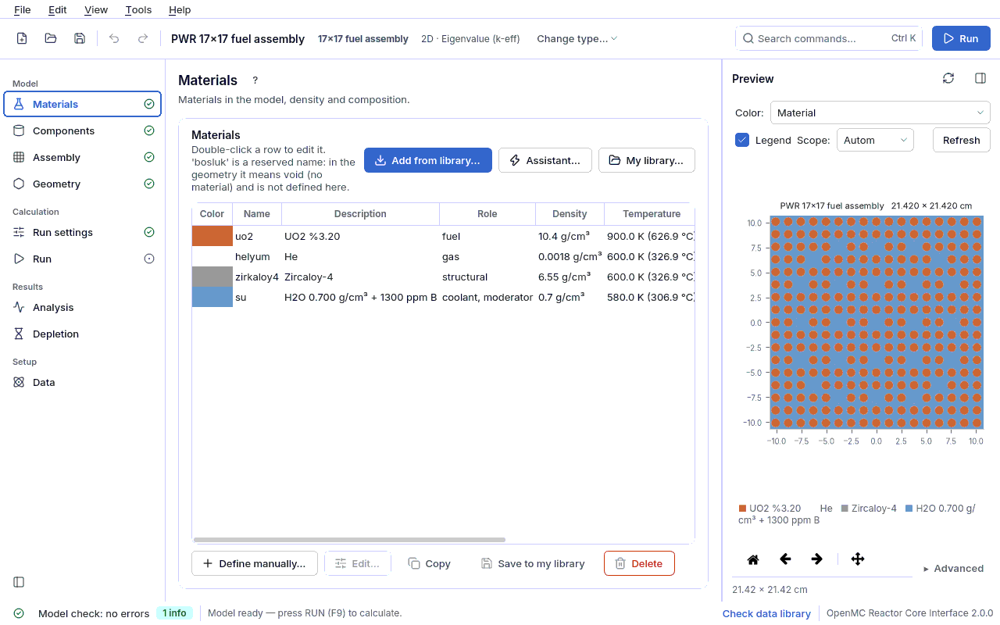
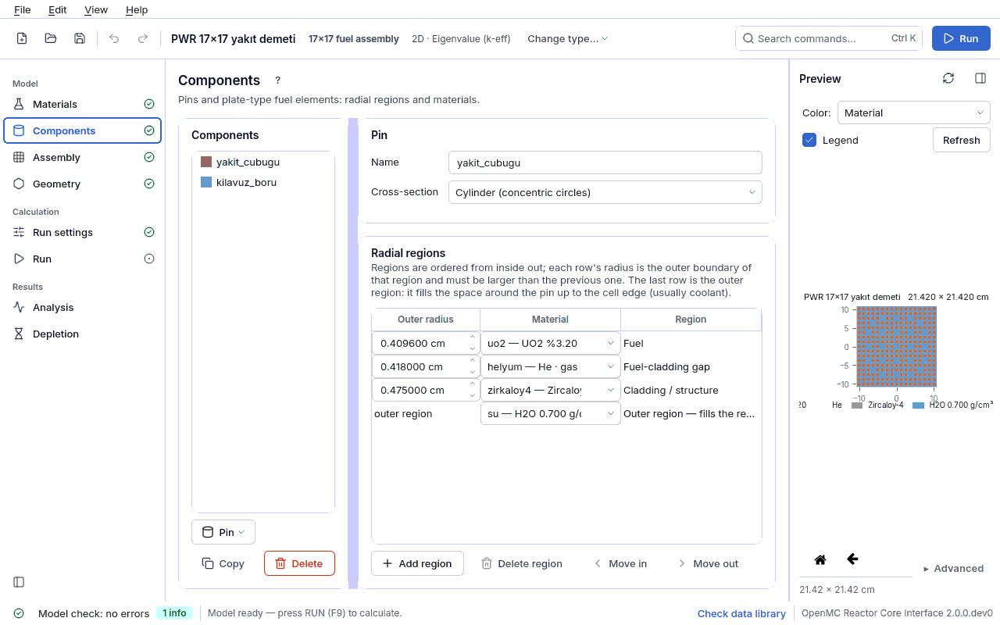
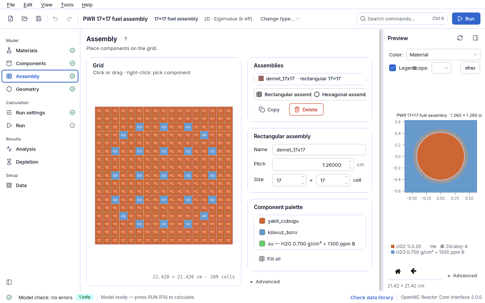

<a id="ilk-hesap"></a>
# 2. First calculation in 15 minutes

In this chapter you open a ready-made **PWR 17×17 fuel assembly** model, look at each of its pages
once, run the calculation and read the result. You can go to the end without changing anything;
the aim is to learn the flow of the program: **Materials → Components → Assembly → Geometry →
Run settings → Run**.

| | |
|---|---|
| Example file | `ornekler/pwr_17x17.json` |
| Time | ~15 minutes (the run takes 1–3 minutes, depending on the machine) |
| Expected result | k∞ = 1.18443 ± 0.00088 (measured: README, table of measured reference results, same settings) |
| Prerequisite | [1. Installation](01-kurulum.md#kurulum) done; `OPENMC_CROSS_SECTIONS` set |

## 2.1 Open the model (1 minute)

1. Start the program: `./calistir.sh` (or `openmc-arayuz`).
2. On the **Start** screen press the **From example** button of the **Fuel assembly — square**
   card (or click the **PWR 17×17 fuel assembly** card in the example gallery below).
3. A notification "example opened as a copy" appears at the bottom right: the example file does
   not change; you work on a copy.

The **model header** at the top says in one line what you are modelling: *PWR 17×17 fuel
assembly · 17×17 fuel assembly · 2D · Eigenvalue (k-eff)*. The sidebar on the left shows only the
pages that make sense for this model; the mark next to a name tells its state (✓ done, ! error,
• missing step).

## 2.2 Materials (2 minutes)



The model has four materials:

| Name | Description | Role | Density | Temperature |
|---|---|---|---|---|
| `uo2` | UO2 3.20 % | fuel | 10.4 g/cm³ | 900 K |
| `helyum` | He (pellet–cladding gap) | gas | 0.0018 g/cm³ | 600 K |
| `zirkaloy4` | Zircaloy-4 (cladding) | structural | 6.55 g/cm³ | 600 K |
| `su` | H2O 0.700 g/cm³ + 1300 ppm B | coolant, moderator | 0.7 g/cm³ | 580 K |

Double-click the `uo2` row: the form of the library material opens (enrichment, density,
temperature). Close it with **Cancel**. Note that the water density is computed from the
temperature and that boron is entered in ppm; the thermal scattering data (S(α,β)) for hydrogen
in water is added automatically. Details: [4.1 Materials](04a-malzemeler.md#malzemeler).

## 2.3 Components (2 minutes)



There are two pin definitions. **yakit_cubugu** (fuel pin) is made of concentric regions from the
inside out: UO₂ pellet (r = 0.4096 cm), helium gap (0.418 cm), Zircaloy-4 cladding (0.475 cm) and
the water filling the rest of the cell. **kilavuz_boru** (guide tube) is water (0.561 cm) +
Zircaloy-4 (0.602 cm) + water. The radii must **increase** outwards and the outermost region must
stay inside the cell pitch; the model check verifies this.
Details: [4.2 Components](04b-parcalar.md#parcalar).

## 2.4 Assembly (2 minutes)



The assembly is a 17×17 rectangular lattice with a cell pitch of **1.26 cm**: 264 fuel pins,
24 guide tubes and one instrument tube in the centre. The map is painted with the coloured
**component palette** by clicking or dragging; a right click picks the component of a cell. The
letters on the map (`y`, `k`, `e`) are the key kept in the background.
Details: [4.3 Assembly](04c-demet.md#demet).

## 2.5 Geometry (2 minutes)


The **layout template** is "single fuel assembly". The **Model** row is **2D (infinite height)**
and the **Side boundary** is **Reflective**: a neutron leaving any of the four faces of the
assembly comes back as in a mirror. This means an infinitely repeated lattice of assemblies; the
result is therefore **k∞** (the infinite multiplication factor without leakage), not the k-eff of
a finite core.

The **Preview** on the right shows the xy cross-section of the geometry in material colours. The
**Run** button is not enabled before the geometry has been drawn and the model check errors have
been fixed ([6.4 Draw first, then run](06-sonuclar.md#once-ciz)).
Details: [4.4 Geometry](04d-geometri.md#geometri).

## 2.6 Run settings (2 minutes)


- **Calculation type**: Eigenvalue (k-eff).
- **Accuracy preset**: **Normal** = 10000 particles per batch × 150 batches, the first 40 batches
  inactive. The line next to it gives the expected k uncertainty. **Quick test** (1000 × 60/20)
  takes less than a minute, but because it has 27 times fewer active histories its σ is about
  5 times larger; **Accurate** (50000 × 300/80) gives publication-quality statistics.
- Shannon entropy is on: at the end of the run the program judges whether the source converged.

Details: [4.6 Run settings](04f-hesap-ayarlari.md#hesap-ayarlari).

## 2.7 Run it (1–3 minutes)


1. Go to the **Run** page; keep the number of threads close to the number of cores of your machine.
2. Press **F9** (or the **Run** button in the top bar). For an unsaved example the run directory is
   created under `~/openmc_kosular`; the full path is written on the page.
3. During the run a live k-eff plot is drawn: it fluctuates in the inactive batches and settles in
   the active ones. **Stop** interrupts the run.

## 2.8 Read the result (3 minutes)

When the run ends, the result card shows a value like:

```
k∞ = 1.18443 ± 0.00088        (1σ standard uncertainty)
```

Your number may differ in the last two digits; that is statistics. Check:

1. Is the **uncertainty** of the order of 0.0008? (The expected value for the Normal preset.) If
   |k − 1.18443| ≤ 2·√(σ₁² + σ₂²) ≈ 0.002, the result agrees with the README measurement.
2. Does the **source convergence** line say the source "appears converged"? If not, increase the
   inactive batches ([6.2 Source convergence](06-sonuclar.md#kaynak-yakinsamasi)).
3. Is the number of **lost particles** zero? If not, the geometry has a gap or an overlap.
4. The **conformity** card (profiles A and D) lists the rules met and not met; "not applicable"
   lines are normal on the first run ([7. Conformity check](07-uygunluk.md#uygunluk-denetimi)).

**What does k∞ = 1.18 mean?** An infinite lattice of this assembly is 18 % above critical without
leakage. In a real core, leakage and control (boron, rods, burnup) balance this excess; k∞ > 1
does not mean that a reactor is supercritical. The rules for interpreting results:
[6. Interpreting results](06-sonuclar.md#sonuclar).

## 2.9 Save and change something

- Save the model to your own folder with **File → Save as**. From then on, runs are written to the
  `kosu` directory next to the model.
- Try this: on **Materials** edit the `su` (water) material, set the boron concentration from
  1300 ppm to 0 and run again. k∞ rises clearly; the boron worth of this assembly is about
  −7 pcm/ppm (README, reactivity coefficients section; Δk × 10⁵). The systematic way to do such sweeps is
  the **Analysis** page ([4.8 Analysis](04h-analiz.md#analiz)).
- If you make a mistake, **Ctrl+Z** undoes every edit.

Next step: [3. Concepts](03-kavramlar.md#kavramlar), then the
[5.1 assembly k∞ lesson](05-dersler.md#ders-demet).
