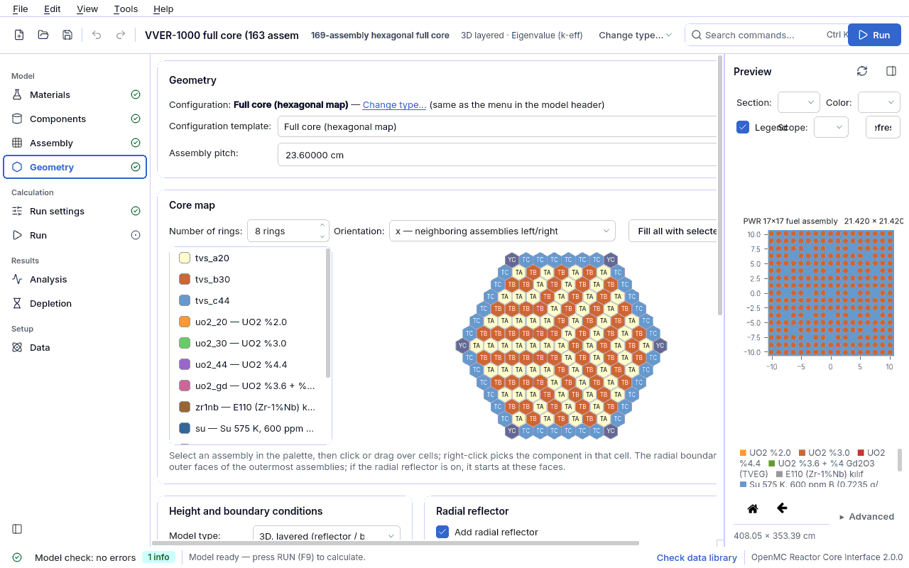

<a id="geometri"></a>
## 4.4 Geometry

The **Geometry** page (in the *Model* group of the sidebar; formerly called "Core") builds the
outermost structure of the model: which assembly is built (single pin, assembly, full core,
sphere, drum-controlled core...), its height, axial layers, reflector and boundary conditions.
Values are written to the `kor` section of the model file. The page is visible in every model.

The page has two views:

- **Template (wizard) view**: this section. You choose a *core type* and only the fields of
  that type are shown. It is the easy path for students, and most bundled examples open in
  this view.
- **Advanced geometry editor**: the model is a node tree; it does what the template cannot,
  such as surrounding a rectangular lattice with hexagonal blocks or placing a drum in any
  region. Details: [4.5 Advanced geometry editor](04e-geometri-gelismis.md#geometri-gelismis).

The geometry cross-section in the right panel is refreshed after every change; the model check
panel below it runs live. A field being hidden in this model does not mean its value is wrong:
a single rule table (`cekirdek/uygunluk.py`, `uygunluk.kor_alanlari` and
`uygunluk.kor_ortak_alanlari`) decides which fields are shown, and the model check uses the
same rules.


<a id="geo-sablon"></a>
### 4.4.1 Configuration template and core type

The **Geometry** card at the top of the page states the model type ("Assembly: ... - Change
type..."). The **Change type...** link is the same as the menu in the model header; the type
changes only through these two paths and the **Configuration template** list below. Every change can
be undone with **Ctrl+Z**.

| Name shown in the list | `kor.tur` | What it builds | Example file |
|---|---|---|---|
| Fuel pin (pin cell) | `tek_cubuk` | a single pin cell (square pitch) | `ornekler/pwr_pinhucre.json` |
| Plate-type fuel element (MTR) | `tek_plaka` | a single plate-type fuel element | `ornekler/mtr_plaka.json` |
| Single fuel assembly | `tek_demet` | a single rectangular or hexagonal assembly | `ornekler/pwr_17x17.json`, `ornekler/sfr_altigen.json` |
| Full core (rectangular map) | `kare_kafes` | a rectangular core map of assemblies | `ornekler/pwr_smr_kor.json` |
| Full core (hexagonal map) | `altigen_kafes` | a hexagonal core map of assemblies | `ornekler/vver1000_kor.json` |
| Spherical assembly (shells) | `kuresel` | concentric spherical shells (Godiva type) | `ornekler/godiva_kriter.json` |
| Drum-controlled compact core | `tamburlu` | cylindrical core + radial reflector + rotating drums | `ornekler/tamburlu_kor.json` |
| Square core + hexagonal ring | `agac` | geometry tree (advanced mode) | `ornekler/pwr_kare_altigen_halka.json` |
| Hexagonal core + drum ring | `agac` | geometry tree (advanced mode) | `ornekler/altigen_tambur_halkasi.json` |
| Lattice core + drum reflector | `agac` | geometry tree (advanced mode) | `ornekler/kafes_tamburlu_yansitici.json` |

**When the core type changes**, fields that do not belong to the new type
(`sema.KOR_TUR_ALANLARI`) return to their default values; this way a value left over from
another type (for example an old `kor.cubuk` in an assembly model) cannot silently change the
model. If you return to the old type within the same session, the previous values are restored.
Spherical shells (`kor.kabuklar`) are not deleted. In the type menu of the model header, `kuresel`
and `agac` (advanced geometry) appear only while a model of that type is open.

**The last three entries** open a parameter window; pressing OK builds a geometry tree from the
dimensions and the model switches directly to advanced geometry (a single undo step). The fields
of the window and their initial values (`arayuz/geometri/sablonlar.py`):

| Template | Fields (initial value) |
|---|---|
| Square core + hexagonal ring | Core assembly A, Core assembly B (checkerboard), Core size (n x n) (5), Lattice pitch (outer size of the assembly, e.g. 21.42 cm), Block pitch (flat to flat) (30 cm), Block ring count (5), Block content (reflector block or hexagonal fuel assembly), Block material, Block channel radius (3 cm), Gap fill (water), Outer reflector thickness (20 cm), Reflector material, Height (2D) |
| Hexagonal core + drum ring | Assembly (hexagonal), Core ring count (3), Lattice pitch (assembly size + 0.01 cm), Core orientation (opposite of the assembly), Lattice outer fill (void), Reflector apothem (lattice envelope + 25 cm), Reflector material, Drum count (6), Drum center radius, Start angle (30 degrees), Rotation (group) (180 degrees), Drum definition name, Drum radius (6 cm), Drum body, Absorber material, Absorber inner radius (0.75 x drum radius), Absorber arc angle (120 degrees), Height (80 cm) |
| Lattice core + drum reflector | Core assembly A/B, Core size (n x n) (3), Lattice pitch, Reflector radius (80 cm), Reflector material, Drum count (4), Drum center radius (60 cm), Start angle (45 degrees), Rotation (group) (180 degrees), drum definition fields (radius 8 cm), Height (200 cm) |

The rectangular templates need at least one **rectangular** assembly in the model, the hexagonal
template a **hexagonal** one (otherwise the window says "A rectangular assembly is required for
this template..."; define the assembly on the [4.3 Assembly](04c-demet.md#demet) page).
Step-by-step use: [5. Guided lessons - square core + hexagonal ring](05-dersler.md#ders-kare-altigen)
and [placing a drum in any geometry](05-dersler.md#ders-tambur).

> ⚠ **Drum direction.** The initial values of the "Lattice core + drum reflector" template put
> the drums at the **corners** of the core (60 cm, 45 degrees); in a rough measurement this gave
> a worth of only ~600 pcm (Δk × 10⁵). The example file moves the drums closer, opposite the core
> faces (42 cm, 0 degrees), and gives ~3000 pcm (Δk × 10⁵) ([ORNEKLER.md](../../ORNEKLER.md)). If
> you are going to measure drum worth, choose the position deliberately.

<a id="geo-tur-alanlari"></a>
### 4.4.2 Type-specific fields

| Field | Meaning | Unit | Typical range | Common mistake | Spec key |
|---|---|---|---|---|---|
| **Configuration template** | the model type (table above) | — | 10 options | changing the type and expecting the fields of the old type to be kept (they return to defaults) | `kor.tur` |
| **Pin** | the pin that fills the pin cell ([4.2 Components](04b-parcalar.md#parcalar)) | — | — | running without selecting a pin (ERROR "no pin selected") | `kor.cubuk` |
| **Plate-type fuel element** | the element of the single plate model | — | — | trying to select it before defining it on the Components page | `kor.plaka` |
| **Assembly** | the assembly of the single-assembly model ([4.3 Assembly](04c-demet.md#demet)) | — | — | looking for the assembly pitch here: for a single assembly the pitch is in the assembly's own form | `kor.demet` |
| **Cell pitch** | side length of the pin cell (`tek_cubuk`) | cm | PWR 1.26; BWR ~1.3 | giving a value smaller than the pin's outer diameter (ERROR "the pin's outer diameter ... is larger than the cell pitch") | `kor.adim` |
| **Assembly pitch** | distance between neighbouring assembly centers (`kare_kafes`, `altigen_kafes`); for hexagonal maps flat to flat | cm | PWR 21.42; VVER-1000 23.6; SFR MET-1000 16.2471 | in a hexagonal map, giving a value smaller than the outer size of the assembly (duct included) (ERROR) | `kor.adim` |
| **Core fill** | the assembly, pin or material that fills the cylinder of the drum-controlled core | — | — | leaving it empty (ERROR "no core fill selected") | `kor.dolgu` |
| **Core radius** | radius of the fuel cylinder in the drum-controlled core | cm | 10–50 (`tamburlu_kor`: 16) | not considering it together with the drum center radius: the drums cannot enter the core | `kor.kor_yaricap` |

For a single pin, single plate and single assembly the lateral size comes from the pin/element/
assembly itself; in mapped cores the core size is map x assembly pitch. The **Total model size**
line at the bottom of the page shows the x × y (× H) size of the built model in cm, live; if it
reads "Could not be built: ...", the model cannot be built yet and the reason is in the model
check panel.

<a id="geo-harita"></a>
### 4.4.3 Core map (rectangular and hexagonal)

Visible only for the `kare_kafes` and `altigen_kafes` types. The map is painted with the same
**component palette** as the Assembly page: select a component in the palette and click or drag
on the grid; a right-click picks the component in that cell; **Fill all with the selected
component** fills every cell. Letters are assigned automatically in the background; in the file
the map is stored as letters (`kor.harita`) and the letter → assembly mapping as `kor.anahtar`.

| Field | Meaning | Unit | Typical range | Common mistake | Spec key |
|---|---|---|---|---|---|
| **Size** (columns × rows) | number of columns and rows of the rectangular map | — | 1–100 | forgetting that shrinking deletes filled cells on the right/bottom (you are asked to confirm; enlarging again does not restore them) | `kor.boyut` |
| map (painting) | the assembly at each position; in a rectangular map the first row is the top (+y) | — | — | putting a hexagonal assembly into a rectangular map (the palette does not offer it; if it comes from a file, ERROR) | `kor.harita`, `kor.anahtar` |
| **Ring count** | number of rings of the hexagonal map, center included: 2 → 7, 3 → 19 assemblies | — | 1–30 (`vver1000_kor`: 8) | reducing the ring count and losing the outer rings (you are asked to confirm) | `kor.halka_sayisi` |
| **Orientation** | orientation of the hexagonal core lattice (in the OpenMC `HexLattice` sense): `x` neighbouring assemblies to the right/left, `y` above/below | — | `x` or `y` | giving the same orientation as the assembly: if the assembly pin lattice is `y` the core must be `x` (90 degrees); if they are the same, ERROR "assembly corners overflow into the neighbouring cell" | `kor.yonelim` |

Only **hexagonal** assemblies, materials and "Void (no material)" enter the palette of a
hexagonal map; a rectangular assembly or a single pin does not fit into a hexagonal core cell.
The hexagonal map is stored as a ring list from outside to inside (6k entries in the ring of
radius k, 1 at the center). `vver1000_kor` is an 8-ring lattice with 169 positions; the 6 corners
of the outer ring are filled with a steel-water reflector (163 assemblies).



> ⚠ **The side boundary of a hexagonal full core**, if there is no radial reflector, is a
> **broken line** running along the outer faces of the assemblies; since there is no matching
> pair of planes, a Periodic (periodic) boundary is not offered for this type. If the side
> boundary is Reflective and the map contains more than one assembly type, the model check warns:
> the infinite-lattice equivalence holds only for identical and symmetric assemblies.

<a id="geo-tambur"></a>
### 4.4.4 Control drums (drum-controlled core)

Compact and space reactors (Kilopower, KRUSTY type) use **rotating control drums** instead of
rods: an arc of each cylinder embedded in the radial reflector is an absorber, and as it rotates
it moves closer to or away from the core. This card is visible only for the `tamburlu` type. To
place drums into another geometry (for example the reflector of a hexagonal or rectangular
lattice core), use a **placement** in the advanced editor
([4.5](04e-geometri-gelismis.md#gg-yerlesim)).

| Field | Meaning | Unit | Typical range | Common mistake | Spec key |
|---|---|---|---|---|---|
| **Drum count** | number of drums in the radial reflector; 0 = plain reflector (INFO) | — | 0–64 (`tamburlu_kor`: 8) | increasing the count without increasing the center radius: neighbours overlap | `kor.tambur.sayi` |
| **Drum radius** | outer radius of the drum | cm | 2–10 (4.0) | giving more than half the reflector thickness (the drum overflows the reflector) | `kor.tambur.yaricap` |
| **Center radius** | distance from the core axis to the drum center | cm | core radius + drum radius ... core radius + reflector − drum radius (21.5) | center − drum radius < core radius (ERROR "drums enter the core") | `kor.tambur.merkez_yaricap` |
| **Drum body material** | the non-absorbing part of the drum (usually the same as the reflector) | — | beryllium | leaving it empty (ERROR "no drum body material selected") | `kor.tambur.govde_malzeme` |
| **Absorber material** | material of the absorber arc | — | B₄C | choosing a material that contains no strong absorber (WARNING) | `kor.tambur.emici_malzeme` |
| **Absorber inner radius** | the absorber arc is the shell between this radius and the drum radius | cm | 0.6–0.8 of the drum radius (2.6) | giving a value equal to or larger than the drum radius (ERROR) | `kor.tambur.emici_ic_yaricap` |
| **Absorber arc angle** | angular width of the absorber shell | degrees | 90–180 (120) | giving 0 or more than 360 (ERROR) | `kor.tambur.emici_aci` |
| **Rotation** | rotation angle of all drums; a box and a slider with 0.1 degree steps | degrees | −360...360 | believing the direction is reversed: **0 degrees means the absorber faces the core** (inserted, lowest k), **180 degrees faces outward** (withdrawn, highest k) | `kor.tambur.donme` |
| **Placement** | live validity line: do the drums enter the core, overflow the reflector, do neighbours overlap (with the chord 2·R_m·sin(π/N)) | — | "Valid - distance between neighbouring drum centers ... cm" | trying to run without noticing the red line: an invalid placement stops the **model build** | — |
| (JSON only) start angle | azimuth of the first drum; there is no field in the interface, the value in the file is kept | degrees | 0 | — | `kor.tambur.baslangic_acisi` |

Measured (`ornekler/tamburlu_kor.json`, 8 B₄C drums, 120 degree arc): at a rotation of 0 degrees
k = 0.96346 ± 0.00092, at 180 degrees 1.00719 ± 0.00110; total drum worth 4372 pcm (Δk × 10⁵)
or 4506 pcm (Δρ × 10⁵) ([ORNEKLER.md](../../ORNEKLER.md), physics acceptance tests). For the
critical drum position use a critical search on the [Analysis](04h-analiz.md#analiz) page, with
the parameter "Control drum rotation".

> 📐 If the drum-controlled core is left **2D**, the model check gives an INFO: there is no axial
> leakage, k-eff is higher than it really is and the drum worth comes out different. For a
> realistic value select "3D, single region" and enter the active height.

<a id="geo-kabuk"></a>
### 4.4.5 Spherical shells

For the `kuresel` type (critical spheres such as Godiva and Jezebel, shielding spheres) the
model consists of concentric shells. The table in the **Spherical shells (inside out)** card
(Outer radius [cm] | Material) is **read-only**: there is no shell editor in this version; shells
are edited in the model file:

```json
"kor": {"tur": "kuresel", "kabuklar": [{"r": 8.7407, "malzeme": "heu"}],
        "sinir": {"yan": "vacuum"}}
```

- The `r` value of each shell is its **outer** radius (`kor.kabuklar[].r`, cm),
  `kor.kabuklar[].malzeme` is its material; `"bosluk"` for void. The radii must increase
  (ERROR).
- The outermost shell is the boundary surface of the model; its boundary is chosen on the
  **Outer surface boundary** row.
- A sphere has no axis: height, axial layers and bottom/top boundaries are not offered; if the
  file contains a height, an ERROR is given.
- For a bare criticality sphere the outer boundary must be **Vacuum (vacuum)**; Reflective means
  an infinite medium (WARNING).

<a id="geo-yukseklik"></a>
### 4.4.6 Height and boundary conditions

| Field | Meaning | Unit | Typical range | Common mistake | Spec key |
|---|---|---|---|---|---|
| **Model** | single choice: "2D (infinite height)", "3D, single region", "3D, layered (reflector / blanket / plenum)" | — | — | choosing 3D when you want k∞, or leaving 2D when you want a 3D rod worth | `kor.yukseklik` (`null` in 2D), `kor.eksenel.var` |
| **Height** | axial length of the model in "3D, single region" (z = −H/2 ... +H/2) | cm | PWR active 366; compact core 45–80 | looking for this field in a layered model: there the height is the sum of the layers | `kor.yukseklik` |
| **Side boundary** | boundary condition of the outer side surface: Reflective (reflective), Vacuum (vacuum), White (white), Periodic (periodic) | — | assembly/pin cell: Reflective; full core: Vacuum | Vacuum for a single cell or assembly (WARNING: leakage breaks the infinite-lattice assumption); radial reflector + Reflective side boundary (models an infinite array; Vacuum for a single core) | `kor.sinir.yan` |
| **Outer surface boundary** | for a spherical assembly the same field appears under this name | — | Vacuum | Reflective for a bare critical sphere (WARNING) | `kor.sinir.yan` |
| **Bottom boundary** | bottom z surface (only in 3D and outside the sphere) | — | Vacuum or Reflective | expecting the bottom/top boundary to have an effect in a 2D model: it is ignored (INFO) | `kor.sinir.alt` |
| **Top boundary** | top z surface (only in 3D and outside the sphere) | — | Vacuum or Reflective | — | `kor.sinir.ust` |
| **Per-face side boundary** | when checked, each flat outer face gets its own condition (symmetry models such as a quarter core) | — | — | not making the opposite face of a periodic face periodic (one-sided periodic stops OpenMC) | `kor.sinir.yuzler` |

Which condition is offered on which surface is decided by `uygunluk.sinir_secenekleri` (the
same rule exists in the model check):

- **Periodic (periodic)** is offered only on a side surface with plane pairs: rectangular cross
  section (pin cell, rectangular assembly, rectangular map) and a single hexagonal assembly. It is
  not offered for a cylinder (drum-controlled core), a sphere or the broken boundary of a
  hexagonal full core; on an unpaired periodic surface OpenMC stops with "Found only one periodic
  surface...".
- Periodic is **never** offered on the bottom/top surfaces: in a finite core axial periodicity
  connects the top of the core to its bottom and is not physical.
- If the value in the file is invalid on that surface, it is not deleted; the box shows "... -
  invalid on this surface" and the model check reports it as well.
- Which of these fields are meaningful in which model is held in the
  `uygunluk.kor_ortak_alanlari` dictionary: `yukseklik`, `eksenel`, `sinir_yan`, `sinir_alt`,
  `sinir_ust`.

The **Per-face side boundary** box appears only in models whose outer cross section has flat
faces (rectangular or hexagonal). When it is checked, the faces are listed with these labels:

| Outer cross section | Face labels | Format in the file |
|---|---|---|
| rectangular | **−x (left)**, **+x (right)**, **−y (bottom)**, **+y (top)** | `kor.sinir.yuzler` = `{"-x": ..., "+x": ..., "-y": ..., "+y": ...}` |
| hexagonal, `x` oriented prism | **Face 1 (normal 30°)**, **Face 2 (normal 90°)**, **Face 3 (normal 150°)**, **Face 4 (normal 210°)**, **Face 5 (normal 270°)**, **Face 6 (normal 330°)** | list of 6 entries (increasing face normal angle) |
| hexagonal, `y` oriented prism | **Face 1 (normal 0°)**, **Face 2 (normal 60°)**, **Face 3 (normal 120°)**, **Face 4 (normal 180°)**, **Face 5 (normal 240°)**, **Face 6 (normal 300°)** | list of 6 entries |

While the box is unchecked, all side faces use the **Side boundary** value. Example:
`ornekler/pwr_ceyrek_kor.json` is a quarter core; the two symmetry faces (−x, +y) are Reflective
and the two outer faces (+x, −y) are Vacuum. This way it solves the same physics as the full core
(four faces vacuum): the measured difference is 41 pcm (Δk × 10⁵), 0.46σ
([ORNEKLER.md](../../ORNEKLER.md), "Quarter-symmetric core"). The symmetry plane is a **mirror**:
if the loading pattern has no mirror symmetry (for example a checkerboard), the quarter model
solves a different loading.

<a id="geo-yansitici"></a>
### 4.4.7 Radial reflector

Visible for a single assembly, rectangular and hexagonal full cores and the drum-controlled
core. In the drum-controlled core the reflector is **mandatory** (the drums are embedded in it);
instead of the checkbox a note saying so is shown.

| Field | Meaning | Unit | Typical range | Common mistake | Spec key |
|---|---|---|---|---|---|
| **Add radial reflector** | surrounds the model with a radial reflector; on first use the first moderator/coolant in the model is suggested as its material | — | — | leaving the side boundary Reflective when adding a reflector (infinite array; a note appears) | `kor.yansitici.var` |
| **Thickness** | radial thickness of the reflector | cm | water 20–30; beryllium 10–20 (`tamburlu_kor`: 12) | making it thinner than twice the drum radius (drums overflow) | `kor.yansitici.kalinlik` |
| **Material** | material of the reflector; in a rectangular full core it also fills the outside of the lattice | — | water, graphite, beryllium, steel | leaving it empty (WARNING "no material selected for the radial reflector") | `kor.yansitici.malzeme` |

If `kor.yansitici.var` was left on in the file for a type in which no radial reflector is built
(for example a pin cell), the model check says "... no radial reflector is built - on in the
file but ignored".

<a id="geo-katmanlar"></a>
### 4.4.8 Axial layers

When **Model** is set to "3D, layered", the **Axial layers** card opens. In a real reactor the
active fuel is not a single axial region: there are reflectors below and above, natural uranium
blankets at the ends of the active region, a gas plenum and zones of different enrichment.
Without them the axial power shape and the reactivity coefficients do not come out realistic.

The table columns are **Name**, **Height** [cm] and **Fill**; the buttons are **+ Layer** (adds at
the top), **Delete**, **Move up**, **Move down**. In the table **the top layer is at the top**; in
the file the layers are stored **from bottom to top** (`kor.eksenel.bolgeler`).

| Field | Meaning | Unit | Typical range | Common mistake | Spec key |
|---|---|---|---|---|---|
| Name | display name of the layer (also written to the cell name) | — | "bottom reflector", "active", "plenum" | — | `kor.eksenel.bolgeler[].ad` |
| Height | thickness of the layer; hovering shows the z range | cm | reflector 20, blanket 15, active 300 | leaving a 0 cm layer (not counted as valid) | `kor.eksenel.bolgeler[].yukseklik` |
| Fill | the component that fills the layer: "Main fill (...)" = the core's own fill, "Void (no material)", or an assembly/pin/plate/material suited to the type | — | — | for a single assembly, giving an assembly of a different lattice type than the main one (not offered in the list) | `kor.eksenel.bolgeler[].dolgu` (`null` = main fill) |
| (JSON only) layer key | in a mapped core the map stays the same, only the letter → assembly mapping changes in that layer (axial enrichment zoning) | — | — | trying to change it in the table: it is shown locked, "(layer-specific map - from file)" | `kor.eksenel.bolgeler[].anahtar` |

While layers are on, the model height is **the sum of the layers**; `kor.yukseklik` is ignored
and set to `null` (single source of truth rule). The line under the card shows the total height,
the active fuel range and (if the power distribution is on) the range of the target pin, live.
There are three different heights and they must not be mixed up
([TEKNIK_NOTLAR.md](../../TEKNIK_NOTLAR.md), "three different heights"):

| | what | where it is used |
|---|---|---|
| total model | sum of the layers | geometry, axial boundary conditions |
| fissile range | layers containing fissile material | initial source box, control rod insertion |
| target pin range | layers containing the power target pin | axial mesh of the power distribution, W/cm |

For `ornekler/pwr_eksenel.json` these are 395 / 330 / 300 cm respectively.

> ⚠ **Interfaces between inner layers are always transparent.** Boundary conditions are applied
> only to the very bottom and very top surfaces. Source convergence also slows down in a layered
> model: in `pwr_eksenel` 40 inactive batches were not enough, 100 were needed
> ([4.6 Run settings](04f-hesap-ayarlari.md#hesap-ayarlari)).

<a id="geo-gecis"></a>
### 4.4.9 Switching to advanced geometry

The **Switch to advanced geometry...** button at the bottom of the page converts the template
into an editable node tree (`geometri.gelismise_gec`): `kor.tur` becomes `agac`, the tree is
written to the `geometri` section and the drum definition of a drum-controlled core to the
`tamburlar` library. A confirmation window asks first.

- **The switch is one-way.** The wizard closes; going back to the template is possible only with
  **Undo (Ctrl+Z)**, and the switch itself is undone in a single step
  ([GEOMETRI_MODELI.md](../../GEOMETRI_MODELI.md) §15 decision 1).
- The switch does not change the physics: `tamburlu_kor` gives a bit-for-bit identical k with the
  same seed in the tree and in the template ([ORNEKLER.md](../../ORNEKLER.md), physics
  acceptance tests).
- What to do with the tree: [4.5 Advanced geometry editor](04e-geometri-gelismis.md#geometri-gelismis).

The most frequent model check findings on this page (no pin selected, undefined letter in the
map, assembly pitch smaller than the assembly, drums enter the core, periodic face without a
partner...) and their solutions are listed under the `kor` location in
[9. Troubleshooting](09-sorun-giderme.md#bulgu-turleri).
