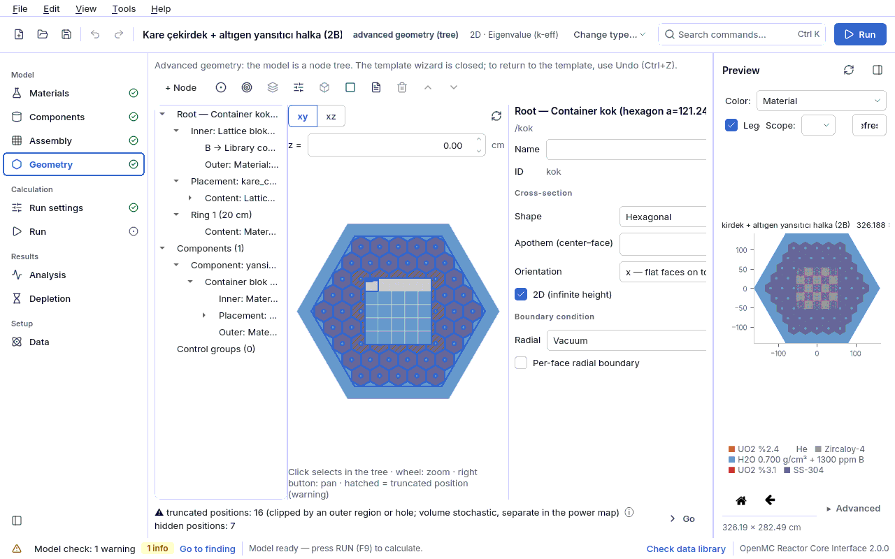
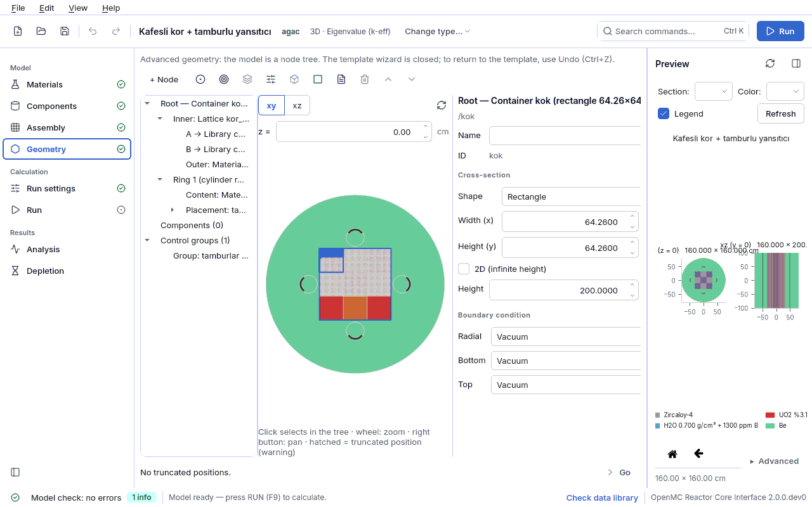

## 4.5 Advanced geometry editor

In advanced mode the model is a **geometry tree** made of nested **nodes** (`kor.tur` =
`agac`; the tree is in the `geometri` section of the model file). Assemblies that the closed
type list of the template cannot build are built this way: surrounding a rectangular lattice
with hexagonal blocks, placing a drum in the reflector of a hexagonal or rectangular lattice
core, putting a cylindrical reflector around a square core, building an axial stack at any
level. This is not a CSG editor: the user does not write surfaces; each node corresponds to a
single, well-known and checkable structure in OpenMC. Design document:
[GEOMETRI_MODELI.md](../../GEOMETRI_MODELI.md) §2–§3, §8, §10, §15.

There are three ways into advanced mode: **Switch to advanced geometry...** on the Geometry page
([4.4.9](04d-geometri.md#geo-gecis)), the last three entries of the **Configuration template** list,
or opening a file saved in advanced mode (`ornekler/pwr_kare_altigen_halka.json`,
`ornekler/altigen_tambur_halkasi.json`, `ornekler/kafes_tamburlu_yansitici.json`). The note at
the top of the page reminds you: the template wizard is closed; to return to the template use
**Undo (Ctrl+Z)**.

### 4.5.1 Screen layout and toolbar

| Area | What it does |
|---|---|
| top: toolbar | adding nodes and tree operations (table below); the right-click menu shows the same actions |
| left: tree | nodes, rings, placements, layers, and the **Components** and **Control groups** branches; drag and drop is allowed only onto a compatible slot (on an incompatible target the cursor shows "forbidden") |
| center: cross-section | schematic **xy** or **xz** cross-section; a z box in xy; the mouse wheel zooms, dragging with the middle/right button pans, a double click fits; a click selects that node in the tree; the selected node is in color, the others faded; truncated positions hatched, hidden positions dotted; in xz the layer boundaries are dashed lines |
| right: properties | the form of the selected item (below); number boxes carry units (cm, °) |
| bottom strip | summary of truncated / hidden positions and **Go** (selects the first lattice with a truncated position) |

The toolbar buttons are icons (except **+ Node** ▾); their names below appear at the start of
the tooltip and as the accessible name for screen readers.

| Action | When enabled | What it does |
|---|---|---|
| **+ Node** ▾ | while a node is selected | puts a new node into the selected slot: Material, Library component, Lattice, Container (shape + rings), Axial stack; the old one comes back with Undo |
| **+ Ring** | while a container is selected | adds an outer ring to the container (10 cm, first material) |
| **+ Placement** | while a container or ring is selected | places a hole + content in that region (drum, channel, sub-lattice); if the model has a drum definition the content is that drum, otherwise a material in a cylindrical hole of 1 cm radius |
| **+ Layer** | while an axial stack is selected | adds a layer to the stack |
| **+ Group** | always | adds a rotation group (its type can be changed to Insertion in the form) |
| **Extract to component** | while a lattice/container/stack other than the root is selected | asks for a name; moves the selected sub-tree to `geometri.parcalar` and puts a `bilesen` reference to that component in its place |
| **Wrap** | while a node is selected | puts the selection into the `ic` of a new container |
| **Rename** | while a named item is selected | renames a placement, group, component or container/lattice/stack; references are updated too |
| **Delete** | outside the root | deletes the selection |
| **Move up** / **Move down** | ring, placement, layer, component, group | changes the order in the list |

Every structural operation (add, delete, move, extract to component...) is **a single undo
step**; typing in form fields is stacked as a step after a short pause. If an operation is
rejected (for example an incompatible slot), the reason appears as a notification.

### 4.5.2 Basic concepts

- **Node types.** The user sees five types (`cekirdek/geometri/sema.py`, `KULLANICI_TURLERI`):
  `malzeme` (leaf; a material or `"bosluk"` = void), `bilesen` (use of a pin, plate, assembly,
  drum or component from the library), `kafes` (rectangular or hexagonal lattice), `kap`
  (container: shape + rings + holes), `eksenel` (z stack).
- **Slot.** A place where a node can be put: `kap.ic`, `kap.dis`, `halka.icerik`,
  `kafes.anahtar[harf]`, `kafes.dis`, `eksenel.icerik`, `katman.icerik`, `yerlesim.icerik`.
- **Definition and use.** The library sections (`cubuklar`, `plakalar`, `demetler`, `tamburlar`,
  `geometri.parcalar`) are *definitions*; a `bilesen` node in the tree is a *use* of a
  definition. However many times the same name is used, **a single universe** is built in
  OpenMC.
- **ID (`id`).** A short identifier unique within the tree (`kok`, `kor_kafesi`...); selection,
  the model check location (`geometri:<yol>`) and cell names use it.
- **Units and axes.** Length in cm, angle in degrees; positive angles are counterclockwise. Each
  node is centered at (0, 0) in its own local frame; an axial stack is centered around z = 0.
- **Two meanings of orientation (do not mix them up).** `kafes.yonelim` is in the OpenMC
  `HexLattice` sense; `kesit.yonelim` is in the `HexagonalPrism` sense. The orientation of a
  cross-section *surrounding* a hexagonal lattice is the same as the lattice's; the *element
  cell* of a hexagonal lattice, however, is a prism of the opposite orientation. That is why a
  hexagonal assembly goes into a hexagonal lattice element with the **opposite** orientation;
  with the same orientation you get an ERROR ("the assembly does not fit the element").

### 4.5.3 Content form (the node in each slot)

When a node other than the root is selected, content rows appear at the top of the form.

| Field | Meaning | Unit | Typical range | Common mistake | Spec key |
|---|---|---|---|---|---|
| **Type** | type of the node in the slot: Material, Library component, Lattice, Container (shape + rings), Axial stack | — | — | believing the old sub-tree is lost when the type changes: a new default node is put in, the old one comes back with Undo | `tur` = `malzeme` / `bilesen` / `kafes` / `kap` / `eksenel` |
| **Material** | material of the material node; "Void" = no material | — | — | leaving void inside the root (WARNING: neutrons pass without interacting) | `ad` (`{"tur": "malzeme", "ad": ...}`) |
| **Library component** | a pin, plate, assembly, drum or component from the library | — | — | trying to define the component here: definitions are on the Components/Assembly pages | `ad` (`{"tur": "bilesen", "ad": ...}`) |
| **Rotation** | the component is rotated when placed into the slot | ° | 0, 30, 60, 90 | rotating a material node (ERROR: OpenMC does not rotate a material-filled cell) | `donusum.donme` |
| **Translation x** | x offset of the component in the slot | cm | 0 | — | `donusum.oteleme` |
| **Translation y** | y offset of the component in the slot | cm | 0 | — | `donusum.oteleme` |

Drum definitions (`tamburlar[]`: `ad`, `yaricap`, `govde_malzeme`, `emici_malzeme`,
`emici_ic_yaricap`, `emici_aci`) come from a template in advanced mode (the drum-controlled core
or the drum assemblies); in this version there is no separate form to edit them, they are edited
in the model file. The **placement** fields of a drum (count, center radius, rotation, start
angle) are not in the definition but in the placement and the group.

### 4.5.4 Container form (shape + rings + holes)

A container consists of an inner region (`ic`) inside a **cross-section**, **rings** going
outward (`halkalar`) and **placements** carved into these regions (`yerlesimler`). The root of
the tree (`kok`) is always a container; height and boundary conditions exist only at the root.

| Field | Meaning | Unit | Typical range | Common mistake | Spec key |
|---|---|---|---|---|---|
| **Name** | display name | — | — | — | `ad` |
| **ID** | unique identifier (read-only) | — | `kok`, `blok` | — | `id` |
| **Shape** | cross-section shape: Rectangle, Cylinder (circle), Hexagon; at the root only, also Sphere and Lattice envelope (the broken boundary of a hexagonal lattice) | — | — | asking for a lattice envelope at a root that contains no hexagonal lattice (not offered) | `kesit.sekil` = `dikdortgen` / `silindir` / `altigen` / `kure` / `kafes_zarfi` |
| **Width (x)** | x size of a rectangular cross-section | cm | square core: n × assembly pitch | — | `kesit.boyut` |
| **Height (y)** | y size of a rectangular cross-section (not the axial height) | cm | — | taking it for the z height of the model | `kesit.boyut` |
| **Radius** | radius of the cylinder or sphere | cm | — | — | `kesit.yaricap` |
| **Apothem (center to face)** | distance from the center to a flat face of a hexagonal cross-section | cm | — | measuring to the corner (corner = 2·apothem/√3) | `kesit.apotem` |
| **Orientation** | orientation of a hexagonal cross-section (`HexagonalPrism` sense): `y` flat faces on the right/left, `x` flat faces on the top/bottom | — | `x` or `y` | mixing it up with the lattice orientation (§4.5.2) | `kesit.yonelim` |
| **2D (infinite height)** | (root only) the model is infinite in the axial direction | — | — | putting an axial stack into a 2D model (ERROR "an axial stack cannot be built in a 2D model") | `yukseklik` = `null` |
| **Height** | (root only) axial length of the model; hidden if the inner region contains an axial stack, and then the height is the sum of the layers | cm | 45–400 | writing a different height in addition while a stack exists (ERROR) | `yukseklik` |
| **Side**, **Bottom**, **Top** | (root only) boundary conditions; bottom/top only in 3D | — | Vacuum | asking for periodic on the bottom/top (not offered) | `sinir.yan`, `sinir.alt`, `sinir.ust` |
| **Per-face side boundary** | (root only) for a flat-faced outer cross-section, each face gets its own condition | — | — | one-sided periodic (the form warns, OpenMC stops) | `sinir.yuzler` |
| **Rotation**, **Translation x**, **Translation y** | (outside the root) transform of the container when placed into its slot | °, cm | — | rotating a container with a non-circular hole and expecting the hole to rotate too (ERROR) | `donusum.donme`, `donusum.oteleme` |

- Which boundary options are offered on which face follows the same rule as in the template
  ([4.4.6](04d-geometri.md#geo-yukseklik)); periodic is offered only on a rectangular or
  hexagonal outer boundary and only when no hole touches the boundary. Boundary types:
  `vacuum`, `reflective`, `white`, `periodic`.
- In a container that is not the root, `dis` (between the outside of the container and the
  boundary of its slot) is **mandatory**; at the root `dis` is **forbidden**.

### 4.5.5 Ring form

| Field | Meaning | Unit | Typical range | Common mistake | Spec key |
|---|---|---|---|---|---|
| **Definition** | how the ring is defined: **Thickness** or **Outer cross-section** | — | — | — | — |
| **Thickness** | grows the shape of the inner boundary uniformly: rectangle size + 2k, cylinder and sphere r + k, hexagon apothem + k | cm | reflector 10–30 | using a thickness on a lattice envelope (ERROR; give an outer cross-section) | `halkalar[].kalinlik` |
| Outer cross-section (Shape, Width (x), Height (y), Radius, Apothem (center to face), Orientation) | an outer boundary of a different shape for the ring (for example a cylindrical reflector around a square core) | cm | — | an outer cross-section that does not enclose the previous boundary (ERROR "the ring's outer cross-section does not enclose the previous one") | `halkalar[].dis` |

The content of a ring is the node below the ring in the tree (`halkalar[].icerik`); while a
ring is selected, **+ Placement** carves a hole into that ring (`halkalar[].yerlesimler`).

### 4.5.6 Lattice form and map editor

| Field | Meaning | Unit | Typical range | Common mistake | Spec key |
|---|---|---|---|---|---|
| **Name** | display name | — | — | — | `ad` |
| **ID** | unique identifier (read-only); the **Lattice** field of a placement shows it | — | `kor_kafesi` | — | `id` |
| **Shape** | Rectangular or Hexagonal | — | — | forgetting that changing the shape resets the map (Undo brings it back) | `sekil` = `kare` / `altigen` |
| **Pitch** | side of the cell in a rectangular lattice, flat to flat in a hexagonal one | cm | pin 1.26; assembly 21.42; hexagonal block 30 | pitch ≤ 0 (ERROR); measuring corner to corner in a hexagonal lattice | `adim` |
| **Columns** | number of columns of the rectangular map | — | 1–60 | — | `boyut` |
| **Rows** | number of rows of the rectangular map | — | 1–60 | leaving the number of map rows inconsistent with `boyut` (by hand in the file; ERROR) | `boyut` |
| **Ring count** | number of rings of the hexagonal lattice, center included | — | 1–60 | a hand-written map whose ring lengths do not match (ERROR) | `halka_sayisi` |
| **Orientation** | hexagonal lattice orientation (`HexLattice` sense): `y` neighbours above, `x` neighbours to the right | — | `x` or `y` | putting a hexagonal assembly into a lattice of the same orientation (ERROR) | `yonelim` |

**Map editor.** Each item in the palette is a letter: "A → demet_24", "B → yansitici_blok"; the
last item "· → outer (...)" is the **outer fill** of the lattice (`dis`). Click a letter and paint
the cells. **+ Letter** adds a new letter (with the first material); the content of a letter is
changed in the **content form** by selecting that letter's node in the tree. A rectangular map
is row by row (first row at the top), a hexagonal map is a ring list from outside to inside.
When the size changes, a rectangular map is aligned at the top-left corner and a hexagonal map
from the inside (inner rings are kept).

- `harita` (the `.` character = outer fill: irregular core or hidden position), `anahtar`
  (`{letter: node}`), `dis` (**mandatory**; in OpenMC the outside of the lattice and the `.`
  positions fall here). The only exception is the hexagonal lattice of a root with a lattice
  envelope; there `.` is not supported and a letter must be defined
  ([GEOMETRI_MODELI.md](../../GEOMETRI_MODELI.md) §16).
- In the map, **hatched** positions are truncated and **dotted** positions hidden; the counts are
  written under the form ("Hatched: k truncated positions ..., g hidden positions."). See
  [4.5.10](#gg-kesik).

### 4.5.7 Axial stack and layer forms

An axial stack divides a content into layers in the z direction; it can be built **at any
level** (inside the root for the whole core, or only inside one channel).

| Field | Meaning | Unit | Typical range | Common mistake | Spec key |
|---|---|---|---|---|---|
| **Name** (stack) | display name | — | — | — | `ad` |
| **Layers** | summary: "n layers, total h cm" | — | — | — | `katmanlar` |
| (stack) default content | the node used by layers whose content is empty | — | — | — | `icerik` |
| **Name** (layer) | name of the layer | — | "bottom water", "active" | — | `katmanlar[].ad` |
| **Height** (layer) | thickness of the layer | cm | 10–300 | a 0 cm layer (skipped, INFO); leaving the total of a non-root stack different from the model height (ERROR; the last layer is not silently stretched) | `katmanlar[].yukseklik` |
| **Use the stack's default content** | if checked, the layer uses the default content of the stack; when unchecked, the layer gets its own content (first material) | — | — | — | `katmanlar[].icerik` (`null` = default) |
| (JSON only) layer key | if the default content is a lattice, the map stays the same and the letter → content mapping changes in that layer | — | — | giving it for a content that is not a lattice (ERROR) | `katmanlar[].anahtar` |

Layers are ordered from bottom to top; **Move up** / **Move down** change the order. If the root
contains a stack, the height of the root is the sum of the stack (single source of truth rule).

### 4.5.8 Placement form: putting a drum, channel or sub-lattice anywhere

A placement carves a **hole** out of the region that owns it (the inner region of a container or
a ring) and puts a **content** into the hole. Drums, control channels, experimental channels and
the square core in the middle of hexagonal blocks are all placed with the same mechanism. Step by
step: [5. Guided lessons - placing a drum in any geometry](05-dersler.md#ders-tambur).

| Field | Meaning | Unit | Typical range | Common mistake | Spec key |
|---|---|---|---|---|---|
| **Name** | name of the placement (groups refer to it by this name) | — | "tambur_halkasi" | giving the same name to two placements | `yerlesimler[].ad` |
| **Mode** | Ring (evenly spaced), List (x, y), Lattice position (letter) | — | — | — | `yerlesimler[].mod` = `halka` / `liste` / `kafes_konumu` |
| **Count** | (ring) number of instances | — | 1–360 (drum: 4–12) | — | `yerlesimler[].sayi` |
| **Center radius** | (ring) distance of the instance centers from the region center | cm | middle of the reflector | letting the hole touch the region boundary (ERROR "hole overflows its region" / "overflows the inner boundary") | `yerlesimler[].merkez_yaricap` |
| **Start angle** | (ring) azimuth of the first instance; instance i: start + 360·i/n | ° | 0, 30, 45 | in a hexagonal core choosing an angle that faces the corners and believing it faces the flat sides (check the cross-section) | `yerlesimler[].baslangic_acisi` |
| **Positions** | (list) instance centers; **+ Position**, **Delete**; columns x [cm], y [cm] | cm | — | overlapping two holes (ERROR "holes overlap") | `yerlesimler[].konumlar` |
| **Lattice** | (lattice position) the holes are carved at the letter positions of this lattice; the lattice must be the inner region of the container or the content of a ring of the same container, and must have no transform | — | — | making the hole larger than the position cell (ERROR "overflows the lattice position cell") | `yerlesimler[].kafes` |
| **Letter** | (lattice position) whose positions | — | — | — | `yerlesimler[].harf` |
| **Natural cross section (drum circle)** | drum content only: the hole is the drum's own circle | — | checked | — | `yerlesimler[].kesit` = `null` |
| hole cross-section (Shape, Width (x), Height (y), Radius, Apothem (center to face), Orientation) | for content other than a drum the hole shape is **mandatory** | cm | — | rotating a non-circular hole by facing or rotation (ERROR) | `yerlesimler[].kesit` |
| Facing the core: Toward center / Fixed / None | the front face of the content (the absorber arc of a drum) is **local +x**; facing tells where this face is turned | — | Toward center for drums | putting an instance center on the facing center (direction undefined, ERROR; choose Fixed) | `yerlesimler[].bakis.tur` = `merkez` / `sabit` |
| **Center x** | x of the facing center (Toward center) | cm | 0 | — | `yerlesimler[].bakis.merkez` |
| **Center y** | y of the facing center (Toward center) | cm | 0 | — | `yerlesimler[].bakis.merkez` |
| **Angle** | fixed facing angle (Fixed) | ° | — | — | `yerlesimler[].bakis.aci` |
| **Group** | the **rotation** group the placement belongs to; "(no group)" | — | — | looking for the rotation in the placement: the value is in the group | `geometri.gruplar[].uyeler` |
| **Offset** | constant rotation added to this placement | ° | 0 | — | `yerlesimler[].donme_ofset` |

**The "facing the core" convention** (all modes; [GEOMETRI_MODELI.md](../../GEOMETRI_MODELI.md) §3.8):

- Rotation angle of instance i: in ring mode **ψᵢ = φᵢ + 180 + D** (bit-for-bit the same as the
  drum of the template); in list and lattice position modes, if facing is Toward center,
  **ψᵢ = atan2(m_y − y_i, m_x − x_i) + D**; if Fixed, **ψᵢ = facing angle + D**; if facing is
  None, the content's own transform.
- **D = group value + offset.** Result: **0 degrees means the absorber faces the core**
  (inserted, lowest k), **180 degrees faces outward** (withdrawn, highest k).
- If the container is rotated by a parent transform, the placement rotates with it and "facing
  the core" is preserved.

Measured (`ornekler/altigen_tambur_halkasi.json`, 6 B₄C drums): rotation 0° → k = 0.95139,
180° → k = 1.04533 (σ 0.0015–0.0017); total Δk = 9394 pcm (Δk × 10⁵), Δρ = 9446 pcm (Δρ × 10⁵)
([ORNEKLER.md](../../ORNEKLER.md)). More than 50 holes in one region give a WARNING (cell search
slows down).

### 4.5.9 Group and component forms

**Groups** drive several placements (rotation) or control rods (insertion) **with a single
value**. The value is kept **only in the group** (single source).

| Field | Meaning | Unit | Typical range | Common mistake | Spec key |
|---|---|---|---|---|---|
| **Name** | name of the group | — | "tamburlar", "Bank A" | — | `geometri.gruplar[].ad` |
| **Type** | Rotation or Insertion | — | — | forgetting that changing the type removes the members | `geometri.gruplar[].tur` = `donme` / `daldirma` |
| **Value** | in a rotation group the rotation of all member placements (box + 0.1° slider); in an insertion group the insertion fraction of the member control rods | °; for insertion % (relative to the active fuel range: 0% withdrawn, 100% fully inserted) | rotation −360...360; insertion 0–100 | taking the insertion value for cm (note below) | `geometri.gruplar[].deger` |
| **Members** | check list: placement names for rotation (all instances of a placement rotate together), control rod definitions for insertion | — | — | putting a member into two groups of the same type (ERROR); a group with a single member or none (WARNING) | `geometri.gruplar[].uyeler` |

> ⚠ **The insertion value is a percentage.** The core reads the value of an insertion group as a
> percentage (0...100; tip z = top − value/100 × active height). In this version the value box in
> the form shows the unit "°" and the tooltip says "insertion depth [cm]"; these are wrong, enter
> the value as a percentage.

- The member control rod's own insertion value is ignored (INFO if it differs).
- **Each control rod placement is a separate volume and instance**
  ([GEOMETRI_MODELI.md](../../GEOMETRI_MODELI.md) §15 decision 5): it carries its own identity,
  insertion and volume; depletion and tallies see it separately. Groups exist only to drive
  several rods at once, and a rod is a member of at most one group. Two banks in the same
  geometry need two separate control rod definitions.
- The target of a parameter sweep and a critical search is the group: `grup_donme` and
  `grup_daldirma` on the Analysis page ([4.8 Analysis](04h-analiz.md#analiz)).

**Components** (`geometri.parcalar[]`: `ad`, `dugum`) are named sub-trees; they are referenced
with `bilesen`.

| Field | Meaning | Unit | Typical range | Common mistake | Spec key |
|---|---|---|---|---|---|
| **Name** | name of the component; it cannot clash with a name in the library | — | "yansitici_blok" | giving the same name as a pin/assembly in the library (ambiguous name, ERROR) | `geometri.parcalar[].ad` |
| **Usage** | in how many places the component is used | — | — | — | — |

**Why a component?** If the same sub-tree is used in several places, **it must be a component**.
Copying an inline node into two slots produces two separate universes; the distribcell power
tally and the instance count in depletion are split. If the model check finds two inline
sub-trees with identical content it gives a WARNING ("convert to a component"). A component
cannot contain itself directly or indirectly (cycle, ERROR).

### 4.5.10 Truncated and hidden positions, model check and probing

If a lattice element or a library component is **clipped** by the boundary of the parent region
or by a hole, that position is **truncated**; if it lies completely under a hole, it is
**hidden**. The bottom strip says so ("⚠ k truncated positions ... ⓘ g hidden positions", or "No
truncated positions."); **Go** selects the first lattice with a truncated position.

- **A truncated position is a WARNING** ([GEOMETRI_MODELI.md](../../GEOMETRI_MODELI.md) §15
  decision 2): its volume is computed stochastically, it is marked separately as "truncated" in
  the power map and does not enter F_ΔH. While **pin-by-pin burnup** (Depletion page,
  `tukenme.malzemeleri_ayir`) is on, a truncated fuel instance is an ERROR.
- A truncated pin (a pin region cut by the cell boundary) also gives a WARNING.
- **A hidden position is INFO**: `.` can be written at that position in the map.
- Example: `ornekler/pwr_kare_altigen_halka.json` gives 16 "truncated block" WARNINGs; a hexagonal
  lattice cannot surround a square hole without clipping, this is inherent to the design. The fuel
  is not truncated, the fuel volume is analytical ([ORNEKLER.md](../../ORNEKLER.md)).

In advanced mode the model check first runs the structural check (unknown type, missing field,
undefined reference, ambiguous name, cycle, map size, ring that does not enclose...); if there
is no error it runs the geometric checks (hole fit and overlap, orientation, axial total,
boundary) and a **600-point point probe**: if no cell contains a point (gap) or more than one
does (overlap), an ERROR is given; both produce lost particles in a run. In addition: a nesting
depth beyond 10 levels is an ERROR, beyond 6 a WARNING (tracking slows down); a control drum in
a 2D model is a WARNING (no axial leakage; the drum worth comes out too high). The location of
the findings has the form `geometri:<yol>`, and clicking one in the list selects that node in the
tree. The full list of messages and their solutions:
[9. Troubleshooting](09-sorun-giderme.md#bulgu-turleri).

**Pin cross-section.** A fuel pin cross-section can be a cylinder, square or hexagon (§15
decision 3); it is chosen on the Components page ([4.2 Components](04b-parcalar.md#parcalar)).
The cross-section orientation of a hexagonal pin is opposite to the orientation of the lattice it
sits in (measured).

**Hexagon around a rectangular assembly.** In the "Square core + hexagonal ring" target assembly
the hexagonal blocks can be reflector blocks (material + channel) or hexagonal fuel assemblies;
the example file uses SS-304 reflector blocks. Build steps:
[5. Guided lessons](05-dersler.md#ders-kare-altigen).
