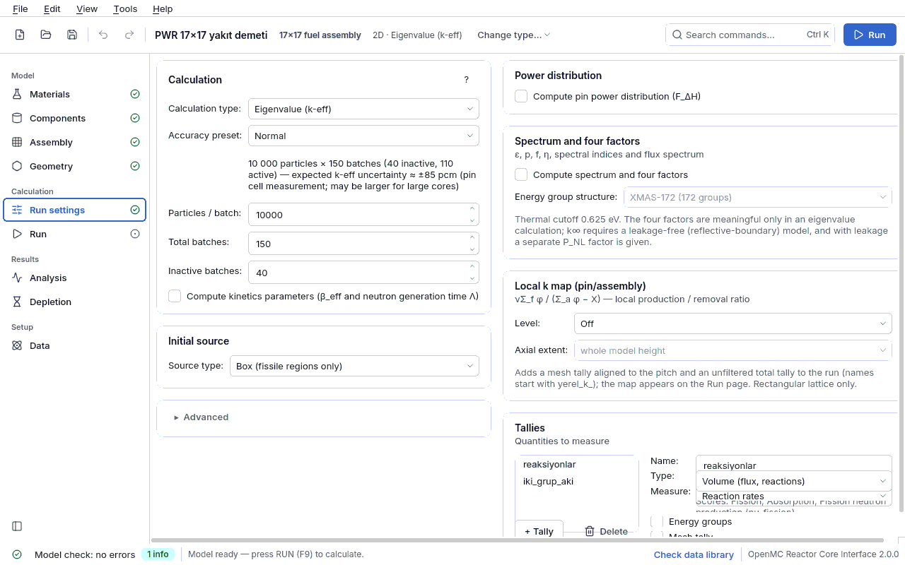

## 4.6 Run settings

This page tells OpenMC **how** to calculate: which kind of calculation (eigenvalue or fixed
source), how many particles and how many batches, where the source starts, which quantities are
measured (power distribution, tallies). Geometry and materials do not change here.

The page has two columns. On the left are the **Calculation**, **Source** (titled **Initial
source** in an eigenvalue calculation) and **Advanced** cards; on the right the **Power
distribution** and **Tallies** cards. The decisions a student has to make are mostly two:
**Calculation type** and **Accuracy preset**. Expert fields are folded under **Advanced**.

**What is shown comes from a single rule table** (`cekirdek/uygunluk.py`,
`uygunluk.ayar_alanlari`). A field that is meaningless in this model is hidden; because the
model check uses the same rule, an option the interface does not offer is also caught as an
error or info finding in a hand-written file. **The value of a hidden field is not deleted from
the file**; only visible fields are saved.

| `uygunluk.ayar_alanlari` key | When it is visible | Reason |
|---|---|---|
| `pasif` | In an eigenvalue calculation | Inactive batches are for the convergence of the fission source; in a fixed source run the source is already known. |
| `entropi` | In an eigenvalue calculation | Shannon entropy measures the fission source distribution. |
| `kinetik` | Eigenvalue calculation **and** fissile material in the geometry | The IFP method follows the fission chain over generations. |
| `kaynak_siddeti` | In a fixed source calculation | Eigenvalue results are normalized to the fission source; the source strength has no effect. |
| `foton` | In a fixed source calculation | Photons do not carry the fission chain; a photon source is meaningless in an eigenvalue run. |
| `kaynak_tayfi_temel` | In a fixed source calculation (the spectrum moves to the **Source** card) | In an eigenvalue run the spectrum is only an initial guess; it stays under **Advanced**. |
| `kutu_kaynagi` | If the geometry contains fissile material | In OpenMC a box source is sampled with the "fissionable regions only" constraint. |
| `guc_dagilimi` | If a pin with a fissile region is **repeated in a lattice** | The distribution is counted over repeated cell instances (not in a pin cell, a sphere or a plate). |
| `eksenel_dilim` | `guc_dagilimi` **and** a 3D model | A 2D model has no axis; only F_ΔH is given. |

Run options (threads, run directory) are **not** on this page; they are on the
[Run](04g-calistir.md#calistir) page.

### Calculation card

| Field | Meaning | Unit | Typical range | Common mistake | Spec key |
|---|---|---|---|---|---|
| **Calculation type** | **Eigenvalue (k-eff)**: a self-sustaining chain reaction; the result is k-eff (or k∞ if all outer boundaries are reflective). **Fixed source**: transport of an externally given source (shielding, detector); the result is the tallies, there is no k-eff. | — | eigenvalue: reactor, assembly, benchmark; fixed source: shielding examples (`ornekler/zirh_kure.json`) | doing a shielding calculation as an eigenvalue run (with no fissile material k is undefined); defining no tally at all in a fixed source run (**error**: "the run produces no result") | `ayarlar.mod` (`eigenvalue` \| `fixed source`) |
| **Accuracy preset** | A preset that sets particles, total batches and inactive batches together: **Quick test** (1 000 × 60, 20 inactive), **Normal** (10 000 × 150, 40 inactive), **Accurate** (50 000 × 300, 80 inactive); if you change the numbers by hand **Custom** appears. The line below states the expected k-eff uncertainty. | — | course/homework: Normal; small reactivity differences: Accurate | putting a k measured with "Quick test" in a report (σ ≈ 300–500 pcm). The preset is not written to the spec as a separate field; it only changes the three numbers. | (none - through `ayarlar.parcacik`, `ayarlar.cevrim`, `ayarlar.pasif`) |
| **Particles per batch** | Number of source particles followed in each batch (OpenMC `particles`). | particles | 1 000 – 100 000 (benchmarks 100 000) | going below 1 000: the model check gives a **warning** ("source convergence may suffer") | `ayarlar.parcacik` |
| **Total batches** | Number of inactive + active batches (OpenMC `batches`). | batches | 60 – 300 | entering fewer than or as many as the inactive batches (**error**); leaving fewer than 20 active batches (**warning**: weak statistics) | `ayarlar.cevrim` |
| **Inactive batches** | The first batches, which do not enter the statistics: discarded until the source distribution converges (OpenMC `inactive`). Visible only in an eigenvalue calculation. | batches | 20 – 100 (more for full cores and axially layered models) | entering fewer than 5 (**warning**); leaving 40 in a layered model: in `pwr_eksenel` 40 inactive batches were not enough, 100 were needed (README). Deciding without looking at the Shannon entropy. | `ayarlar.pasif` |
| **Compute kinetics parameters (β_eff and generation time Λ)** | The IFP (Iterated Fission Probability) method computes the effective delayed neutron fraction β_eff and the neutron generation time Λ; reactivity is also written in **dollars** ($). Visible in an eigenvalue model with fissile material. | — | off (turn on when needed); measured: PWR 17×17 β_eff = 692.9 ± 25.7 pcm, Λ = 18.85 ± 0.07 μs (v3 rerun, Λ = ℓ/k, k∞ = 1.18443; before v3 22.4 μs = ℓ was written); for Godiva k ≈ 1, so ℓ ≈ Λ; Godiva β_eff = 681 ± 27 pcm, Λ = 5.62 ns (README) | leaving it on when not needed (the run slows down); turning it on in a fixed source run (ignored, **info**) | `ayarlar.kinetik.var` |

**How is the expected uncertainty computed?** The "≈ ±N pcm" value in the summary line is
derived from a measurement: σ_k · √(particles × active batches) ≈ 9.0 × 10⁴ pcm (pin cell,
`pwr_pinhucre`). On this basis Normal ≈ ±86 pcm, Accurate ≈ ±27 pcm and Quick test ≈ ±450 pcm
(measured 311–532 pcm) are expected. In large or loosely coupled cores the real uncertainty can
be larger; the text says "approximately". Here pcm = Δk × 10⁵ (the standard uncertainty of k,
1σ). After the run, the k-eff card on the [Run](04g-calistir.md#calistir) page compares the
measured σ with this target.

### Source card ("Initial source" in an eigenvalue run)

In an eigenvalue calculation the source is only an **initial guess**: within the inactive
batches it turns into the real fission source and does not affect k-eff (provided there are
enough inactive batches). In a fixed source calculation the source **is the result itself**: its
position, energy, direction and strength directly determine the tallies.

| Field | Meaning | Unit | Typical range | Common mistake | Spec key |
|---|---|---|---|---|---|
| **Source type** | **Point source** or **Box (fissionable regions only)**. A box source is sampled uniformly in the fissile regions of the model; its limits are derived from the fissile range when the model is built. The box option is offered only if the geometry contains fissile material. | — | eigenvalue: box or a point at the center; shielding: point | choosing a box in a fixed source run: particles start only in fissile material (**warning**). In a hand-written file, keeping the box limits shorter than the height of a 3D model (README "known pitfalls": the axial power comes out overly peaked). | `ayarlar.kaynak.tur` (`nokta` \| `kutu`); box limits `ayarlar.kaynak.alt`, `ayarlar.kaynak.ust` (`null` = from the model; JSON only) |
| **Point position** | (x, y, z) position of the point source. The z box is visible only in a 3D model and in a sphere. | cm | (0, 0, 0) = model center | putting the source outside the geometry: particles are lost immediately (**error**: "point source z = ... is outside the model") | `ayarlar.kaynak.konum` |
| **Particle** | **Neutron** or **Photon (gamma)**. If photon is selected, photon transport is switched on too; the library must contain photon data. If there is only one option the row is hidden. | — | neutron | choosing photon in an eigenvalue calculation (**error**: photons do not carry the fission chain); choosing photon while the library has no photon data (**error**) | `ayarlar.kaynak.parcacik` (`neutron` \| `photon`) |
| **Source strength [1/s]** | Source particles emitted per second. In a fixed source run the tally results are multiplied by it and become absolute; if left at 1 the results stay **per source particle**. Visible only in a fixed source run. | 1/s | 1 (relative) or the real source (e.g. 1e12) | multiplying the results by the strength once more by hand: OpenMC **applies the strength itself** (measured: with 1 and 1e12 the ratio is exactly 1e12) - this is double counting. Zero or negative value (**error**). Changing it in an eigenvalue run (ignored, **info**). | `ayarlar.kaynak.kuvvet` |

#### Energy spectrum and angular distribution

In a fixed source run this box is on the **Source** card; in an eigenvalue run it is under
**Advanced › Energy and direction of the initial source**. When a spectrum is selected only the
fields of that type are shown; the mean energy is written below it (and in a fixed source run a
note on the strength).

| Field | Meaning | Unit | Typical range | Common mistake | Spec key |
|---|---|---|---|---|---|
| **Energy spectrum** | Watt fission spectrum, Maxwell spectrum, Monoenergetic, Discrete lines, Group-wise spectrum (histogram), Fusion spectrum (D-T / D-D, Muir). | — | eigenvalue: Watt; D-T source: monoenergetic 14.1 MeV or fusion | believing the spectrum changes the result of an eigenvalue run (it is only an initial guess, **info**). Raising the source energy above the data ceiling (**error**: "source energy ..., data ceiling ..."). | `ayarlar.kaynak.enerji.tur` (`watt` \| `maxwell` \| `tek` \| `ayrik` \| `histogram` \| `fuzyon`) |
| **a (Watt)** | Parameter of the Watt spectrum χ(E) ~ exp(−E/a) sinh(√(bE)). Mean energy 1.5a + a²b/4. | eV | 988 keV (U-235 thermal fission) | taking the unit for keV and writing 988 (the field expects eV; the unit selector shows it) | `ayarlar.kaynak.enerji.a` |
| **b** | Second parameter of the Watt spectrum. | 1/eV | 2.249e-6 | taking a and b from different nuclides | `ayarlar.kaynak.enerji.b` |
| **θ** | Temperature of the Maxwell spectrum √E · exp(−E/θ); mean 1.5θ. | eV | 1.2932 MeV | — | `ayarlar.kaynak.enerji.theta` |
| **Energy** | Energy of a monoenergetic source. | eV | 14.1 MeV (D-T), 2.45 MeV (D-D), thermal 0.0253 eV | — | `ayarlar.kaynak.enerji.enerji` |
| **Lines** | Discrete lines: `energy[eV]:probability` pairs, comma separated. Example (Co-60): `1.173e6:0.5, 1.333e6:0.5`. | eV : — | 1–20 lines | a malformed `E:p` pair is not saved and is skipped; the model check reports what is missing - check the pairs | `ayarlar.kaynak.enerji.noktalar` |
| **Group edges** | The N+1 group edges of a histogram spectrum, in increasing order. | eV | e.g. `1e5, 1e6, 1e7` | entering the edges in decreasing order | `ayarlar.kaynak.enerji.kenarlar` |
| **Group values** | Relative weight of each group; there must be **one fewer** than the number of edges. | — | N values | entering as many values as edges (the spectrum cannot be built, red summary) | `ayarlar.kaynak.enerji.degerler` |
| **Mean E₀** | Mean energy of the fusion spectrum. | eV | 14.08 MeV (D-T) | — | `ayarlar.kaynak.enerji.e0` |
| **Mass sum** | Sum of the mass numbers of the reactants: D+T = 5, D+D = 4. | — | 4 or 5 | leaving 5 for D-D | `ayarlar.kaynak.enerji.kutle_orani` |
| **Ion temperature** | Ion temperature kT of the plasma; it broadens the spectrum: for D-T FWHM = 177·√(kT[keV]) keV (at kT = 20 keV σ ≈ 336 keV, measured 335 keV). | eV | 10–50 keV | — | `ayarlar.kaynak.enerji.iyon_sicaklik` |
| **Angular distribution** | **Isotropic** (equal in all directions), **Monodirectional beam** (pencil beam) or **Cone**. | — | isotropic | choosing beam or cone and leaving **Direction** as the zero vector. Changing it in an eigenvalue run and expecting the result to change (only an initial guess, **info**). | `ayarlar.kaynak.aci.tur` (`izotropik` \| `tek_yon` \| `koni`) |
| **Direction** | Axis of the beam or cone (u, v, w). Hidden for isotropic. | — | (0, 0, 1) | — | `ayarlar.kaynak.aci.yon` |
| **Cone half-angle** | Angle from the axis to the edge of the cone; a distribution uniform in solid angle is used. Visible only for Cone. | degrees | 0.01–180 | entering the full angle (edge to edge) | `ayarlar.kaynak.aci.koni_aci` |

### Advanced

| Field | Meaning | Unit | Typical range | Common mistake | Spec key |
|---|---|---|---|---|---|
| **Random seed** | Seed of the random number generator. The same seed and the same model give the same result (reproduction with the capsule relies on this). | — | 1 (default); different seeds for independent repetitions | running with a single seed and trusting the σ of pin powers: the power tally uncertainty is optimistic, run with several seeds (see [interpreting the power distribution](06-sonuclar.md#guc-dagilimi-yorum)) | `ayarlar.tohum` |
| **Temperature method** | How the cross section is obtained at a temperature that is not in the library: **Interpolation (interpolation)** or **Nearest temperature (nearest)**. | — | interpolation | S(α,β) for water exists only between 284–800 K; a temperature sweep outside this range fails in the middle of the run (README "known pitfalls") | `ayarlar.sicaklik_yontemi` (`interpolation` \| `nearest`) |
| **Measure source convergence with Shannon entropy** | Measures whether the fission source distribution converged within the inactive batches. It is evaluated automatically at the end of the run (see [source convergence](06-sonuclar.md#kaynak-yakinsamasi)). Visible only in an eigenvalue run. | — | **on** | turning it off: the model check gives a **warning**; an unconverged source makes the k-eff estimate biased and this is not noticed any other way | `ayarlar.entropi_mesh.var` |
| **Entropy mesh** | Number of divisions nx, ny (nz in 3D) of the regular mesh on which the entropy is computed. While **Automatic mesh size** is checked, 8 × 8 radial divisions are used, 8 axial divisions in a 3D model and a single slice in 2D; when the model changes 2D ↔ 3D the mesh changes too. | divisions | 8 × 8 × 1 (2D), 8 × 8 × 8 (3D) | leaving nz = 1 in a 3D model: axial convergence is never measured. Zero divisions (**error**). | `ayarlar.entropi_mesh.boyut`; the automatic flag `ayarlar.entropi_mesh.otomatik` |
| **Automatic mesh size** | The entropy mesh is derived from the model (see above). | — | on | — | `ayarlar.entropi_mesh.otomatik` |
| **IFP generations** | Number of generations IFP follows backward; visible only while kinetics is on. | generations | 10 (1–50) | a very small value biases β_eff; a very large value inflates memory | `ayarlar.kinetik.nesil` |
| **Delayed neutron groups** | Per-group β_i (a `DelayedGroupFilter` on the IFP beta numerator) and λ_i (a separate `decay-rate` / `delayed-nu-fission` tally) are scored; the [point kinetics card](04h2-kinetik.md#kinetik) reads them with **Take from last run**. **6 groups (ENDF/B)**, **8 groups (JEFF)** or **total β_eff only**. Visible only while kinetics is on. | groups | 6 (with the ENDF/B-VIII.0 library) | a number that does not match the library: with ENDF/B data and 8 groups, groups 7 and 8 stay empty and are dropped on reading; with JEFF data and 6 groups the last two groups are **not counted** (β_eff comes out too small) | `ayarlar.kinetik.gruplar` (0, 6, 8) |

### Power distribution card

Visible only in a model in which a pin with a fissile region is **repeated** in a lattice
(assembly, core map or drum fill) (`uygunluk.guc_cubuklari`). Each instance of the fuel cell
repeated in the lattice is counted separately (OpenMC `DistribcellFilter`); the result appears
as a power map on the [Run](04g-calistir.md#calistir-guc-haritasi) page. For interpretation see
[interpreting the power distribution](06-sonuclar.md#guc-dagilimi-yorum), for a step-by-step
example the [power map lesson](05-dersler.md#ders-guc).

| Field | Meaning | Unit | Typical range | Common mistake | Spec key |
|---|---|---|---|---|---|
| **Compute pin power distribution (F_ΔH)** / **Compute pin power distribution (F_ΔH, F_q)** | Turns on the power tally. A 2D model gives only F_ΔH (highest pin power / mean), a 3D model also F_q (highest local power density / mean); the label changes accordingly. | — | off; on when a power map is wanted | leaving it on in an unsuitable model: the card says "cannot be computed - uncheck the box" | `guc_dagilimi.var` |
| **Target pin** | The pin type whose power is counted. If there are several suitable fuel pins, "All fuel pins (N types)" is at the top; if the list in the file does not match them, "Selection from file" keeps the list as it is. Normalization is over **all** fuel pins in the list. | — | single-type assembly: that pin; multi-enrichment core: all fuel pins | selecting a pin that is not in the geometry or not repeated in any assembly (**error** or **warning**) | `guc_dagilimi.cubuklar[].cubuk` |
| **Target region** | In which radial region of the selected pin the power is counted (numbered from 1, with the material name). In a multi-type selection the fissile region of each type is used and the box stays empty. It is under Advanced. | — | region 1 (fuel) | selecting the cladding or coolant region (**warning**: "its material does not look fissile" - the result is meaningless) | `guc_dagilimi.cubuklar[].bolge` (counted from 0) |
| **Score** | The OpenMC score counted as power: Fission energy (kappa-fission), Recoverable fission energy (fission-q-recoverable), Prompt fission energy (fission-q-prompt), Local heating (heating-local). It is under Advanced. | — | `kappa-fission` | writing a score that deposits no energy (e.g. `fission`) (**warning**: it only gives the number of fissions) | `guc_dagilimi.skor` |
| **Axial bins** | Number of axial bins of the power tally in a 3D model; F_q depends on it. Visible only in a 3D model. | bins | 20 (1–200); at least 10–20 | fewer than 10 bins (**warning**): coarse bins average out the peak and F_q comes out small (pure cosine limit π/2 = 1.571) | `guc_dagilimi.eksenel_dilim` |
| **Total power** | Power of the region **covered by the model** - not of the whole core. If given, pin powers are also written in W and linear power in W/cm; if left empty (0) only the relative distribution is given. | W | single 17×17 assembly: 3400 MWth / 193 assemblies = 17.6e6 W → mean ≈ 182 W/cm | writing the power of the whole core into a single-assembly model (linear power is inflated 193 times). Giving it in a 2D model (**warning**: W/cm cannot be computed). Negative (**error**). | `guc_dagilimi.toplam_guc` |

> ⚠ **F_ΔH is a maximum and is biased upward at low statistics.** In the same model 1.1455 was
> measured with 3 000 particles and 1.0708 with 20 000 particles (README). The reported pin σ do
> not see the correlation between successive batches; in `pwr_3b` the real scatter was measured
> to be ~20 times larger. For a power map use at least **Normal**, preferably several different
> **Random seed** values.

### Spectrum and four factors card

Adds six tallies to the run (names start with `y3_`; `cekirdek/spektrum.py`): the energy
spectrum (whole model and fuel), the four factors (ε, p, f, η) and the spectral indices (ρ28, δ25,
δ28, C*). The result appears in the **Spectrum and four factors** card on the
[Run](04g-calistir.md#calistir-spektrum) page; definitions and a step-by-step example:
[lesson 5.11](05-dersler.md#ders-spektrum). The thermal cutoff is fixed at **0.625 eV**. The
generated script builds the same tallies.

| Field | Meaning | Unit | Typical range | Common misuse | Spec key |
|---|---|---|---|---|---|
| **Compute spectrum and four factors** | Turns on the Y3 tallies. The four factors and k only in an eigenvalue calculation; the spectrum is also computed in fixed source. | — | off | Taking ε·p·f·η for k-eff in a leaking (vacuum-bounded) model: k-eff additionally needs the P_NL factor (the card gives it separately). | `ayarlar.spektrum.var` |
| **Energy group structure** | Groups of the flux spectrum (OpenMC built-in structures): CASMO-70, XMAS-172, SHEM-361, CCFE-709. The four factors and indices do not depend on it (they use their own two groups). | group | XMAS-172 | Choosing CCFE-709 with few particles: more noise per group. | `ayarlar.spektrum.grup_yapisi` |

### Local k map card

Adds a mesh tally aligned to the pitch of the square lattice (`yerel_k_pin` or
`yerel_k_demet`) and an unfiltered total tally (`yerel_k_toplam`) to the run
(`cekirdek/yerel_k.py`). The map appears in the **Local k map** card on the
[Run](04g-calistir.md#calistir) page; definition and interpretation: [6.7](06-sonuclar.md#yerel-k),
step-by-step example: [lesson 5.15](05-dersler.md#ders-yerel-k). For an unsupported model
(hexagonal lattice, gap between assemblies, translated lattice) the card shows the error and
the model is unchanged. The generated script builds the same tallies.

| Field | Meaning | Unit | Typical range | Common misuse | Spec key |
|---|---|---|---|---|---|
| **Level** | Off / Pin / Assembly: the mesh bins are the size of a pin cell or an assembly. | — | off | Taking local k for k∞: it is a local production / removal ratio without leakage or net current term. | `tallyler[].uretici = "yerel_k"` |
| **Axial extent** | Whole model height (in 3D including the axial reflector) or the active (fissile) region only. No difference in 2D. | — | whole model | Choosing "active" and comparing the mean with k∞: coverage becomes < 1. | mesh `alt`/`ust` z |

### Tallies card

A tally (counter) accumulates how many times a reaction occurs at a given place and energy in
the model. **+ Tally** adds a new tally, **Delete** deletes the selected one. In a fixed source
calculation at least one tally (or the power distribution) is **mandatory**; otherwise the run
produces no result (**error**). The results are read in the **Result** card on the
[Run](04g-calistir.md#calistir) page and under **Detailed output**.

| Field | Meaning | Unit | Typical range | Common mistake | Spec key |
|---|---|---|---|---|---|
| **Name** | Name of the tally (shown in the result table). | — | `aki`, `reaksiyon` ... | giving the same name to two tallies | `tallyler[].ad` |
| **What to measure** | Ready-made score set: **Flux** (flux), **Reaction rates** (fission, absorption, nu-fission), **Heat / power** (kappa-fission, heating) or **Custom** (you choose the scores yourself). | — | Flux | — | `tallyler[].skorlar` |
| **Scores** | OpenMC scores selected in the custom set (flux, fission, absorption, nu-fission, scatter, total, elastic, (n,gamma), (n,2n), heating, kappa-fission, fission-q-prompt, damage-energy). Unknown scores from the file are kept in the list. | — | 1–4 scores | OpenMC does not check score names; a made-up score fails in the run (the model check gives a **warning** against a curated list). Forgetting that the `flux` score is a **volume integral** (unit cm/s or cm per source particle): for the mean flux [1/cm²/s] divide by the region volume. | `tallyler[].skorlar` |
| **Energy groups** | Adds an energy filter to the tally. | — | off; two groups: thermal/fast | — | `tallyler[].filtreler[]` (`tur`: `enerji`) |
| **Group boundaries [eV]** | Energy group boundaries, in increasing order, comma separated. | eV | `0.0, 0.625, 2.0e7` (two groups) | unreadable text does not delete the existing filter; fewer than two boundaries are invalid | `tallyler[].filtreler[].gruplar` |
| **Mesh tally** | Adds a mesh filter to the tally (regular, cylindrical, spherical; details in [4.11](04k-mesh-tally.md#mesh-tally)); the limits are taken from the outer size of the model when the model is built (`otomatik`). | — | off | writing the mesh by hand with small limits and later adding a reflector to the model: the automatic mesh prevents this (the `alt`/`ust` limits of old files are kept) | `tallyler[].filtreler[]` (`tur`: `mesh`, `otomatik`, `alt`, `ust`) |
| **Mesh divisions** | Number of divisions nx, ny, nz of the mesh; nz is meaningful only in a 3D model and in a sphere. | divisions | 10 × 10 × 1 (1–1000) | expecting nz > 1 in a 2D model (in 2D the mesh is a single slice) | `tallyler[].filtreler[].boyut` |

Filter types the interface does not edit (for example a `malzeme` filter with an `adlar` list;
a `hucre` filter) are **kept** if they come from the file, and the form shows the note "Also a
filter from the file: ... (kept)." For a nuclide tally the `tallyler[].nuklidler` field is
entered only in JSON.

### Frequent findings on this page

| Finding (model check panel) | Level | What to do |
|---|---|---|
| inactive batches (N) must be fewer than total batches (M) | error | Increase **Total batches** or decrease **Inactive batches**. |
| too few inactive batches / few active batches | warning | Use 20–50 inactive and at least 20 active batches; the **Normal** preset provides both. |
| Shannon entropy is off | warning | Turn on the **Advanced › Measure source convergence with Shannon entropy** box. |
| few particles per batch | warning | Use at least 1 000 **Particles per batch**. |
| a photon source is meaningless in an Eigenvalue (k-eff) calculation | error | Set the calculation type to **Fixed source** or select Neutron as **Particle**. |
| no tally defined in a fixed source calculation | error | Add a tally with **+ Tally** on the **Tallies** card. |
| in an eigenvalue calculation the energy spectrum is only an initial guess | info | Expected behaviour; nothing to do. |

All finding types and their solutions: [Troubleshooting](09-sorun-giderme.md#sorun-giderme).
