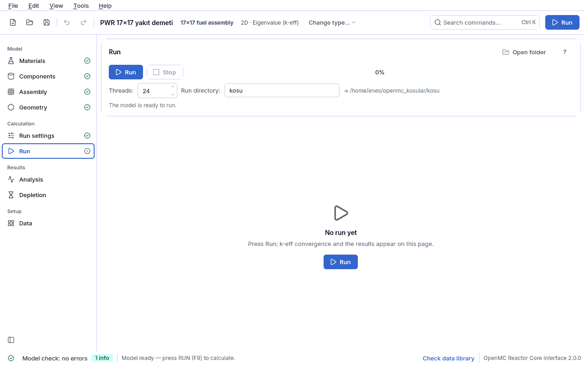

<a id="calistir"></a>
## 4.7 Run

This page runs the model with OpenMC and shows the result **on the same page**, in a single
flow from top to bottom: run card → result dashboard (k-eff, Shannon entropy, duration, speed) →
convergence plots → power map (if on) → result card → conformity check → detailed output.
OpenMC runs as a separate process; the interface does not freeze during the run. Shortcut:
**F9**.



<a id="calistir-kosu"></a>
### Run card

| Field | Meaning | Unit | Typical range | Common mistake | Spec key |
|---|---|---|---|---|---|
| **Run** / **Stop** | Starts the run / ends the running run. A stopped run has no result. The progress bar next to it reads "N / M batches". | — | — | changing the model without understanding why **Run** is disabled: the line under the button gives the reason (see below) | — |
| **Threads** | Number of OpenMP threads (`openmc -s N`). The tooltip states the number of logical cores of this computer. | threads | 4–24 (default 8) | giving all cores: the interface and the preview slow down. With a different number of threads, even with the same seed, small differences in the last digit are possible (rounding level). | `calistirma.is_parcacigi` |
| **Run directory** | Directory where the run files are written. A relative path is placed next to the project file for a **saved project**, and under `~/openmc_kosular` for an **unsaved** project (new or opened from an example); the full path appears on the right of the row as "→ ...". **It is emptied at every run.** | — | `kosu` | giving a directory where you keep the results of another run (they are deleted). Running an example without saving and looking for the result next to the project. | `calistirma.dizin` |
| **Open folder** | Opens the directory of the last successful run in the file manager. | — | — | — | — |

The run directory holds side by side: `model.xml`, `spec.json` (the model of the run),
`kapsul.json` (reproducibility capsule: spec hash, OpenMC and library versions, seed,
environment), `statepoint.*.h5`, `summary.h5` and `kosu.log` (raw OpenMC output). For
reproduction from the capsule see the `yeniden` command in the [Terminal](08-terminal.md#terminal)
section.

<a id="calistir-kapi"></a>
#### Why is Run disabled? "Plot first, then run"

The line under the button states the status of the gate:

| What the line says | Meaning | What to do |
|---|---|---|
| The model check has N errors - fix them first. | The model check panel contains at least one **error**. | Click the badge at the bottom and select the finding; the related page opens. See [Troubleshooting](09-sorun-giderme.md#sorun-giderme). |
| The geometry preview has not been plotted yet. Plot first, then run... | The preview has not been produced successfully for this model. | Go to a design page (for example Geometry) and wait for the preview to be plotted. |
| Ready to run. N warnings - they may affect the result... | No error, but warnings. | Read the warnings; most of them (for example too few inactive batches, entropy off) affect the reliability of the result. |
| The model is ready to run. | No errors and no warnings. | — |

This gate is the habit of hand-written scripts, *"uncomment the `model.run()` line if the plots
are correct"*, built into the interface; the reasoning is in
[Plot first, then run](06-sonuclar.md#once-ciz). When you press **Run**, the model check is done
once more before the run directory is emptied; if there is an error the run does not start and
**the previous result is not deleted**.

<a id="calistir-pano"></a>
### Result dashboard and convergence plots

| Indicator | Meaning | How to read it |
|---|---|---|
| **k-eff** (or **k∞**) | Multiplication factor of the run ± 1σ standard uncertainty and its pcm (Δk × 10⁵) badge. If all outer boundaries are reflective the label becomes **k∞** (no leakage). Below it the uncertainty expected from the preset in Run settings is written ("target ≈ ±N pcm"); if the measured σ exceeds the target, the badge turns to the warning color. | While the run is going, the value is the **cumulative mean**. In a fixed source run it says "k-eff undefined; the result is the tallies". |
| **Shannon entropy** | Source entropy [bit] of the last batch and the convergence badge: **Converged**, **Not converged** or **Uncertain**. The detailed assessment is in the tooltip. | **Not converged**: at the end of the inactive period the source is still drifting; increase the inactive batches, k-eff may be biased. Details: [source convergence](06-sonuclar.md#kaynak-yakinsamasi). |
| **Duration**, **Speed** | Run duration (min:s; number of active + inactive batches) and particles/s (with the number of threads). | The duration estimates of analysis and depletion improve from this measurement. |
| **Model check** | Result of the pre-run model check gate: "No errors", "N errors" or, for a run loaded from disk, "Loaded from disk". | — |
| Convergence plot | k-eff batch by batch and the cumulative mean; the inactive limit is marked. | In the active batches the mean should settle into a flat band. |
| Entropy plot | Shannon entropy batch by batch. | It should flatten within the inactive batches; a fast rise at the beginning is normal. |

In a fixed source calculation the k-eff and entropy cards are not shown.

<a id="calistir-sonuc"></a>
### Result card

The criticality interpretation (`kosucu.keff_yorumu`) is written in these words:

- **Critical (statistically indistinguishable from k = 1)**: |k − 1| ≤ 2σ.
- **Supercritical (k > 1 - power rises)** / **Subcritical (k < 1 - power dies out)**.
- **k∞ (infinite medium) - no leakage, no criticality verdict**: when all outer boundaries are
  reflective; k∞ > 1 does not say the reactor is supercritical but that the fuel carries excess
  reactivity.

Below it the reactivity ρ = (k − 1)/k is written in pcm (Δρ × 10⁵) ± uncertainty; if kinetics is
on, dollars ($ = ρ / β_eff) are also given. **Lost particles** and OpenMC warnings appear in bold
and in color on this card; they are not silent. A lost particle means a gap or an overlap in the
geometry (conformity rule K3). In a fixed source run the card shows the tally tables.

<a id="calistir-guc-haritasi"></a>
### Power map

Visible only if the power distribution is on in [Run settings](04f-hesap-ayarlari.md#ayar-guc)
and the run has a result. For a rectangular lattice a grid is drawn, for a hexagonal lattice the
real hexagonal layout; the color scale is relative to the mean (1.00 = mean pin). The summary at
the top gives F_ΔH, F_q (3D), the hottest pin/assembly and the conservation check.

| Field | Meaning | Unit | Typical range | Common mistake | Spec key |
|---|---|---|---|---|---|
| **Scale** | In a full core **Assembly** (assembly averages) or **Pin** (all pins in the core). Default Pin: peaking factors are on the pin scale. | — | Pin | taking the peak of the assembly averages for F_ΔH | — |
| **Pin type** | In a multi-type power distribution, shows only the selected pin type on the map; the relative power is still relative to **all** fuel pins. | — | All types | — | — |
| **View** | **Pin total power (F_ΔH)** or **Single axial bin (F_q)**; in a 3D model the bin slider selects the axial bin. | — | — | expecting F_q in a 2D model | — |
| **Save PNG...** | Saves the map as PNG. | — | — | — | — |
| **Write values on the map** | Under Advanced: writes the relative power into each cell (the matplotlib navigation bar is also here). | — | off (unreadable in a large core) | — | — |

Pins at truncated (clipped) positions are marked with "×" and kept out of F_ΔH. The note under
the map reminds you: the ± values are the deviations reported by OpenMC and are **optimistic**;
for the real uncertainty first confirm convergence with the entropy, then run the model with 5–10
different seeds. Details: [interpreting the power distribution](06-sonuclar.md#guc-dagilimi-yorum)
and the [power map lesson](05-dersler.md#ders-guc).

<a id="calistir-uygunluk"></a>
### Conformity card

When the run finishes (or a saved run is loaded), the run is checked against the rules of the
selected **profiles**. Each row gives the rule ID (K1, K2, ...), the status (**passed**, **not
met**, **not applicable**, **note**), the finding and the suggestion; the source (citation of the
standard or good practice), the label and the profile are in the tooltip. Problems are at the top
of the list.

| Field | Meaning | Unit | Typical range | Common mistake | Spec key |
|---|---|---|---|---|---|
| **A · Monte Carlo good practice** | Profile A: source convergence (K1), statistical adequacy (K2), lost particles (K3). Meaningful for every run. | — | on (default) | believing these rules are clauses of a standard: all of them are labeled **good practice** | `calistirma.uygunluk_profilleri` |
| **B · Criticality safety** | Profile B: acceptance condition k + 2σ < USL (K6), area of applicability (K6-AOA), K8–K14. Requires bias and USL from the V&V set; otherwise it says "USL could not be computed". | — | off (turn on for a criticality safety study) | taking "USL could not be computed" for a tool error: the set does not contain enough independent cases for that area of applicability | `calistirma.uygunluk_profilleri` |
| **C · Reactor core design** | Profile C: sign of the reactivity coefficients (K7), shutdown margin (K7-SDM), F_ΔH / F_q limits (K7-F), reference of the core method validation (K16). The limits are user/facility input; if not given, "could not be compared". | — | off | counting a positive MTC as an error (according to the SRP it is not an error on its own; **info**) | `calistirma.uygunluk_profilleri` |
| **D · Reporting** | Profile D: data traceability (K4), uncertainty and unit reporting (K5). | — | on (default) | — | `calistirma.uygunluk_profilleri` |

The profile selection is saved in the project; if it is changed while a result exists, the run is
checked again. **Go to finding** (or a double click on the row) opens the page where the finding
is fixed: K1/K2 → Run settings, K3 → Geometry, K4 (material without a temperature) → Materials.
The "honest framework" text is shown verbatim under the card: **the check produces evidence, it
does not certify.** For all rules, the profile selection and "what it proves, what it does not",
see [Conformity and V&V](07-uygunluk.md#uygunluk-denetimi); for rule-by-rule troubleshooting see
[conformity rules](09-sorun-giderme.md#uygunluk-kurallari).

<a id="calistir-ayrinti"></a>
### Detailed output and report

The **Detailed output** foldable section is closed by default; if the run fails it opens by
itself. It contains the raw OpenMC output (**Copy** puts it on the clipboard; the number of lines
is written under the heading) and the full result text (statepoint and all tally tables).

The report of the run is produced with **File › Create report... (Ctrl+R)** (the last successful
run is used); the report contains the reproducibility information and the conformity annex of
the selected profiles. The terminal equivalent of the same job:

```bash
openmc-arayuz-kosu rapor kosu/ -o rapor.pdf
```

Step-by-step example: [report and conformity annex lesson](05-dersler.md#ders-rapor).
