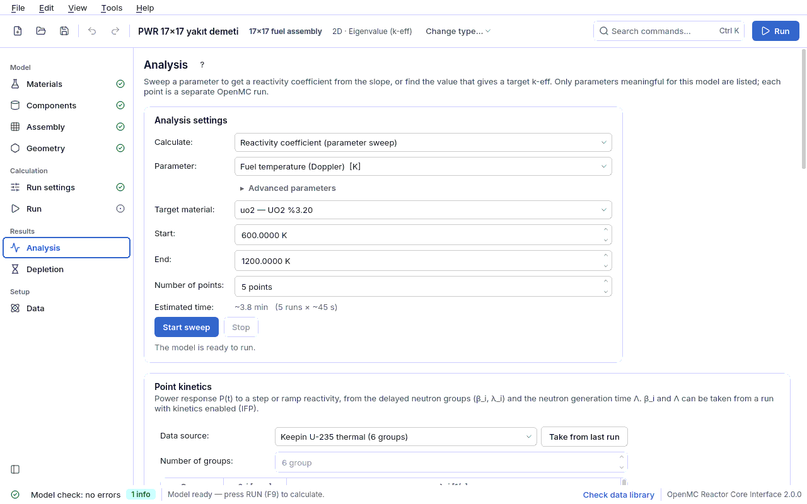

## 4.8 Analysis

A single k-eff number says little about a design. The **Analysis** page changes a parameter to
answer two questions:

- **Reactivity coefficient (parameter sweep):** the parameter changes step by step over a range,
  k-eff is measured at each point and the coefficient comes from the slope of the ρ(p) curve
  (Doppler, moderator temperature, void, boron worth, rod/drum worth...).
- **Critical search (the value that gives the target k-eff):** the parameter value that gives
  the target k-eff (usually 1) is found (critical boron, critical rod position, critical drum
  angle...).

Each point is **a separate OpenMC run**; the job runs in the background, the interface does not
freeze and it can be cut at any moment with **Stop**. The points are run with the particle/batch
values of the model's [Run settings](04f-hesap-ayarlari.md#hesap-ayarlari) page. The analysis
settings are **not written** to the spec; they are not lost when the project is saved, but they
are not counted as part of the model either. The page is visible only in an eigenvalue
calculation and while the geometry contains fissile material.

### Analysis settings card

| Field | Meaning | Unit | Typical range | Common mistake | Spec key |
|---|---|---|---|---|---|
| **What to compute** | **Reactivity coefficient (parameter sweep)** or **Critical search (the value that gives the target k-eff)**. In a critical search only control parameters are offered (`uygunluk.KRITIK_PARAMETRELER`). | — | — | trying to find a coefficient with a critical search (a critical search gives a root, not a slope) | (not written to the spec) |
| **Parameter** | The quantity to change; the list contains only parameters that **really change the model in this model** (table below). The unit is in square brackets next to the name. | — | — | asking for a sweep that is not in the list by hand in the file: a sweep the interface does not offer would not change the model and would give "coefficient = 0 ± noise" - that is why it is not offered | sweep type (e.g. `yakit_sicaklik`) |
| **Advanced parameters** | When opened, design studies are added to the list too: `kafes_adim`, `kor_adim`, `cubuk_yaricap`, `malzeme_yogunluk`. | — | off | — | — |
| **Target material** / **Target assembly** / **Control rod** / **Target region** / **Target** | The object the parameter is applied to; the label changes with the parameter (material, assembly, control rod, pin region). For parameters that are core settings (e.g. drum rotation) there is no target choice and the row is hidden. When the target changes, the range is suggested again from the **current** value of that target. | — | — | looking for the cladding material instead of the water in a boron sweep: boron is offered only for light (borated) water materials | — |
| **Start** / **End** (**Lower limit** / **Upper limit** in a critical search) | Ends of the swept range; in a critical search the bracket in which the root is searched. The unit is the unit of the parameter (K, ppm, %, °, cm, g/cm³). | parameter unit | defaults: fuel temperature 600–1200 K, coolant ±40 K (within the water table 280–620 K), void 0–50%, boron 0–2000 ppm, enrichment 2–5%, rod 0–100%, drum 0–180° | giving a bracket that does not contain the root in a critical search: the search is **not done** and you are told to widen the range - no extrapolation. A temperature range that leaves the 284–800 K S(α,β) range of water (fails in the middle of the run). | — |
| **Number of points** | Number of points (runs) in the sweep; visible only for a sweep. | points | 5 (2–50) | extracting a single slope from a curved relation (a rod S curve) with 2–3 points | — |
| **Target k-eff** | Target of the critical search; visible only for a critical search. | — | 1.0 (e.g. 0.95 for a subcritical design) | — | — |
| **Estimated duration** | Duration estimate before starting: "~total (N runs × ~single run)". The duration of a single run comes from the measured speed (particles/s) and is corrected with the real measurement after the first point. A critical search usually takes 4–8 runs. | s | — | starting a 10-point sweep with the Accurate preset and being surprised by the duration | — |

### Parameters (sweep types)

The definitions are in `cekirdek/tarama.py` (`TURLER`); `uygunluk.gecerli_taramalar` and
`uygunluk.gecerli_hedefler` decide which ones are offered.

| Sweep type | What changes | Target | Unit → coefficient unit | When it is offered |
|---|---|---|---|---|
| `yakit_sicaklik` | Fuel temperature (Doppler); density constant (solid fuel). | fuel material | K → pcm/K | materials in the fuel role |
| `sogutucu_sicaklik` | Coolant temperature **and** density together (water: saturated liquid table; LBE: Sobolev; Na: Fink & Leibowitz). Gives the moderator temperature coefficient. | coolant | K → pcm/K | coolants with a correlation (heavy water is not offered: it would fall back to the light water table) |
| `void_orani` | Coolant density ρ₀·(1 − α). | coolant | % → pcm/%void | liquid coolants with a correlation |
| `bor_ppm` | Natural boron dissolved in water (ppm by mass). | light water | ppm → pcm/ppm | only light (borated) water |
| `zenginlik` | Weight percent of U-235. | material containing uranium | % → pcm/% | materials whose composition contains an enriched U element (not offered for fuel written with explicit isotopes) |
| `cubuk_daldirma` | Control rod insertion fraction (0% withdrawn, 100% fully inserted). | control rod | % → pcm/% | only in a 3D model, while the geometry contains a control rod |
| `tambur_donme` | Control drum rotation (0° the absorber faces the core, lowest k; 180° faces outward, highest k). | core | degrees → pcm/degree | in a drum-controlled core while the drum count > 0 (in advanced geometry it is an alias of the single rotation group, if there is one) |
| `yansitici_kalinlik` | Radial thickness of the radial reflector. | core | cm → pcm/cm | while a reflector is built and its material is not void |
| `grup_donme` | Value of a rotation group (drums). | group | degrees → pcm/degree | if advanced geometry has a rotation group |
| `grup_daldirma` | Value of an insertion group (control rod bank). | group | % → pcm/% | in advanced geometry, in a 3D model with an insertion group |
| `kafes_adim` | Pin pitch in the assembly (moderation ratio study). | assembly | cm → pcm/cm | Advanced; assemblies used in the geometry |
| `kor_adim` | Cell pitch in a pin cell, assembly pitch in a rectangular full core. | core | cm → pcm/cm | Advanced; if the core type has an `adim` field |
| `cubuk_yaricap` | Outer radius of the selected region of the pin (the range is suggested so that it does not clash with neighbouring regions). | pin region | cm → pcm/cm | Advanced; regions of the pins in the geometry other than the outermost one |
| `malzeme_yogunluk` | Density of the selected material. | material | g/cm³ → pcm/(g/cm³) | Advanced; materials whose density is given in g/cm³ (not offered if given in atom/b-cm) |

Control parameters offered in a critical search (`uygunluk.KRITIK_PARAMETRELER`): `bor_ppm`,
`cubuk_daldirma`, `tambur_donme`, `zenginlik`, `yansitici_kalinlik`, `grup_donme`,
`grup_daldirma`.

> ⚠ **Temperature and density change together.** When the coolant heats up, its density drops;
> if you change only the temperature you miss the largest part of the effect.
> `sogutucu_sicaklik` updates the density with the correlation; for a material without a known
> correlation the density is kept constant and this is **stated explicitly** in the result.

### Parameter sweep: reading the result

All points are run **with the same random seed**: statistical fluctuations partly cancel in the
difference (correlated sampling) and the coefficient comes out less noisy. The reported
uncertainty is **conservative** because it treats the points as independent. The result card
shows the k(p) plot, the point table (Value, k-eff, ±, ρ [pcm]; ρ = (k − 1)/k, pcm = Δρ × 10⁵)
and the coefficient from the slope ± uncertainty with a short physics interpretation (e.g.
"Doppler coefficient. It is expected to be negative..."). If the slope cannot be distinguished
from zero within 2σ this is said explicitly: more particles/batches or a wider range are needed.

Measured examples (`ornekler/pwr_17x17.json`, README):

| Sweep | Coefficient |
|---|---|
| Fuel temperature 600 → 1200 K | Doppler −1.98 ± 0.17 pcm/K |
| Coolant temperature 540 → 620 K, 0 ppm boron | Moderator temperature −35.2 ± 1.0 pcm/K |
| Coolant temperature, 1300 ppm boron | Moderator temperature −2.6 ± 1.2 pcm/K |
| Boron 0 → 8000 ppm | Boron worth −7.0 pcm/ppm |

The difference between the two MTC values is real physics: boron is dissolved in the water, when
the density drops the absorber decreases too and the two effects cancel each other.

> ⚠ **Shape of the rod worth curve.** The classic S curve is seen only if the system is close to
> critical at every position. `ornekler/pwr_kontrol.json` is a single assembly with a reflective
> side boundary; the worth accumulates late and the peak of the differential worth comes out close
> to full insertion (measured with the example's own
> settings 8000 × 90 / 30 inactive, seed 1, 01.10.2026: 0% → k = 1.18186 ± 0.00150, 50% → 1.16626 ±
> 0.00136, 100% → 0.59146 ± 0.00122). The axial ends are vacuum, so these are k-eff, not k∞; the
> simplifications of the rod model (B4C without cladding, 25 positions as one group, sharp tip) are
> in the description of the example.

### Critical search: method and stopping criterion

- **Method:** bracket-protected false position (regula falsi) + bisection. The first two points
  are the ends of the range, and it is checked that the root lies between them; if the secant
  estimate falls outside the bracket or coincides with a point already measured, bisection is
  used. At most 15 iterations are done.
- **Stopping criterion:** |k − target| ≤ 2σ. The result card also counts a result as "Critical"
  when |k − 1| ≤ 2σ; both places use the same definition.
- **Uncertainty of the root:** estimated from the local slope as δx = σ_k / |dk/dx| and written
  with the result ("Solution: ... = x ± δx"). Once the bracket gets below this uncertainty,
  further iterations add no information; the search stops and says so. For a narrower answer
  the solution is not more iterations but **more particles** per point.
- **No extrapolation:** if the target is outside the range the search does not start; widen the
  range.

Measured examples (README): critical boron for the 17×17 assembly **3430 ppm** (7 runs);
critical rod position of `ornekler/pwr_kontrol.json` **87.85% ± 0.09** (13 runs); critical drum
position of `ornekler/tamburlu_kor.json` **122.46° ± 3.68** (4 runs). Step-by-step example:
[critical search lesson](05-dersler.md#ders-kritik-arama).

If the project changes during an analysis (another model is opened), the result of the running
job is not written into the new project; the line under the button says so.
