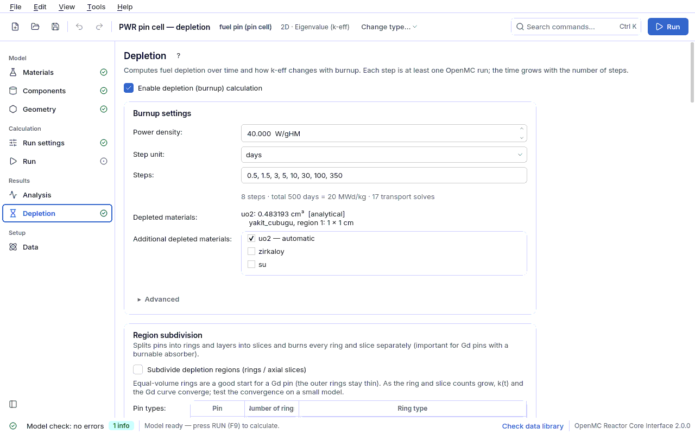

## 4.9 Depletion

The depletion (burnup) calculation computes how the fuel changes over time: U-235 decreases,
Pu-239 builds up, fission product poisons such as Xe-135 and Sm-149 reduce the reactivity. At
every step a transport problem is solved, the reaction rates are taken and the Bateman
equations are advanced with the CRAM solver of OpenMC (`openmc.deplete`). The settings are
written to the `tukenme` section of the spec.

The tab is shown only in an **eigenvalue (k-eff) calculation** with **fissile material** in
the geometry (`uygunluk.tukenme_uygun`); a fixed source activation calculation is not
available in this version. If the tab is opened anyway, only an empty state that gives the
reason ("A depletion calculation is not possible in this model") is shown. The page is a
single flow: enable switch → **Burnup settings** → **Tracked nuclides** → **Run** →
**Result** → **Detailed output**. While depletion is off, only the switch and a short
description are shown.

The run is not made in the process of the interface itself but as an `openmc-arayuz-kosu
--alt tukenme` **subprocess** (the interface starts it with the same Python as `python -m
cekirdek.giris --alt tukenme`; a `terminate()` on the OpenMC C++ side can kill the whole
process; this happened in the preview). The same from the terminal:
`python3 -m cekirdek.tukenme ornekler/pwr_tukenme.json -s 16`
([8. Terminal](08-terminal.md#terminal)).

### Enable switch and Burnup settings card

| Field | Meaning | Unit | Typical range | Common mistake | Spec key |
|---|---|---|---|---|---|
| **Enable the depletion (burnup) calculation** | Turns depletion on. Turning it off and on again does not make the previous result stale. While it is off, **Start depletion** does not work ("Depletion is off — enable it above"). | — | — | Turning it on while fixed source is selected in Run settings: error "depletion requires an eigenvalue (k-eff) calculation" | `tukenme.var` |
| **Power density** | Power per gram of heavy metal. **Absolute power [W] is not used**: in a 2D model it would have to be "per cm", which is a silent unit trap; W/gHM is independent of the geometry and is the number engineers really give. | W/gHM | PWR 38–40, BWR ~25, SFR 50–100 (`pwr_tukenme`: 40) | Entering absolute power (MW): warning "power density … W/gHM is unusual"; 0: error "power density must be greater than zero" | `tukenme.guc_yogunlugu` |
| **Step unit** | Unit of the step lengths: **days** or **MWd/kg (burnup)**. The two are converted into each other with the power density (MWd/kg = days × W/gHM / 1000). | days \| MWd/kg | — | Entering burnup values with the day unit (for example "20" giving 20 days instead of 20 MWd/kg) | `tukenme.adim_birimi` (`d` \| `MWd/kg`) |
| **Steps** | Step lengths, comma separated (not cumulative; each one is the length of an interval). The summary below gives the number of steps, the total days and MWd/kg and the number of **transport solutions**. Keep the first steps short (for example 0.5, 1.5): Xe-135 reaches equilibrium in ~2 days and causes a fast drop of a few thousand pcm in a PWR; a long first step squeezes this into a single line. | days or MWd/kg | `pwr_tukenme`: 0.5, 1.5, 3, 5, 10, 30, 100, 350 days (500 days = 20 MWd/kg) | A non-number or a negative value: "Steps are invalid — …" (red); a long first step: warning "first step … days — the Xe-135 equilibrium (~2 days) is squeezed into one step"; empty: error "at least one time step is required" | `tukenme.adimlar` |
| **Burned materials** | Read-only: the materials to be burned, their **analytic volumes** and the method. Fissile materials and burnable absorbers (Gd, Er) are burned automatically. The volume is the sum of region area × (layer height × number of instances in that layer); pins, plates, spherical shells, the cylinder of a drum-controlled core, axial layers, hexagonal assemblies and square/hexagonal pin cross sections are supported. | cm³ | `pwr_17x17` uo2: 139.147 cm³ (2D: for a height of 1 cm) | Thinking the volume does not matter: if the volume is wrong by a factor f, the burnup rate is wrong by the same factor and **leaves no trace in k-eff**; the error "volume cannot be computed" stops the run | (computed, not stored) |
| **Additional depleted materials** | Materials other than the fuel that should be burned (for example a B₄C control rod, a drum absorber): ticked in the list. Fissile materials and burnable absorbers stay ticked and locked with the note "automatic". A name that is in the file but undefined in the model is not deleted; it is shown with the note "(undefined)". Every additional material needs an exact volume. | — | usually empty | An undefined name: error "undefined extra material"; thinking that control elements burn by themselves (they do not) | `tukenme.ek_malzemeler` |

Below the **Burned materials** row a red warning appears if the chain file cannot be used
("The chain file cannot be used: … (Advanced › Chain)"); the fix is
`./veri_indir.sh --yalniz-zincir` ([9. Troubleshooting](09-sorun-giderme.md#kurulum-sorunlari)).

### Advanced section

| Field | Meaning | Unit | Typical range | Common mistake | Spec key |
|---|---|---|---|---|---|
| **Chain** | Depletion chain: **Automatic (from the spectrum)** (thermal if the model contains hydrogen/deuterium or graphite S(α,β), otherwise fast; beryllium is deliberately not counted), **ENDF/B-VIII.0 thermal (3820 nuclides)**, **ENDF/B-VIII.0 fast (3820 nuclides)**, **CASL simplified thermal / fast (228 nuclides, ~3 times faster)**. The line below gives the selected file, the **fission yield energy** and the reason. | — | automatic | Choosing a thermal chain for a fast system: warning "… chain selected but the model looks like a … spectrum"; taking CASL as the final result (it is for a preliminary study; info "simplified CASL chain") | `tukenme.zincir` (`otomatik` \| `termal` \| `hizli` \| `casl_termal` \| `casl_hizli`) |
| **Integrator** | Time integration: OpenMC's eight integrators (Predictor, CE/CM, CE/LI, LE/QI, EPC-RK4, CF4, SI-CE/LI, SI-LE/QI); transport solutions per step and how to choose are in [4.9.1](04i2-tukenme-genisletme.md#tukenme-genisletme). | — | cecm | Using Predictor with long steps (coarse; shorten the steps or choose CECM) | `tukenme.entegrator` (`predictor` \| `cecm` \| `celi` \| `leqi` \| `epc_rk4` \| `cf4` \| `si_celi` \| `si_leqi`) |
| **Pin-by-pin burnup (each instance a separate material — very heavy)** | When off, all cells containing the same material burn as **one material** (assembly average, fast). When on, each instance of the fuel (each pin of the assembly) becomes a separate material; memory and time grow with the number of instances (17×17: 264, MTR: 23 instances). Shown only if a burnable material occurs more than once in the geometry. | — | off | Turning it on in an advanced geometry with truncated positions: error "instance volume is not exact in pin-by-pin burnup" | `tukenme.malzemeleri_ayir` |
| **Region subdivision** (separate card) | Splits a pin into radial rings and a layer into axial slices; every piece burns separately (important for the Gd pin). Switches pin-by-pin burnup on automatically. Details: [4.9.2](04i3-tukenme-bolme.md#tukenme-bolme); lesson [5.20](05d-ders-tukenme-bolme.md#ders-tukenme-bolme). | rings, slices | Gd pin: 3–6 rings | Interpreting a subdivided model without comparing it with the undivided one | `tukenme.bolme` |

**Chain: thermal or fast — and fission yields.** The two ENDF/B-VIII.0 chains differ in the
capture branching ratio of 101 nuclides (for example Am-241(n,γ) → Am-242m is 8.1 % in the
thermal and 13.2 % in the fast chain). But the chain only changes the branching ratios;
**fission product yields are a separate setting** and the OpenMC default is a fixed 0.0253
eV — even if a fast chain is chosen. This tool sets the yield energy to 500 keV in a fast
system (independent yield of U-235 → Xe-135: 0.00079 thermal, 0.00120 fast). The
spectrum-weighted `average` mode is not used (README "Known limitations").

### Tracked nuclides card

Selects the nuclides to follow in the plot, the table and the CSV; the selection is **not
physics**: when it changes, the previous result is updated from the same result file without
rerunning, and the result is not considered stale.

| Element | What it does |
|---|---|
| Search box | Searches with normalised spelling: "xe-13", "am242m", "PU". |
| Tree | The nuclides of the chain in groups (uranium, plutonium, Xe/Sm dynamics, fission product poisons, burnable absorbers, waste / heat…); the group heading shows selected/total. |
| Ready sets | Basic, Pu vector, Poisons, Minor actinides, Waste / heat… — added with one click. |
| Chips | The selected nuclides; removed with ×. A selected name that is not in the chain becomes a **red chip** (it is not deleted; the tooltip gives the closest name). |

| Field | Meaning | Unit | Typical range | Common mistake | Spec key |
|---|---|---|---|---|---|
| Tracked nuclides | The selection list (OpenMC names: `U235`, `Pu239`, `Xe135`, `Am242_m1`). | — | default: U235, U238, Pu239, Pu240, Pu241, Xe135, Sm149 | A non-OpenMC spelling such as "Xe-135" (formerly skipped silently; now a red chip and the error "tracked nuclide not in the chain") | `tukenme.izlenen` |

### Run card

**Start depletion** starts the run, **Stop** ends it. The button does not work until the model
check gate is passed (preview drawn, no errors); the line below gives the reason. The progress
is **measured, not estimated**: the total number of transport solutions is known ((steps ×
transport solutions per integrator step) + 1) and when the first transport solution finishes,
the remaining time is computed from its real duration ("Waiting for the first transport
solution — the remaining time will be measured from it."). The number of threads is the value
on the **Run** page (`calistirma.is_parcacigi`).

At the start of the run a copy of the spec (`tukenme_spec.json`) is written to the same
directory as the result, and the old result (`depletion_results.h5`) is deleted first: an
interrupted run would otherwise leave the old result next to the new record and make it look
"current". If another project is opened, the result of a running depletion is not written to
the new project.

**Cost (measured).** The nuclides of the chain are added to the fuel, so the transport
becomes slower. Pin cell, 2000 × 20 particles, 2 transport solutions: CASL (228 nuclides)
37 s, ENDF/B-VIII.0 (3820 nuclides) 125 s. `pwr_tukenme` (17 transport solutions, 5000 × 60)
takes ~50 minutes (README).

### Result card

| Element | What it shows |
|---|---|
| Previous result line | When the tab opens it shows the result of the last run (no need to rerun a 50-minute run to see it). Three states: "Result of the previous run (…) — **belongs to this model**."; in red and bold "**Stale result** (…): the model has changed since that run (…). The numbers shown do not belong to this model — run again." (the changed section is named); "… it **cannot be verified** that it belongs to this model" (no record). An interrupted run is shown separately as "Interrupted run (…): N / M steps completed". |
| Plot | Top: k-eff (± 1σ) versus time; bottom: atom density of the selected nuclides versus time. |
| Table | days, MWd/kg, k-eff, ρ [pcm] (ρ = (k − 1)/k, pcm = Δρ × 10⁵). |
| Export as CSV | Time [days], burnup [MWd/kg], k, σ and, for every selected nuclide in every material, the number of atoms and the density [atom/b-cm]. Decimal point, comma as field separator, full precision. |

The staleness comparison is made with Python equality, not with text (hash): `3` and `3.0` in
JSON are the same number. Name, description, run directory and tracked nuclides do not affect
the physics and are not counted; turning depletion off and on does not make the result stale
either. The result is read according to the **recorded** spec (material mapping and volumes
come from the model of the run). Reading is done in the background (~3 s).

**Detailed output** (collapsible) shows the output of OpenMC and `cekirdek.tukenme`; it opens
by itself on an error.

#### Pin power versus burnup

If a power tally can be built for the model (the pins repeat in a lattice) the depletion run
also tallies the pin power distribution in every step — even if the power distribution is off in
Run settings (all fuel pins if no target is chosen). To switch it off set `tukenme.adim_gucu` to
`false` in the spec. OpenMC writes `openmc_simulation_n<i>.h5` after the transport at the
**beginning** of every step; these correspond one to one to the time points of
`depletion_results.h5` (the CECM corrector transport is not written: the distribution shown is
the beginning-of-step one). A new run deletes the old step files.

Below the result card (if step files exist):

| Element | What it shows |
|---|---|
| **Step:** | Step selector (step, days, MWd/kg); the pin table below is the table of that step (same as the [pin power table](04g-calistir.md#calistir-pin-tablosu): sort, filter, **Fold to quarter**). |
| Plot (left) | Relative power versus burnup (± 1σ) of the pins selected in the table; each selection is added to the list (at most 6). Initially the hottest pin. **Clear selection** empties the list. |
| Plot (right) and table | F_ΔH and F_q (3D) ± σ per step and the peak q′. |
| **Save step × pin…** | The pin table of every step in one file: step, time [d], burnup [MWd/kg] + pin columns (CSV; Excel if openpyxl is installed). |
| **Peaking factors CSV…** | F_ΔH, F_q, their σ and the peak q′ per step. |

The absolute power is the source power of the step (power density × heavy metal;
`Results.get_source_rates`); in a 2D model power and q′ are per 1 cm of height (like the
depletion volume; table header "Power [W/cm height]", `W_per_cm` in the file). **With pin-by-pin
depletion off** all pins burn with the same average composition: the change of the
distribution with burnup does not reflect per-pin burnup (the faster burning of hot pins is not
seen). The pin power is the sum over all fuel regions of the pin (all rings of a Gd pin). The
**Pin power per step** box under Advanced (`tukenme.adim_gucu`) switches the measurement off;
it does not make the result stale. The relative power is relative to that step's fuel pin average. Lesson:
[5.7](05-dersler.md#ders-guc-yanma).

### Example and verification

`ornekler/pwr_tukenme.json`: the same pin as `pwr_pinhucre`, 40 W/gHM, 500 days (20 MWd/kg),
full ENDF/B-VIII.0 thermal chain, CECM. Measured: k∞ 1.35930 ± 0.00184 (0 days) → 1.06545 ±
0.00168 (500 days); Xe-135 + early Sm-149 (0 → 2 days) Δρ = −2634 ± 158 pcm (pcm = Δρ × 10⁵).
Step by step: [depletion lesson](05-dersler.md#ders-tukenme). The analytic verification
(Bateman, with the chain's own half-lives, to ten digits) and the agreement of the volumes
with the OpenMC stochastic volume within 1σ are in the tests (README "Depletion").

### Common model check findings (`tukenme`, `tukenme/<material>`)

| Finding (summary) | Level | Fix |
|---|---|---|
| depletion requires an eigenvalue (k-eff) calculation | error | Set **Calculation type** to eigenvalue in Run settings ([4.6](04f-hesap-ayarlari.md#hesap-ayarlari)). |
| depletion not possible: no fissile (fuel) material in the geometry | error | The fuel to be burned must be in the geometry. |
| chain file missing / damaged | error | `./veri_indir.sh --yalniz-zincir`; source and sha256: `~/nucdata/chain/KAYNAK.txt`. |
| tracked nuclide not in the chain: '…' | error | Remove the red chip or choose the name given in the tooltip. |
| first step … days — the Xe-135 equilibrium (~2 days) is squeezed into one step | warning | Make the first steps 0.5 and 1.5 days. |
| few active statistics (… particles × … batches) | warning | Increase the particles and batches in Run settings. |
| volume cannot be computed | error | Unsupported geometry; reduce the truncated positions in the advanced model. |
| burnable absorber '…' does not take part in depletion | warning | Its volume is not known analytically; the material stays fresh during the run and overstates the control worth at end of life. |

All findings: [9. Troubleshooting](09-sorun-giderme.md#bulgu-turleri). Limitations: depletion
cannot be continued where it stopped (every run starts from the beginning), control elements
do not burn by themselves (they are added with `tukenme.ek_malzemeler`), eigenvalue mode only
([6. Known limitations](06-sonuclar.md#bilinen-sinirlar)).
