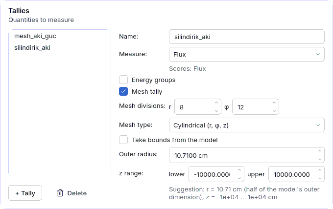
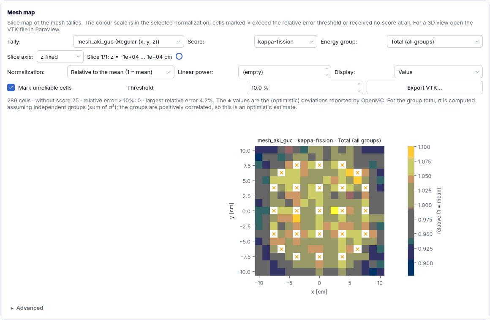

<a id="mesh-tally"></a>
## 4.10 Mesh tally and VTK

A mesh tally splits a quantity (flux, fission, heating, absorption ...) over the cells of a mesh
that is independent of the model geometry: pin-by-pin power map, radial flux profile, dose map
in a shield. The mesh is added to a tally in the **Tallies** card of the
[Run settings](04f-hesap-ayarlari.md#ayar-tally) page; the result appears on the
[Run](04g-calistir.md#calistir) page in the **Mesh map** card as a 2D slice and is exported to
**VTK** for ParaView. The computation lives in the `cekirdek/mesh_tally/` package; the model
built by the interface and the Python script exported with **Script** build the same mesh (the
same definition function; `testler/test_y1_mesh_tanim.py`).

Example: `ornekler/pwr_mesh_aki.json` (two-group flux and kappa-fission on a 17 x 17 regular
mesh, flux on an 8 x 12 cylindrical mesh). Step by step: [5.13 Lesson](05c-ders-mesh.md#ders-mesh).



<a id="mesh-form"></a>
### Mesh fields in the tally form

| Field | Meaning | Unit | Typical range | Common misuse | Spec key |
|---|---|---|---|---|---|
| **Mesh tally** | Adds a mesh filter to the tally (switching it off removes the filter). | — | off | A very fine mesh: fewer histories per cell, larger relative error (see the × mark on the map). | `tallyler[].filtreler[]` (`tur`: `mesh`) |
| **Mesh type** | **Regular (x, y, z)** `RegularMesh`, **Cylindrical (r, φ, z)** `CylindricalMesh`, **Spherical (r, θ, φ)** `SphericalMesh`. A hexagonal mesh is out of scope: the installed OpenMC 0.16.0 has no `HexagonalMesh` class; use a regular or cylindrical mesh for a hexagonal assembly. | — | regular | A cylindrical mesh on a square assembly: the corners stay outside the mesh (suggested r = half the outer size). | `mesh_turu` (`duzenli` \| `silindirik` \| `kuresel`; regular if absent) |
| **Mesh divisions** | Division count on the three axes; the labels follow the type: x, y, z / r, φ, z / r, θ, φ. On regular and cylindrical meshes the z division is shown only in a 3D model and in a sphere. Grids are uniform (φ 0 to 2π, θ 0 to π). | divisions | 17 x 17 x 1 (one per pin), r 5 to 20 | Expecting z divisions in a 2D model (the mesh is a single slice in 2D). | `boyut` |
| **Take bounds from the model** | When on, the bounds are derived from the model bounding box when the model is **built** (`otomatik`); adding a reflector enlarges the mesh too. Switching it off writes the current suggestion as explicit bounds that can be edited. | — | on | Entering small bounds by hand and enlarging the model later. | `otomatik` |
| **Lower bound** / **Upper bound** | Corners of a regular mesh (x, y, z). | cm | bounding box | Lower >= upper: "mesh lower bound must be smaller than the upper bound on every axis". | `alt`, `ust` |
| **Outer radius** | Outer radius of a cylindrical or spherical mesh (inner radius 0). | cm | half the outer size | 0 or negative: "mesh outer radius must be greater than zero". | `r_ust` |
| **z range** | Axial bounds of a cylindrical mesh (lower, upper). | cm | core height | Lower >= upper. | `z_alt`, `z_ust` |
| **Group structure** | With energy groups on, predefined group boundaries: **Manual**, CASMO-2/4/8/16/25/40/70, XMAS-172, SHEM-361. Boundaries are taken from OpenMC (`openmc.mgxs.GROUP_STRUCTURES`) and written to the **Group boundaries [eV]** box; editing the box by hand shows **Manual**. | — | CASMO-2 (0.625 eV) | 172 groups on a 17 x 17 mesh: 49 708 bins, very few histories per bin. | `tallyler[].filtreler[].gruplar` |

The mesh centre `merkez` [x, y, z] (JSON only; default 0, 0, 0) shifts a cylindrical or
spherical mesh; the form keeps this field. Automatic suggestion:

* **x, y**: the model bounding box (reflector included).
* **z**: core height in a 3D model, sphere diameter in a sphere. In a **2D model** (infinite in
  the axial direction, unbounded z) +/-10⁴ cm (`Z_2B_YARI`): particles wander freely in z, so a
  +/-1 cm mesh missed most of the track length. Measured (`pwr_mesh_aki`, 5000 particles x 40
  active batches): median kappa-fission relative error 21% at +/-1 cm, 2.7% at +/-10⁴ cm. In an
  axially infinite model the flux is uniform in z, so the per-volume value does not change.
* **r**: half of the larger side of the bounding box for cylindrical and spherical meshes.

Scores are chosen from the **Scores** list of the form: flux (`flux`), fission, absorption,
`heating`, `heating-local` (local heating), `kappa-fission`, `fission-q-recoverable` ...

<a id="mesh-harita"></a>
### Mesh map on the Run page

When the run finishes (or a saved run directory is loaded) the mesh tallies of the statepoint
are read. A tally with a filter other than one mesh filter and an optional energy filter is not
mapped (the warning line gives the reason). The card is hidden when there is no mesh tally.



| Control | Meaning |
|---|---|
| **Tally**, **Score**, **Energy group** | The displayed array. The energy group is **Total (all groups)** or a single group; for the total the σ values are assumed independent (σ² summed). |
| **Slice axis** and slider | The fixed axis and the slice number; the label gives the slice range. On a cylindrical mesh "z fixed" shows the (r, φ) plane in Cartesian form and "φ fixed" is the r-z section; on a spherical mesh "φ fixed" is the meridian plane (ρ, z). |
| **Normalization** | **Per source neutron** (raw OpenMC value; scaled by the source strength in fixed source), **Per volume (/cm³)**, **Relative to the mean (1 = mean)** (the mean of the scored cells is 1), **Absolute (from total power)**. |
| **Total power** | For absolute normalization, the power [W] of the region covered by the model; it opens with the **Total power** of the power distribution in Run settings. |
| **Display** | **Value**, **Standard deviation (σ)**, **Relative error (σ / value)**. |
| **Mark unreliable cells** | Cells whose relative error exceeds the **Threshold** or that received no score are marked with ×; a cell without score is left out of the colour scale (blank). |
| **Threshold** | Default 10%: the MCNP5 manual (LA-UR-03-1987, Chapter 2, "relative error R" interpretation table) calls R < 0.10 "generally reliable" (except point detectors). This is a **guideline, not a rule**; moreover the ± values are the optimistic (no inter-batch correlation) deviations reported by OpenMC. |
| **Export VTK...** | Writes the selected tally with the selected normalization to a `.vtk` file: for each score and group `<score>_g<n>` (+ `_toplam`), `_sigma` and `_bagil_hata` fields. |

**Absolute normalization** is meaningful only in an eigenvalue calculation: source rate
S = P / (H · e) [neutrons/s], where H is the sum of the heating score on the mesh
(`kappa-fission`, `heating` ...) per source neutron [eV] and e = 1.602176634 x 10⁻¹⁹ J/eV
(CODATA 2018, exact). Flux is shown in n/cm²·s, heating in W/cm³; the mesh must cover the whole
fissile region (automatic bounds do). Without a heating score in the tally or with an empty total
power the map is shown per volume with a warning. In a **2D model** the mesh height is
2 x 10⁴ cm, so enter total power = linear power [W/cm] x 20 000 cm (e.g. 17.6 MW per assembly /
366 cm = 48.1 kW/cm -> 9.6 x 10⁸ W); the relative map does not need it. The uncertainty of the
normalization factor itself is not added to σ.

<a id="mesh-vtk"></a>
### VTK and ParaView

The file is in legacy VTK format (`DATASET STRUCTURED_GRID`, ASCII). If the Python `vtk`
package is installed, OpenMC's own writer (`Mesh.write_data_to_vtk`, volume normalization off)
is used; otherwise (not in the default environment, no new dependency is added) a built-in
writer with the same point and cell order. Cylindrical and spherical cells are written as
straight-edged hexahedra (OpenMC's default). In ParaView: **File › Open** -> `.vtk` -> **Apply**;
choose a field for colouring (e.g. `kappa_fission_toplam`), extract the `_bagil_hata` > 0.1
cells with **Threshold**, take a slice with **Slice**.

The same mesh in the script (cylindrical example):

```python
import numpy as np
tally_2_mesh_0 = openmc.CylindricalMesh(
    r_grid=np.linspace(0.0, 10.71, 9),
    phi_grid=np.linspace(0.0, 6.283185307179586, 13),
    z_grid=np.linspace(-10000.0, 10000.0, 2),
    origin=[0.0, 0.0, 0.0])
```

<a id="mesh-hatalar"></a>
### Common findings

| Finding | Cause | What to do |
|---|---|---|
| Many × on the map | Few histories per cell (fine mesh, many groups) | Increase particles/batches or coarsen the mesh; relative error ~ 1/√N. |
| "Absolute normalization not possible ..." | Total power empty or no heating score in the tally; fixed source calculation | Enter the total power, add `kappa-fission` to the tally; in fixed source use "Per source neutron". |
| "Mesh tally not shown on the map: ..." | The tally has a filter other than mesh and energy (material, cell) | Define a separate mesh tally. |
| "unknown mesh type: ..." | Wrong `mesh_turu` in the JSON (e.g. hexagonal) | Write `duzenli`, `silindirik` or `kuresel`. |
| "VTK file name must end with .vtk" | Missing extension | Add `.vtk` to the file name (the dialog adds it). |
