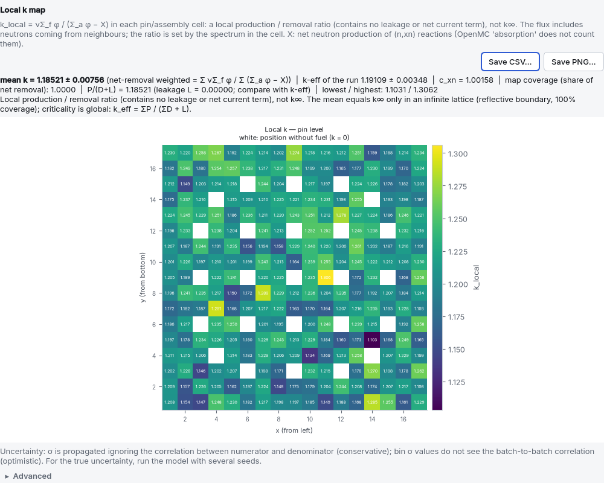
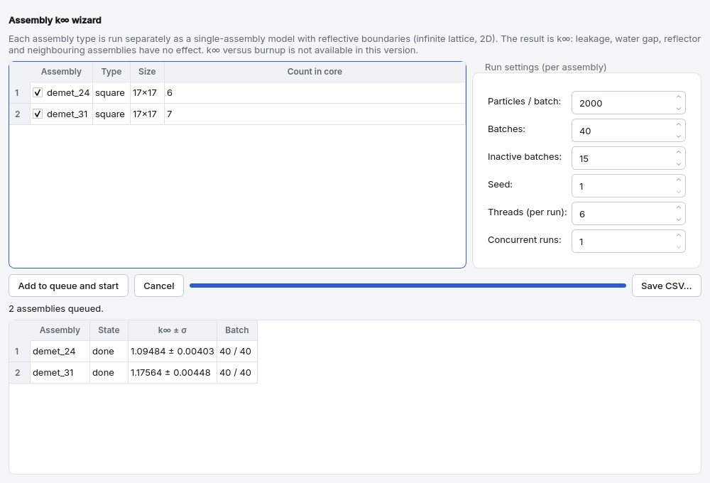

<a id="dersler"></a>
# 5. Guided lessons

Each lesson starts with an example file, goes step by step through the interface and ends with
an **expected result**. The lessons are ordered from easy to hard; lesson 1 is a prerequisite for
the others. Examples are opened from the example list of the start screen or with **File › Open…**
and they open as a **copy**: the files under `ornekler/` are test references and are never
overwritten. Use **File › Save as…** to keep your own changes.

| Lesson | Topic | Example file | Level |
|---|---|---|---|
| [5.1](#ders-demet) | Assembly k∞ | `ornekler/pwr_17x17.json` | introductory |
| [5.2](#ders-tam-kor) | Full core (square map) | `ornekler/pwr_smr_kor.json` | intermediate |
| [5.3](#ders-altigen-kor) | Hexagonal assembly and hexagonal core | `ornekler/sfr_altigen.json`, `ornekler/vver1000_kor.json` | intermediate |
| [5.4](#ders-kare-altigen) | Square core + hexagonal ring | `ornekler/pwr_kare_altigen_halka.json` | advanced |
| [5.5](#ders-tambur) | Placing a drum in any geometry | `ornekler/kafes_tamburlu_yansitici.json`, `ornekler/altigen_tambur_halkasi.json` | advanced |
| [5.6](#ders-tukenme) | Depletion and nuclide selection | `ornekler/pwr_tukenme.json` | advanced |
| [5.7](#ders-guc) | Power map and F_ΔH | `ornekler/pwr_3b.json` | intermediate |
| [5.8](#ders-benchmark) | Benchmark and C/E | `ornekler/godiva_kriter.json` and `kriter_*` | introductory–advanced |
| [5.9](#ders-kritik-arama) | Critical search | `ornekler/pwr_17x17.json`, `ornekler/pwr_kontrol.json`, `ornekler/tamburlu_kor.json` | intermediate |
| [5.10](#ders-rapor) | Report and conformity annex | any run | intermediate |
| [5.11](#ders-spektrum) | Spectrum and four factors | `ornekler/pwr_pinhucre.json` | intermediate |
| [5.13](05c-ders-mesh.md#ders-mesh) | Mesh flux and power map, ParaView | `ornekler/pwr_mesh_aki.json` | intermediate |
| [5.14](#ders-malzeme-asistani) | Material assistant and my library | `ornekler/pwr_17x17.json` | introductory |
| [5.15](#ders-yerel-k) | Local k and assembly k∞ | `ornekler/pwr_17x17.json`, `ornekler/pwr_ceyrek_kor.json` | intermediate |
| [5.16](05d-ders-foton-sicaklik-yuzey.md#ders-foton-sicaklik-yuzey) | Photon heating, temperature interpolation, surface current | `ornekler/pwr_pinhucre.json`, `ornekler/zirh_kure.json` | intermediate |
| [5.18](05d-ders-goruntuleyici.md#ders-goruntuleyici) | Viewer: slice, overlaps, tally overlay, 3D | `ornekler/pwr_mesh_aki.json`, `ornekler/vver1000_kor.json`, `ornekler/pwr_3b.json` | intermediate |
| [5.19](05d-ders-mgxs.md#ders-mgxs) | Group constants, multigroup MC and random ray | `ornekler/pwr_pinhucre.json` | advanced |
| [5.20](05d-ders-tukenme-bolme.md#ders-tukenme-bolme) | Ring subdivision of a Gd pin and the branch table | `ornekler/bolme/pwr_gd_bolme.json`, `ornekler/pwr_tukenme.json` | advanced |
| [5.21](05d-ders-triso-varyans.md#ders-triso-varyans) | TRISO fuel, packing fraction and a shield with weight windows | `ornekler/htgr_kompakt.json`, `ornekler/htgr_pebble.json`, `ornekler/zirh_agirlik_pencere.json` | advanced |

**Where do the expected results come from?** Every value has a source: the `referans.olcum` field
of the example file, [VV.md](../../VV.md), [ORNEKLER.md](../../ORNEKLER.md) or the measurement tables
of [TEKNIK_NOTLAR.md](../../TEKNIK_NOTLAR.md). The measurement condition (particles × batches / inactive
batches) is given in each lesson. A Monte Carlo result is statistical: with the same settings but a
different seed or thread count the last digits differ; **a 2–3σ difference with different settings
is normal**. Uncertainties are 1σ standard uncertainties everywhere. How to read a result:
[6. Interpreting results](06-sonuclar.md#sonuclar).

Page names in the sidebar: **Materials**, **Components**, **Assembly**, **Geometry**,
**Run settings**, **Run**, **Analysis**, **Depletion**. Only the pages that make sense for the
model are shown ([4.0 Window layout](04-sekmeler.md#pencere-duzeni)).

---

<a id="ders-demet"></a>
## 5.1 Assembly k∞: PWR 17×17

**Example file:** `ornekler/pwr_17x17.json` · **Level:** introductory · **Estimated time:** 15 minutes
(run 1–3 minutes)

**Goal.** Read the model of a fuel assembly page by page, understand why **k∞** (the infinite
multiplication factor) is computed, run it and compare the result with the measured value. If this
is your first time, follow [2. First calculation in 15 minutes](02-ilk-hesap.md#ilk-hesap) first;
this lesson focuses on the physics of the same model.

**Steps.**

1. Open **PWR 17×17 fuel assembly** from the example list of the start screen. The model header
   states the type: single fuel assembly, 2D, eigenvalue (k-eff).
2. **Materials** page: there are four materials (`uo2`, `helyum`, `zirkaloy4`, `su`). Double-click
   `su` (water); it is a library material and is stored with its generation parameters such as
   temperature and boron ([4.1 Materials](04a-malzemeler.md#malzemeler)). Close it with **Cancel**
   without changing anything.
3. **Components** page: the fuel pin and the guide tube. Select the fuel pin; in the **Radial
   regions** card the fuel, gap and cladding regions are listed from the inside out. The outer radii
   of the regions must increase and the outermost region must stay smaller than the cell pitch
   ([4.2 Components](04b-parcalar.md#parcalar)).
4. **Assembly** page: a 17×17 square map; the coloured palette shows which pin is in which cell.
   The **Pitch** is 1.26 cm (distance between pin centres).
5. **Geometry** page: the configuration template is a single assembly; the **Radial boundary** is
   `reflective` and the model is 2D (infinite height). The preview on the right draws the xy
   cross-section of the assembly.
6. **Why k∞?** When all outer boundaries are reflective, no neutron can escape; the model is an
   infinitely repeated assembly medium. The result card then shows **k∞** and gives no criticality
   verdict: k∞ > 1 does not mean that the reactor is supercritical, only that the fuel carries
   excess reactivity ([6.1 Statistics](06-sonuclar.md#istatistik)).
7. **Run settings** page: the **Accuracy preset** should be **Normal** (10 000 particles × 150
   batches, 40 inactive). The line below gives the expected k-eff uncertainty
   ([4.6 Run settings](04f-hesap-ayarlari.md#hesap-ayarlari)).
8. Go to the **Run** page. The line under the button should say that the model is ready to run or
   give the number of warnings; the button is not enabled before the preview has been drawn
   ([Draw first, then run](06-sonuclar.md#once-ciz)). Press **Run** (or **F9**).
9. Watch the convergence plot during the run: after the inactive batches the cumulative mean should
   settle into a flat band. The **Shannon entropy** badge should say **Converged**.

**Expected result.** k∞ = **1.18443 ± 0.00088** ([TEKNIK_NOTLAR.md](../../TEKNIK_NOTLAR.md), table of measured
reference results; the example's own settings 10 000 × 150 / 40 inactive, seed 1, 6 threads,
01.10.2026). Your value should be within 2–3σ of this. A larger
difference or a lost-particle warning signals a problem
([9. Troubleshooting](09-sorun-giderme.md#sorun-giderme)).

**What we learned / check questions.**

- If all side boundaries were `vacuum`, would the result be k∞ or k-eff? Would the value of a single
  assembly grow or shrink? (Leakage → k-eff, it shrinks.)
- By roughly what factor must particles × active batches grow to halve σ? (σ ∝ 1/√N → about 4.)
- The regression anchor `ornekler/pwr_pinhucre.json` gives k∞ = 1.3570 ± 0.0020. It is **not the
  same fuel** as this assembly: the pin cell is 3.0 %, all materials at 293.6 K, no boron in the
  water; this assembly is 3.2 %, hot (fuel 900 K, cladding 600 K, water 580 K) with 1300 ppm boron.
  Where does the k∞ difference (~0.17) come from? (Measured with the settings of this assembly:
  without boron 1.34300 ± 0.00085 → **boron ≈ −15 900 pcm (Δk × 10⁵)**; without boron and all
  materials at 293.6 K 1.37120 ± 0.00094 → **temperature ≈ −2 800 pcm**. The small remainder comes
  from the enrichment, the pellet/cladding dimensions and the guide tubes. Boron and temperature
  dominate, not the guide tubes.)

---

<a id="ders-tam-kor"></a>
## 5.2 Full core: square SMR core

**Example file:** `ornekler/pwr_smr_kor.json` (also `ornekler/pwr_ceyrek_kor.json`) ·
**Level:** intermediate · **Estimated time:** 30 minutes (Normal run 1–3 minutes)

**Goal.** Place assemblies on a core map, see how leakage lowers k-eff in a finite core and build
quarter-core symmetry with the right boundary condition.

**Steps.**

1. Open the **Square SMR-like full core (52 assemblies)** example. The model header shows the type
   "full core (square map)".
2. The **Assembly** page has two assemblies: `demet_24` (2.4 %) and `demet_31` (3.1 %); both are
   PWR 17×17 assemblies.
3. **Geometry** page, **Core map** card: a 12×12 map, **Cell pitch** (assembly pitch) 21.42 cm.
   Letters: `A` → `demet_24` (inner zone), `B` → `demet_31` (outer belt), `s` → `su` (two rows of
   water reflector around). Pick an item from the palette and click cells to paint; a right click
   picks the content of that cell ([4.4.3 Core map](04d-geometri.md#geo-harita)). Do not change
   the map.
4. On the same page the height is **3D, layered**: bottom water 20 cm, active 200 cm, top water
   20 cm ([4.4.8 Axial layers](04d-geometri.md#geo-katmanlar)). The **Radial**, **Bottom** and
   **Top boundary** are `vacuum`: neutrons escape and the result is **k-eff**.
5. **Run settings**: the example opens with **Quick test** (1 000 × 60, 20 inactive); this is only
   to see that the model runs (σ of a few hundred pcm). Set the **Accuracy preset** to **Normal**.
6. **Run**. Look at the k-eff interpretation on the result card (supercritical / critical /
   subcritical; criterion |k − 1| ≤ 2σ). Check the entropy badge: in a full core, 40 inactive
   batches are **borderline** for source convergence
   ([6.2 Source convergence](06-sonuclar.md#kaynak-yakinsamasi)).
7. (Optional) **Quarter core:** open `ornekler/pwr_ceyrek_kor.json`. Only a quarter of the map is
   present; on the **Geometry** page **Per-face radial boundary** is on: the −x and +y faces are
   `reflective` (symmetry planes), the +x and −y faces `vacuum` (outer faces)
   ([4.4.6 Height and boundary conditions](04d-geometri.md#geo-yukseklik)).

**Expected result.**

- Full core, **Normal** (10 000 × 150, 40 inactive): k-eff = **1.06005 ± 0.00086**
  ([ORNEKLER.md](../../ORNEKLER.md), table of run times per accuracy preset; 81 s with 6 threads).
- Full core and quarter core at 20 000 × 160 batches / 60 inactive: **1.05881 ± 0.00059** and
  **1.05922 ± 0.00066**; difference 41 pcm (Δk × 10⁵), i.e. 0.46σ ([ORNEKLER.md](../../ORNEKLER.md),
  quarter-core section).

**What we learned / check questions.**

- The assemblies of the core are **not** the assembly of lesson 5.1 (3.2 %, k∞ ≈ 1.18): they are
  2.4 % and 3.1 %. Infinite-lattice values measured with the same geometry, temperatures and 1300 ppm
  boron: k∞(2.4 %) = 1.09772 ± 0.00090 and k∞(3.1 %) = 1.17538 ± 0.00086 (`pwr_17x17` settings,
  01.10.2026). The k-eff of the core (1.06005) is below both, not between them - why? (Leakage: the
  side, bottom and top boundaries are vacuum and the water reflector is only 20 cm. The weight of the
  2.4 % inner zone and the leakage together lower k-eff.)
- Why can the quarter core not be built with a **checkerboard** loading? (The reflective symmetry
  plane **mirrors** the quarter; a checkerboard has no mirror symmetry, so the mirrored core is a
  different loading — measured difference +260 pcm. [ORNEKLER.md](../../ORNEKLER.md))
- Is the quarter core faster for the same number of particles? (No; the gain is in per-assembly
  statistics.)

---

<a id="ders-altigen-kor"></a>
## 5.3 Hexagonal assembly and hexagonal core

**Example files:** `ornekler/sfr_altigen.json` (assembly), `ornekler/vver1000_kor.json` (core) ·
**Level:** intermediate · **Estimated time:** 40 minutes

**Goal.** Learn the ring layout of a hexagonal lattice and the **orientation** rule; place hexagonal
assemblies on a hexagonal core map.

**Steps — hexagonal assembly.**

1. Open the **SFR hexagonal assembly** example. On the **Assembly** page the map is hexagonal, not
   square: **Number of rings** 7 (centre included; 1 + 6 + 12 + … = 127 pins), **Pitch** 0.9 cm,
   **Orientation** `y`. On a hexagonal map the positions are written ring by ring from the outside
   in ([4.3 Assembly](04c-demet.md#demet)).
2. On the **Geometry** page the radial boundary is reflective; the result is again k∞. This assembly
   has no duct; the space outside the pins is filled by the **Outside assembly** fill (`sodyum`).
3. Keep the **Run settings** as in the file (10 000 × 120, 30 inactive). **Run**.

**Expected result (assembly).** k∞ = **1.46634 ± 0.00070** ([TEKNIK_NOTLAR.md](../../TEKNIK_NOTLAR.md), table of
measured reference results; 53 s with 24 threads). Why k∞ is much larger than for the PWR assembly
(~1.18): the enrichment is **19.75 %** (PWR assembly 3.2 %), the fuel is a **dense metal** (U-10Mo,
17 g/cm³; far more uranium per unit volume than UO₂) and there is no absorber of that kind - neither
the dissolved **boron** in the water nor the absorption of a hydrogenous **moderator** is present in
this assembly. The fast spectrum alone does not raise k∞ (the U-235 fission cross section is much
smaller in a fast spectrum than in a thermal one).

**Steps — hexagonal core.**

4. Open the **VVER-1000 full core (163 assemblies)** example. The **Assembly** page has three
   assemblies (`tvs_a20`, `tvs_b30`, `tvs_c44`); each has 11 rings and a pin lattice with
   orientation **`y`**.
5. **Geometry** page: type "full core (hexagonal map)", **Number of rings** 8 (169 positions),
   **Assembly pitch** 23.6 cm, core lattice orientation **`x`**. The six corners of the outer ring
   are filled with `R` (steel-water reflector); the other 163 positions are assemblies. The radial
   reflector is 20 cm.
6. **Orientation rule:** if the pin lattice of the assembly is `y`, the core lattice must be `x`
   (the two at 90°). To try it, temporarily set the core orientation to `y`: the model check panel
   shows an **error** for every assembly saying that the orientation of assembly 'tvs_a20' ('y')
   equals the core orientation and that the assembly corners spill into the neighbouring cell.
   Undo with **Ctrl+Z**. The measurement behind this rule and the `HexLattice`/`HexagonalPrism`
   orientation pitfall: [6.5 Known pitfalls](06-sonuclar.md#tuzaklar).
7. The example opens with **Quick test**. Set the **Accuracy preset** to **Normal** and **Run**.

**Expected result (core).** k-eff = **1.09907 ± 0.00097**, **Normal** (10 000 × 150, 40 inactive;
66 s with 8 threads; [ORNEKLER.md](../../ORNEKLER.md), table of run times per accuracy preset). The
loading pattern is for teaching; it is not a real VVER-1000 map.

**What we learned / check questions.**

- How many positions does a hexagonal lattice with 8 rings have? (1 + 3·n·(n−1) = 169.)
- What does the **pitch** measure in a hexagonal lattice? (Flat to flat, not corner to corner.)
- Why is the duct apothem of a hexagonal assembly `(rings − 1)·pitch·√3/2 + pitch/2` and not
  `(rings − 0.5)·pitch`? ([6.5 Known pitfalls](06-sonuclar.md#tuzaklar))

---

<a id="ders-kare-altigen"></a>
## 5.4 Square core + hexagonal ring

**Example file:** `ornekler/pwr_kare_altigen_halka.json` · **Level:** advanced · **Estimated time:**
45 minutes (Normal run ~1 minute)

**Goal.** Read an arrangement that the templates cannot build (a square-lattice core surrounded by
a hexagonal block lattice) as a **geometry tree**, and build the same thing in your own model from a
template. Concepts: [4.5 Advanced geometry editor](04e-geometri-gelismis.md#geometri-gelismis).

**Steps — reading the example.**

1. Open the **Square core inside a hexagonal reflector ring** example. The **Geometry** page opens directly
   in the advanced editor (tree + cross-section + property form); the note at the top says the
   template wizard is closed.
2. Read the tree from top to bottom:
   - **Root — hexagon a=121.244 (x)**: the root container, a hexagonal cross-section with
     orientation `x` (apothem 121.24 cm).
   - **Inside: lattice blok_kafesi (hexagonal, 5 rings)**: the inside of the root is a hexagonal
     lattice with 5 rings and a 30 cm pitch; its letter `B` points to the component
     `yansitici_blok` (SS-304 block + 6 cm diameter water channel).
   - **Placement: kare_cekirdek (list, 1)**: a **rectangular** hole (107.1 × 107.1 cm) is cut out of
     the middle of the lattice, and **lattice cekirdek_kafesi (square 5×5)** is put into it (a 5×5
     PWR assembly lattice with a 21.42 cm pitch, checkerboard 2.4 % / 3.1 %).
   - **Ring 1 (20 cm)**: a 20 cm water belt on the outside. Radial boundary `vacuum`; the model is 2D.
   - **Components (1)**: `yansitici_blok` is defined once and used as the same universe at every
     position.
3. Select the placement row and read the form: **Mode** List, one position (0, 0), hole
   cross-section Rectangle. In the cross-section the selected node is coloured and the others are
   faded.
4. Look at the strip at the bottom: there is a **16 truncated positions** warning. The square hole
   cuts some hexagonal blocks; it is not possible to surround a square core with a hexagonal lattice
   **without truncation**. This is not an error but a consequence of the design: the volume of the
   truncated blocks is computed stochastically. Blocks completely under the hole are hidden on the
   map with `.` (hidden position, info). The fuel is not truncated; the fuel volume is analytical
   ([4.5.10](04e-geometri-gelismis.md#gg-kesik)).
5. The **Run settings** are Normal (10 000 × 150, 40 inactive). **Run**.

**Expected result.** k-eff = **1.06492 ± 0.00086** (the `referans.olcum` field of the example; Normal,
56 s with 6 threads). This value is not an external reference but the tool's own measurement (for
regression).

**Steps — building it yourself.**

6. Open `ornekler/pwr_17x17.json` (a single assembly in template mode). Optionally add
   **SS-316 stainless steel** first with **Materials › Add from library…**; the template proposes the
   first structural material of the model as block material (`zirkaloy4` if you add nothing).
7. On the **Geometry** page choose **Square center + hexagonal ring** from the **Configuration
   template** list. In the window that opens, the fields are filled from the components of the
   model: core assembly A, core assembly B (checkerboard) (here both `demet_17x17`), core size (n×n)
   5, lattice pitch 21.42 cm, block pitch (flat to flat) 30 cm, number of block rings 5, block
   content "reflector block (material + channel)", block material, block channel radius 3 cm, gap
   fill `su`, outer reflector thickness 20 cm, reflector material `su`, height 2D. Press **OK**.
8. The model switches to advanced geometry and the tree has the same structure as the example. The
   model check again gives the **16 truncated positions** warning (same geometry). **Ctrl+Z** returns
   to the single assembly before the template.
9. In the block content list a "fuel: …" option appears only if the model contains a **hexagonal**
   assembly: the content of the hexagonal ring blocks can be a reflector block or a hexagonal fuel
   assembly ([GEOMETRI_MODELI.md](../../GEOMETRI_MODELI.md) section 15, decision 3).

**What we learned / check questions.**

- Why is a truncated position a warning and not an error? When does it become an error? (A
  truncated fuel instance with **Pin-by-pin burnup** on; [4.9 Depletion](04i-tukenme.md#tukenme).)
- Why use a **component** instead of copying the same block inline into every position? (One
  universe; distribcell and depletion instance counts are not split.)
- Why does the k-eff of your own model differ from the example? (A single-enrichment assembly and a
  different block material.)

---

<a id="ders-tambur"></a>
## 5.5 Placing a drum in any geometry

**Example files:** `ornekler/kafes_tamburlu_yansitici.json`, `ornekler/altigen_tambur_halkasi.json`
(and the model of lesson 5.4) · **Level:** advanced · **Estimated time:** 60 minutes

**Goal.** Use a control drum in any geometry, not only in the "drum-controlled core" template: a
placement (hole + content), the "facing the core" rule and a **group** that rotates the drums
together. Form details: [4.5.8 Placement form](04e-geometri-gelismis.md#gg-yerlesim) and
[4.5.9 Group and component forms](04e-geometri-gelismis.md#gg-grup).

**Rule (all modes).** The absorber arc of the drum is on the local +x side; the placement turns this
side towards the facing centre. **Rotation = group value + offset**: **0° the absorber faces the
core** (inserted, lowest k), **180° the absorber faces outwards** (withdrawn, highest k).

**Steps — A. Lattice core + drum reflector (reading and rotating).**

1. Open the **Lattice core with a drum-controlled reflector** example. In the tree: **Root — rectangle 64.26×64.26**,
   **Inside: lattice kor_kafesi (square 3×3)**, **Ring 1** (outer cross-section a cylinder,
   r = 80 cm; content `berilyum`) and under it **Placement: tamburlar_yansitici (ring, 4)** →
   **Content: component tambur_b4c**. At the bottom **Control groups (1)** → **Group: tamburlar
   (rotation = 180)**.
2. Select the placement row. Form: **Mode** Ring, **Count** 4, **Center radius** 42 cm,
   **Start angle** 0°, **Natural cross-section (drum circle)** checked, **Facing the core** towards the
   centre (centre x 0, centre y 0), **Group** `tamburlar`, **Offset** 0. The drums face the four
   **faces** of the core.
3. Select the group row. The **Value** is 180° (drums withdrawn). See in the cross-section that the
   absorber arcs face outwards. Set the value to **0**: the arcs turn to the core. Do one run at 180°
   and one at 0° (Normal).
4. The **definition** of the drum (radius 8 cm, body `berilyum`, absorber `b4c`, absorber inner
   radius 6 cm, 120° arc) is in the library (`tamburlar[]`), not in the placement; the placement only
   says where and how many.

**Expected result (A).** 180°: k-eff = **1.05046 ± 0.00097** (`referans.olcum` of the example; Normal,
10 000 × 150, 40 inactive). In a rough measurement (2 000 × 40) the total drum worth was
~**3000 pcm** (Δk × 10⁵); the same drums placed to face the **corners** of the core (centre 60 cm,
45°) gave only ~600 pcm ([ORNEKLER.md](../../ORNEKLER.md)). These two numbers are rough; the
difference of your own Normal runs should be of this order.

**Steps — B. Hexagonal core + drum ring (group sweep).**

5. Open the **Hexagonal core with a control-drum ring** example: 19 SFR assemblies (3-ring core, lattice `x`, pin
   lattice `y`), a hexagonal beryllium ring (outer apothem 48.7 cm) with 6 B₄C drums inside:
   **Count** 6, **Center radius** 36 cm, **Start angle** 30° (the drums face the flat sides of the
   core).
6. On the **Analysis** page set **Calculate** to **Reactivity coefficient (parameter sweep)**;
   **Parameter**: rotation group (`grup_donme`, degrees); **Start** 0, **End** 180, **Number of
   points** 5. Check the **Estimated time** and press **Start sweep**
   ([4.8 Analysis](04h-analiz.md#analiz)).

**Expected result (B).** Strict measurement ([ORNEKLER.md](../../ORNEKLER.md), drum interaction
section, 20 000 × 230 batches, 100 inactive): all out (180°) **1.04766 ± 0.00056**, all in (0°)
**0.95286 ± 0.00051**; total worth Δk = **9480 ± 75 pcm** (Δk × 10⁵), Δρ = **9497 ± 76 pcm**
(Δρ × 10⁵). The G-4 measurement for 0° / 60° / 120° / 180° gave 0.95139 / 0.97516 / 1.02525 /
1.04533 (σ 0.0015–0.0019): k increases **monotonically** with the rotation angle. With Normal
settings at 180° the `referans.olcum` value of the example is **1.04745 ± 0.00084**.

**Steps — C. Placing drums in the square core + hexagonal ring.**

This part adds 4 drums to the geometry of lesson 5.4 (square core, hexagonal block ring, 20 cm water
belt on the outside). Every step was checked with the model check; all steps are done in the
interface.

7. Open `ornekler/pwr_kare_altigen_halka.json` (or the model you built in 5.4) and save it to your
   own file with **File › Save as…** (for example `kare_altigen_tambur.json`).
8. **Materials › Add from library…**: add **beryllium (Be)** (name `berilyum`) and **B₄C — boron
   carbide** (name `b4c`). **File › Save**.
9. **Drum definition.** Add a new drum definition with the drum form on the **Components > Drums**
   page (the same definition as in `ornekler/kafes_tamburlu_yansitici.json`): name `tambur_b4c`,
   radius 8 cm, body material `berilyum`, absorber material `b4c`, absorber inner radius 6 cm,
   absorber arc angle 120°. The definition is written to the `tamburlar[]` section (`ad`, `yaricap`,
   `govde_malzeme`, `emici_malzeme`, `emici_ic_yaricap`, `emici_aci`); the placement fields (count,
   centre, rotation) belong to the placement and the group, not to the definition.
10. On the **Geometry** page select the **root** container (top row) in the tree and press
    **+ Placement** in the toolbar. Because the model has a drum definition, the content of the new
    placement is automatically **component tambur_b4c** and **Natural cross-section (drum circle)**
    is checked.
11. Fill in the placement form: name `tambur_halkasi`, **Mode** Ring, **Count** 4, **Center radius**
    63 cm, **Start angle** 0°, **Facing the core** towards the centre (centre x 0, centre y 0),
    **Offset** 0.
    *Where do the numbers come from?* For its worth to be measurable the drum must sit **right next
    to the core**. The face of the square core is 53.55 cm from the centre; with the centre of a drum
    of radius 8 cm at 63 cm the drum covers 55-71 cm (1.45 cm of water to the face). 0°, 90°, 180°,
    270° are the middles of the faces; there is no room at the corners (45°; the corner is 75.7 cm
    away). The drums carve into the steel blocks (truncated position warning).
    *Why not the water belt (Ring 1)?* The first version of this lesson put the drums into the
    outermost water belt (centre radius 131.2 cm). Hardly any neutron reaches it through the ~70 cm
    steel reflector in between: measured k(0°) = 1.06613 ± 0.00097, k(180°) = 1.06504 ± 0.00085 -
    a difference of −109 ± 129 pcm (Δk × 10⁵), statistically zero.
12. Only two **warnings** should remain in the model check panel: "20 truncated positions..." (the 16
    of lesson 5.4 plus the blocks carved by the drums) and "control drum in a 2D model: no axial
    leakage; the drum worth comes out too high". Try it: set the **Center radius** to 60; an
    **error** appears for each drum saying that the holes 'kare_cekirdek#0' and 'tambur_halkasi#0'
    overlap. Set it back to 63.
13. Press **+ Group** in the toolbar; a new rotation group appears under **Control groups** (value 0).
    Select the group: name `tamburlar`, type rotation, **Value** 180, and tick `tambur_halkasi`
    under **Members**. (The same link can be made with the **Group** box of the placement form.)
14. In the xy cross-section see that the absorber arcs face outwards. **File › Save**. With Normal
    settings do one run at 180° and one at 0°.

**Expected result (C).** Measured (01.10.2026; Normal 10 000 × 150 / 40 inactive, seed 1, 6
threads): k(0°) = **1.06255 ± 0.00090**, k(180°) = **1.06627 ± 0.00083** → total drum worth
Δk = **372 ± 122 pcm** (Δk × 10⁵), about 3σ. Check: k(0°) < k(180°) and
|k₁₈₀ − k₀| > 2·√(σ₁₈₀² + σ₀²). If the difference does not exceed 2σ (possible with another seed),
increase the particles per batch and repeat. The worth is small: behind the drums there is steel
and water, in front of them only one face of the core. Because the model is 2D, the drum worth
comes out too high (there is no axial leakage; the model check warns about it). For a more
realistic value, untick **2D (infinite height)** in the root form, give a **Height** and set the
bottom/top boundaries to `vacuum`.

**What we learned / check questions.**

- Why does a larger drum (for example r = 12 cm) give a model check error? (The hole overlaps the
  core placement: 63 − 12 = 51 cm < 53.55 cm; the model check says the holes overlap.)
- What sets the direction in which the drums face the core? (In ring mode ψᵢ = φᵢ + 180 + D; with
  the facing centre in the middle, the absorber arc of every instance turns to the centre,
  D = group value + offset.)
- Why do Δk and Δρ give different numbers for the drum worth? (Δρ = Δk/(k₁·k₂); the difference
  grows as the k values move away from 1. Always state which quantity pcm is applied to.)

---

<a id="ders-tukenme"></a>
## 5.6 Depletion and nuclide selection

**Example file:** `ornekler/pwr_tukenme.json` · **Level:** advanced · **Estimated time:** full example
~50 minutes of running; shortened class run ~5–10 minutes

**Goal.** Compute how the fuel changes over time, see Xe-135 / Sm-149 poisoning, select the nuclides
to track and export the result as CSV. Every field of the page:
[4.9 Depletion](04i-tukenme.md#tukenme).

**Steps.**

1. Open the **PWR pin cell — depletion** example: the same pin cell as `pwr_pinhucre` (a k∞ model).
2. **Depletion** page: **Enable depletion (burnup) calculation** is checked.
   - **Power density** 40 W/gHM (not an absolute power: in a 2D model it would have to be "per cm").
   - **Step unit** days; **Steps** 0.5, 1.5, 3, 5, 10, 30, 100, 350 (500 days in total =
     20 MWd/kg). The first two steps are deliberately short: Xe-135 reaches equilibrium in about
     2 days; a long first step would squash this drop into a single line. The line below gives the
     number of steps, the total burnup and the number of transport solutions.
   - **Chain** automatic (from the spectrum) → ENDF/B-VIII.0 thermal for this model; **Integrator**
     CECM (2 transport solutions per step) → 8 × 2 + 1 = 17 transport solutions.
3. **Tracked nuclides** card: type `xe` into the search box and find Xe-135 in the tree. From the
   ready-made sets add the poisons and the Pu vector. Selected nuclides appear as chips and are
   removed with ×. A name that is not in the chain becomes a **red chip**. Nuclide selection is not
   physics: changing it after the run does not make the result stale.
4. **Run settings** 5 000 × 60 batches (10 inactive). **Start depletion**. When the first transport
   solution finishes, the remaining time is computed from its **measured** duration.
5. **Shortened class run (optional).** If time is short, after **Save as** set the **Chain** to the
   simplified CASL thermal chain (228 nuclides, ~3 times faster) and the **Steps** to `0.5, 1.5`
   (5 transport solutions). The CASL chain is only for a preliminary look; the numbers may differ
   slightly from the full chain.
6. When the run ends, the result card shows a plot (k-eff and the selected nuclides versus time) and
   a table (days, MWd/kg, k-eff, ρ [pcm]). **Export as CSV** saves time, burnup, k, σ and the atom
   count and density of every selected nuclide.
7. Change something in the model (for example **Power density** 38): the previous result line turns
   into a red **stale result** and says which section changed. Undo with **Ctrl+Z**.

**Expected result** ([TEKNIK_NOTLAR.md](../../TEKNIK_NOTLAR.md), `pwr_tukenme` example in the depletion section;
full ENDF/B-VIII.0 thermal chain, CECM, 5 000 × 60 particles, ~50 minutes):

| days | MWd/kg | k∞ |
|---|---|---|
| 0 | 0 | 1.35930 ± 0.00184 |
| 0.5 | 0.02 | 1.32788 ± 0.00179 |
| 2 | 0.08 | 1.31232 ± 0.00211 |
| 50 | 2 | 1.27547 ± 0.00175 |
| 500 | 20 | 1.06545 ± 0.00168 |

- 0 → 2 days (Xe-135 + early Sm-149): Δρ = **−2634 ± 158 pcm** (Δρ × 10⁵) — within the published
  ~2500–3000 pcm band for a full-power PWR.
- The value at day 0 is within 1σ of the regression anchor (k∞ = 1.3570 ± 0.0020).
- At 20 MWd/kg about 40 % of the U-235 remains; Pu-239 is ~0.5 % of the heavy metal.

**What we learned / check questions.**

- Why is "choosing the fast chain not enough"? (The fission product yield is a separate setting;
  in a fast system the yield energy is set to 500 keV — [6.5 Known pitfalls](06-sonuclar.md#tuzaklar).)
- What would happen if the volume of a depletable material were wrong by a factor f? (The number
  of atoms N·V in the material is counted f times too large while the total reaction rate in the
  tally stays the same: the **reaction rate per atom becomes 1/f** and the material burns at a wrong
  rate by that factor, without leaving a trace in the k-eff of the first step. This is why volumes
  are computed analytically.)
- Why does **Pin-by-pin burnup** change nothing in this model? (The pin cell has a single fuel
  instance.)

---

<a id="ders-guc"></a>
## 5.7 Power map and F_ΔH

**Example file:** `ornekler/pwr_3b.json` · **Level:** intermediate · **Estimated time:** 30 minutes
(run ~2–5 minutes)

**Goal.** Compute the pin-by-pin power distribution, read the **F_ΔH** and **F_q** peaking factors and
learn the statistical limits of these numbers. Fields: [4.6 Run settings](04f-hesap-ayarlari.md#hesap-ayarlari),
interpretation: [6.3 Interpreting the power distribution](06-sonuclar.md#guc-dagilimi-yorum).

**Steps.**

1. Open the **PWR 17×17 assembly — 3D** example: a single assembly 366 cm high; radial boundary
   `reflective`, bottom and top boundaries `vacuum`.
2. On the **Run settings** page the power distribution card is on: pin-by-pin power distribution
   (F_ΔH, F_q) is checked, **Target pin** `yakit_cubugu`, **Score** `kappa-fission`, **Axial bins**
   20, **Total power** 17.6e6 W (`guc_dagilimi.toplam_guc`).
3. **Why 17.6 MW of total power?** This field is the power of **the region covered by the model**,
   not of the whole core: 3400 MWth / 193 assemblies ≈ 17.6 MW. Entering the power of the whole
   core for a single-assembly model makes the linear power look 193 times too large.
4. The example uses 20 000 particles × 150 batches (40 inactive). **Run**.
5. When the run ends, the power map appears on the **Run** page: 264 fuel pins coloured, guide tubes
   empty. **Write values on the map** writes the relative power in each cell. The summary lines give
   F_ΔH, F_q, the mean and the highest linear power.
6. Run the same model with **Quick test** and compare F_ΔH: with little statistics F_ΔH goes **up**.

**Expected result** ([TEKNIK_NOTLAR.md](../../TEKNIK_NOTLAR.md), power distribution and peaking factors section;
the example's own settings 20 000 × 150 / 40 inactive, 20 axial bins, 6 threads, 01.10.2026; seeds
1-5): a single run gives **F_ΔH ≈ 1.06-1.08**, **F_q ≈ 1.63-1.75** (seed 1: 1.0732 and 1.6264); the
scatter (1σ) of the 5 seeds is 0.0071 for F_ΔH and 0.051 for F_q. If the maps are averaged first and
the maximum is taken afterwards, **F_ΔH = 1.0620 ± 0.0055** and **F_q = 1.600 ± 0.032** (σ: seed
scatter / √5). Mean linear power **182 W/cm**.

- **The uncertainties are optimistic.** The reported σ per bin is 0.003–0.008, while the real spread
  between three independent seeds was measured as 0.07–0.17 (~20 times larger): in an eigenvalue
  calculation the correlation between batches makes the tally σ too small. Run with several seeds
  for the real uncertainty.
- **F_ΔH is a maximum and is biased upwards:** the mean of the seed maxima (1.0718) is larger than
  the peak of the averaged map (1.0620); in this model 31 pins are statistically indistinguishable
  from the peak (the interpretation line states this and the expected bias). With little statistics
  the difference grows: 1.1455 had been measured with 3 000 particles (old measurement, He
  0.0001785).
- **F_q depends on the axial resolution:** coarse bins average the peak away; use at least 10–20 bins
  (the pure cosine limit is π/2 = 1.571).

**What we learned / check questions.**

- If the linear power came out as ~35 000 W/cm instead of ~182 W/cm, which field is wrong?
  (**Total power**: the power of the whole core was entered.)
- Why must the sum of the pin powers equal the unfiltered tally? (Conservation check; it catches
  mapping errors.)
- Why is F_ΔH the same and F_q smaller in the axially layered `ornekler/pwr_eksenel.json`? (Layering
  does not touch the radial distribution; the water reflector flattens the axial profile.)

<a id="ders-guc-yanma"></a>
### 5.7.1 Pin power table and pin power versus burnup

**Example file:** `ornekler/pwr_3b.json` (table), `ornekler/pwr_17x17.json` (burnup) ·
**Level:** intermediate. Fields: [pin power table](04g-calistir.md#calistir-pin-tablosu),
[pin power versus burnup](04i-tukenme.md#tukenme-pin-gucu).

**A. Table (the run of 5.7).**

1. The **Pin power table** under the power map has 264 rows (guide/instrument tubes are not in
   the table). Click the **Relative power** header to sort descending: the first row is the
   hottest pin and its value equals F_ΔH in the summary (table = map).
2. Click a pin on the map: its row is selected and its values are shown above the table.
3. **Fold to quarter**: enabled because the single assembly is mirror-symmetric; 264 pins become
   72 orbits (81 positions in the quarter − 9 guide/instrument positions). The **Asymmetry**
   column is the difference between the pins of one orbit: in a symmetric model it is only
   statistical noise.
4. Switch folding **off** and write a CSV with **Save table…**; the sum of the `W` column is
   Total power × target share (in this model all fission energy is in the target pins:
   17.6 MW). In the folded table each row is the average of m members (`katlanan_m` column):
   the total is Σ m·W.
5. Rows in italics cannot be told apart statistically from the hottest pin (within a combined
   2σ): "the hottest pin" is a group, not a single pin.

**B. Versus burnup.**

1. Open the `pwr_17x17` example and enable the calculation on the **Depletion** page. You do not
   have to switch on the power distribution in Run settings: the depletion run tallies the pin
   power in every step by itself. To shorten the run you can choose the **CASL simple thermal**
   chain under Advanced.
2. When the run finishes, a **Step** selector appears below the result card. The table shows
   the values of the selected step; pins selected in the table are tracked in the left plot as
   relative power versus burnup, the right plot shows F_ΔH per step.
3. **Save step × pin…** gives the pin table of every step in one CSV.

**What did we learn / check questions.**

- Relative power is relative to the average of that step: if a pin's relative power drops, must
  its absolute power drop too? (Yes, by the same ratio — if total power and target share are
  constant.)
- In `pwr_17x17` **Pin-by-pin depletion** is off: all pins burn with the same average
  composition. Why is the flattening of the distribution by the faster burning of hot pins
  therefore **not seen**? (No per-pin burnup feedback; to see it switch on **Pin-by-pin
  depletion** under Advanced — every pin becomes its own material, memory and time grow with
  the number of pins.) Judge differences with the seed-to-seed spread, not with the single-run
  σ (optimistic).
- Why is the distribution shown the one at the **beginning** of the step? (OpenMC writes the
  step statepoint after the predictor transport.)

**Measured (B, small settings).** 02.10.2026, `pwr_17x17` + Depletion: **2000 × 30 / 10
inactive** (the example's own 10 000 × 150 setting was not measured), CASL simple thermal, CECM,
40 W/gHM, steps 1, 4, 5, 10 MWd/kg (9 transports, 6 threads, 518 s). Mean q′ **193.3 W/cm**
(2D: per 1 cm of height). F_ΔH per step: 1.222, 1.207, 1.258, 1.262, 1.240 (single-run σ
0.06–0.10); the hottest pin is at a different position in every step (x = 5, y = 6 → x = 14,
y = 9 → …). With these statistics the step-to-step difference **cannot be told apart** from
noise and F_ΔH is pushed up by the bias of the maximum (5.7): to read a burnup trend increase
the number of particles and use several seeds. k-eff 1.1773 → 0.9648 (20 MWd/kg).

These numbers are not a design or licensing assessment; for the limits see
[6.6 Known limits](06-sonuclar.md#bilinen-sinirlar).

<a id="ders-benchmark"></a>
## 5.8 Benchmark and C/E

**Example files:** `ornekler/godiva_kriter.json`, `ornekler/kriter_jezebel.json`,
`ornekler/kriter_flattop25.json`, `ornekler/kriter_lct008.json` · **Level:** introductory–advanced ·
**Estimated time:** Godiva 10 minutes; LCT-008 long (reference run ~450 s)

**Goal.** Compare the calculation with a measured critical assembly (ICSBEP) and read **C/E** and
**C − E** correctly. Background: [7.4 V&V](07-uygunluk.md#vv).

**Steps.**

1. Open the **Godiva critical sphere** example: a bare HEU metal sphere (ICSBEP HEU-MET-FAST-001).
   The core type is `kuresel`; the shells are edited only in JSON.
2. **Run settings**: the setting in the file, 20 000 particles × 160 batches (40 inactive), gives
   σ ≈ 0.0005. The reference measurement in the table below was made with **100 000 × 150 batches
   (50 inactive)** (σ = 0.00025); enter these values for the same σ. If time is short, run with the
   setting of the file and take the larger σ into account. **Run**.
3. Compare the result with the experimental value: E ± σe = 1.0000 ± 0.0010. For examples with a
   reference the summary lines write this themselves (reference, C/E, C − E in pcm,
   |C − E| / σ; [4.7 Result card](04g-calistir.md#calistir)). By hand:
   C − E [pcm] = (C − E) × 10⁵ (**Δk × 10⁵**, not a reactivity difference), difference/σ =
   |C − E| / √(σc² + σe²), C/E = C / E.
4. Do the same for Jezebel and Flattop-25. LCT-008 (LEU UO₂ lattice, borated water) takes long;
   only read its result.

**Expected result** ([VV.md](../../VV.md), table of experimental benchmarks):

| Example | Benchmark | E ± σe | C ± σc | C − E [pcm] | difference/σ |
|---|---|---|---|---|---|
| `godiva_kriter.json` | HEU-MET-FAST-001 | 1.0000 ± 0.0010 | 1.00038 ± 0.00025 | +38 | 0.37 |
| `kriter_jezebel.json` | PU-MET-FAST-001 | 1.0000 ± 0.0020 | 0.99996 ± 0.00023 | −4 | 0.02 |
| `kriter_flattop25.json` | HEU-MET-FAST-028 | 1.0000 ± 0.0030 | 1.00106 ± 0.00026 | +106 | 0.35 |
| `kriter_lct008.json` | LEU-COMP-THERM-008/1 | 1.0007 ± 0.0012 | 1.00067 ± 0.00021 | −3 | 0.02 |

The acceptance criterion |C − E| ≤ 3·√(σc² + σe²) and σc ≤ 30 pcm is **the project's own criterion**;
it does not come from a standard.

**What we learned / check questions.**

- What is the difference between the regression anchor (pin cell k∞) and the Godiva test? (The anchor
  says "the code is consistent with itself"; the benchmark says "the result agrees with a
  measurement".)
- Why is k_norm = C/E used for a benchmark with E = 1.0007? (NUREG/CR-6698 normalisation; K9.)
- Do four benchmarks demonstrate the calculational bias of an LWR design? (No: there are not enough
  independent cases for LWR/LEU lattices, the USL cannot be computed — [7.4](07-uygunluk.md#vv).)

<a id="ders-kritik-arama"></a>
## 5.9 Critical search

**Example files:** `ornekler/pwr_17x17.json`, `ornekler/pwr_kontrol.json`,
`ornekler/tamburlu_kor.json` · **Level:** intermediate · **Estimated time:** 5–30 minutes per search

**Goal.** Find the parameter value that gives the target k-eff (critical boron, critical rod
position, critical drum angle) and read the uncertainty of the result. Method:
[4.8 Analysis](04h-analiz.md#analiz).

**Steps.**

1. Open `ornekler/pwr_17x17.json`. On the **Analysis** page set **Calculate** to **Critical search
   (value giving the target k-eff)**.
2. **Parameter**: boron concentration (`bor_ppm`); **Target material** `su`; **Start** 0, **End**
   5000 ppm; **Target k-eff** 1.0. Check the **Estimated time** and press **Start critical search**.
3. The search runs the ends of the interval, then narrows with a bracket-protected false position
   plus bisection. The stopping criterion is |k − target| ≤ 2σ. If the root is not in the interval
   it does **not extrapolate**; it asks you to widen the interval.
4. `ornekler/pwr_kontrol.json`: **Parameter** rod insertion (`cubuk_daldirma`, %), interval 0–100.
5. `ornekler/tamburlu_kor.json`: **Parameter** drum rotation (`tambur_donme`, degrees), interval
   0–180.

**Expected result** ([TEKNIK_NOTLAR.md](../../TEKNIK_NOTLAR.md), reactivity coefficients and critical search
section):

| Model | Parameter | Critical value | Number of runs |
|---|---|---|---|
| `pwr_17x17` | boron | **3430 ppm** | 7 |
| `pwr_kontrol` | rod insertion | **87.85 ± 0.09 %** | 13 |
| `tamburlu_kor` | drum rotation | **122.46° ± 3.68** | 4 |

The uncertainty of the root is reported from the local slope as δx = σ_k / |dk/dx|.

**What we learned / check questions.**

- `pwr_17x17` is a k∞ model; 3430 ppm is the critical boron of an **infinite lattice**, not of a core.
  Why? (Reflective boundary: no leakage.)
- Why is the control rod curve not the classic S shape? (A single assembly with high k∞: the unrodded
  lower part stays supercritical on its own; the worth accumulates late.)
- Why is the stopping criterion 2σ and not 1σ? (The same definition as the result panel, so that the
  search does not reject a configuration the panel calls critical.)

<a id="ders-rapor"></a>
## 5.10 Report and conformity annex

**Example file:** any finished run (for example the run of lesson 5.1 or 5.8) · **Level:** intermediate ·
**Estimated time:** 10 minutes

**Goal.** Produce a PDF/HTML report from a run, read the **conformity annex** of the report and
separate what the annex shows from what it does not. Background:
[7. Conformity check](07-uygunluk.md#uygunluk-denetimi).

**Steps.**

1. Finish a run (for example `ornekler/godiva_kriter.json`). In the conformity card on the **Run**
   page choose the profiles: **A** (Monte Carlo good practice) and **D** (reporting) for every run;
   **B** (criticality safety) for a critical assembly, **C** (reactor core design) for a core
   calculation.
2. **File → Create report…** (**Ctrl+R**). Choose the file name and format (`.pdf` or `.html`).
   **Open** in the notification opens the report.
3. The same from the terminal:

   ```bash
   openmc-arayuz-kosu rapor kosu/ -o rapor.pdf
   openmc-arayuz-kosu uygunluk kosu/ --profil A,B,D
   ```

4. Read the report in order: model summary, results (k ± 1σ, labelled "standard uncertainty"),
   reproducibility block (OpenMC version, library, sha256, seed — `kapsul.json`) and the
   **conformity annex**: for every rule **met / not met / not applicable**, its label (good practice /
   standard / project criterion / user-defined limit) and its source.

**Expected result.** For the Godiva run the rules of profiles A and D are mostly **met**; profile B
needs the V&V set for the USL; if the application's subset has too few independent cases the annex
says "USL could not be computed" ([9.3](09-sorun-giderme.md#usl-hesaplanamadi)). "Not applicable"
lines are not a failure (unless `--siki` is given).

**What it shows and what it does not.**

- **It shows:** that the input and data of the run are traceable, that the uncertainty is reported
  correctly, that source convergence and statistics pass the good-practice thresholds; and the
  bias/USL calculation if present.
- **It does not show:** that the model represents the real facility correctly, that the result is
  fit for licensing, or that the tool "complies" with a standard or is certified. These need the user
  organisation's quality assurance programme, an independent review and its own validation report
  ([7.3](07-uygunluk.md#ne-kanitlar)).

**What we learned / check questions.**

- What is the difference between "met" and "not applicable"? (In the second there is no data to
  evaluate the rule, for example F_ΔH with no user-defined limit.)
- Why is the exit code of the `uygunluk` command useful in CI? (0 no error, 1 error findings,
  2 usage error, 3 a rule that could not be evaluated with `--siki`.)

<a id="ders-spektrum"></a>
## 5.11 Spectrum, four factors and spectral indices

**Example file:** `ornekler/pwr_pinhucre.json` · **Level:** intermediate · **Estimated time:** 15
minutes

**Goal.** In a reflective-boundary (infinite lattice) PWR pin cell, plot the neutron energy
spectrum, split k∞ into the four factors (ε, p, f, η), see that the product ε·p·f·η·c_xn equals
k∞, and read the CSEWG spectral indices.

**Definitions (which tally ratio).** All are tallies of the same run; νF = `nu-fission`,
A = `absorption`, _th = E < E_c, F = fuel (materials containing fissile nuclides), X = Σ (x−1)·R_x
((n,xn)-type channels, see below). The definitions agree with OpenMC's official tally-arithmetic
example (openmc-notebooks, `tally-arithmetic.ipynb`) **in the leakage-free limit**; p differs: the
example's p also contains thermal leakage. Textbook frame: Lamarsh & Baratta, *Introduction to
Nuclear Engineering*, Chapter 6; Duderstadt & Hamilton, *Nuclear Reactor Analysis* (1976), neutron
life cycle and the four-factor formula — but the **two-group definition** differs from the
textbook: the textbook ε counts only fast fission above the U-238 threshold (typically
1.02–1.08); here "fast" = E > 0.625 eV, so ε also contains epithermal and resonance U-235 fission
(1.225 in this pin cell) and p is correspondingly smaller. The product does not change.

| Symbol | Name | Tally ratio |
|---|---|---|
| ε | fast fission factor | νF / νF_th |
| p | resonance escape probability | A_th / A |
| f | thermal utilization | A_F,th / A_th |
| η | neutrons per thermal absorption | νF_th / A_F,th |
| ε·p·f·η | product | νF / A (intermediate tallies cancel) |
| c_xn | (n,xn) correction | A / (A − X) |
| P_NL | non-leakage probability (P_FNL·P_TNL) | (A − X) / (A − X + L) |
| k | k from tallies | νF / (A − X + L) = ε·p·f·η·c_xn·P_NL |

- **Thermal cutoff E_c = 0.625 eV:** the value of the OpenMC example, the CASMO-2 two-group
  boundary and the **calculational** cutoff of the CSEWG/ENDF-202 TRX calculations; the effective
  cadmium cutoff in the experiment depends on the cadmium thickness (~0.4–0.5 eV). Changing the
  cutoff changes all four factors (by definition); only the product stays the same.
- **Leakage-free assumption:** p = A_th/A is the k∞ definition. The p of the OpenMC example also
  contains thermal leakage; there is no thermal leakage tally here. With leakage, L is taken from
  the global `leakage` tally of the statepoint and given as a **single** factor P_NL; giving P_FNL
  and P_TNL separately needs an energy-dependent surface current tally (out of scope).
- **(n,xn):** OpenMC's `absorption` score does not count the neutrons born in (n,2n); hence
  ε·p·f·η = νF/A underestimates k∞ by X/A (about 0.14 % in the pin cell). c_xn corrects for it. In
  the classical four-factor formula this effect is assumed to be inside ε. X counts only the MT 11,
  16, 17, 24, 25, 30, 37, 41, 42 channels; higher channels (MT 152+, (n,5n) ...) are not counted.
  In models containing Be or D₂O, (n,2n) matters. **c_xn is verified only by the analytic
  (hand-calculation) test;** X/A of about 0.14 % is smaller than the Monte Carlo uncertainty of A
  (~0.2 %), so its effect on k is not resolved by Monte Carlo. Verified by Monte Carlo: the
  unfiltered nu-fission tally = global k-tracklength (~1e-6 relative); with the Y3 tallies the
  neutron balance A − X + L = 1 (3σ, since the correlation is neglected); with the analog estimator
  the same balance holds **exactly** (1e-9) — this shows that L and the tallies share one
  normalization and that the channel set of X is complete for these models (pin cell, Godiva).
- **Spectral indices (CSEWG benchmark definitions; BNL-19302/ENDF-202, TRX-1/2 lattices):**
  ρ28 = U-238 capture epithermal/thermal, δ25 = U-235 fission epithermal/thermal, δ28 = U-238
  fission / U-235 fission, C* = U-238 capture / U-235 fission. Experiments measure them in the
  central fuel pin; here they are averages over **all fuel materials**. In a homogeneous model (fuel
  and moderator in the same material) f = 1 and η belongs to the fuel + moderator mixture, so it
  loses its textbook meaning.
- **Uncertainty:** first order, **correlation between tallies neglected**: for r = a/b,
  (σ_r/r)² = (σ_a/a)² + (σ_b/b)². When the numerator is a subset of the denominator (p, f) the
  true correlation is positive, so the given σ is an **overestimate** (conservative). The σ of the
  product is computed from the νF/A ratio.
- **Spectrum:** OpenMC's `flux` score is a volume integral (φ·V, cm per source neutron); the plot
  divides it by the lethargy width: φ_g·V / ln(E_g,upper / E_g,lower).

**Steps.**

1. Open `ornekler/pwr_pinhucre.json`. In **Run settings › Spectrum and four factors**, tick
   **Compute spectrum and four factors**; **Energy group structure**: XMAS-172.
2. **Run**. When the run ends, the **Spectrum and four factors** card appears.
3. In the plot, find the thermal peak (about 0.05–0.1 eV, depending on the moderator temperature), the 1/E slowing-down plateau and the U-238
   resonance dips (6.67 eV, 20.9 eV, 36.7 eV ...) on the fuel curve; the fission peak per unit
   lethargy is at ~1–2 MeV.
4. Compare the product ε·p·f·η·c_xn in the table with OpenMC's k.

**Expected result** (source run: the example file's own settings — 5 000 particles × 60 batches /
10 inactive, seed 1 — ENDF/B-VIII.0, OpenMC 0.16.0, XMAS-172; the acceptance test runs the same
model with 15 inactive batches, its values differ from this table by a few σ):

| Quantity | Value ± 1σ |
|---|---|
| ε | 1.2250 ± 0.0048 |
| p | 0.6543 ± 0.0024 |
| f | 0.9276 ± 0.0040 |
| η | 1.8251 ± 0.0078 |
| ε·p·f·η | 1.3570 ± 0.0044 |
| c_xn | 1.0015 |
| k∞ (tallies) | 1.3589 ± 0.0044 |
| k∞ (OpenMC combined) | 1.3570 ± 0.0020 |
| ρ28 / δ25 / δ28 / C* | 2.795 ± 0.014 / 0.1528 ± 0.0006 / 0.0545 ± 0.0002 / 0.5109 ± 0.0020 |

The two k come from the same histories and agree within 2σ (test: `testler/test_y3_spektrum.py`,
`test_pin_hucre_dort_faktor_k_sonsuz`). These indices belong to this pin cell; they are not
compared with the TRX measurements (different lattice: the 3 % enrichment and the 0.70 g/cm³ water
harden the spectrum, so ρ28 and δ25 are clearly larger than in the TRX/BAPL lattices — roughly a
factor of two; this ratio was not verified against the ENDF-202 tables, no reference value is
given). The example file is a teaching model: its cross
sections are taken at 293.6 K while the water density is 0.70 g/cm³ (hot condition); this
inconsistency is deliberate and does not make the results design values.

**What we learned / check questions.**

- Why is f < 1 and η < ν (about 2.43)? (f leaves out the thermal absorption of the clad and the
  water; η is the production per thermal absorption in the fuel, and U-235 capture and U-238
  absorption are in the denominator too.)
- Which factors change if the thermal cutoff is moved to 1 eV? (All of them; the product νF/A
  stays the same.)
- Why are ε, p, f, η meaningless for Godiva (`ornekler/godiva_kriter.json`) and why is P_NL about
  0.43? (No or negligible thermal fission: ε = νF/νF_th is either undefined or excessively large;
  the four factors are a thermal-reactor definition. Bare sphere, large leakage.)
- This result is not a validation or a certificate; it only shows that the definitions are
  consistent.

<a id="ders-malzeme-asistani"></a>
## 5.14 Material assistant and my library

**Example file:** `ornekler/pwr_17x17.json` · **Level:** introductory · **Estimated time:** 15 minutes
(no Monte Carlo run)

**Goal.** Build a fuel and a coolant with the assistant, compare the derived values with a hand
calculation, see how an invalid input is stopped, and save the material to the library on this
computer. Background: [Material assistant](04a-malzemeler.md#malzeme-asistani).

**Steps.**

1. Open `ornekler/pwr_17x17.json`. On the **Materials** page, click **Assistant…**.
2. **What are you designing?** → **Fuel**. **Material type** UO₂; **U-235 weight %** 3.2;
   **Density** "directly in g/cm³", 10.40; **O/M ratio** 2.000; **Temperature** 900 K.
3. Read the **Derived values** panel and compare it with the hand calculation below.
4. **Next**. If a cross section library is set, the check list shows no missing nuclides; if not,
   the warning "missing-nuclide check skipped" appears. The suggested **Name** is `uo2_2` (the
   example already has `uo2`). Tick **Also save to my library** and click **Finish**.
5. Open **Assistant…** again → **Moderator / coolant** → **Light water**: 580 K, 15.5 MPa,
   1000 ppm boron. Then lower the pressure to 5 MPa and raise the temperature to 600 K.
6. **My library…**: the material saved in step 4 is in the list; **Add to project** adds it again
   with a `_2` name.

**Expected result** (hand calculation; `testler/test_k6_hesap.py` and `testler/test_k6_sogutucu.py`):

| Value | Hand calculation | Panel |
|---|---|---|
| M_U (3.2%, ORNL/CSD/TM-244 vector) | 1 / Σ(w_i/M_i) = 237.9519 g/mol | — |
| N_total = 3 · ρ N_A / (M_U + 2 M_O) | 3 · 10.40 · 0.602214 / 269.9505 = 0.069602 atom/b-cm | 6.9602e-02 |
| N(U-235) | 0.023201 · 0.032396 = 7.5161e-04 atom/b-cm | 7.5161e-04 |
| Heavy metal | 10.40 · 237.9519 / 269.9505 = 9.1672 gHM/cm³ | 9.1672 |
| Water ρ(580 K, 15.5 MPa), IAPWS-IF97 | 0.71187 g/cm³ (NIST IAPWS-95: 0.711869) | 0.71187 |
| 600 K, 5 MPa | p_s(600 K) = 12.34 MPa > 5 MPa: steam region | red error, **Next** disabled |

The assistant's UO₂ has the same composition as the UO₂ of the library (U, enrichment 3.2; O 2;
10.40 g/cm³; 900 K); with the same seed k is also the same.

**What we learned / check questions.**

- Why do U-234 and U-236 appear besides U-235? (Enrichment also enriches U-234; the
  ORNL/CSD/TM-244 correlation gives U-234 = 0.0089·e and U-236 = 0.0046·e by weight. The U-236
  term is an empirical fit to commercial LEU containing recycled uranium; enrichment from
  natural feed has no U-236, and the correlation is valid only at low enrichment.)
- Why does the saturated-water table (the library's **Light water**) come out 2.2% lower at 580 K and
  15.5 MPa (0.6965 g/cm³)? (2.0% is the pressure: IF97 saturated liquid is 0.69763 g/cm³;
  the remaining 0.17% is the linear interpolation of the table.) (At 15.5 MPa the liquid is compressed; the assistant also accounts for pressure
  through IF97.)
- Why is my library not connected to a network? (User decision: material data stays on this
  computer only; the file is written atomically and is not deleted if it gets damaged.)
---

<a id="ders-yerel-k"></a>
## 5.15 Local k and assembly k∞

**Example files:** `ornekler/pwr_17x17.json`, `ornekler/pwr_ceyrek_kor.json` · **Level:**
intermediate · **Estimated time:** 30 minutes (runs ~1–2 minutes)

**Goal.** Read the per-pin/per-assembly **local k** map, see in numbers with which weighting
the map mean equals k∞, and compute the **k∞** of every assembly type with the wizard.
Interpretation: [6.7 Local k and assembly k∞](06-sonuclar.md#yerel-k).

**Steps.**

1. Open the **PWR 17×17 assembly** example. In **Run settings** › **Local k map
   (pin/assembly)** set **Level** = **Pin**. Two tallies are added to the model:
   `yerel_k_pin` (17×17 mesh aligned to the pin pitch; `nu-fission`, `absorption` and (n,xn)
   scores) and `yerel_k_toplam` (no filter, same scores). The same from the terminal:
   `python -m cekirdek.yerel_k ekle ornekler/pwr_17x17.json pin -o pwr_17x17_yk.json`.
2. Set 3 000 particles × 40 batches / 15 inactive and **Run**.
3. On the **Run** page the **Local k map** card opens. White cells are guide tubes (no fuel,
   k = 0); the mouse pointer shows the cell's k ± σ and the ratio without the (n,xn)
   correction.
4. In the summary line compare the **mean k**, the **k-eff of the run** and **P/(D+L)**.
   Then take the table with **Save CSV…** and compute the plain (unweighted) mean of the
   `fisil = 1` rows only.
5. Assembly k∞ wizard: open the **Quarter-symmetric PWR core** example, **Tools › Assembly
   k∞ wizard…**. The two assembly types (`demet_24`, `demet_31`) are listed with their count
   in the core. 2 000 particles × 40 / 15, seed 1, **Add to queue and start**. Each type
   enters the run queue ([4.10](04j-is-akisi.md#is-akisi)) as a separate run; the table fills
   with the k∞ ± σ of finished runs, **Save CSV…**.
6. Add assembly-level local k to the same core and run 4 000 × 40 / 20. Compare the local k
   (± σ) of the inner assemblies with the wizard's k∞ values.





**Expected result** (02.10.2026, ENDF/B-VIII.0, 6 threads):

- **17×17, 3 000 × 40 / 15, seed 1.** Mean local k **1.18521**, combined k-eff of the run
  **1.19109 ± 0.00348**. They are **two correlated estimates** (same histories); their
  difference (−590 pcm) splits as follows: ΣP = global k-tracklength = **1.18941** (same
  estimator, identical), ΣD_model = **1.0035 ± 0.0040** (expected value 1: no leakage, per
  source neutron). k_map = k_tl / D_model → the deviation of D from 1 gives −420 pcm
  (≈ 0.9 σ_D), the combined vs tracklength estimator −170 pcm. Map coverage 1.0000,
  c_xn = 1.00158.
- **Plain mean** (the 264 fuelled pins only) **1.2108**: almost all of the 2 500 pcm shift
  is the absorption of the guide tubes (2.1% of D) being left out — ΣP/ΣD of the fuelled pins
  is 1.2107 as well. The pin-to-pin scatter (1.10–1.31) is mostly noise at this statistics.
- **Wizard** (2 000 × 40 / 15, seed 1): `demet_24` **k∞ = 1.0948 ± 0.0040**, `demet_31`
  **1.1715 ± 0.0045**. A single-assembly model built by hand (core type **single assembly**,
  all boundaries `reflective`) is **physically identical** (material composition, surface,
  cell and lattice signature fixed by a test); because the wizard prunes the library to the
  parts in use, the random realization may differ: `demet_24` 1.0948 (identical), `demet_31`
  by hand 1.1756 ± 0.0045 — a difference of 0.65 σ_diff (σ_diff = √(σ₁² + σ₂²)).
- **Quarter core, assembly level** (4 000 × 40 / 20): inner `demet_24` 1.085–1.088
  (± 0.02–0.03), `demet_31` 1.16–1.20 (± 0.02–0.06). The bin σ values are large because the
  correlation is ignored (conservative). Map mean 1.0644, P/(D+L) = 1.0628, k-tracklength
  1.0633, combined k-eff 1.0595 ± 0.0025. Leakage is only L = 0.00155 (1 − ℓ = 0.9985:
  −155 pcm): the water reflector cells are inside the map and most neutrons are absorbed
  there. Most of the gap between the mean and k-eff is not leakage but the estimator
  difference (combined − tracklength −380 pcm). In a 3D model the assembly bins also contain
  the axial water layers (±h/2); for the active region only, set **Axial extent** = **active
  (fissile) region only** on the card (coverage becomes < 1).

**What we learned / check questions.**

- Which mean of the local k values equals k∞ in an infinite lattice? (The arithmetic mean
  weighted by net removal — Σ_aφ − X. The production-weighted harmonic mean is equivalent
  only when all bins are fissile; the D of P = 0 bins such as guide tubes is added to the
  denominator separately.)
- Why is local k not k∞? (It is a local production / removal ratio; the net current across
  the bin boundaries and leakage are not part of the definition. The flux includes neutrons
  coming from neighbours; the ratio is set by the spectrum in the bin: the local k of an
  inner assembly is close to its k∞ in the in-core spectrum. Criticality is global:
  k_eff = ΣP / (ΣD + L) = k_map (1 − ℓ).)
- What would change without the (n,2n) correction? (OpenMC `absorption` does not count (n,xn);
  a difference of c_xn − 1 ≈ 0.16% would remain between P/A and k∞.)
- Why is the pin level rejected for the BEAVRS core? (Assembly pitch 21.50 cm, 17 × 1.26 =
  21.42 cm: the water gap between assemblies cannot be aligned to one uniform mesh; use the
  assembly level.)
