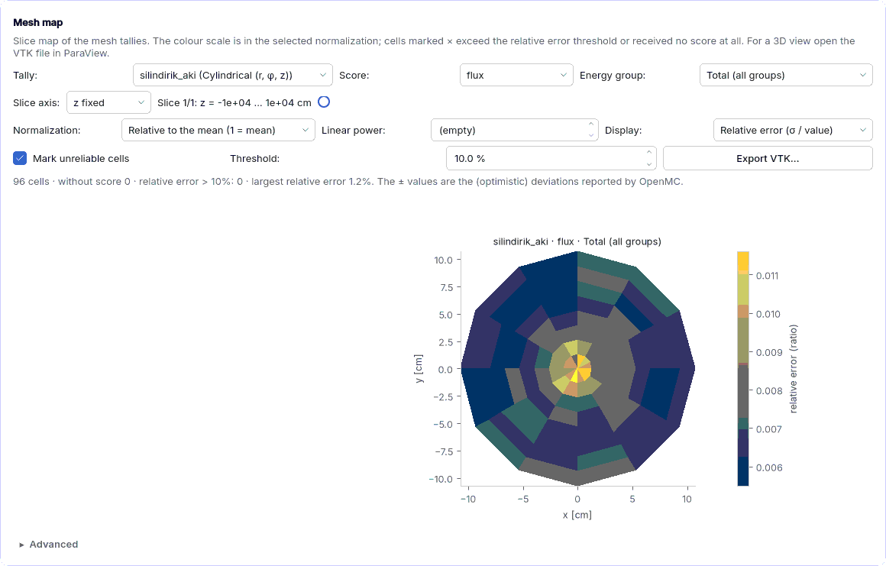

## 5.13 Mesh flux and power map, ParaView

**Example:** `ornekler/pwr_mesh_aki.json` · **Level:** intermediate · **Prerequisite:** [5.1](05-dersler.md#ders-demet)
· **Reference:** [4.10 Mesh tally](04j-mesh-tally.md#mesh-tally)

Goal: produce a pin-by-pin power map and a two-group flux map of a 17 x 17 PWR assembly, check
with the σ map whether the statistics are sufficient, and export the result to ParaView.

### Step 1: inspect the mesh

1. Open the example **PWR 17×17 assembly: mesh flux and power map** from the start screen.
2. In **Run settings › Tallies** select the `mesh_aki_guc` tally: scores flux and kappa-fission,
   **Energy groups** on with **Group structure** CASMO-2 (0.625 eV boundary), **Mesh tally** on,
   **Mesh type** Regular, **Mesh divisions** 17 x 17. With **Take bounds from the model** on, the
   suggestion line shows +/-10.71 cm: mesh cell = 21.42 / 17 = 1.26 cm = rod pitch, so every cell
   is one rod cell. If the mesh did not match the pitch, a cell would collect parts of two rods.
   The model is 2D (axially infinite): the mesh spans +/-10⁴ cm in z, i.e. the whole z column,
   and the values are z integrals.
3. Select the `silindirik_aki` tally: **Cylindrical (r, φ, z)**, 8 rings x 12 sectors. On a square
   assembly a cylindrical mesh misses the corners (r = 10.71 cm inscribed circle; 21.5% of the area
   lies outside); it is still useful to see the radial profile.

### Step 2: run and read the map

Press **Run**. Measurement (5000 particles x 60 batches / 20 inactive, 6 threads, ENDF/B-VIII.0,
OpenMC 0.16.0): ~35–45 s, k∞ = 1.1829 ± 0.0024. In the **Mesh map** card:

* **Score** kappa-fission, **Normalization** Relative to the mean: 25 cells are blank and marked
  × — 24 guide tubes and 1 instrument tube, no fission. Peak ~1.10 in the rods next to the guide
  tubes (where there is more water, moderation and thermalization increase); lowest ~0.88 near the
  assembly edge. Median relative error 2.7%, largest 4.2%: no fuel cell exceeds the rough 10%
  threshold, but the target for pin power is **1–2%**; for that increase the number of histories
  roughly 4–7 times (relative error ∝ 1/√N).
* **Score** flux, **Energy group** Group 1 (thermal) and Group 2 (fast): the thermal/fast flux
  ratio is ~0.20 in a guide tube and ~0.16 in the corner fuel rod — the extra water in the guide
  tube thermalizes neutrons.
* **Display** Relative error: median relative error 2.4% in the thermal group, 1.0% in the fast
  group.
* In the cylindrical tally the ring averages are 0.994 to 1.003: consistent with the flat radial
  profile expected in an infinite lattice (reflective boundary).

The same settings with a different seed differ by ±1–2σ; with fewer particles (e.g. 1000 x 20)
you see many × marks.

### Step 3: absolute power density

Choose **Normalization** Absolute (from total power). Since the model is 2D the box is named
**Linear power** [W/cm] and opens empty (no active height): 3400 MWth / 193 assemblies / 366 cm =
48.1 kW/cm, so enter **48 100**. Measurement: global heating tally H = 9.38 x 10⁷ eV per source
neutron (`kappa-fission`); mean of the fuel cells 114.7 W/cm³ = 48.1 kW/cm / 264 rods /
1.5876 cm² (rod cell area), peak 126 W/cm³.

**Consistency checks:** (1) H / (k∞/ν̄) ~ 9.38 x 10⁷ / (1.1829 / 2.43) ~ 193 MeV, consistent with
the ENDF/B-VIII.0 MT458 recoverable fission energy of U-235, 194.1 MeV (ν̄ ~ 2.43 assumed).
(2) `heating-local` / `kappa-fission` = 1.030: capture gammas contribute ~3%. (3) With **Score**
flux the mean total flux is ~3.0 x 10¹⁴ n/cm²·s — the PWR order of magnitude.

### Step 4: ParaView

Write `mesh_aki_guc.vtk` with **Export VTK...** and open it in ParaView (**File › Open**,
**Apply**). Colour by `kappa_fission_toplam`, extract the cells with
`kappa_fission_toplam_bagil_hata` > 0.1 using **Threshold** (empty in the fuel for this example;
cells without score hold -1). In a 3D model (e.g. `pwr_3b`) add z divisions and take axial slices
with **Slice**.

**Checklist:** the mesh matches the rod pitch; no fuel cell is marked ×; the relative peak is in
the expected range; the consistency checks pass. This is a teaching calculation; it cannot be
used for licensing or certification.
