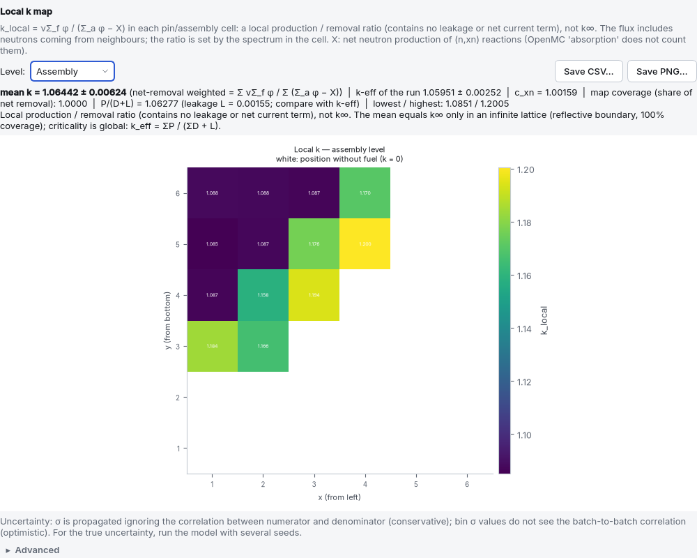

# 6. Interpreting results

When a run finishes, the **Run** page shows the result card (k-eff, or tallies in a fixed
source run), the k-per-batch plot, the Shannon entropy plot, the power map if requested, and the
[conformity panel](07-uygunluk.md#uygunluk-denetimi); the raw OpenMC output is folded under
"Detailed output". This chapter explains how to read those numbers: a single k-eff value says
nothing until you know its uncertainty, whether the source converged and whether the geometry is
right.

In this chapter **pcm** always means × 10⁵, and the quantity it applies to is stated:
*Δk × 10⁵* for a difference in k, *Δρ × 10⁵* for a difference in reactivity (ρ = (k − 1)/k).

## 6.1 Statistics: k-eff and its uncertainty

**What does k-eff ± σ mean?** A Monte Carlo result is an estimate. The "±" value on the result
card is the **1σ standard uncertainty** (in the sense of JCGM 100 / GUM); it is not a confidence
interval. If the distribution is normal, the true value lies within ±1σ with about 68 %
probability and within ±2σ with about 95 %. Do not call the uncertainty an "error": an error is a
known mistake, the uncertainty is the width of the statistics.

**Inactive and active batches.** In the first batches the fission source is not yet correctly
distributed; these **inactive batches** do not contribute to the statistics. k-eff and all tallies
are computed from the **active batches** only (total minus inactive).

**How fast does the uncertainty shrink?** σ falls with the square root of the number of tracked
neutrons: to halve σ you must make the product particles × active batches **four times larger**.
The **Accuracy preset** option in Run settings prints the expected σ from this rule
(σ_k ≈ 90 000 pcm / √(particles × active batches), pcm = Δk × 10⁵; the coefficient comes from a
`pwr_pinhucre` measurement and gives only the order of magnitude for other models):

| Accuracy preset | Particles per batch | Batches / inactive | Expected σ_k |
|---|---|---|---|
| Quick test | 1000 | 60 / 20 | ~450 pcm (Δk × 10⁵) |
| Normal | 10 000 | 150 / 40 | ~86 pcm |
| Accurate | 50 000 | 300 / 80 | ~27 pcm |

"Quick test" only shows that the model runs; every result that will be quoted, compared or put
into a report is run with at least "Normal".

**Batch-to-batch correlation.** OpenMC computes σ as if successive batches were independent. But
the fission source of one batch is born from the previous one; batches are correlated and the
reported σ is **below** the true uncertainty. For k-eff the effect is small (F.B. Brown,
LA-UR-09-03136 §IV.C: no significant bias seen in k-eff); for local tallies (pin power, flux maps)
it is large (1.7–4.7 times in the same source). Rule **K2** in the conformity panel checks this
correlation with the lag-1 autocorrelation (see [the rules](09-sorun-giderme.md#uygunluk-kurallari)).

**The interpretation on the result card.** The tool classifies k as follows
(`cekirdek/kosucu.py`, `keff_yorumu`):

| State | Criterion | Shown |
|---|---|---|
| All outer boundaries reflective | no leakage | "k∞ (infinite medium)"; **no** criticality verdict |
| Critical | \|k − 1\| ≤ 2σ | "statistically indistinguishable from k = 1" |
| Supercritical | k > 1 + 2σ | "power rises" |
| Subcritical | k < 1 − 2σ | "power dies away" |

The card also prints the reactivity ρ = (k − 1)/k in pcm (Δρ × 10⁵) and its uncertainty
σ_ρ ≈ σ_k / k². If kinetics parameters were computed, the reactivity is also given in
**dollars** (1 $ = β_eff). If ρ > 1 $, the card states both meanings: in a real transient this
is prompt criticality; in an infinite-medium (k∞) calculation it is the excess reactivity carried
by the fuel.

> **Example.** `ornekler/pwr_17x17.json` is a single assembly with reflective side boundaries; its
> result is a k∞ (README measurement 1.18443 ± 0.00088). Its reactivity is
> ρ∞ = 0.18443 / 1.18443 = 0.15571 → **+15 571 pcm (Δρ × 10⁵)**, with an uncertainty of
> 0.00088 / 1.18443² ≈ 63 pcm. This does not mean "the reactor is supercritical": in a finite core
> leakage and control balance this excess.

**Comparing two results.** A difference between two k values is significant only if
\|k₁ − k₂\| > 2·√(σ₁² + σ₂²) (the tool uses the same 2σ criterion in critical search and in
parameter sweep interpretation). Write the difference **in both forms** and say which one it is:
Δk = k₂ − k₁ (pcm = Δk × 10⁵) or Δρ = (k₂ − k₁)/(k₁k₂) (pcm = Δρ × 10⁵).

> ⚠ **Results run with different settings are not compared.** This is why the README comparison of
> `pwr_3b` and `pwr_eksenel` was run **with the same settings** (250 batches / 100 inactive). The
> difference between two numbers obtained with different particles, inactive batches, temperature
> method or library contains the difference in settings as well as in the model. A comparison
> should change one thing only: even in that example the two models differed in two ways (water
> reflector + natural UO₂ blanket), and the −232 pcm difference in k could not be read as
> "reflector savings".

**Reproducibility.** The same spec, the same seed and the same number of threads give the same k
on the same machine (measured difference of order 10⁻¹⁵: OpenMP reduction order). If the seed
changes, the result changes within the statistics — this is expected. The `kapsul.json` file in
every run directory stores this information; to reproduce a run see the `yeniden` command in the
[terminal](08-terminal.md#terminal) chapter.

## 6.2 Source convergence (Shannon entropy)

In an eigenvalue calculation the initial source (point or box) is not the true fission
distribution; it settles towards the true distribution during the inactive batches. If the source
has not settled before the inactive period ends, the active batches tally from a **biased**
distribution and k-eff comes out biased. You cannot see this by looking at the result: σ looks
small and the number looks reasonable.

**Shannon entropy** measures with a single number how widely the fission source is spread over a
mesh. It is **on** by default in Run settings (`ayarlar.entropi_mesh`, default mesh 8 × 8 × 1).
The entropy plot on the Run page should flatten out during the inactive batches.

**How does the tool judge convergence?** (`cekirdek/kosucu.py`, `entropi_yakinsama`)

1. The **plateau** is the last half of the active period: its mean is the plateau value and its
   scatter (σ) the noise level per batch.
2. If the mean of the **last quarter** of the inactive period is **more than 2σ** away from the
   plateau, the source is still moving at the end of the inactive period: "Increase the number of
   inactive batches — k-eff may be biased." A fast rise at the start is normal (starting from a
   point source the entropy starts from zero).
3. If the mean of the **first quarter** of the active period is more than 2σ away from the plateau,
   the source kept moving in the active period too (too few inactive batches): "kept drifting in
   the active period". The old version took σ from the whole active period and missed this case (a
   3D core with 4 inactive batches came out "converged").

Cases that cannot be judged are stated explicitly: with fewer than 4 inactive batches, too few
active batches or a constant entropy the result is "could not be evaluated" — not "converged". In
practice 20–50 inactive batches are needed, more for large and loosely coupled models (full cores,
layered 3D). Rule **K1** in the conformity panel checks the same criterion after the run.

> **Measured example (README, `pwr_eksenel`).** In the layered 3D assembly **40 inactive batches
> were not enough**: the entropy was still drifting at the end of the inactive period (drift
> 0.0433 > 2σ = 0.0125). Raising the inactive batches to 100 brought the drift down to 0.0006.

> **Full cores.** According to `docs/ORNEKLER.md`, the 40 inactive batches of the "Normal" preset
> are **borderline** for full cores (the entropy was still falling). If you compare k values,
> increase the inactive batches; the SLOW test OR12 uses 20 000 × 160 / 60.

**Entropy does not see everything.** Entropy is a global scalar; a problem in one direction can be
hidden inside the dominant distribution in another. A measured example: in an earlier version the
z range of the box source was fixed at ±1 cm; in a 366 cm 3D model the source started in the 2 cm
slice at the centre and the axial power shape came out **over-peaked** (axial peak 2.32 instead of
1.49). The entropy did not show it, because the radial distribution dominated in that geometry.
(This bug was fixed: the box source now covers the fissile height of the model.) In tall 3D models
choose more than one z division for the entropy mesh; the z bounds of the mesh are derived from the
real height of the model.

## 6.3 Interpreting the power distribution

The power distribution is switched on in [Run settings](04f-hesap-ayarlari.md#hesap-ayarlari)
(visible only in models where a fissile pin repeats in a lattice), and the result appears on the
Run page as a power map. OpenMC's `DistribcellFilter` counts every instance of the repeated fuel
cell separately; in a 3D model axial bins are added. Step-by-step lesson:
[power map and F_ΔH](05-dersler.md#ders-guc).

| | Definition | What it limits |
|---|---|---|
| **F_ΔH** | highest pin power / average pin power (radial) | coolant temperature rise in the hot channel (DNB margin) |
| **F_q** | highest local power density / average (radial × axial) | fuel centreline temperature, linear power (~400–500 W/cm) |

F_q is defined only in a 3D model; in a 2D model the tool prints "F_q undefined".

**Measured reference (README, `pwr_3b`, the example's settings 20 000 × 150 / 40, 20 axial
bins, 5 seeds, 01.10.2026):** a single run gives F_ΔH 1.064-1.083 and F_q 1.626-1.753; the peak
of the averaged map is F_ΔH = 1.0620 ± 0.0055, F_q = 1.600 ± 0.032; average linear power 182 W/cm
(17.6 MW per assembly). Its axially layered twin `pwr_eksenel` with the same settings (20 000 × 250
/ 100, 5 seeds): F_ΔH 1.0603 ± 0.0039 and 1.0618 ± 0.0028 - the same within statistics (layering
does not touch the radial distribution; a good consistency check); F_q 1.6362 ± 0.0147 →
1.5909 ± 0.0133 (−2.8 %, 2.3σ; the water reflector flattens the axial profile).

**1. The reported uncertainties are optimistic.** The per-pin σ does not see the batch-to-batch
correlation. Measured in this model (`pwr_3b`, 4000 particles, 3 independent seeds): reported σ
0.003–0.008 per bin, true scatter between seeds 0.07–0.17 — about **20 times**. Most of the
difference comes not from correlation but from an **unconverged fission source**: with few
particles and few inactive batches the seeds are not noisy samples of the same distribution but
different (biased) distributions. This is a bias; it decreases with the number of inactive
batches, not with the number of particles. What to do:
- Keep Shannon entropy on; increase the inactive batches until the entropy flattens.
- For the true uncertainty, run the model with **5–10 independent seeds** and look at the scatter
  of the results. There is no separate button for this in the interface: change **Random seed** in
  Run settings and run again, or use `cekirdek.guc.coklu_tohum()` in Python (default 5 seeds; the
  standard deviation computed from 3 seeds is itself ~50 % uncertain).

**2. F_ΔH is a maximum and is biased upwards at low statistics.** Because the largest of hundreds
of pins is taken, noise raises the peak. Measured: in the same model 1.1455 with 3000 particles,
1.0708 with 20 000. If the per-pin statistical deviation exceeds 30 % of the true scatter of the
distribution, the tool prints the warning "F_ΔH is biased upwards in this case"; increase the
number of particles.

**3. F_q depends on the axial resolution.** Coarse bins average the peak and make F_q look small
(for a pure cosine profile the fine-bin limit is π/2 = 1.571). Use at least 10–20 axial bins
(`ayarlar.guc_dagilimi.eksenel_dilim`); below 10 the tool warns. Empty bins in axial layers where
the target pin is absent are excluded from the F_q average and are listed.

**4. Coverage.** F_ΔH and F_q cover only the selected target pin types. If part of the fission
energy of the model is in other fissile regions not on the map (another pin type, a blanket), the
tool prints that share; the hottest pin may be one of them.

**5. Absolute power.** `ayarlar.guc_dagilimi.toplam_guc` is optional and is the power of **the
region the model covers**, not of the whole core. Example: 3400 MWth / 193 assemblies = 17.6 MW;
in a single-assembly model enter `17.6e6` W. With the correct input the average linear power comes
out at ~182 W/cm; if it is not of this order, the input is wrong. If the highest linear power
exceeds 500 W/cm the tool adds the note "typical PWR limit ~400–500 W/cm". The `kappa-fission`
score also assigns to the pins the part of gamma heating deposited outside the fuel (~2–3 % in a
PWR); pin power comes out larger by this amount.

**The thresholds in the tool are for teaching.** The phrases "F_ΔH < 1.02 nearly flat",
"F_ΔH > 1.65 high", "F_q > 2.6 high" in the interpretation lines are typical PWR values, not design
limits. Real limits are plant specific; rule **K7-F** of the conformity check compares F_ΔH and F_q
only with a limit entered by the user and says "could not be compared" if there is none.

## 6.4 Plot first, then run

The **RUN button is not enabled** until the geometry preview has been produced successfully and
the model check errors have been fixed. This is the habit from hand-written scripts — *"uncomment
the `model.run()` line once the plots look right"* — built into the interface; it prevents running
for hours with a wrong geometry. If you press RUN, you are first told what is missing; the status
bar at the bottom also shows the next step ("Drawing the geometry; RUN is enabled when the preview
is ready.").

What to look for in the preview:
- Is every region filled with the expected material? An empty (void) region or a wrong colour means
  lost particles and a wrong result.
- In a 3D model the preview shows the xy and xz sections side by side; check axial layers, the
  control rod tip and the reflectors in the xz section.
- Refresh the preview with **F6**. Drawing happens in the background; while the model is unchanged,
  changing the section or colour is fast. For a suspicious region, use Advanced > **Show overlaps**
  to see cell overlaps in a separate colour.

The preview does not replace a run: a section shows only one plane. After the run, look at the
number of lost particles (rule **K3** of the conformity check: lost particles = 0); lost particles
are a symptom of a geometry error.

## 6.5 Known pitfalls

This list contains pitfalls found **by measurement** during development. Most were fixed in the
tool or tied to the model check; they are written here so that you do not fall into the same trap
in an exported script or in your own OpenMC work.

**Data and physics**
- **Temperature ranges of the data library can be narrow.** Neutron data cover 250–2500 K, but
  **the S(α,β) data for water cover only 284–800 K**. A temperature sweep that leaves the range stops
  in the middle of the run; the tool reads the ranges in advance (`cekirdek/veri_bilgi.py`) and warns
  in the model check.
- **`HexLattice` and `HexagonalPrism` orientations use the same letter but opposite definitions**
  (one "perpendicular to the y axis", the other "parallel to the y axis"). For the same geometric
  orientation the **same letter** is given; this was verified by measurement. A wrong mapping caused
  a 2.4 % Δk deviation. In a hexagonal full core, if the assembly pin lattice is 'y', the core
  lattice must be 'x' (90° to each other).
- **The apothem of a hexagonal assembly duct** is `(rings − 1)·pitch·√3/2 + pitch/2`, not
  `(rings − 0.5)·pitch`. The second looks right at the corners but leaves too much gap on the flat
  faces.
- **The z range of a box source must cover the height of the model** (see
  [source convergence](#kaynak-yakinsamasi)); before the fix the 3D power shape was over-peaked and
  the entropy did not show it.

**The OpenMC API (for those working with an exported script)**
- **The `Model.plot()` colour dictionary** wants an SVG colour name or an `(R, G, B)` tuple; a
  hexadecimal colour string raises `KeyError`.
- **With entropy on, OpenMC's batch line format changes** (an extra column). If you parse the output
  yourself, recognise both formats.
- **`Tally.scores` does no validation:** an invented score name is accepted and the error appears
  only during the run. The tool gives a *warning* in the model check based on a curated score list.
- **`Tally.get_pandas_dataframe` has no `distribcell_paths` argument**; the correct one is
  `paths=True`.
- **`Cell.num_instances` needs `Geometry.determine_paths()` first**, otherwise it raises
  `ValueError`.

**Bugs found and fixed (user-facing summary)**
- **The preview crashed the application because of tallies.** `Model.plot()` initialises the OpenMC
  library and also tries to resolve tally filters; an unresolved filter terminated the process on
  the C++ side (a Python `try/except` cannot catch this). The preview now plots a model without
  tallies, and a second plot cannot start while one is running. If you still see a crash in the
  preview, report it with the log file attached (see [terminal](08-terminal.md#terminal)).
- **The S(α,β) rule suggested hydrogen for pure zirconium.** The rule only checked "are the elements
  a subset of the allowed set"; since {Zr} ⊆ {H, Zr}, pure Zr counted as "zirconium hydride". Every
  rule now has a required element set; the old warning on `pwr_pinhucre` was this false alarm.
- **Axial layering revealed three bugs (all found by measurement).** (1) Two separate definitions of
  the "fissile range" made the builder and the script build different source boxes → 1300 pcm
  (Δk × 10⁵); reduced to a single definition. (2) The power conservation tally counted the whole
  model → a false "BROKEN"; the reference tally was tied to the same cell. (3) The power mesh
  extended beyond the target pin → F_q inflated by 10.4 % (1.6435 → 1.8150); the mesh now uses the range
  of the target pin. In addition, the z bounds of the entropy mesh were fixed; once corrected, this
  warning caught that 40 inactive batches were not enough in `pwr_eksenel`.
  *Lesson: two codes that compute the same number in two ways will sooner or later diverge.*
- **The U₃Si₂-Al density was inconsistent with the loading.** The dispersion fuel was built with a
  fixed 5.4 g/cm³ at a loading of 4.8 gU/cm³; the correct value is ~6.73 g/cm³. The density is now
  computed from the loading; a density given by hand (old files, the `mtr_plaka` example) is used
  as is.
- **The exported script silently built a different model for some names.** Names such as "a b" and
  "a_b" fell into the same Python variable, names such as "class" or "openmc" broke the script, and
  with kinetics on the script did not write the β_eff tallies. Variables are now prefixed by type and
  unique (`m_uo2`, `c_yakit_cubugu`); the equivalence of the script and the interface model is
  checked by a test.

## 6.6 Known limitations

These are not bugs but deliberate scope limits of the tool; keep them in mind when interpreting
results.

- **The shells of a spherical assembly cannot be edited in the interface**; only in JSON
  (`ornekler/godiva_kriter.json`). The interface shows the shells read-only.
- **The drum absorber arc is a single piece** and the drum is not split axially; in a drum core the
  axial layers work inside the core cylinder, while the drums and the radial reflector span the full
  height.
- **The per-layer letter mapping (`anahtar`) is entered only in JSON**; the axial layer table does
  not delete it and shows it locked as "from file".
- **The spatial distribution of a fixed source is limited:** point or box. Surface sources and
  source files (`source.h5`) are not supported.
- **There are no dose conversion coefficients:** there is a flux tally but no flux-to-dose factor.
  The flux tally is integrated over the cell volume (unit n·cm/s, or n·cm per source neutron); divide
  by the region volume for the average flux.
- **The interface imports materials only** (File menu, OpenMC XML). Converting raw CSG geometry back
  into "pin → lattice → core" layers is not solvable in general; a wrong guess would silently produce
  a wrong model. Python scripts cannot be imported either.
- **In depletion the fission yield is fixed** (thermal 0.0253 eV, fast 500 keV); OpenMC's
  spectrum-weighted average mode is not used. Depletion works only in eigenvalue mode, cannot be
  resumed, and control elements (B₄C rods, drums) are not depleted by default (they can be added
  with `tukenme.ek_malzemeler`).
- **There is no MPI:** in this installation OpenMC runs on a single node with OpenMP
  (see [HPC](08-terminal.md#hpc)).
- **The conformity check and V&V do not certify anything** (see
  [what it proves](07-uygunluk.md#ne-kanitlar)).

## 6.7 Local k and assembly k∞

**Local k** is the ratio, in each pin or assembly cell,

  k_local = νΣ_f φ / (Σ_a φ − X),  X = Σ (x − 1) R_(n,xn)

The cells are the bins of a mesh aligned to the pitch of the square lattice; the tallies are
named `yerel_k_pin` / `yerel_k_demet` plus the unfiltered `yerel_k_toplam`
(`python -m cekirdek.yerel_k ekle model.json pin|demet -o new.json`).

- **It is not k∞: it is a leakage-free local multiplication ratio.** Net neutron exchange
  with neighbouring cells is ignored.
- **(n,xn) is in the denominator.** OpenMC `absorption` does not count channels such as
  (n,2n) as removal, and the neutrons they produce do not enter `nu-fission`. In leakage-free
  balance P + X = A, hence k = P/(A − X); c_xn = A/(A − X). The uncorrected P/A is shown in the
  tooltip as well. Counted channels: MT 11, 16, 17, 24, 25, 30, 37, 41, 42 (same list as the
  four-factor lesson).
- **Mean:** ΣP / Σ(A − X) — the arithmetic mean weighted by net removal (= the
  production-weighted harmonic mean). It equals k∞ only in an **infinite lattice** (single
  pin/assembly with reflective boundaries) with map coverage 1. The plain or volume-weighted
  mean does not.
- **Map coverage** = Σ_map (A − X) / (A − X)_model. It drops below 1 when a channel box,
  water gap or reflector lies outside the map.
- **Uncertainty:** σ is propagated ignoring the correlation between numerator and
  denominator (conservative); bin σ values do not see the batch-to-batch correlation
  (optimistic, see [6.3](#guc-dagilimi-yorum)). For the true uncertainty use several seeds.
- **Limits:** square lattices only; on a hexagonal lattice (OpenMC has no hexagonal mesh) and
  in a core with gaps between assemblies the pin level is rejected with a clear error. A
  single axial bin (radial map).

The **assembly k∞ wizard** (`python -m arayuz.analiz.demet_kinf model.json`) runs every
assembly type separately through the run queue as a single-assembly model with reflective
boundaries (2D, tallies/power/depletion off, fissile box source) and gives an "assembly type
× k∞ ± σ" table. The result is the infinite-lattice k∞: no water gap, reflector, spectral
effect of neighbouring assemblies or leakage. k∞ versus burnup is not available in this
version.

