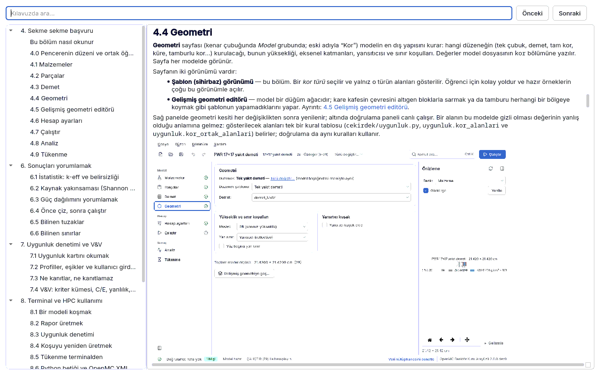

<a id="giris"></a>
# 0. Bu kılavuz kime, nasıl okunur

Bu kılavuz, OpenMC Reaktör Kuru Arayüzü'nü (kısaca "arayüz") **başkasına sormadan**
kullanabilmeniz için yazıldı. Hedef okur reaktör fiziği dersi alan bir üniversite öğrencisi ya
da Monte Carlo taşınım hesabı yapan bir araştırmacıdır. OpenMC'yi önceden bilmeniz gerekmez;
temel reaktör fiziği kavramlarını (k-eff, reaktivite, nötron spektrumu) bildiğiniz varsayılır.
Bilmediğiniz bir terim için [10. Terim sözlüğü](10-sozluk.md#sozluk) bölümüne bakın.

Kılavuz aynı zamanda programın **kullanıcı el kitabıdır**: amaçlanan kullanımı, sınırları,
girdi tanımını, hata iletilerinin anlamını ve örnek problemleri bir arada verir (ANSI/ANS-10.5
türü bir kullanıcı belgesi; bkz. [YAZILIM_KALITE.md](../../YAZILIM_KALITE.md)).



## 0.1 Program ne yapar, ne yapmaz

**Yapar.** Malzemeden kora kadar bütün model parametrelerini tek bir arayüzden kurarsınız;
geometri **çalıştırmadan önce** çizilir ve denetlenir; hesap aynı yerden başlatılır, sonuçlar
orada okunur. Arayüz doğrudan OpenMC nesnelerini değil, doğrulanabilir bir **JSON model tanımını**
(spec) düzenler; spec tek gerçek kaynaktır:

```
spec (JSON) ──► kurucu ──► openmc.Model ──► XML ──► openmc
     └────────► betik üretici ──► model.py (tek başına çalışan OpenMC betiği)
```

Desteklenen işler: özdeğer (k-eff) ve sabit kaynak hesabı; pin hücre, kare/altıgen demet,
kare/altıgen tam kor, MTR plaka elemanı, tamburlu kompakt kor, küresel düzenek ve **gelişmiş
geometri ağacı** (kare çekirdeği altıgen halkayla sarmak, tamburu herhangi bir bölgeye koymak
gibi); eksenel katmanlar; kontrol çubuğu ve tamburu; güç dağılımı ve tepe faktörleri;
reaktivite katsayısı taraması ve kritik arama; tükenme (yanma); kriter (benchmark) C/E
karşılaştırması; sonuç **uygunluk denetimi** ve rapor.

**Yapmaz.** Ham CSG (yüzey ve bölge ifadesi) yazdırmaz, DAGMC/CAD geometrisi okumaz; geçici
rejim ya da termohidrolik hesap yapmaz; doz dönüşüm katsayısı uygulamaz; tükenmeyi yalnız
özdeğer modunda yapar; MPI ile çok düğümde koşmaz (OpenMP ile tek düğüm). Ayrıntılı liste:
[Bilinen sınırlar](06-sonuclar.md#bilinen-sinirlar).

**Sertifika vermez.** Araç bir analizi "standarda uygun" diye onaylayamaz. Yaptığı iş,
standartların ve iyi uygulamanın isteyeceği **kanıtı üretmek** ve **eksikleri görünür
kılmaktır**. Lisanslama ya da güvenlik analizinde kullanmak isteyen kuruluşun kendi kalite
güvence programı ve kendi doğrulama raporu gerekir. Bkz.
[7.3 Ne kanıtlar, ne kanıtlamaz](07-uygunluk.md#ne-kanitlar).

## 0.2 Amaçlanan kullanım ve sınırlar

| | |
|---|---|
| Kullanım | Eğitim (ders, laboratuvar), araştırma, ön tasarım ve yöntem karşılaştırması |
| Yazılım sınıfı | Güvenlikle ilgili **olmayan** bilimsel yazılım (ANSI/ANS-10.4 çerçevesi) |
| Doğrulanmış ortam | OpenMC 0.16.0, ENDF/B-VIII.0 (HDF5, 294 K ve üstü sıcaklıklar), Linux |
| Girdi | Model dosyası (`*.json`, şema sürümü 3); arayüzde ya da elle yazılır |
| Çıktı | Koşu dizini (`model.xml`, `spec.json`, `kapsul.json`, `statepoint.*.h5`, `kosu.log`), rapor (PDF/HTML), Python betiği |
| Doğrulama | Regresyon çıpası, kriter kümesi C/E, analitik testler ([7.4 V&V](07-uygunluk.md#vv)) |

Sonuçlar ancak bu ortamda ve kriter kümesinin temsil ettiği uygulamalar için savunulabilir;
başka bir kütüphane ya da OpenMC sürümünde kriter kümesi yeniden koşulmalıdır.

## 0.3 Kılavuzun haritası

| Bölüm | Ne zaman okunur |
|---|---|
| [1. Kurulum ve ilk açılış](01-kurulum.md#kurulum) | Program henüz kurulu değilse ya da nükleer veri eksikse |
| [2. 15 dakikada ilk hesap](02-ilk-hesap.md#ilk-hesap) | İlk kez kullanıyorsanız: baştan sona bir PWR demeti hesabı |
| [3. Kavramlar](03-kavramlar.md#kavramlar) | Malzeme, çubuk, demet, kor, geometri ağacı ne demek; hangi düzeneği nasıl kurarım |
| [4. Sekme sekme başvuru](04-sekmeler.md#sekmeler) | Bir alanın anlamı, birimi, tipik aralığı ve yaygın yanlış kullanımı |
| [5. Rehberli dersler](05-dersler.md#dersler) | Bir örnek dosyayla adım adım çalışmak, beklenen sonucu görmek |
| [6. Sonuçları yorumlamak](06-sonuclar.md#sonuclar) | k-eff ± σ, kaynak yakınsaması, güç dağılımı, bilinen tuzaklar |
| [7. Uygunluk denetimi ve V&V](07-uygunluk.md#uygunluk-denetimi) | Denetim kartı ne der; USL, AOA; ne kanıtlar, ne kanıtlamaz |
| [8. Terminal ve HPC](08-terminal.md#terminal) | Arayüzsüz koşu, betik, rapor, hesaplama kümesi |
| [9. Sorun giderme](09-sorun-giderme.md#sorun-giderme) | Bir hata ya da uyarı iletisi gördüğünüzde: neden ve çözüm |
| [10. Terim sözlüğü](10-sozluk.md#sozluk) | Türkçe–İngilizce terim karşılıkları |

Kılavuzu baştan sona okumanız gerekmez. Önerilen yol: **2 → 3 → ilgilendiğiniz ders (5) → gerektiğinde
4 ve 9**. Bölüm 4 bir başvuru bölümüdür; ekranda bir alanı merak ettiğinizde oraya gidin.

## 0.4 Kılavuzu uygulamada açmak

- **Yardım menüsü → Kullanım kılavuzu**: kılavuzu baştan açar.
- **F1**: bulunduğunuz sayfanın bölümünü açar (bağlamsal yardım).
- Alanların ve kartların yanındaki **"?"** düğmeleri ve doğrulama bulguları ilgili bölüme gider.
- **Ctrl+K** (komut paleti) kılavuzda arama da yapar.

Kılavuz penceresi çevrimdışıdır (internet gerekmez). Solda içindekiler, üstte arama kutusu
vardır: **Enter** ya da **F3** sonraki eşleşme, **Shift+F3** önceki; bütün eşleşmeler
vurgulanır. Kılavuzun dili arayüz dilidir (**Görünüm → Dil**); bir bölümün İngilizcesi henüz
yoksa Türkçesi gösterilir ve pencerenin üstünde bir uyarı satırı çıkar.

Kaynak metin `docs/kilavuz/tr/` ve `docs/kilavuz/en/` altında Markdown'dır; GitHub'da da
okunabilir. HTML ve PDF sürümü `araclar/kilavuz.sh` ile üretilir
(bkz. [8. Terminal ve HPC](08-terminal.md#terminal)).

## 0.5 Yazım kuralları

| Gösterim | Anlamı |
|---|---|
| **Hesap ayarları** | Arayüzdeki bir sayfa, kart, düğme ya da alan etiketi (ekrandaki yazımıyla) |
| **Dosya → Farklı kaydet** | Menü yolu |
| **F9**, **Ctrl+K** | Klavye kısayolu |
| `ayarlar.parcacik` | Model dosyasındaki (JSON) anahtar; nokta iç içe sözlüğü, `[]` listeyi gösterir |
| `ornekler/pwr_17x17.json` | Depodaki bir dosya (örnekler kopya olarak açılır, üzerine yazılmaz) |
| `openmc-arayuz-kosu …` | Terminal komutu |

Sayısal kurallar:

- Ondalık ayırıcı **noktadır** (1.18325); arayüzdeki sayı kutuları da noktayla çalışır.
- Belirsizlik, aksi yazılmadıkça **1σ standart belirsizliktir** ("hata" değil); `k = 1.18325 ± 0.00075`
  bir güven aralığı değildir.
- **pcm** her yerde tanımıyla verilir: ya **Δk × 10⁵** (k farkı) ya da **Δρ × 10⁵**
  (reaktivite farkı, ρ = (k − 1)/k). İkisi aynı şey değildir; hangisi olduğu yazılır.
- Uzunluk cm, sıcaklık K, açı derece, enerji eV (aksi yazılmadıkça).
- Kılavuzdaki ölçülmüş sayılar (k-eff, F_ΔH, kritik bor…) depodaki belgelerden (`docs/VV.md`,
  `docs/ORNEKLER.md`, `README.md`) ve örneklerin `referans.olcum` alanından alınmıştır; kendi
  makinenizde istatistik nedeniyle son hanelerde küçük farklar olağandır.

## 0.6 Uyarı düzeyleri

Kılavuzda ve arayüzde üç bulgu düzeyi vardır:

- **hata** — çalıştırmayı engeller; model ya da veri yanlış ya da eksik.
- **uyarı** — çalıştırabilirsiniz ama sonuç yanlı ya da beklenmedik olabilir; nedenini okuyun.
- **bilgi** — yalnızca dikkat çeker.

Bir bulguyu anlamadığınızda [9. Sorun giderme](09-sorun-giderme.md#bulgu-turleri) bölümünde
bulgunun **yer** koduna (ör. `malzeme:uo2`, `kor`, `ayarlar`) göre arayın.
