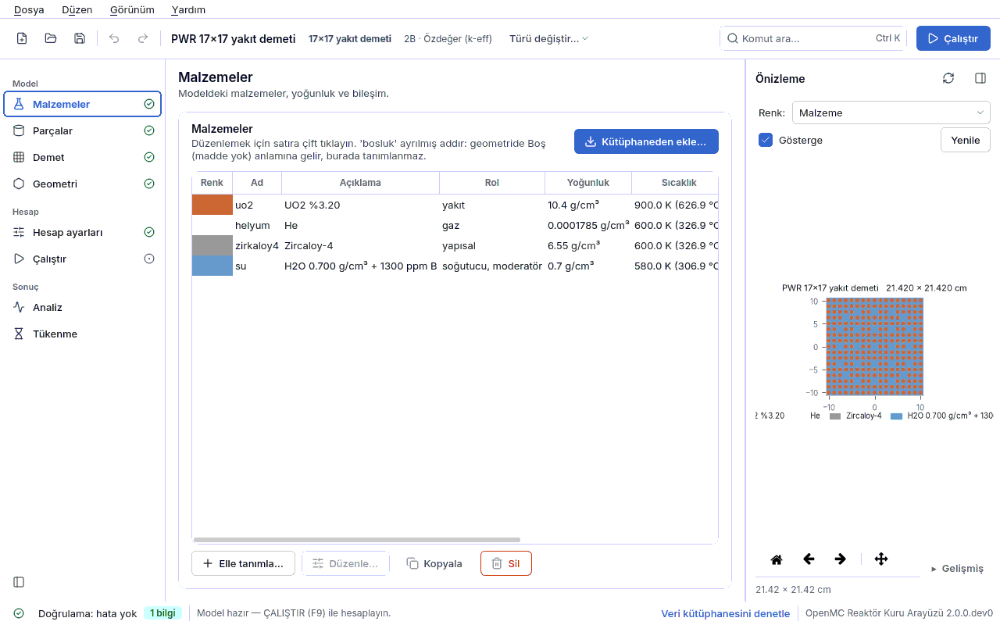
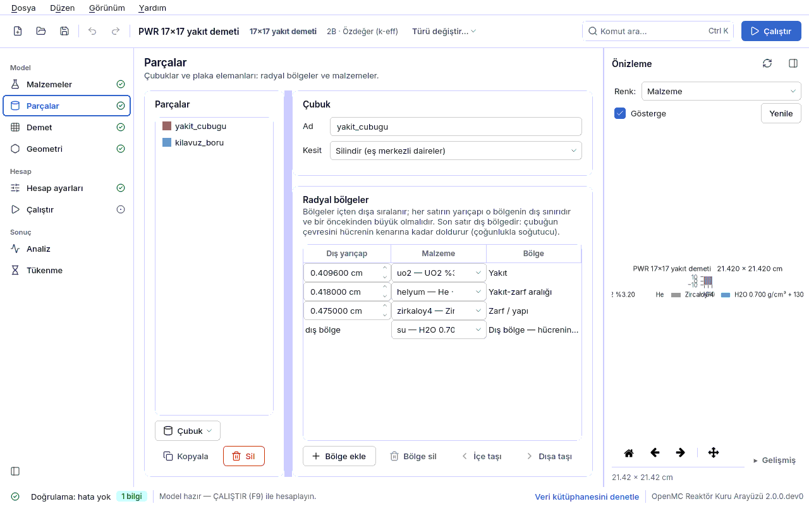
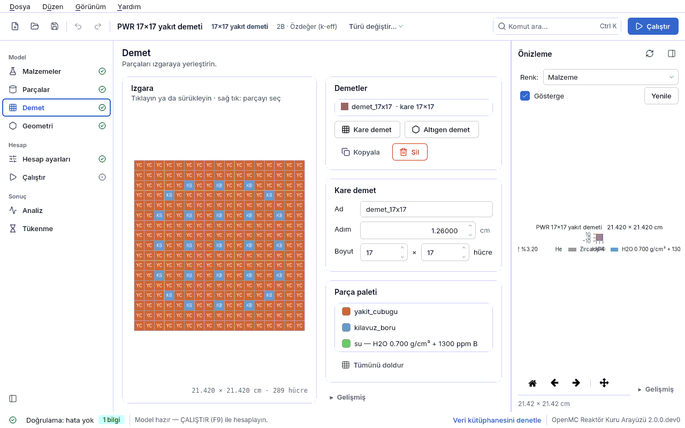

<a id="ilk-hesap"></a>
# 2. 15 dakikada ilk hesap

Bu bölümde hazır bir **PWR 17×17 yakıt demeti** modelini açıp her sayfasına bir kez bakacak,
hesabı çalıştıracak ve sonucu okuyacaksınız. Hiçbir şey değiştirmeden sonuna kadar gidebilirsiniz;
amaç programın akışını tanımaktır: **Malzemeler → Parçalar → Demet → Geometri → Hesap ayarları →
Çalıştır**.

| | |
|---|---|
| Örnek dosya | `ornekler/pwr_17x17.json` |
| Süre | ~15 dakika (koşu 1–3 dakika; makineye göre) |
| Beklenen sonuç | k∞ = 1.18325 ± 0.00075 (ölçüm: README "Ölçülen referans sonuçlar", aynı ayarlar) |
| Önkoşul | [1. Kurulum](01-kurulum.md#kurulum) tamam; `OPENMC_CROSS_SECTIONS` ayarlı |

## 2.1 Modeli açın (1 dakika)

1. Programı açın: `./calistir.sh` (ya da `openmc-arayuz`).
2. **Başlangıç** ekranında **Yakıt demeti — kare** kartının **Örnekten** düğmesine basın
   (ya da aşağıdaki örnek galerisinde **PWR 17×17 yakıt demeti** kartına tıklayın).
3. Sağ altta "Örnek kopya olarak açıldı" bildirimi çıkar: örnek dosyası değişmez, siz kopyasıyla
   çalışırsınız.

Üstteki **model başlığı** ne modellediğinizi tek satırda söyler: *PWR 17×17 yakıt demeti ·
17×17 yakıt demeti · 2B · Özdeğer (k-eff)*. Soldaki kenar çubuğunda yalnız bu modelde anlamlı
sayfalar görünür; adlarının yanındaki işaret durumu söyler (✓ tamam, ! hata var, • eksik adım).

## 2.2 Malzemeler (2 dakika)



Modelde dört malzeme vardır:

| Ad | Açıklama | Rol | Yoğunluk | Sıcaklık |
|---|---|---|---|---|
| `uo2` | UO2 %3.20 | yakıt | 10.4 g/cm³ | 900 K |
| `helyum` | He (pelet–kılıf aralığı) | gaz | 0.0001785 g/cm³ | 600 K |
| `zirkaloy4` | Zircaloy-4 (kılıf) | yapısal | 6.55 g/cm³ | 600 K |
| `su` | H2O 0.700 g/cm³ + 1300 ppm B | soğutucu, moderatör | 0.7 g/cm³ | 580 K |

`uo2` satırına çift tıklayın: kütüphane malzemesinin formu açılır (zenginlik, yoğunluk,
sıcaklık). **İptal** ile kapatın. Suyun yoğunluğunun sıcaklıktan hesaplandığına, borun ppm
cinsinden girildiğine dikkat edin; sudaki hidrojen için termal saçılma verisi (S(α,β))
kendiliğinden eklenir. Ayrıntı: [4.1 Malzemeler](04a-malzemeler.md#malzemeler).

## 2.3 Parçalar (2 dakika)



İki çubuk tanımı vardır. **yakit_cubugu** içten dışa eş merkezli bölgelerden oluşur:
UO₂ pelet (r = 0.4096 cm), helyum aralığı (0.418 cm), Zircaloy-4 kılıf (0.475 cm) ve hücrenin
geri kalanını dolduran su. **kilavuz_boru** su (0.561 cm) + Zircaloy-4 (0.602 cm) + sudur.
Yarıçaplar dıştan **artmalı** ve en dış bölge hücre adımının içinde kalmalıdır; doğrulama bunu
denetler. Ayrıntı: [4.2 Parçalar](04b-parcalar.md#parcalar).

## 2.4 Demet (2 dakika)



Demet 17×17 kare kafestir, hücre adımı **1.26 cm**: 264 yakıt çubuğu, 24 kılavuz boru ve
merkezde bir ölçüm borusu. Harita renkli **parça paletiyle** tıklanarak/sürüklenerek boyanır;
sağ tık bir hücrenin parçasını seçer. Haritadaki harfler (`y`, `k`, `e`) arka planda tutulan
anahtardır. Ayrıntı: [4.3 Demet](04c-demet.md#demet).

## 2.5 Geometri (2 dakika)


**Düzenek şablonu** "Tek yakıt demeti"dir. **Model** satırı **2B (sonsuz yükseklik)** ve
**Yan sınır** **Yansıtıcı (reflective)**: demetin dört yüzünden çıkan nötron aynadaki gibi geri
döner. Bu, sonsuz tekrarlanan bir demet kafesi demektir; sonuç bu yüzden **k∞**'dur (sızıntısız
sonsuz ortam çarpanı), sonlu bir korun k-eff'i değildir.

Sağdaki **Önizleme** geometrinin xy kesitini malzeme renkleriyle gösterir. Geometri çizilmeden
ve doğrulama hataları giderilmeden **Çalıştır** düğmesi etkinleşmez
([6.4 Önce çiz, sonra çalıştır](06-sonuclar.md#once-ciz)). Ayrıntı: [4.4 Geometri](04d-geometri.md#geometri).

## 2.6 Hesap ayarları (2 dakika)


- **Hesap türü**: Özdeğer (k-eff).
- **Hesap hassasiyeti**: **Normal** = 10000 parçacık/çevrim × 150 çevrim, ilk 40 çevrim pasif.
  Yanındaki satır beklenen k belirsizliğini yazar. **Hızlı deneme** (1000 × 60/20) bir dakikadan
  kısa sürer ama aktif tarih sayısı 27 kat az olduğundan σ yaklaşık 5 kat büyür; **Hassas** (50000 × 300/80) yayına uygun istatistik verir.
- Shannon entropisi açıktır: koşu sonunda kaynağın yakınsayıp yakınsamadığı değerlendirilir.

Ayrıntı: [4.6 Hesap ayarları](04f-hesap-ayarlari.md#hesap-ayarlari).

## 2.7 Çalıştırın (1–3 dakika)


1. **Çalıştır** sayfasına geçin; iş parçacığı sayısını makinenizin çekirdek sayısına yakın tutun.
2. **F9**'a basın (ya da üst çubuktaki **Çalıştır** düğmesi). Kaydedilmemiş bir örnekte koşu
   dizini `~/openmc_kosular` altında açılır; tam yol sayfada yazar.
3. Koşu sırasında canlı k-eff grafiği çizilir: pasif çevrimlerde dalgalanır, aktif çevrimlerde
   oturur. **Durdur** koşuyu keser.

## 2.8 Sonucu okuyun (3 dakika)

Koşu bitince sonuç kartı şunu benzeri bir değer gösterir:

```
k∞ = 1.18325 ± 0.00075        (1σ standart belirsizlik)
```

Sizin sayınız son iki hanede farklı olabilir; bu istatistiktir. Kontrol edin:

1. **Belirsizlik** ~0.0008 mertebesinde mi? (Normal hassasiyetin beklenen değeri.) Fark
   |k − 1.18325| ≤ 2·√(σ₁² + σ₂²) ≈ 0.002 ise sonuç README ölçümüyle tutarlıdır.
2. **Kaynak yakınsaması** satırı "yakınsamış görünüyor" diyor mu? Demiyorsa pasif çevrimi
   artırın ([6.2 Kaynak yakınsaması](06-sonuclar.md#kaynak-yakinsamasi)).
3. **Kayıp parçacık** sıfır mı? Sıfır değilse geometride boşluk ya da örtüşme vardır.
4. **Uygunluk** kartı (profil A ve D) karşılanan / karşılanmayan kuralları listeler; ilk koşuda
   "uygulanamadı" satırları olağandır ([7. Uygunluk denetimi](07-uygunluk.md#uygunluk-denetimi)).

**k∞ = 1.18 ne demek?** Bu demetten oluşan sonsuz bir kafes, sızıntı olmadan kritiğin %18
üstündedir. Gerçek korda sızıntı ve kontrol (bor, çubuklar, yanma) bu fazlalığı karşılar;
k∞ > 1 bir reaktörün süperkritik olduğu anlamına gelmez. Sonuçları yorumlamanın kuralları:
[6. Sonuçları yorumlamak](06-sonuclar.md#sonuclar).

## 2.9 Kaydedin ve bir şey değiştirin

- **Dosya → Farklı kaydet** ile modeli kendi klasörünüze kaydedin. Bundan sonra koşular modelin
  yanındaki `kosu` dizinine yazılır.
- Deneyin: **Malzemeler**'de `su` malzemesini düzenleyip bor derişimini 1300 ppm'den 0'a çekin,
  yeniden çalıştırın. k∞ belirgin biçimde artar; bor değeri bu demette yaklaşık −7 pcm/ppm'dir
  (README "Reaktivite katsayıları"; Δk × 10⁵). Bu tür taramaları sistematik yapmanın yolu
  **Analiz** sayfasıdır ([4.8 Analiz](04h-analiz.md#analiz)).
- Hata yaparsanız **Ctrl+Z** her düzenlemeyi geri alır.

Sıradaki adım: [3. Kavramlar](03-kavramlar.md#kavramlar), sonra
[5.1 Demet k∞ dersi](05-dersler.md#ders-demet).
