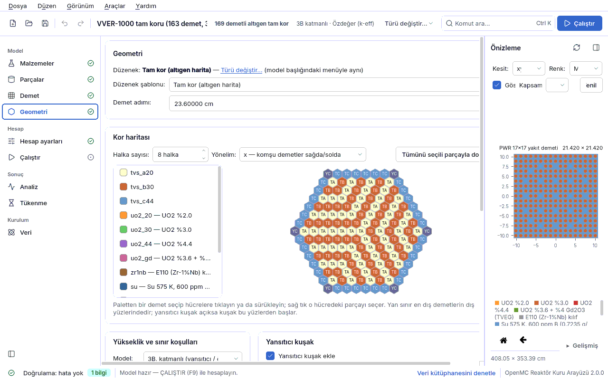

<a id="geometri"></a>
## 4.4 Geometri

**Geometri** sayfası (kenar çubuğunda *Model* grubunda; eski adıyla “Kor”) modelin en dış
yapısını kurar: hangi düzeneğin (tek çubuk, demet, tam kor, küre, tamburlu kor…) kurulacağı,
bunun yüksekliği, eksenel katmanları, yansıtıcısı ve sınır koşulları. Değerler model dosyasının
`kor` bölümüne yazılır. Sayfa her modelde görünür.

Sayfanın iki görünümü vardır:

- **Şablon (sihirbaz) görünümü** — bu bölüm. Bir *kor türü* seçilir ve yalnız o türün alanları
  gösterilir. Öğrenci için kolay yoldur ve hazır örneklerin çoğu bu görünümle açılır.
- **Gelişmiş geometri editörü** — model bir düğüm ağacıdır; kare kafesin çevresini altıgen
  bloklarla sarmak ya da tamburu herhangi bir bölgeye koymak gibi şablonun yapamadıklarını yapar.
  Ayrıntı: [4.5 Gelişmiş geometri editörü](04e-geometri-gelismis.md#geometri-gelismis).

Sağ panelde geometri kesiti her değişiklikten sonra yenilenir; altında doğrulama paneli canlı
çalışır. Bir alanın bu modelde gizli olması değerinin yanlış olduğu anlamına gelmez: gösterilecek
alanları tek bir kural tablosu (`cekirdek/uygunluk.py`, `uygunluk.kor_alanlari` ve
`uygunluk.kor_ortak_alanlari`) belirler; doğrulama da aynı kuralları kullanır.


<a id="geo-sablon"></a>
### 4.4.1 Düzenek şablonu ve kor türü

Sayfanın üstündeki **Geometri** kartında modelin türü yazar (“Düzenek: … — Türü değiştir…”).
**Türü değiştir…** bağlantısı model başlığındaki menüyle aynıdır; tür yalnız bu iki yoldan ve
aşağıdaki **Düzenek şablonu** listesinden değişir. Her değişiklik **Ctrl+Z** ile geri alınır.

| Listede görünen ad | `kor.tur` | Ne kurar | Örnek dosya |
|---|---|---|---|
| Yakıt çubuğu (pin hücre) | `tek_cubuk` | tek bir çubuk hücresi (kare adımlı) | `ornekler/pwr_pinhucre.json` |
| Plaka elemanı (MTR) | `tek_plaka` | tek bir plaka tipi yakıt elemanı | `ornekler/mtr_plaka.json` |
| Tek yakıt demeti | `tek_demet` | kare ya da altıgen tek demet | `ornekler/pwr_17x17.json`, `ornekler/sfr_altigen.json` |
| Tam kor (kare harita) | `kare_kafes` | demetlerden kare kor haritası | `ornekler/pwr_smr_kor.json` |
| Tam kor (altıgen harita) | `altigen_kafes` | demetlerden altıgen kor haritası | `ornekler/vver1000_kor.json` |
| Küresel düzenek (kabuklar) | `kuresel` | eş merkezli küresel kabuklar (Godiva tipi) | `ornekler/godiva_kriter.json` |
| Tamburlu kompakt kor | `tamburlu` | silindirik kor + yansıtıcı kuşak + dönen tamburlar | `ornekler/tamburlu_kor.json` |
| Kare çekirdek + altıgen halka | `agac` | geometri ağacı (gelişmiş mod) | `ornekler/pwr_kare_altigen_halka.json` |
| Altıgen çekirdek + tambur halkası | `agac` | geometri ağacı (gelişmiş mod) | `ornekler/altigen_tambur_halkasi.json` |
| Kafesli çekirdek + tamburlu yansıtıcı | `agac` | geometri ağacı (gelişmiş mod) | `ornekler/kafes_tamburlu_yansitici.json` |

**Kor türü değişince** yeni türe ait olmayan alanlar (`sema.KOR_TUR_ALANLARI`) varsayılan
değerine döner; böylece başka bir türden kalmış bir değer (ör. demet modelinde eski bir
`kor.cubuk`) modeli sessizce değiştiremez. Oturum içinde eski türe geri dönerseniz önceki
değerler geri getirilir. Küresel kabuklar (`kor.kabuklar`) silinmez. Model başlığındaki tür menüsünde `kuresel` ve
`agac` (gelişmiş geometri) yalnız o türde bir model açıkken görünür.

**Son üç düzenek** bir parametre penceresi açar; Tamam'a basınca ölçülerden bir geometri ağacı
kurulur ve model doğrudan gelişmiş geometriye geçer (tek geri alma adımı). Pencerenin alanları ve
başlangıç değerleri (`arayuz/geometri/sablonlar.py`):

| Şablon | Alanlar (başlangıç değeri) |
|---|---|
| Kare çekirdek + altıgen halka | Çekirdek demeti A, Çekirdek demeti B (dama), Çekirdek boyutu (n×n) (5), Kafes adımı (demetin dış ölçüsü, ör. 21.42 cm), Blok adımı (düz–düz) (30 cm), Blok halka sayısı (5), Blok içeriği (yansıtıcı blok ya da altıgen yakıt demeti), Blok malzemesi, Blok kanal yarıçapı (3 cm), Aralık dolgusu (su), Dış yansıtıcı kalınlığı (20 cm), Yansıtıcı malzemesi, Yükseklik (2B) |
| Altıgen çekirdek + tambur halkası | Demet (altıgen), Kor halka sayısı (3), Kafes adımı (demet ölçüsü + 0.01 cm), Kor yönelimi (demetinkinin tersi), Kafes dış dolgusu (boşluk), Yansıtıcı apotemi (kafes zarfı + 25 cm), Yansıtıcı malzemesi, Tambur sayısı (6), Tambur merkez yarıçapı, Başlangıç açısı (30°), Dönme (grup) (180°), Tambur tanımı adı, Tambur yarıçapı (6 cm), Tambur gövdesi, Emici malzemesi, Emici iç yarıçapı (0.75 × tambur yarıçapı), Emici yay açısı (120°), Yükseklik (80 cm) |
| Kafesli çekirdek + tamburlu yansıtıcı | Çekirdek demeti A/B, Çekirdek boyutu (n×n) (3), Kafes adımı, Yansıtıcı yarıçapı (80 cm), Yansıtıcı malzemesi, Tambur sayısı (4), Tambur merkez yarıçapı (60 cm), Başlangıç açısı (45°), Dönme (grup) (180°), tambur tanım alanları (yarıçap 8 cm), Yükseklik (200 cm) |

Kare şablonlar için modelde en az bir **kare**, altıgen şablon için bir **altıgen** demet
tanımlı olmalıdır (yoksa pencere “Bu şablon için bir kare demet gerekli…” der; demeti
[4.3 Demet](04c-demet.md#demet) sayfasında tanımlayın). Adım adım kullanım:
[5. Rehberli dersler — kare çekirdek + altıgen halka](05-dersler.md#ders-kare-altigen) ve
[tamburu herhangi bir geometriye yerleştirmek](05-dersler.md#ders-tambur).

> ⚠ **Tambur yönü.** “Kafesli çekirdek + tamburlu yansıtıcı” şablonunun başlangıç değerleri
> tamburları korun **köşelerine** (60 cm, 45°) koyar; kaba ölçümde bu yalnız ~600 pcm
> (Δk × 10⁵) değer verdi. Örnek dosya tamburları kor yüzlerinin karşısına (42 cm, 0°)
> yaklaştırır ve ~3000 pcm (Δk × 10⁵) verir ([ORNEKLER.md](../../ORNEKLER.md)). Tambur değeri ölçecekseniz
> konumu bilerek seçin.

<a id="geo-tur-alanlari"></a>
### 4.4.2 Türe özgü alanlar

| Alan | Anlamı | Birim | Tipik aralık | Yaygın yanlış kullanım | Spec anahtarı |
|---|---|---|---|---|---|
| **Düzenek şablonu** | modelin türü (yukarıdaki tablo) | — | 10 seçenek | türü değiştirip eski türün alanlarının korunacağını sanmak (varsayılana döner) | `kor.tur` |
| **Çubuk** | pin hücreyi dolduran çubuk ([4.2 Parçalar](04b-parcalar.md#parcalar)) | — | — | çubuk seçmeden çalıştırmak (HATA “çubuk seçilmemiş”) | `kor.cubuk` |
| **Plaka elemanı** | tek plaka modelinin elemanı | — | — | elemanı Parçalar'da tanımlamadan seçmeye çalışmak | `kor.plaka` |
| **Demet** | tek demet modelinin demeti ([4.3 Demet](04c-demet.md#demet)) | — | — | demet adımını burada aramak: tek demette adım demetin kendi formundadır | `kor.demet` |
| **Hücre adımı** | pin hücrenin kenarı (`tek_cubuk`) | cm | PWR 1.26; BWR ~1.3 | çubuğun dış çapından küçük vermek (HATA “çubuğun dış çapı … hücre adımından büyük”) | `kor.adim` |
| **Demet adımı** | komşu demet merkezleri arası (`kare_kafes`, `altigen_kafes`); altıgende düz yüzden düz yüze | cm | PWR 21.42; VVER-1000 23.6; SFR MET-1000 16.2471 | altıgende demetin dış ölçüsünden (kılıf dahil) küçük vermek (HATA) | `kor.adim` |
| **Kor dolgusu** | tamburlu korun silindirini dolduran demet, çubuk ya da malzeme | — | — | boş bırakmak (HATA “kor dolgusu seçilmemiş”) | `kor.dolgu` |
| **Kor yarıçapı** | tamburlu korda yakıt silindirinin yarıçapı | cm | 10–50 (`tamburlu_kor`: 16) | tambur merkez yarıçapıyla birlikte düşünmemek: tamburlar kora giremez | `kor.kor_yaricap` |

Tek çubuk, tek plaka ve tek demette yatay ölçü çubuğun/elemanın/demetin kendisinden gelir;
haritalı korlarda kor ölçüsü harita × demet adımıdır. Sayfanın altındaki **Toplam model ölçüsü**
satırı kurulan modelin x × y (× H) ölçüsünü cm cinsinden canlı yazar; “Kurulamadı: …” yazıyorsa
model henüz kurulamıyordur ve neden doğrulama panelindedir.

<a id="geo-harita"></a>
### 4.4.3 Kor haritası (kare ve altıgen)

Yalnız `kare_kafes` ve `altigen_kafes` türlerinde görünür. Harita, Demet sayfasındakiyle aynı
**parça paletiyle** boyanır: paletten bir parça seçip ızgarada tıklayın ya da sürükleyin; sağ tık
o hücredeki parçayı seçer; **Tümünü seçili parçayla doldur** bütün hücreleri doldurur. Harfler arka
planda kendiliğinden atanır; dosyada harita harflerle (`kor.harita`), harf → demet eşlemesi
`kor.anahtar` ile saklanır.

| Alan | Anlamı | Birim | Tipik aralık | Yaygın yanlış kullanım | Spec anahtarı |
|---|---|---|---|---|---|
| **Boyut** (sütun × satır) | kare haritanın sütun ve satır sayısı | — | 1–100 | küçültmenin sağdaki/alttaki dolu hücreleri sildiğini unutmak (onay sorulur; büyütmek geri getirmez) | `kor.boyut` |
| harita (boyama) | her konumdaki demet; kare haritada ilk satır en üsttür (+y) | — | — | kare haritaya altıgen demet koymak (palet sunmaz; dosyadan gelirse HATA) | `kor.harita`, `kor.anahtar` |
| **Halka sayısı** | altıgen haritanın merkez dahil halka sayısı: 2 → 7, 3 → 19 demet | — | 1–30 (`vver1000_kor`: 8) | halka sayısını küçültüp dış halkaları kaybetmek (onay sorulur) | `kor.halka_sayisi` |
| **Yönelim** | altıgen kor kafesinin yönelimi (OpenMC `HexLattice` anlamında): `x` komşu demetler sağda/solda, `y` üstte/altta | — | `x` ya da `y` | demetle aynı yönelimi vermek: demet pin kafesi `y` ise kor `x` olmalı (90°); aynı olursa HATA “demet köşeleri komşu hücreye taşar” | `kor.yonelim` |

Altıgen haritada palete yalnız **altıgen** demetler, malzemeler ve “Boş (madde yok)” girer; kare
demet ya da tek çubuk altıgen kor hücresine oturmaz. Altıgen harita dıştan içe halka listesi
olarak saklanır (yarıçapı k olan halkada 6k öğe, merkezde 1). `vver1000_kor` 8 halkalı, 169
konumlu bir kafestir; dış halkanın 6 köşesi çelik-su yansıtıcıyla doldurulur (163 demet).



> ⚠ **Altıgen tam korun yan sınırı** yansıtıcı kuşak yoksa demetlerin dış yüzlerinden geçen
> **kırık bir çizgidir**; eşleşen düzlem çifti olmadığı için bu türde Periyodik (periodic) sınır
> sunulmaz. Yan sınır Yansıtıcı ve haritada birden fazla demet türü varsa doğrulama uyarır: sonsuz
> kafes eşdeğerliği yalnız aynı ve simetrik demetlerde geçerlidir.

<a id="geo-tambur"></a>
### 4.4.4 Kontrol tamburları (tamburlu kor)

Kompakt ve uzay reaktörlerinde (Kilopower, KRUSTY türü) çubuk yerine **dönen kontrol tamburu**
kullanılır: yansıtıcı kuşağa gömülü silindirlerin bir yayı emicidir, döndükçe kora yaklaşır ya da
uzaklaşır. Bu kart yalnız `tamburlu` türünde görünür. Tamburları başka bir geometriye
(ör. altıgen ya da kare kafesli korun yansıtıcısına) koymak için gelişmiş editördeki
**yerleşim** kullanılır ([4.5](04e-geometri-gelismis.md#gg-yerlesim)).

| Alan | Anlamı | Birim | Tipik aralık | Yaygın yanlış kullanım | Spec anahtarı |
|---|---|---|---|---|---|
| **Tambur sayısı** | yansıtıcı kuşaktaki tambur sayısı; 0 = düz yansıtıcı (BİLGİ) | — | 0–64 (`tamburlu_kor`: 8) | sayıyı artırıp merkez yarıçapını büyütmemek: komşular çakışır | `kor.tambur.sayi` |
| **Tambur yarıçapı** | tamburun dış yarıçapı | cm | 2–10 (4.0) | kuşak kalınlığının yarısından büyük vermek (kuşaktan taşar) | `kor.tambur.yaricap` |
| **Merkez yarıçapı** | kor ekseninden tambur merkezine uzaklık | cm | kor yarıçapı + tambur yarıçapı … kor yarıçapı + kuşak − tambur yarıçapı (21.5) | merkez − tambur yarıçapı < kor yarıçapı (HATA “tamburlar kora giriyor”) | `kor.tambur.merkez_yaricap` |
| **Gövde malzemesi** | tamburun emici olmayan kısmı (çoğunlukla yansıtıcıyla aynı) | — | berilyum | boş bırakmak (HATA “tambur gövdesi malzemesi seçilmemiş”) | `kor.tambur.govde_malzeme` |
| **Emici malzemesi** | emici yayın malzemesi | — | B₄C | güçlü emici içermeyen bir malzeme seçmek (UYARI) | `kor.tambur.emici_malzeme` |
| **Emici iç yarıçapı** | emici yay, bu yarıçap ile tambur yarıçapı arasındaki kabuktur | cm | tambur yarıçapının 0.6–0.8'i (2.6) | tambur yarıçapına eşit ya da büyük vermek (HATA) | `kor.tambur.emici_ic_yaricap` |
| **Emici yay açısı** | emici kabuğun açısal genişliği | derece | 90–180 (120) | 0 ya da 360'tan büyük vermek (HATA) | `kor.tambur.emici_aci` |
| **Dönme** | bütün tamburların dönme açısı; kutu ve 0.1° adımlı kaydırıcı | derece | −360…360 | yönü ters sanmak: **0° emici kora bakar** (daldırılmış, en düşük k), **180° dışa bakar** (çekilmiş, en yüksek k) | `kor.tambur.donme` |
| **Yerleşim** | canlı geçerlilik satırı: tamburlar kora giriyor mu, kuşaktan taşıyor mu, komşular çakışıyor mu (kiriş 2·R_m·sin(π/N) ile) | — | “Geçerli — komşu tambur merkezleri arası … cm” | kırmızı satırı görmeden çalıştırmaya çalışmak: geçersiz yerleşim **model kurulumunu** durdurur | — |
| (yalnız JSON) başlangıç açısı | ilk tamburun azimutu; arayüzde alanı yok, dosyadaki değer korunur | derece | 0 | — | `kor.tambur.baslangic_acisi` |

Ölçülen (`ornekler/tamburlu_kor.json`, 8 B₄C tamburu, 120° yay): dönme 0°'de
k = 0.96346 ± 0.00092, 180°'de 1.00719 ± 0.00110; toplam tambur değeri 4372 pcm (Δk × 10⁵) ya
da 4506 pcm (Δρ × 10⁵) ([ORNEKLER.md](../../ORNEKLER.md), fizik kabulleri). Kritik tambur konumu için
[Analiz](04h-analiz.md#analiz) sayfasında kritik arama, parametre “Kontrol tamburu dönmesi”.

> 📐 Tamburlu kor **2B** bırakılırsa doğrulama BİLGİ verir: eksenel sızıntı yoktur, k-eff
> olduğundan yüksek, tambur değeri farklı çıkar. Gerçekçi bir değer için “3B, tek bölge” seçip
> aktif yükseklik girin.

<a id="geo-kabuk"></a>
### 4.4.5 Küresel kabuklar

`kuresel` türünde (Godiva, Jezebel gibi kritik küreler, zırhlama küreleri) model eş merkezli
kabuklardan oluşur. **Küresel kabuklar (içten dışa)** kartındaki tablo (Dış yarıçap [cm] |
Malzeme) **salt okunurdur**: kabuk düzenleyici bu sürümde yoktur, kabuklar model dosyasında
düzenlenir:

```json
"kor": {"tur": "kuresel", "kabuklar": [{"r": 8.7407, "malzeme": "heu"}],
        "sinir": {"yan": "vacuum"}}
```

- Her kabuğun `r` değeri **dış** yarıçapıdır (`kor.kabuklar[].r`, cm), `kor.kabuklar[].malzeme`
  malzemesidir; boşluk için `"bosluk"`. Yarıçaplar artan sırada olmalı (HATA).
- En dıştaki kabuk modelin sınır yüzeyidir; sınırı **Dış yüzey sınırı** satırından seçilir.
- Kürede eksen yoktur: yükseklik, eksenel katman, alt/üst sınır sunulmaz; dosyada yükseklik
  yazılıysa HATA verilir.
- Çıplak bir kritiklik küresinde dış sınır **Vakum (vacuum)** olmalıdır; Yansıtıcı sonsuz bir
  ortam demektir (UYARI).

<a id="geo-yukseklik"></a>
### 4.4.6 Yükseklik ve sınır koşulları

| Alan | Anlamı | Birim | Tipik aralık | Yaygın yanlış kullanım | Spec anahtarı |
|---|---|---|---|---|---|
| **Model** | tek seçim: “2B (sonsuz yükseklik)”, “3B, tek bölge”, “3B, katmanlı (yansıtıcı / örtü / plenum)” | — | — | k∞ isterken 3B seçmek ya da 3B çubuk değeri isterken 2B bırakmak | `kor.yukseklik` (2B'de `null`), `kor.eksenel.var` |
| **Yükseklik** | “3B, tek bölge”de modelin eksenel boyu (z = −H/2 … +H/2) | cm | PWR aktif 366; kompakt kor 45–80 | katmanlı modelde bu alanı aramak: orada yükseklik katmanların toplamıdır | `kor.yukseklik` |
| **Yan sınır** | dış yan yüzeyin sınır koşulu: Yansıtıcı (reflective), Vakum (vacuum), Beyaz (white), Periyodik (periodic) | — | demet/pin hücre: Yansıtıcı; tam kor: Vakum | tek hücre ya da demette Vakum (UYARI: sızıntı sonsuz kafes varsayımını bozar); yansıtıcı kuşak + Yansıtıcı yan sınır (sonsuz dizi modeller; tek kor için Vakum) | `kor.sinir.yan` |
| **Dış yüzey sınırı** | küresel düzenekte aynı alan bu adla görünür | — | Vakum | çıplak kritik kürede Yansıtıcı (UYARI) | `kor.sinir.yan` |
| **Alt sınır** | alt z yüzeyi (yalnız 3B ve küre dışında) | — | Vakum ya da Yansıtıcı | 2B modelde alt/üst sınırın etkisini sanmak: yok sayılır (BİLGİ) | `kor.sinir.alt` |
| **Üst sınır** | üst z yüzeyi (yalnız 3B ve küre dışında) | — | Vakum ya da Yansıtıcı | — | `kor.sinir.ust` |
| **Yüz başına yan sınır** | işaretlenince her düz dış yüz ayrı koşul alır (çeyrek kor gibi simetri modelleri) | — | — | periyodik bir yüzün karşı yüzünü periyodik yapmamak (tek taraflı periyodik OpenMC'yi durdurur) | `kor.sinir.yuzler` |

Hangi yüzeyde hangi koşulun sunulacağını `uygunluk.sinir_secenekleri` belirler (aynı kural
doğrulamada da vardır):

- **Periyodik (periodic)** yalnız düzlem çiftli yan yüzeyde sunulur: kare kesit (pin hücre, kare
  demet, kare harita) ve altıgen tek demet. Silindirde (tamburlu kor), kürede ve altıgen tam
  korun kırık sınırında sunulmaz; OpenMC eşsiz periyodik yüzeyde “Found only one periodic
  surface…” diyerek durur.
- **Alt/üst** yüzeylerde periyodik **hiç** sunulmaz: sonlu bir korda eksenel periyodiklik
  korun tepesini dibine bağlar ve fiziksel değildir.
- Dosyadaki değer o yüzeyde geçersizse silinmez; kutuda “… — bu yüzeyde geçersiz” diye görünür ve
  doğrulama ayrıca bildirir.
- Bu alanların hangi modelde anlamlı olduğu `uygunluk.kor_ortak_alanlari` sözlüğündedir:
  `yukseklik`, `eksenel`, `sinir_yan`, `sinir_alt`, `sinir_ust`.

**Yüz başına yan sınır** kutusu yalnız dış kesiti düz yüzlü (dikdörtgen ya da altıgen) olan
modelde görünür. İşaretlenince yüzler şu etiketlerle listelenir:

| Dış kesit | Yüz etiketleri | Dosyadaki biçim |
|---|---|---|
| dikdörtgen | **−x (sol)**, **+x (sağ)**, **−y (alt)**, **+y (üst)** | `kor.sinir.yuzler` = `{"-x": …, "+x": …, "-y": …, "+y": …}` |
| altıgen, `x` yönelimli prizma | **Yüz 1 (normal 30°)**, **Yüz 2 (normal 90°)**, **Yüz 3 (normal 150°)**, **Yüz 4 (normal 210°)**, **Yüz 5 (normal 270°)**, **Yüz 6 (normal 330°)** | 6 öğeli liste (yüz normali açısı artan) |
| altıgen, `y` yönelimli prizma | **Yüz 1 (normal 0°)**, **Yüz 2 (normal 60°)**, **Yüz 3 (normal 120°)**, **Yüz 4 (normal 180°)**, **Yüz 5 (normal 240°)**, **Yüz 6 (normal 300°)** | 6 öğeli liste |

Kutu kapalıyken bütün yan yüzler **Yan sınır** değerini kullanır. Örnek: `ornekler/pwr_ceyrek_kor.json`
çeyrek kordur; iki simetri yüzü (−x, +y) Yansıtıcı, iki dış yüz (+x, −y) Vakumdur. Böylece
tam korla (dört yüz vakum) aynı fiziği çözer: ölçülen fark 41 pcm (Δk × 10⁵), 0.46σ
([ORNEKLER.md](../../ORNEKLER.md), “Çeyrek simetrik kor”). Simetri düzlemi **ayna**dır: yükleme deseninin
ayna simetrisi yoksa (ör. dama deseni) çeyrek model başka bir yükleme çözer.

<a id="geo-yansitici"></a>
### 4.4.7 Yansıtıcı kuşak

Tek demet, kare ve altıgen tam kor ile tamburlu korda görünür. Tamburlu korda kuşak
**zorunludur** (tamburlar bu kuşağın içine gömülür); onay kutusu yerine bunu söyleyen bir not
görünür.

| Alan | Anlamı | Birim | Tipik aralık | Yaygın yanlış kullanım | Spec anahtarı |
|---|---|---|---|---|---|
| **Yansıtıcı kuşak ekle** | modeli bir yansıtıcı kuşakla çevirir; ilk açılışta malzeme olarak modeldeki ilk moderatör/soğutucu önerilir | — | — | kuşak eklerken yan sınırı Yansıtıcı bırakmak (sonsuz dizi; not çıkar) | `kor.yansitici.var` |
| **Kalınlık** | kuşağın radyal kalınlığı | cm | su 20–30; berilyum 10–20 (`tamburlu_kor`: 12) | tambur yarıçapının iki katından ince vermek (tamburlar taşar) | `kor.yansitici.kalinlik` |
| **Malzeme** | kuşağın malzemesi; kare tam korda kafesin dışını da doldurur | — | su, grafit, berilyum, çelik | boş bırakmak (UYARI “yansıtıcı kuşağın malzemesi seçilmemiş”) | `kor.yansitici.malzeme` |

Yansıtıcı kuşağın kurulmadığı bir türde (ör. pin hücre) dosyada `kor.yansitici.var` açık kalmışsa
doğrulama “… yansıtıcı kuşak kurulmaz — dosyada açık ama yok sayılır” der.

<a id="geo-katmanlar"></a>
### 4.4.8 Eksenel katmanlar

**Model** “3B, katmanlı” seçilince **Eksenel katmanlar** kartı açılır. Gerçek bir reaktörde
aktif yakıt tek eksenel bölge değildir: altta ve üstte yansıtıcı, aktif bölgenin ucunda doğal
uranyum örtü, gaz plenumu, farklı zenginlik kuşakları bulunur. Bunlar olmadan eksenel güç şekli
ve reaktivite katsayıları gerçekçi çıkmaz.

Tablonun sütunları **Ad**, **Yükseklik** [cm] ve **Dolgu**dur; düğmeler **+ Katman** (en üste
ekler), **Sil**, **Yukarı taşı**, **Aşağı taşı**. Tabloda **en üst katman en üsttedir**; dosyada
katmanlar **alttan üste** saklanır (`kor.eksenel.bolgeler`).

| Alan | Anlamı | Birim | Tipik aralık | Yaygın yanlış kullanım | Spec anahtarı |
|---|---|---|---|---|---|
| Ad | katmanın görünen adı (hücre adına da yazılır) | — | “alt yansıtıcı”, “aktif”, “plenum” | — | `kor.eksenel.bolgeler[].ad` |
| Yükseklik | katmanın kalınlığı; üzerine gelince z aralığı görünür | cm | yansıtıcı 20, örtü 15, aktif 300 | 0 cm katman bırakmak (geçerli sayılmaz) | `kor.eksenel.bolgeler[].yukseklik` |
| Dolgu | katmanı dolduran parça: “Ana dolgu (…)” = korun kendi dolgusu, “Boş (madde yok)”, ya da türe uygun bir demet/çubuk/plaka/malzeme | — | — | tek demette ana demetle farklı kafes tipinde demet vermek (listede sunulmaz) | `kor.eksenel.bolgeler[].dolgu` (`null` = ana dolgu) |
| (yalnız JSON) katman anahtarı | haritalı korda harita aynı kalır, yalnız harf → demet eşlemesi o katmanda değişir (eksenel zenginlik kuşaklama) | — | — | tabloda değiştirmeye çalışmak: kilitli görünür, “(katmana özel harita — dosyadan)” | `kor.eksenel.bolgeler[].anahtar` |

Katmanlar açıkken modelin yüksekliği **katmanların toplamıdır**; `kor.yukseklik` yok sayılır ve
`null`'a çekilir (tek gerçek kaynak kuralı). Kartın altındaki satır toplam yüksekliği, aktif yakıt
aralığını ve (güç dağılımı açıksa) hedef çubuğun aralığını canlı yazar. Üç ayrı yükseklik vardır
ve karıştırılmamalıdır ([TEKNIK_NOTLAR.md](../../TEKNIK_NOTLAR.md), “Üç ayrı yükseklik”):

| | ne | nerede kullanılır |
|---|---|---|
| toplam model | katman toplamı | geometri, eksenel sınır koşulları |
| fisil aralık | fisil malzeme içeren katmanlar | başlangıç kaynağı kutusu, kontrol çubuğu daldırması |
| hedef çubuk aralığı | güç hedefi çubuğun bulunduğu katmanlar | güç dağılımı eksenel ağı, W/cm |

`ornekler/pwr_eksenel.json` için sırasıyla 395 / 330 / 300 cm.

> ⚠ **İç katman arayüzleri daima geçirgendir.** Sınır koşulu yalnız en alt ve en üst yüzeye
> uygulanır. Katmanlı modelde kaynak yakınsaması da yavaşlar: `pwr_eksenel`'de 40 pasif çevrim
> yetmedi, 100 gerekti ([4.6 Hesap ayarları](04f-hesap-ayarlari.md#hesap-ayarlari)).

<a id="geo-gecis"></a>
### 4.4.9 Gelişmiş geometriye geçiş

Sayfanın en altındaki **Gelişmiş geometriye geç…** düğmesi şablonu düzenlenebilir bir düğüm
ağacına dönüştürür (`geometri.gelismise_gec`): `kor.tur` `agac` olur, ağaç `geometri` bölümüne,
tamburlu korun tambur tanımı `tamburlar` kütüphanesine yazılır. Onay penceresi sorar.

- **Geçiş tek yönlüdür.** Sihirbaz kapanır; şablona dönüş yalnız **Geri Al (Ctrl+Z)** ile olur ve
  geçişin kendisi tek adımda geri alınır ([GEOMETRI_MODELI.md](../../GEOMETRI_MODELI.md) §15 karar 1).
- Geçiş fiziği değiştirmez: `tamburlu_kor` ağaçta ve şablonda aynı tohumla bit düzeyinde aynı k'yı
  verir ([ORNEKLER.md](../../ORNEKLER.md), fizik kabulleri).
- Ağaçla ne yapılacağı: [4.5 Gelişmiş geometri editörü](04e-geometri-gelismis.md#geometri-gelismis).

Bu sayfanın en sık doğrulama bulguları (çubuk seçilmemiş, haritada tanımsız harf, demet adımı
demetten küçük, tamburlar kora giriyor, periyodik yüzün eşi yok…) ve çözümleri
[9. Sorun giderme](09-sorun-giderme.md#bulgu-turleri) bölümünde `kor` yeri altında listelenir.
