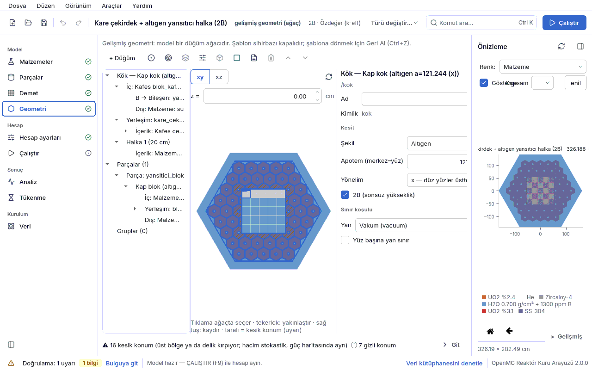
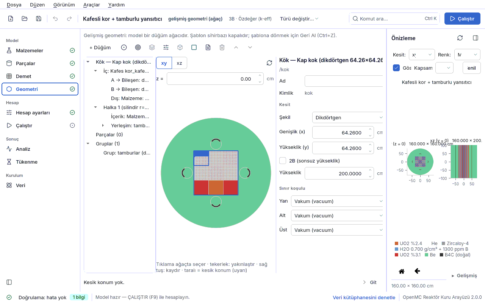

## 4.5 Gelişmiş geometri editörü

Gelişmiş modda model, iç içe geçen **düğümlerden** oluşan bir **geometri ağacıdır**
(`kor.tur` = `agac`; ağaç model dosyasının `geometri` bölümündedir). Şablonun kapalı tür
listesinin kuramadığı düzenekler böyle kurulur: kare kafesin çevresini altıgen bloklarla sarmak,
tamburu altıgen ya da kare kafesli bir korun yansıtıcısına yerleştirmek, kare korun çevresine
silindirik yansıtıcı koymak, herhangi bir düzeyde eksenel yığın kurmak. Bu bir CSG editörü
değildir: kullanıcı yüzey yazmaz; her düğüm OpenMC'de bilinen, doğrulanabilir tek bir yapıya
karşılık gelir. Tasarım belgesi: [GEOMETRI_MODELI.md](../../GEOMETRI_MODELI.md) §2–§3, §8, §10,
§15.

Gelişmiş moda üç yoldan girilir: Geometri sayfasında **Gelişmiş geometriye geç…**
([4.4.9](04d-geometri.md#geo-gecis)), **Düzenek şablonu** listesindeki son üç düzenek, ya da
gelişmiş modda kaydedilmiş bir dosyayı açmak (`ornekler/pwr_kare_altigen_halka.json`,
`ornekler/altigen_tambur_halkasi.json`, `ornekler/kafes_tamburlu_yansitici.json`). Sayfanın
üstündeki not bunu hatırlatır: şablon sihirbazı kapalıdır, şablona dönmek için **Geri Al (Ctrl+Z)**.

### 4.5.1 Ekran düzeni ve araç çubuğu

| Bölge | Ne yapar |
|---|---|
| üst: araç çubuğu | düğüm ekleme ve ağaç işlemleri (aşağıdaki tablo); sağ tık menüsü aynı eylemleri gösterir |
| sol: ağaç | düğümler, halkalar, yerleşimler, katmanlar, **Parçalar** ve **Gruplar** dalları; sürükle-bırak yalnız uyumlu yuvaya yapılır (uyumsuz hedefte imleç “yasak” olur) |
| orta: kesit | şematik **xy** ya da **xz** kesit; xy'de z kutusu; fare tekerleği yakınlaştırır, orta/sağ tuşla sürüklemek kaydırır, çift tık sığdırır; tıklama ağaçta o düğümü seçer; seçili düğüm renkli, diğerleri soluk; kesik konumlar taralı, gizli konumlar noktalı; xz'de katman sınırları kesikli çizgi |
| sağ: özellikler | seçili ögenin formu (aşağıda); sayı kutuları birimlidir (cm, °) |
| alt şerit | kesik / gizli konum özeti ve **Git** (kesik konumu olan ilk kafesi seçer) |

Araç çubuğundaki düğmeler simgedir (**+ Düğüm** ▾ dışında); aşağıdaki adları ipucunun
başında ve ekran okuyucu için erişilebilir adda görünür.

| Eylem | Ne zaman etkin | Ne yapar |
|---|---|---|
| **+ Düğüm** ▾ | bir düğüm seçiliyken | seçili yuvaya yeni düğüm koyar: Malzeme, Bileşen (kütüphaneden), Kafes, Kap (şekil + halkalar), Eksenel yığın; eskisi Geri Al ile döner |
| **+ Halka** | kap seçiliyken | kaba dış halka ekler (10 cm, ilk malzeme) |
| **+ Yerleşim** | kap ya da halka seçiliyken | o bölgeye delik + içerik yerleştirir (tambur, kanal, alt kafes); modelde tambur tanımı varsa içerik odur, yoksa 1 cm yarıçaplı silindir delikte malzeme |
| **+ Katman** | eksenel yığın seçiliyken | yığına katman ekler |
| **+ Grup** | her zaman | dönme grubu ekler (türü formda Daldırma yapılabilir) |
| **Parçaya çıkar** | kök dışındaki kafes/kap/yığın seçiliyken | ad sorar; seçili alt ağacı `geometri.parcalar`'a taşır, yerine o parçaya bir `bilesen` başvurusu koyar |
| **Sarmala** | bir düğüm seçiliyken | seçiliyi yeni bir kabın `ic`ine alır |
| **Yeniden adlandır** | adlı öge seçiliyken | yerleşim, grup, parça ya da kap/kafes/yığın adını değiştirir; başvuruları da günceller |
| **Sil** | kök dışında | seçiliyi siler |
| **Yukarı taşı** / **Aşağı taşı** | halka, yerleşim, katman, parça, grup | listedeki sırayı değiştirir |

Her yapısal işlem (ekle, sil, taşı, parçaya çıkar…) **tek bir geri alma adımıdır**; form
alanlarındaki yazma, kısa bir duraklamadan sonra adım olarak yığılır. Bir işlem reddedilirse
(ör. uyumsuz yuva) neden bildirim olarak görünür.

### 4.5.2 Temel kavramlar

- **Düğüm türleri.** Kullanıcı beş tür görür (`cekirdek/geometri/sema.py`, `KULLANICI_TURLERI`):
  `malzeme` (yaprak; bir malzeme ya da `"bosluk"` = void), `bilesen` (kütüphanedeki bir çubuk,
  plaka, demet, tambur ya da parçanın kullanımı), `kafes` (kare ya da altıgen), `kap` (şekil +
  halkalar + delikler), `eksenel` (z yığını).
- **Yuva.** Bir düğümün konabileceği yer: `kap.ic`, `kap.dis`, `halka.icerik`,
  `kafes.anahtar[harf]`, `kafes.dis`, `eksenel.icerik`, `katman.icerik`, `yerlesim.icerik`.
- **Tanım ve kullanım.** Kütüphane bölümleri (`cubuklar`, `plakalar`, `demetler`, `tamburlar`,
  `geometri.parcalar`) *tanımdır*; ağaçtaki `bilesen` düğümü bir tanımın *kullanımıdır*. Aynı ad kaç
  kez kullanılırsa kullanılsın OpenMC'de **tek bir universe** kurulur.
- **Kimlik (`id`).** Ağaç içinde tekil kısa kimlik (`kok`, `kor_kafesi`…); seçim, doğrulama yeri
  (`geometri:<yol>`) ve hücre adları bunu kullanır.
- **Birimler ve eksenler.** Uzunluk cm, açı derece; pozitif açı saat yönünün tersidir. Her düğüm
  kendi yerel çerçevesinde (0, 0) merkezlidir; eksenel yığın z = 0 etrafında ortalanır.
- **İki yönelim anlamı (karıştırılmamalı).** `kafes.yonelim` OpenMC `HexLattice` anlamındadır;
  `kesit.yonelim` `HexagonalPrism` anlamındadır. Bir altıgen kafesi *saran* kesitin yönelimi
  kafesinkiyle aynıdır; altıgen kafesin *eleman hücresi* ise ters yönelimli bir prizmadır. Bu
  yüzden altıgen bir demet, altıgen kafes elemanına **ters** yönelimle konur; aynı yönelimle
  konursa HATA (“demet elemana oturmaz”).

### 4.5.3 İçerik formu (her yuvadaki düğüm)

Kök dışında bir düğüm seçilince formun üstünde içerik satırları görünür.

| Alan | Anlamı | Birim | Tipik aralık | Yaygın yanlış kullanım | Spec anahtarı |
|---|---|---|---|---|---|
| **Tür** | yuvadaki düğümün türü: Malzeme, Bileşen (kütüphaneden), Kafes, Kap (şekil + halkalar), Eksenel yığın | — | — | türü değiştirince eski alt ağacın kaybolduğunu sanmak: yeni varsayılan düğüm konur, eskisi Geri Al ile döner | `tur` = `malzeme` / `bilesen` / `kafes` / `kap` / `eksenel` |
| **Malzeme** | malzeme düğümünün malzemesi; “Boşluk (void)” = madde yok | — | — | kök içinde boşluk bırakmak (UYARI: nötron etkileşmeden geçer) | `ad` (`{"tur": "malzeme", "ad": …}`) |
| **Bileşen** | kütüphanedeki çubuk, plaka, demet, tambur ya da parça | — | — | bileşeni burada tanımlamaya çalışmak: tanımlar Parçalar/Demet sayfalarındadır | `ad` (`{"tur": "bilesen", "ad": …}`) |
| **Dönme** | bileşen yuvaya konurken döndürülür | ° | 0, 30, 60, 90 | malzeme düğümünü döndürmek (HATA: OpenMC malzeme dolgulu hücreyi döndürmez) | `donusum.donme` |
| **Öteleme x** | bileşenin yuvadaki x kayması | cm | 0 | — | `donusum.oteleme` |
| **Öteleme y** | bileşenin yuvadaki y kayması | cm | 0 | — | `donusum.oteleme` |

Tambur tanımları (`tamburlar[]`: `ad`, `yaricap`, `govde_malzeme`, `emici_malzeme`,
`emici_ic_yaricap`, `emici_aci`) gelişmiş modda bir şablondan (tamburlu kor ya da tamburlu
düzenekler) gelir; bu sürümde onları düzenleyen ayrı bir form yoktur, model dosyasında
düzenlenir. Tamburun **yerleşim** alanları (sayı, merkez yarıçapı, dönme, başlangıç açısı)
tanımda değil, yerleşimde ve grupta durur.

### 4.5.4 Kap formu (şekil + halkalar + delikler)

Kap, bir **kesit** içinde bir iç bölgeden (`ic`), dışa doğru **halkalardan** (`halkalar`) ve bu
bölgelere oyulan **yerleşimlerden** (`yerlesimler`) oluşur. Ağacın kökü (`kok`) her zaman bir
kaptır; yükseklik ve sınır koşulları yalnız köktedir.

| Alan | Anlamı | Birim | Tipik aralık | Yaygın yanlış kullanım | Spec anahtarı |
|---|---|---|---|---|---|
| **Ad** | görünen ad | — | — | — | `ad` |
| **Kimlik** | tekil kimlik (salt okunur) | — | `kok`, `blok` | — | `id` |
| **Şekil** | kesit şekli: Dikdörtgen, Silindir (daire), Altıgen; yalnız kökte Küre ve Kafes zarfı (altıgen kafesin kırık sınırı) | — | — | kafes zarfını altıgen kafes içermeyen kökte istemek (sunulmaz) | `kesit.sekil` = `dikdortgen` / `silindir` / `altigen` / `kure` / `kafes_zarfi` |
| **Genişlik (x)** | dikdörtgen kesitin x ölçüsü | cm | kare çekirdek: n × demet adımı | — | `kesit.boyut` |
| **Yükseklik (y)** | dikdörtgen kesitin y ölçüsü (eksenel yükseklik değil) | cm | — | bunu modelin z yüksekliği sanmak | `kesit.boyut` |
| **Yarıçap** | silindir ya da küre yarıçapı | cm | — | — | `kesit.yaricap` |
| **Apotem (merkez–yüz)** | altıgen kesitin merkezden düz yüze uzaklığı | cm | — | köşeye kadar ölçmek (köşe = 2·apotem/√3) | `kesit.apotem` |
| **Yönelim** | altıgen kesitin yönelimi (`HexagonalPrism` anlamı): `y` düz yüzler sağda/solda, `x` düz yüzler üstte/altta | — | `x` ya da `y` | kafes yönelimiyle karıştırmak (§4.5.2) | `kesit.yonelim` |
| **2B (sonsuz yükseklik)** | (yalnız kök) model eksenel yönde sonsuz | — | — | 2B modele eksenel yığın koymak (HATA “2B modelde eksenel yığın kurulamaz”) | `yukseklik` = `null` |
| **Yükseklik** | (yalnız kök) modelin eksenel boyu; iç bölgede eksenel yığın varsa gizlenir ve yükseklik katmanların toplamıdır | cm | 45–400 | yığın varken ayrıca farklı bir yükseklik yazmak (HATA) | `yukseklik` |
| **Yan**, **Alt**, **Üst** | (yalnız kök) sınır koşulları; alt/üst yalnız 3B'de | — | Vakum | periyodiği alt/üstte istemek (sunulmaz) | `sinir.yan`, `sinir.alt`, `sinir.ust` |
| **Yüz başına yan sınır** | (yalnız kök) düz yüzlü dış kesitte her yüz ayrı koşul | — | — | tek taraflı periyodik (form uyarır, OpenMC durur) | `sinir.yuzler` |
| **Dönme**, **Öteleme x**, **Öteleme y** | (kök dışında) kabın yuvaya konurken dönüşümü | °, cm | — | daire dışı delikli bir kabı döndürüp deliğin de döneceğini beklemek (HATA) | `donusum.donme`, `donusum.oteleme` |

- Sınır koşullarının hangi yüzde hangi seçenekle sunulduğu şablondakiyle aynı kuraldır
  ([4.4.6](04d-geometri.md#geo-yukseklik)); periyodik yalnız dikdörtgen ya da altıgen dış
  sınırda ve sınıra değen delik yokken sunulur. Sınır türleri: `vacuum`, `reflective`, `white`,
  `periodic`.
- Kök olmayan kapta `dis` (kabın dışı ile yuvanın sınırı arası) **zorunludur**; kökte `dis`
  **yasaktır**.

### 4.5.5 Halka formu

| Alan | Anlamı | Birim | Tipik aralık | Yaygın yanlış kullanım | Spec anahtarı |
|---|---|---|---|---|---|
| **Tanım** | halka nasıl tanımlanır: **Kalınlık** ya da **Dış kesit** | — | — | — | — |
| **Kalınlık** | iç sınırın şeklini düzgün büyütür: dikdörtgende boyut + 2k, silindir ve kürede r + k, altıgende apotem + k | cm | yansıtıcı 10–30 | kafes zarfı üzerinde kalınlık kullanmak (HATA; dış kesit verin) | `halkalar[].kalinlik` |
| Dış kesit (Şekil, Genişlik (x), Yükseklik (y), Yarıçap, Apotem (merkez–yüz), Yönelim) | halkanın farklı şekilli dış sınırı (ör. kare korun çevresinde silindirik yansıtıcı) | cm | — | önceki sınırı kapsamayan bir dış kesit (HATA “halka dış kesiti öncekini kapsamıyor”) | `halkalar[].dis` |

Halkanın içeriği ağaçta halkanın altındaki düğümdür (`halkalar[].icerik`); halka seçiliyken
**+ Yerleşim** o halkaya delik oyar (`halkalar[].yerlesimler`).

### 4.5.6 Kafes formu ve harita düzenleyicisi

| Alan | Anlamı | Birim | Tipik aralık | Yaygın yanlış kullanım | Spec anahtarı |
|---|---|---|---|---|---|
| **Ad** | görünen ad | — | — | — | `ad` |
| **Kimlik** | tekil kimlik (salt okunur); yerleşimin **Kafes** alanı bunu gösterir | — | `kor_kafesi` | — | `id` |
| **Şekil** | Kare ya da Altıgen | — | — | şekli değiştirince haritanın sıfırlandığını unutmak (Geri Al ile döner) | `sekil` = `kare` / `altigen` |
| **Adım** | kare kafeste hücre kenarı, altıgende düz yüzden düz yüze | cm | pin 1.26; demet 21.42; altıgen blok 30 | adım ≤ 0 (HATA); altıgende köşeden köşeye ölçmek | `adim` |
| **Sütun** | kare haritanın sütun sayısı | — | 1–60 | — | `boyut` |
| **Satır** | kare haritanın satır sayısı | — | 1–60 | harita satır sayısını `boyut` ile tutarsız bırakmak (dosyada elle; HATA) | `boyut` |
| **Halka sayısı** | altıgen kafesin merkez dahil halka sayısı | — | 1–60 | halka uzunluğu tutmayan elle yazılmış harita (HATA) | `halka_sayisi` |
| **Yönelim** | altıgen kafes yönelimi (`HexLattice` anlamı): `y` komşular yukarıda, `x` komşular sağda | — | `x` ya da `y` | altıgen demeti aynı yönelimli kafese koymak (HATA) | `yonelim` |

**Harita düzenleyicisi.** Paletteki her öge bir harftir: “A → demet_24”, “B → yansitici_blok”;
son öge “· → dış (…)” kafesin **dış dolgusudur** (`dis`). Harfe tıklayıp hücreleri boyayın.
**+ Harf** yeni bir harf ekler (ilk malzemeyle); harfin içeriği ağaçta o harfin düğümü seçilerek
**İçerik formu**nda değiştirilir. Kare harita satır satırdır (ilk satır en üst), altıgen harita
dıştan içe halka listesidir. Boyut değişince kare harita sol üst köşeden, altıgen harita içten
hizalanır (iç halkalar korunur).

- `harita` (`.` karakteri = dış dolgu: düzensiz kor ya da gizli konum), `anahtar`
  (`{harf: düğüm}`), `dis` (**zorunlu**; OpenMC'de kafesin dışı ve `.` konumları buraya düşer).
  Tek istisna kafes zarflı kökün altıgen kafesidir; orada `.` desteklenmez, harf tanımlanmalıdır
  ([GEOMETRI_MODELI.md](../../GEOMETRI_MODELI.md) §16).
- Haritada **taralı** konumlar kesik, **noktalı** konumlar gizlidir; form altında sayıları yazar
  (“Taralı: k kesik konum …, g gizli konum.”). Bkz. [4.5.10](#gg-kesik).

### 4.5.7 Eksenel yığın ve katman formları

Eksenel yığın, bir içeriği z yönünde katmanlara böler; **herhangi bir düzeyde** kurulabilir
(kökün içinde bütün kor için ya da yalnız bir kanalın içinde).

| Alan | Anlamı | Birim | Tipik aralık | Yaygın yanlış kullanım | Spec anahtarı |
|---|---|---|---|---|---|
| **Ad** (yığın) | görünen ad | — | — | — | `ad` |
| **Katmanlar** | özet: “n katman, toplam h cm” | — | — | — | `katmanlar` |
| (yığın) varsayılan içerik | içeriği boş katmanların kullandığı düğüm | — | — | — | `icerik` |
| **Ad** (katman) | katmanın adı | — | “alt su”, “aktif” | — | `katmanlar[].ad` |
| **Yükseklik** (katman) | katman kalınlığı | cm | 10–300 | 0 cm katman (atlanır, BİLGİ); kök dışındaki yığının toplamını model yüksekliğinden farklı bırakmak (HATA; son katman sessizce uzamaz) | `katmanlar[].yukseklik` |
| **Yığının varsayılan içeriğini kullan** | işaretliyse katman yığının varsayılan içeriğini kullanır; kaldırılınca katmana kendi içeriği (ilk malzeme) konur | — | — | — | `katmanlar[].icerik` (`null` = varsayılan) |
| (yalnız JSON) katman anahtarı | varsayılan içerik bir kafesse harita aynı kalır, harf → içerik eşlemesi o katmanda değişir | — | — | kafes olmayan içerikte vermek (HATA) | `katmanlar[].anahtar` |

Katmanlar alttan üste dizilir; sırayı **Yukarı taşı** / **Aşağı taşı** değiştirir. Kökün
içinde yığın varsa kökün yüksekliği yığının toplamıdır (tek gerçek kaynak kuralı).

### 4.5.8 Yerleşim formu — tamburu, kanalı ya da alt kafesi her yere koymak

Yerleşim, sahibi olan bölgeden (kabın iç bölgesi ya da bir halka) bir **delik** oyar ve deliğe bir
**içerik** koyar. Tambur, kontrol kanalı, deney kanalı ve altıgen blokların ortasındaki kare
çekirdek aynı mekanizmayla yerleşir. Adım adım: [5. Rehberli dersler — tamburu herhangi bir
geometriye yerleştirmek](05-dersler.md#ders-tambur).

| Alan | Anlamı | Birim | Tipik aralık | Yaygın yanlış kullanım | Spec anahtarı |
|---|---|---|---|---|---|
| **Ad** | yerleşimin adı (gruplar bununla başvurur) | — | “tambur_halkasi” | aynı adı iki yerleşime vermek | `yerlesimler[].ad` |
| **Mod** | Halka (eşit aralıklı), Liste (x, y), Kafes konumu (harf) | — | — | — | `yerlesimler[].mod` = `halka` / `liste` / `kafes_konumu` |
| **Sayı** | (halka) örnek sayısı | — | 1–360 (tambur: 4–12) | — | `yerlesimler[].sayi` |
| **Merkez yarıçapı** | (halka) örnek merkezlerinin bölge merkezine uzaklığı | cm | yansıtıcının ortası | deliği bölge sınırına değdirmek (HATA “deliği bölgesinden taşıyor” / “iç sınırına taşıyor”) | `yerlesimler[].merkez_yaricap` |
| **Başlangıç açısı** | (halka) ilk örneğin azimutu; örnek i: başlangıç + 360·i/n | ° | 0, 30, 45 | altıgen korda köşelere bakan açıyı seçip yüzlere baktığını sanmak (kesitte görün) | `yerlesimler[].baslangic_acisi` |
| **Konumlar** | (liste) örnek merkezleri; **+ Konum**, **Sil**; sütunlar x [cm], y [cm] | cm | — | iki deliği örtüştürmek (HATA “delikleri örtüşüyor”) | `yerlesimler[].konumlar` |
| **Kafes** | (kafes konumu) delikler bu kafesteki harf konumlarından oyulur; kafes kabın iç bölgesi ya da aynı kaptaki bir halkanın içeriği olmalı ve dönüşümsüz olmalı | — | — | deliği konum hücresinden büyük vermek (HATA “kafes konumu hücresinden taşıyor”) | `yerlesimler[].kafes` |
| **Harf** | (kafes konumu) hangi harfin konumları | — | — | — | `yerlesimler[].harf` |
| **Doğal kesit (tambur dairesi)** | yalnız tambur içerikte: delik tamburun kendi dairesidir | — | işaretli | — | `yerlesimler[].kesit` = `null` |
| delik kesiti (Şekil, Genişlik (x), Yükseklik (y), Yarıçap, Apotem (merkez–yüz), Yönelim) | tambur dışındaki içerikte deliğin şekli **zorunludur** | cm | — | daire olmayan deliği bakış ya da dönmeyle döndürmek (HATA) | `yerlesimler[].kesit` |
| Kora bakış: Merkeze / Sabit / Yok | içeriğin ön yüzü (tamburda emici yay) **yerel +x**'tir; bakış bu yüzü nereye çevireceğini söyler | — | tamburda Merkeze | örnek merkezini bakış merkezine koymak (yön tanımsız, HATA; Sabit seçin) | `yerlesimler[].bakis.tur` = `merkez` / `sabit` |
| **Merkez x** | bakış merkezinin x'i (Merkeze) | cm | 0 | — | `yerlesimler[].bakis.merkez` |
| **Merkez y** | bakış merkezinin y'si (Merkeze) | cm | 0 | — | `yerlesimler[].bakis.merkez` |
| **Açı** | sabit bakış açısı (Sabit) | ° | — | — | `yerlesimler[].bakis.aci` |
| **Grup** | yerleşimin üyesi olduğu **dönme** grubu; “(grup yok)” | — | — | dönmeyi yerleşimde aramak: değer gruptadır | `geometri.gruplar[].uyeler` |
| **Ofset** | bu yerleşime eklenen sabit dönme | ° | 0 | — | `yerlesimler[].donme_ofset` |

**“Kora bakan yön” konvansiyonu** (bütün modlar; [GEOMETRI_MODELI.md](../../GEOMETRI_MODELI.md) §3.8):

- Örnek i'nin dönme açısı: halka modunda **ψᵢ = φᵢ + 180 + D** (şablondaki tamburla bit düzeyinde
  aynı); liste ve kafes konumu modunda, bakış Merkeze ise **ψᵢ = atan2(m_y − y_i, m_x − x_i) + D**;
  Sabit ise **ψᵢ = bakış açısı + D**; bakış Yok ise içeriğin kendi dönüşümü.
- **D = grup değeri + ofset.** Sonuç: **0° emici kora bakar** (daldırılmış, en düşük k),
  **180° dışa bakar** (çekilmiş, en yüksek k).
- Kap bir üst dönüşümle döndürülürse yerleşim birlikte döner ve “kora bakma” korunur.

Ölçülen (`ornekler/altigen_tambur_halkasi.json`, 6 B₄C tambur): dönme 0° → k = 0.95139,
180° → k = 1.04533 (σ 0.0015–0.0017); toplam Δk = 9394 pcm (Δk × 10⁵), Δρ = 9446 pcm (Δρ × 10⁵)
([ORNEKLER.md](../../ORNEKLER.md)). Bir bölgede 50'den fazla delik UYARI verir (hücre araması
yavaşlar).

### 4.5.9 Grup ve parça formları

**Gruplar** birden çok yerleşimi (dönme) ya da kontrol çubuğunu (daldırma) **tek değerle** sürer.
Değer **yalnız grupta** tutulur (tek kaynak).

| Alan | Anlamı | Birim | Tipik aralık | Yaygın yanlış kullanım | Spec anahtarı |
|---|---|---|---|---|---|
| **Ad** | grubun adı | — | “tamburlar”, “Banka A” | — | `geometri.gruplar[].ad` |
| **Tür** | Dönme ya da Daldırma | — | — | türü değiştirince üyelerin silindiğini unutmak | `geometri.gruplar[].tur` = `donme` / `daldirma` |
| **Değer** | dönme grubunda bütün üye yerleşimlerin dönmesi (kutu + 0.1° kaydırıcı); daldırma grubunda üye kontrol çubuklarının daldırma oranı | °; daldırmada % (aktif yakıt aralığına göre: %0 çekilmiş, %100 tam dalmış) | dönme −360…360; daldırma 0–100 | daldırma değerini cm sanmak (aşağıdaki not) | `geometri.gruplar[].deger` |
| **Üyeler** | onay listesi: dönmede yerleşim adları (yerleşimin bütün örnekleri birlikte döner), daldırmada kontrol çubuğu tanımları | — | — | bir üyeyi aynı türden iki gruba koymak (HATA); tek üyeli ya da boş grup (UYARI) | `geometri.gruplar[].uyeler` |

> ⚠ **Daldırma değeri yüzdedir.** Çekirdek daldırma grubunun değerini bir yüzde olarak okur
> (0…100; uç z = üst − değer/100 × aktif yükseklik). Bu sürümde formdaki değer kutusunun yanında
> “°” birimi ve ipucunda “daldırma derinliği [cm]” yazar; bunlar yanlıştır, değeri yüzde girin.

- Üye kontrol çubuğunun kendi daldırma değeri yok sayılır (farklıysa BİLGİ).
- **Her kontrol çubuğu yerleşimi ayrı bir hacim ve örnektir** ([GEOMETRI_MODELI.md](../../GEOMETRI_MODELI.md)
  §15 karar 5): kendi kimliğini, daldırmasını ve hacmini taşır; tükenme ve tally onu ayrı görür.
  Gruplar yalnız birden çok çubuğu aynı anda sürmek içindir ve bir çubuk en çok bir gruba üyedir.
  Aynı geometride iki banka için iki ayrı kontrol çubuğu tanımı gerekir.
- Tarama ve kritik arama hedefi gruptur: Analiz sayfasında `grup_donme` ve `grup_daldirma`
  ([4.8 Analiz](04h-analiz.md#analiz)).

**Parçalar** (`geometri.parcalar[]`: `ad`, `dugum`) adlandırılmış alt ağaçlardır; `bilesen` ile
başvurulur.

| Alan | Anlamı | Birim | Tipik aralık | Yaygın yanlış kullanım | Spec anahtarı |
|---|---|---|---|---|---|
| **Ad** | parçanın adı; kütüphanedeki bir adla çakışamaz | — | “yansitici_blok” | kütüphanedeki bir çubuk/demetle aynı adı vermek (belirsiz ad, HATA) | `geometri.parcalar[].ad` |
| **Kullanım** | parçanın kaç yerde kullanıldığı | — | — | — | — |

**Neden parça?** Aynı alt ağaç birden çok yerde kullanılacaksa **parça olmalıdır**. Satır içi bir
düğümü iki yuvaya kopyalamak iki ayrı universe üretir; distribcell güç tally'si ve tükenmedeki
örnek sayımı bölünür. Doğrulama aynı içerikli iki satır içi alt ağaç bulursa UYARI verir
(“parçaya çevirin”). Parça kendini doğrudan ya da dolaylı içeremez (döngü, HATA).

### 4.5.10 Kesik ve gizli konumlar, doğrulama ve yoklama

Bir kafes elemanı ya da bileşen üst bölgenin sınırıyla ya da bir delikle **kırpılıyorsa** o konum
**kesiktir**; tamamen bir deliğin altında kalıyorsa **gizlidir**. Alt şerit bunu yazar
(“⚠ k kesik konum … ⓘ g gizli konum”, ya da “Kesik konum yok.”); **Git** kesik konumu olan ilk
kafesi seçer.

- **Kesik konum UYARIdır** ([GEOMETRI_MODELI.md](../../GEOMETRI_MODELI.md) §15 karar 2): hacmi
  stokastik hesaplanır, güç haritasında “kesik” olarak ayrı işaretlenir ve F_ΔH'ye girmez.
  **Çubuk çubuk yanma** (Tükenme sayfası, `tukenme.malzemeleri_ayir`) açıkken kesik yakıt örneği
  HATAdır.
- Kesik çubuk (pin bölgesi hücre sınırıyla kesiliyor) ayrıca UYARI verir.
- **Gizli konum BİLGİdir**: haritada o konuma `.` yazılabilir.
- Örnek: `ornekler/pwr_kare_altigen_halka.json` 16 “kesik blok” UYARISI verir; kare deliği altıgen
  kafes kırpmadan saramaz, bu tasarımın gereğidir. Yakıt kesik değildir, yakıt hacmi analitiktir
  ([ORNEKLER.md](../../ORNEKLER.md)).

Gelişmiş modda doğrulama önce yapısal denetimi (bilinmeyen tür, eksik alan, tanımsız başvuru,
belirsiz ad, döngü, harita boyutu, kapsamayan halka…) yapar; hata yoksa geometrik denetimleri
(delik sığması ve örtüşmesi, yönelim, eksenel toplam, sınır) ve **600 noktalık bir nokta
yoklaması** koşar: bir noktayı içeren hücre yoksa (boşluk) ya da birden fazlaysa (örtüşme) HATA
verilir; ikisi de koşuda kayıp parçacık üretir. Ayrıca: iç içe derinlik 10 düzeyi aşarsa HATA,
6'yı aşarsa UYARI (izleme yavaşlar); 2B modelde kontrol tamburu UYARI (eksenel sızıntı yok;
tambur değeri fazla çıkar). Bulguların yeri `geometri:<yol>` biçimindedir ve listeden tıklanınca
ağaçta o düğüm seçilir. Mesajların tam listesi ve çözümleri:
[9. Sorun giderme](09-sorun-giderme.md#bulgu-turleri).

**Pin kesiti.** Yakıt çubuğu kesiti silindir, kare ya da altıgen olabilir (§15 karar 3); bu
Parçalar sayfasında seçilir ([4.2 Parçalar](04b-parcalar.md#parcalar)). Altıgen pinin kesit
yönelimi yerleştiği kafesin yönelimine terstir (ölçüldü).

**Kare demetin çevresine altıgen.** Hedef düzeneklerden “Kare çekirdek + altıgen halka”da altıgen
bloklar yansıtıcı blok (malzeme + kanal) ya da altıgen yakıt demeti olabilir; örnek dosyada
SS-304 yansıtıcı bloklar kullanılır. Kurulum adımları:
[5. Rehberli dersler](05-dersler.md#ders-kare-altigen).
