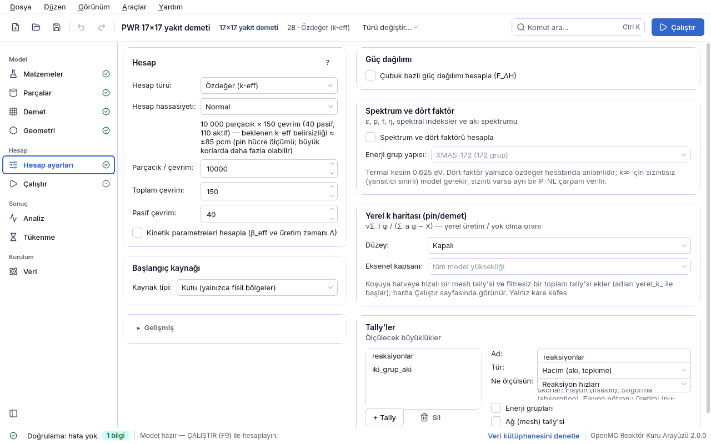

## 4.6 Hesap ayarları

Bu sayfa OpenMC'ye **nasıl** hesap yapacağını söyler: hangi tür hesap (özdeğer ya da sabit
kaynak), kaç parçacık ve kaç çevrim, kaynak nerede başlar, hangi büyüklükler ölçülür (güç
dağılımı, tally'ler). Geometri ve malzeme burada değişmez.

Sayfa iki sütundur. Solda **Hesap**, **Kaynak** (özdeğer hesabında başlığı **Başlangıç
kaynağı** olur) ve **Gelişmiş** kartları; sağda **Güç dağılımı** ve **Tally'ler** kartları
vardır. Öğrencinin vereceği karar çoğunlukla iki tanedir: **Hesap türü** ve **Hesap
hassasiyeti**. Uzman alanları **Gelişmiş** altında katlıdır.

**Neyin görüneceği tek bir kural tablosundan gelir** (`cekirdek/uygunluk.py`,
`uygunluk.ayar_alanlari`). Bu modelde anlamsız olan alan gizlenir; doğrulama aynı kuralı
kullandığı için arayüzün sunmadığı bir seçenek elle yazılmış bir dosyada da hata ya da bilgi
bulgusu olarak yakalanır. **Gizlenen bir alanın değeri dosyadan silinmez**; yalnızca
görünen alanlar kaydedilir.

| `uygunluk.ayar_alanlari` anahtarı | Ne zaman görünür | Gerekçe |
|---|---|---|
| `pasif` | Özdeğer hesabında | Pasif çevrim fisyon kaynağının yakınsaması içindir; sabit kaynakta kaynak zaten bellidir. |
| `entropi` | Özdeğer hesabında | Shannon entropisi fisyon kaynağı dağılımını ölçer. |
| `kinetik` | Özdeğer hesabı **ve** geometride fisil malzeme | IFP yöntemi fisyon zincirini nesiller boyunca izler. |
| `kaynak_siddeti` | Sabit kaynak hesabında | Özdeğer sonuçları fisyon kaynağına normalize edilir; şiddetin etkisi yoktur. |
| `foton` | Sabit kaynak hesabında | Fotonlar fisyon zincirini taşımaz; özdeğerde foton kaynağı anlamsızdır. |
| `kaynak_tayfi_temel` | Sabit kaynak hesabında (tayf **Kaynak** kartına çıkar) | Özdeğerde tayf yalnızca başlangıç tahminidir; **Gelişmiş** altında kalır. |
| `kutu_kaynagi` | Geometride fisil malzeme varsa | Kutu kaynak OpenMC'de "yalnızca fisil bölgeler" kısıtıyla örneklenir. |
| `guc_dagilimi` | Fisil bölgeli bir çubuk bir **kafeste tekrarlanıyorsa** | Dağılım tekrarlanan hücre örnekleri üzerinden sayılır (pin hücrede, kürede, plakada yok). |
| `eksenel_dilim` | `guc_dagilimi` **ve** 3B model | 2B modelde eksen yoktur; yalnızca F_ΔH verilir. |

Çalıştırma ayarları (iş parçacığı, koşu dizini) bu sayfada **değildir**; onlar
[Çalıştır](04g-calistir.md#calistir) sayfasındadır.

### Hesap kartı

| Alan | Anlamı | Birim | Tipik aralık | Yaygın yanlış kullanım | Spec anahtarı |
|---|---|---|---|---|---|
| **Hesap türü** | **Özdeğer (k-eff)**: kendi kendini sürdüren zincir tepkimesi; sonuç k-eff (ya da bütün dış sınırlar yansıtıcıysa k∞). **Sabit kaynak**: dışarıdan verilen bir kaynağın taşınımı (zırhlama, dedektör); sonuç tally'lerdir, k-eff yoktur. | — | özdeğer: reaktör, demet, kriter; sabit kaynak: zırh örnekleri (`ornekler/zirh_kure.json`) | Zırh hesabını özdeğerde yapmak (fisil yoksa k tanımsız); sabit kaynakta hiç tally tanımlamamak (**hata**: "koşu hiçbir sonuç üretmez"). | `ayarlar.mod` (`eigenvalue` \| `fixed source`) |
| **Hesap hassasiyeti** | Parçacık, toplam çevrim ve pasif çevrimi birlikte ayarlayan ön ayar: **Hızlı deneme** (1 000 × 60, 20 pasif), **Normal** (10 000 × 150, 40 pasif), **Hassas** (50 000 × 300, 80 pasif); sayıları elle değiştirirseniz **Özel** görünür. Altındaki satır beklenen k-eff belirsizliğini yazar. | — | ders/ödev: Normal; küçük reaktivite farkı: Hassas | "Hızlı deneme" ile ölçülen k'yı rapora yazmak (σ ≈ 300–500 pcm). Ön ayar spec'e ayrı bir alan olarak yazılmaz; yalnızca üç sayıyı değiştirir. | (yok — `ayarlar.parcacik`, `ayarlar.cevrim`, `ayarlar.pasif` üzerinden) |
| **Parçacık / çevrim** | Her çevrimde (batch) izlenen kaynak parçacığı sayısı (OpenMC `particles`). | parçacık | 1 000 – 100 000 (kriterler 100 000) | 1 000'in altına inmek: doğrulama **uyarı** verir ("kaynak yakınsaması bozulabilir"). | `ayarlar.parcacik` |
| **Toplam çevrim** | Pasif + aktif çevrim sayısı (OpenMC `batches`). | çevrim | 60 – 300 | Pasif çevrimden az ya da eşit girmek (**hata**); aktif çevrimi 20'nin altında bırakmak (**uyarı**: istatistik zayıf). | `ayarlar.cevrim` |
| **Pasif çevrim** | Baştaki, istatistiğe katılmayan çevrimler: kaynak dağılımı yakınsayana kadar atılır (OpenMC `inactive`). Yalnızca özdeğer hesabında görünür. | çevrim | 20 – 100 (tam korda ve eksenel katmanlı modelde daha fazla) | 5'ten az girmek (**uyarı**); katmanlı modelde 40'ta bırakmak — `pwr_eksenel`'de 40 pasif çevrim yetmedi, 100 gerekti (README). Shannon entropisine bakmadan karar vermek. | `ayarlar.pasif` |
| **Kinetik parametreleri hesapla (β_eff ve üretim zamanı Λ)** | IFP (Iterated Fission Probability) yöntemiyle etkin gecikmiş nötron kesri β_eff ve nötron üretim zamanı Λ hesaplanır; reaktivite ayrıca **dolar** ($) cinsinden yazılır. Özdeğer + fisil modelde görünür. | — | kapalı (gerekince açın); ölçülen: PWR 17×17 β_eff = 696 ± 48 pcm, Λ ≈ 18.9 μs (README: 22.4 μs = ℓ; v3 Λ = ℓ/k, k∞ = 1.184); Godiva β_eff = 681 ± 27 pcm, Λ = 5.62 ns (README) | Gerekmediği hâlde açık bırakmak (koşu yavaşlar); sabit kaynakta açmak (yok sayılır, **bilgi**). | `ayarlar.kinetik.var` |

**Beklenen belirsizlik nasıl hesaplanır?** Özet satırındaki "≈ ±N pcm" değeri bir ölçümden
türetilir: σ_k · √(parçacık × aktif çevrim) ≈ 9.0 × 10⁴ pcm (pin hücre, `pwr_pinhucre`). Buna
göre Normal ≈ ±86 pcm, Hassas ≈ ±27 pcm, Hızlı deneme ≈ ±450 pcm (ölçülen 311–532 pcm) beklenir.
Büyük ya da gevşek bağlı korlarda gerçek belirsizlik daha büyük olabilir; metin bunu "yaklaşık"
diye belirtir. Burada pcm = Δk × 10⁵ (k'nın standart belirsizliği, 1σ). Koşu bitince
[Çalıştır](04g-calistir.md#calistir) sayfasındaki k-eff kartı ölçülen σ'yı bu hedefle karşılaştırır.

### Kaynak kartı (özdeğerde "Başlangıç kaynağı")

Özdeğer hesabında kaynak yalnızca **ilk tahmindir**: pasif çevrimler içinde gerçek fisyon
kaynağına döner ve k-eff'i etkilemez (yeter ki pasif çevrim yeterli olsun). Sabit kaynak
hesabında ise kaynak **sonucun kendisidir**: konumu, enerjisi, yönü ve şiddeti doğrudan
tally'leri belirler.

| Alan | Anlamı | Birim | Tipik aralık | Yaygın yanlış kullanım | Spec anahtarı |
|---|---|---|---|---|---|
| **Kaynak tipi** | **Nokta kaynak** ya da **Kutu (yalnızca fisil bölgeler)**. Kutu kaynağı modelin fisil bölgelerinde düzgün örneklenir; sınırları model kurulurken fisil aralıktan türetilir. Kutu seçeneği yalnızca geometride fisil malzeme varsa sunulur. | — | özdeğer: kutu ya da merkezde nokta; zırh: nokta | Sabit kaynakta kutu seçmek: parçacıklar yalnızca fisil malzemede başlar (**uyarı**). Elle yazılmış dosyada kutu sınırlarını 3B modelin yüksekliğinden kısa tutmak (README "Bilinen tuzaklar": eksenel güç aşırı tepeli çıkar). | `ayarlar.kaynak.tur` (`nokta` \| `kutu`); kutu sınırları `ayarlar.kaynak.alt`, `ayarlar.kaynak.ust` (`null` = modelden; yalnız JSON) |
| **Nokta konumu** | Nokta kaynağın (x, y, z) konumu. z kutusu yalnızca 3B modelde ve kürede görünür. | cm | (0, 0, 0) = model merkezi | Kaynağı geometrinin dışına koymak: parçacıklar anında kaybolur (**hata**: "nokta kaynak z = … modelin dışında"). | `ayarlar.kaynak.konum` |
| **Parçacık** | **Nötron** ya da **Foton (gama)**. Foton seçilirse foton taşınımı da açılır; kütüphanede foton verisi bulunmalıdır. Tek seçenek varsa satır gizlidir. | — | nötron | Özdeğer hesabında foton seçmek (**hata**: fotonlar fisyon zincirini taşımaz); kütüphanede foton verisi yokken foton seçmek (**hata**). | `ayarlar.kaynak.parcacik` (`neutron` \| `photon`) |
| **Kaynak şiddeti [1/s]** | Saniyede yayılan kaynak parçacığı. Sabit kaynakta tally sonuçları bununla çarpılır ve mutlak birime geçer; 1 bırakılırsa sonuçlar **kaynak parçacığı başına** kalır. Yalnızca sabit kaynakta görünür. | 1/s | 1 (bağıl) ya da gerçek kaynak (ör. 1e12) | Sonuçları bir de elle şiddetle çarpmak: OpenMC şiddeti **kendisi uygular** (ölçüldü: 1 ve 1e12 ile oran tam 1e12) — çift sayım olur. Sıfır ya da negatif değer (**hata**). Özdeğerde değiştirmek (yok sayılır, **bilgi**). | `ayarlar.kaynak.kuvvet` |

#### Enerji tayfı ve açısal dağılım

Bu kutu sabit kaynakta **Kaynak** kartında, özdeğerde **Gelişmiş › Başlangıç kaynağının
enerjisi ve yönü** altında durur. Tayf seçilince yalnızca o türün alanları görünür; altında
ortalama enerji yazılır (sabit kaynakta şiddet notu da).

| Alan | Anlamı | Birim | Tipik aralık | Yaygın yanlış kullanım | Spec anahtarı |
|---|---|---|---|---|---|
| **Enerji tayfı** | Watt fisyon tayfı, Maxwell tayfı, Tek enerjili (monoenerjetik), Ayrık çizgiler, Grup grup tayf (histogram), Füzyon tayfı (D-T / D-D, Muir). | — | özdeğer: Watt; D-T kaynağı: tek enerjili 14.1 MeV ya da füzyon | Özdeğerde tayfın sonucu değiştireceğini sanmak (yalnızca başlangıç tahmini, **bilgi**). Kaynak enerjisini veri tavanının üstüne çıkarmak (**hata**: "kaynak enerjisi …, veri tavanı …"). | `ayarlar.kaynak.enerji.tur` (`watt` \| `maxwell` \| `tek` \| `ayrik` \| `histogram` \| `fuzyon`) |
| **a (Watt)** | Watt tayfı χ(E) ~ exp(−E/a) sinh(√(bE)) parametresi. Ortalama enerji 1.5a + a²b/4. | eV | 988 keV (U-235 termal fisyon) | Birimi keV sanıp 988 yazmak (alan eV bekler; birim seçicisi gösterir). | `ayarlar.kaynak.enerji.a` |
| **b** | Watt tayfının ikinci parametresi. | 1/eV | 2.249e-6 | a ile b'yi farklı nüklidlerden almak. | `ayarlar.kaynak.enerji.b` |
| **θ** | Maxwell tayfı √E · exp(−E/θ) sıcaklığı; ortalama 1.5θ. | eV | 1.2932 MeV | — | `ayarlar.kaynak.enerji.theta` |
| **Enerji** | Tek enerjili kaynağın enerjisi. | eV | 14.1 MeV (D-T), 2.45 MeV (D-D), termal 0.0253 eV | — | `ayarlar.kaynak.enerji.enerji` |
| **Çizgiler** | Ayrık çizgiler: `enerji[eV]:olasılık` çiftleri, virgülle. Örnek (Co-60): `1.173e6:0.5, 1.333e6:0.5`. | eV : — | 1–20 çizgi | Bozuk bir `E:p` çifti kaydedilmez ve atlanır; doğrulama eksiği bildirir — çiftleri kontrol edin. | `ayarlar.kaynak.enerji.noktalar` |
| **Grup kenarları** | Histogram tayfın N+1 grup kenarı, artan sırada. | eV | ör. `1e5, 1e6, 1e7` | Kenarları azalan sırada girmek. | `ayarlar.kaynak.enerji.kenarlar` |
| **Grup değerleri** | Her grubun bağıl ağırlığı; kenar sayısından **bir eksik** olmalı. | — | N değer | Kenarla aynı sayıda değer girmek (tayf kurulamaz, kırmızı özet). | `ayarlar.kaynak.enerji.degerler` |
| **Ortalama E₀** | Füzyon tayfının ortalama enerjisi. | eV | 14.08 MeV (D-T) | — | `ayarlar.kaynak.enerji.e0` |
| **Kütle toplamı** | Tepkimeye girenlerin kütle numaraları toplamı: D+T = 5, D+D = 4. | — | 4 ya da 5 | D-D için 5 bırakmak. | `ayarlar.kaynak.enerji.kutle_orani` |
| **İyon sıcaklığı** | Plazmanın iyon sıcaklığı kT; tayfı genişletir: D-T için FWHM = 177·√(kT[keV]) keV (kT = 20 keV'de σ ≈ 336 keV, ölçülen 335 keV). | eV | 10–50 keV | — | `ayarlar.kaynak.enerji.iyon_sicaklik` |
| **Açısal dağılım** | **İzotropik** (her yöne eşit), **Tek yönlü demet** (kalem demet) ya da **Koni**. | — | izotropik | Demet ya da koni seçip **Yön**'ü sıfır vektör bırakmak. Özdeğerde değiştirip sonucun değişmesini beklemek (yalnızca başlangıç tahmini, **bilgi**). | `ayarlar.kaynak.aci.tur` (`izotropik` \| `tek_yon` \| `koni`) |
| **Yön** | Demetin ya da koninin ekseni (u, v, w). İzotropikte gizlidir. | — | (0, 0, 1) | — | `ayarlar.kaynak.aci.yon` |
| **Koni yarı açısı** | Koninin eksenden kenara açısı; katı açıda düzgün dağılım kullanılır. Yalnızca Koni'de görünür. | derece | 0.01–180 | Tam açıyı (iki kenar arası) girmek. | `ayarlar.kaynak.aci.koni_aci` |

### Gelişmiş

| Alan | Anlamı | Birim | Tipik aralık | Yaygın yanlış kullanım | Spec anahtarı |
|---|---|---|---|---|---|
| **Rastgele tohum** | Rastgele sayı üretecinin tohumu. Aynı tohum ve aynı model aynı sonucu verir (kapsül ile yeniden üretim buna dayanır). | — | 1 (varsayılan); bağımsız tekrarlar için farklı tohumlar | Tek tohumla koşup çubuk güçlerinin σ'sına güvenmek: güç tally'si belirsizliği iyimserdir, birkaç tohumla koşun (bkz. [güç dağılımını yorumlamak](06-sonuclar.md#guc-dagilimi-yorum)). | `ayarlar.tohum` |
| **Sıcaklık yöntemi** | Kütüphanede olmayan bir sıcaklıkta tesir kesitinin nasıl alınacağı: **Ara değer (interpolation)** ya da **En yakın sıcaklık (nearest)**. | — | ara değer | Su için S(α,β) yalnızca 284–800 K arasındadır; aralık dışı bir sıcaklık taraması koşunun ortasında patlar (README "Bilinen tuzaklar"). | `ayarlar.sicaklik_yontemi` (`interpolation` \| `nearest`) |
| **Shannon entropisi ile kaynak yakınsamasını ölç** | Fisyon kaynağı dağılımının pasif çevrimler içinde yakınsayıp yakınsamadığını ölçer. Koşu sonunda otomatik değerlendirilir (bkz. [kaynak yakınsaması](06-sonuclar.md#kaynak-yakinsamasi)). Yalnızca özdeğerde görünür. | — | **açık** | Kapatmak: doğrulama **uyarı** verir; yakınsamamış kaynak k-eff'i yanlı tahmin ettirir ve bu başka türlü fark edilmez. | `ayarlar.entropi_mesh.var` |
| **Entropi ağı** | Entropinin hesaplandığı düzenli ağın bölme sayıları nx, ny (3B'de nz). **Ağ boyutu otomatik** işaretliyken 8 × 8 radyal bölme, 3B modelde 8 eksenel bölme, 2B'de tek dilim kullanılır; model 2B ↔ 3B değişince ağ da değişir. | bölme | 8 × 8 × 1 (2B), 8 × 8 × 8 (3B) | 3B modelde nz = 1 bırakmak: eksenel yakınsama hiç ölçülmez. Sıfır bölme (**hata**). | `ayarlar.entropi_mesh.boyut`; otomatik işareti `ayarlar.entropi_mesh.otomatik` |
| **Ağ boyutu otomatik** | Entropi ağının modelden türetilmesi (yukarı bakın). | — | açık | — | `ayarlar.entropi_mesh.otomatik` |
| **IFP nesil sayısı** | IFP'nin geriye doğru izlediği nesil sayısı; yalnızca kinetik açıkken görünür. | nesil | 10 (1–50) | Çok küçük değer β_eff'i yanlı verir; çok büyük değer belleği şişirir. | `ayarlar.kinetik.nesil` |
| **Gecikmeli nötron grupları** | Grup başına β_i (IFP beta payına `DelayedGroupFilter`) ve λ_i (ayrı `decay-rate` / `delayed-nu-fission` tally'si) sayılır; [nokta kinetiği kartı](04h2-kinetik.md#kinetik) bunları **Son koşudan al** ile okur. **6 grup (ENDF/B)**, **8 grup (JEFF)** ya da **yalnız toplam β_eff**. Yalnızca kinetik açıkken görünür. | grup | 6 (ENDF/B-VIII.0 kütüphanesiyle) | Kütüphaneyle eşleşmeyen sayı: ENDF/B verisiyle 8 seçilirse 7. ve 8. gruplar boş kalır ve okunurken atılır; JEFF verisiyle 6 seçilirse son iki grup **toplama girmez** (β_eff eksik çıkar). | `ayarlar.kinetik.gruplar` (0, 6, 8) |

### Güç dağılımı kartı

Yalnızca fisil bölgeli bir çubuğun bir kafeste (demet, kor haritası ya da tambur dolgusu)
**tekrarlandığı** modelde görünür (`uygunluk.guc_cubuklari`). Kafeste tekrarlanan yakıt
hücresinin her örneği ayrı sayılır (OpenMC `DistribcellFilter`); sonuç
[Çalıştır](04g-calistir.md#calistir-guc-haritasi) sayfasında güç haritası olarak çıkar.
Yorumu için [güç dağılımını yorumlamak](06-sonuclar.md#guc-dagilimi-yorum) bölümüne,
adım adım örnek için [güç haritası dersine](05-dersler.md#ders-guc) bakın.

| Alan | Anlamı | Birim | Tipik aralık | Yaygın yanlış kullanım | Spec anahtarı |
|---|---|---|---|---|---|
| **Çubuk bazlı güç dağılımı hesapla (F_ΔH)** / **Çubuk bazlı güç dağılımı hesapla (F_ΔH, F_q)** | Güç tally'sini açar. 2B modelde yalnızca F_ΔH (en yüksek çubuk gücü / ortalama), 3B modelde ayrıca F_q (en yüksek yerel güç yoğunluğu / ortalama) verilir; etiket buna göre değişir. | — | kapalı; güç haritası istenince açık | Uygun olmayan modelde açık bırakmak: kart "hesaplanamaz — kutuyu kapatın" der. | `guc_dagilimi.var` |
| **Hedef çubuk** | Gücü sayılacak çubuk türü. Birden çok uygun yakıt çubuğu varsa en üstte "Tüm yakıt çubukları (N tür)" vardır; dosyadaki liste bunlara uymuyorsa "Dosyadaki seçim" listeyi aynen korur. Normalizasyon listedeki **bütün** yakıt çubukları üzerinden yapılır. | — | tek tür demet: o çubuk; çok zenginlikli kor: tüm yakıt çubukları | Geometride olmayan ya da hiçbir demette tekrarlanmayan bir çubuk seçmek (**hata** ya da **uyarı**). | `guc_dagilimi.cubuklar[].cubuk` |
| **Hedef bölge** | Seçili çubuğun hangi radyal bölgesinde güç sayılacağı (1'den numaralı, malzeme adıyla). Çok türlü seçimde her tür için fisil bölge kullanılır ve kutu boş kalır. Gelişmiş altındadır. | — | 1. bölge (yakıt) | Zarf ya da soğutucu bölgesini seçmek (**uyarı**: "malzemesi fisil görünmüyor" — sonuç anlamsız). | `guc_dagilimi.cubuklar[].bolge` (0'dan sayılır) |
| **Skor** | Güç olarak sayılan OpenMC skoru: Fisyon enerjisi (kappa-fission), Geri kazanılabilir fisyon enerjisi (fission-q-recoverable), Anlık fisyon enerjisi (fission-q-prompt), Yerel ısınma (heating-local). Gelişmiş altındadır. | — | `kappa-fission` | Enerji bırakmayan bir skor (ör. `fission`) yazmak (**uyarı**: yalnızca fisyon sayısını verir). | `guc_dagilimi.skor` |
| **Eksenel dilim** | 3B modelde güç tally'sinin eksenel bin sayısı; F_q buna bağlıdır. Yalnızca 3B modelde görünür. | dilim | 20 (1–200); en az 10–20 | 10'dan az dilim (**uyarı**): kaba dilimler tepeyi ortalar, F_q küçük çıkar (saf kosinüs sınırı π/2 = 1.571). | `guc_dagilimi.eksenel_dilim` |
| **Toplam güç** | **Modelin kapsadığı** bölgenin gücü — tüm korun değil. Verilirse çubuk güçleri W, çizgisel güç W/cm cinsinden de yazılır; boş (0) bırakılırsa yalnızca bağıl dağılım verilir. | W | tek 17×17 demet: 3400 MWth / 193 demet = 17.6e6 W → ortalama ≈ 182 W/cm | Tek demetlik modele tüm korun gücünü yazmak (çizgisel güç 193 kat şişer). 2B modelde vermek (**uyarı**: W/cm hesaplanamaz). Sıfırdan küçük (**hata**). | `guc_dagilimi.toplam_guc` |

> ⚠ **F_ΔH bir maksimumdur ve az istatistikte yukarı yanlıdır.** Aynı modelde 3 000 parçacıkla
> 1.1455, 20 000 parçacıkla 1.0708 ölçüldü (README). Raporlanan çubuk σ'ları ardışık çevrimler
> arasındaki ilintiyi görmez; `pwr_3b`'de gerçek saçılma ~20 kat büyük ölçüldü. Güç haritası
> için en az **Normal**, tercihen birkaç farklı **Rastgele tohum** kullanın.

### Tally'ler kartı

Tally (sayaç), modelin belirli bir yerinde ve enerjisinde hangi tepkimenin kaç kez olduğunu
toplar. **+ Tally** yeni bir tally ekler, **Sil** seçiliyi siler. Sabit kaynak hesabında en az
bir tally (ya da güç dağılımı) **zorunludur**; yoksa koşu hiçbir sonuç üretmez (**hata**).
Sonuçlar [Çalıştır](04g-calistir.md#calistir) sayfasındaki **Sonuç** kartında ve
**Ayrıntılı çıktı** altında okunur.

| Alan | Anlamı | Birim | Tipik aralık | Yaygın yanlış kullanım | Spec anahtarı |
|---|---|---|---|---|---|
| **Ad** | Tally'nin adı (sonuç tablosunda görünür). | — | `aki`, `reaksiyon` … | Aynı adı iki tally'ye vermek. | `tallyler[].ad` |
| **Ne ölçülsün** | Hazır skor seti: **Akı** (flux), **Reaksiyon hızları** (fission, absorption, nu-fission), **Isı / güç** (kappa-fission, heating) ya da **Özel** (skorları kendiniz seçersiniz). | — | Akı | — | `tallyler[].skorlar` |
| **Skorlar** | Özel sette seçilen OpenMC skorları (akı, fisyon, soğurma, nu-fission, saçılma, toplam, esnek saçılma, (n,gamma), (n,2n), ısınma, kappa-fission, fission-q-prompt, damage-energy). Dosyadaki bilinmeyen skorlar listede korunur. | — | 1–4 skor | OpenMC skor adını doğrulamaz; uydurma bir skor koşuda hata verir (doğrulama küratörlü listeye göre **uyarı** verir). `flux` skorunun **hacim üzerinden integral** olduğunu (birim cm/s ya da kaynak parçacığı başına cm) unutmak: ortalama akı [1/cm²/s] için bölge hacmine bölün. | `tallyler[].skorlar` |
| **Enerji grupları** | Tally'ye enerji filtresi ekler. | — | kapalı; iki grup: termal/hızlı | — | `tallyler[].filtreler[]` (`tur`: `enerji`) |
| **Grup sınırları [eV]** | Enerji grup sınırları, artan sırada, virgülle. | eV | `0.0, 0.625, 2.0e7` (iki grup) | Okunamayan metin mevcut filtreyi silmez; ikiden az sınır geçersizdir. | `tallyler[].filtreler[].gruplar` |
| **Akı haritası (düzenli ağ)** | Tally'ye düzenli ağ (mesh) filtresi ekler; sınırlar model kurulurken modelin dış ölçüsünden alınır (`otomatik`). | — | kapalı | Ağı elle küçük sınırlarla yazıp sonra modele yansıtıcı eklemek: otomatik ağ bunu önler (eski dosyaların `alt`/`ust` sınırları korunur). | `tallyler[].filtreler[]` (`tur`: `mesh`, `otomatik`, `alt`, `ust`) |
| **Ağ bölmeleri** | Ağın nx, ny, nz bölme sayısı; nz yalnızca 3B modelde ve kürede anlamlıdır. | bölme | 10 × 10 × 1 (1–1000) | 2B modelde nz > 1 beklemek (2B'de ağ tek dilimdir). | `tallyler[].filtreler[].boyut` |

Arayüzün düzenlemediği filtre türleri (ör. `malzeme` filtresi, `adlar` listesiyle; `hucre`
filtresi) dosyadan gelirse **korunur** ve formda "Ayrıca dosyadan gelen filtre: … (korunur)."
notu görünür. Nüklid bazlı tally için `tallyler[].nuklidler` alanı yalnızca JSON'dan girilir.

### Bu sayfanın sık bulguları

| Bulgu (doğrulama paneli) | Seviye | Ne yapmalı |
|---|---|---|
| pasif çevrim (N) toplam çevrimden (M) az olmalı | hata | **Toplam çevrim**i artırın ya da **Pasif çevrim**i azaltın. |
| pasif çevrim çok az / aktif çevrim sayısı az | uyarı | Pasif 20–50, aktif en az 20 çevrim kullanın; **Normal** ön ayarı ikisini de sağlar. |
| Shannon entropisi kapalı | uyarı | **Gelişmiş › Shannon entropisi…** kutusunu açın. |
| çevrim başına parçacık az | uyarı | **Parçacık / çevrim** en az 1 000 olsun. |
| foton kaynağı Özdeğer (k-eff) hesabında anlamsız | hata | Hesap türünü **Sabit kaynak** yapın ya da **Parçacık**'ı Nötron seçin. |
| sabit kaynak hesabında hiçbir tally tanımlı değil | hata | **Tally'ler** kartında **+ Tally** ile bir tally ekleyin. |
| özdeğer hesabında enerji tayfı yalnızca başlangıç tahminidir | bilgi | Beklenen davranış; bir şey yapmanız gerekmez. |

Bütün bulgu türleri ve çözümleri: [Sorun giderme](09-sorun-giderme.md#sorun-giderme).
