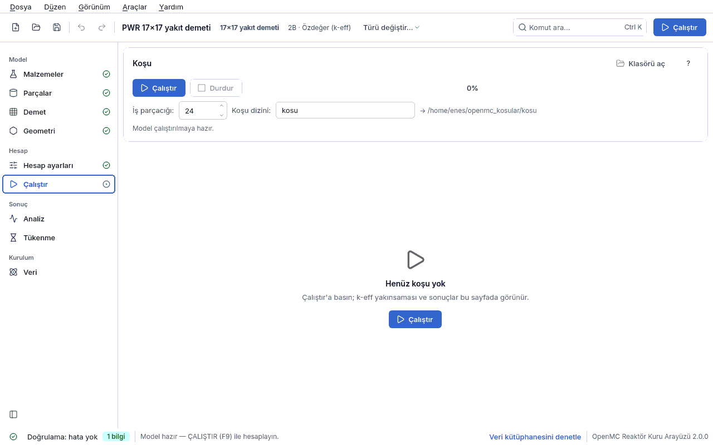

<a id="calistir"></a>
## 4.7 Çalıştır

Bu sayfa modeli OpenMC ile koşturur ve sonucu **aynı sayfada**, yukarıdan aşağıya tek akışta
gösterir: koşu kartı → sonuç panosu (k-eff, Shannon entropisi, süre, hız) → yakınsama
grafikleri → güç haritası (açıksa) → sonuç kartı → uygunluk denetimi → ayrıntılı çıktı.
OpenMC ayrı bir süreç olarak çalışır; koşu boyunca arayüz donmaz. Kısayol: **F9**.



<a id="calistir-kosu"></a>
### Koşu kartı

| Alan | Anlamı | Birim | Tipik aralık | Yaygın yanlış kullanım | Spec anahtarı |
|---|---|---|---|---|---|
| **Çalıştır** / **Durdur** | Koşuyu başlatır / sürmekte olan koşuyu sonlandırır. Durdurulan koşunun sonucu yoktur. Yanındaki ilerleme çubuğu "N / M çevrim" yazar. | — | — | **Çalıştır**'ın neden pasif olduğunu anlamadan modeli değiştirmek: düğmenin altındaki satır nedenini yazar (aşağıya bakın). | — |
| **İş parçacığı** | OpenMP iş parçacığı sayısı (`openmc -s N`). İpucu bu bilgisayardaki mantıksal çekirdek sayısını söyler. | iş parçacığı | 4–24 (varsayılan 8) | Bütün çekirdekleri vermek: arayüz ve önizleme yavaşlar. Farklı iş parçacığı sayısıyla aynı tohumda bile son hanede küçük farklar olabilir (yuvarlama düzeyinde). | `calistirma.is_parcacigi` |
| **Koşu dizini** | Koşu dosyalarının yazılacağı dizin. Göreli yol **kayıtlı projede** proje dosyasının yanına, **kaydedilmemiş** (yeni ya da örnekten açılmış) projede `~/openmc_kosular` altına yazılır; tam yol satırın sağında "→ …" ile görünür. **Her koşuda içi temizlenir.** | — | `kosu` | Başka bir koşunun sonuçlarını sakladığınız dizini vermek (silinir). Örneği kaydetmeden koşup sonucu proje yanında aramak. | `calistirma.dizin` |
| **Klasörü aç** | Son başarılı koşunun dizinini dosya yöneticisinde açar. | — | — | — | — |

Koşu dizininde yan yana şunlar durur: `model.xml`, `spec.json` (koşunun modeli),
`kapsul.json` (tekrarlanabilirlik kapsülü: spec karması, OpenMC ve kütüphane sürümü, tohum,
ortam), `statepoint.*.h5`, `summary.h5` ve `kosu.log` (ham OpenMC çıktısı). Kapsülle yeniden
üretim için [Terminal](08-terminal.md#terminal) bölümündeki `yeniden` komutuna bakın.

<a id="calistir-kapi"></a>
#### Çalıştır neden pasif? — "Önce çiz, sonra çalıştır"

Düğmenin altındaki satır kapının durumunu yazar:

| Satırda yazan | Anlamı | Ne yapmalı |
|---|---|---|
| Doğrulamada N hata var — önce bunları giderin. | Doğrulama panelinde en az bir **hata** var. | Alttaki rozete tıklayın, bulguyu seçin; ilgili sayfa açılır. Bkz. [Sorun giderme](09-sorun-giderme.md#sorun-giderme). |
| Geometri önizlemesi henüz çizilmedi. Önce çiz, sonra çalıştır… | Önizleme bu model için başarıyla üretilmedi. | Bir tasarım sayfasına (ör. Geometri) geçip önizlemenin çizilmesini bekleyin. |
| Çalıştırılabilir. N uyarı var — sonucu etkileyebilir… | Hata yok, uyarı var. | Uyarıları okuyun; çoğu (ör. pasif çevrim az, entropi kapalı) sonucun güvenilirliğini etkiler. |
| Model çalıştırılmaya hazır. | Hata ve uyarı yok. | — |

Bu kapı, elle yazılan betiklerdeki *"çizimler doğruysa `model.run()` satırının yorumunu
kaldır"* alışkanlığının arayüze gömülmüş hâlidir; gerekçesi
[Önce çiz, sonra çalıştır](06-sonuclar.md#once-ciz) bölümündedir. **Çalıştır**'a basınca koşu
dizini temizlenmeden önce doğrulama bir kez daha yapılır; hata varsa koşu başlamaz ve
**önceki sonuç silinmez**.

<a id="calistir-pano"></a>
### Sonuç panosu ve yakınsama grafikleri

| Gösterge | Anlamı | Nasıl okunur |
|---|---|---|
| **k-eff** (ya da **k∞**) | Koşunun çoğaltma katsayısı ± 1σ standart belirsizlik ve bunun pcm (Δk × 10⁵) rozeti. Bütün dış sınırlar yansıtıcıysa etiket **k∞** olur (sızıntı yok). Altında Hesap ayarlarındaki ön ayardan beklenen belirsizlik ("hedef ≈ ±N pcm") yazar; ölçülen σ hedefi aşarsa rozet uyarı rengine döner. | Koşu sürerken değer **kümülatif ortalamadır**. Sabit kaynakta "k-eff tanımsız; sonuç tally'lerdir" yazar. |
| **Shannon entropisi** | Son çevrimin kaynak entropisi [bit] ve yakınsama rozeti: **Yakınsadı**, **Yakınsamadı** ya da **Belirsiz**. Ayrıntılı değerlendirme ipucundadır. | **Yakınsamadı**: pasif dönemin sonunda kaynak hâlâ kayıyor; pasif çevrimi artırın, k-eff yanlı olabilir. Ayrıntı: [kaynak yakınsaması](06-sonuclar.md#kaynak-yakinsamasi). |
| **Süre**, **Hız** | Koşu süresi (dk:sn; etkin + pasif çevrim sayısı) ve parçacık/s (iş parçacığı sayısıyla). | Analiz ve tükenme süre tahminleri bu ölçümden düzelir. |
| **Doğrulama** | Koşu öncesi doğrulama kapısının sonucu: "Hata yok", "N hata" ya da diskten yüklenen koşuda "Diskten yüklendi". | — |
| Yakınsama grafiği | Çevrim çevrim k-eff ve kümülatif ortalama; pasif sınırı işaretlidir. | Aktif çevrimlerde ortalama düz bir banda oturmalı. |
| Entropi grafiği | Çevrim çevrim Shannon entropisi. | Pasif çevrimler içinde düzleşmeli; başta hızla yükselmesi normaldir. |

Sabit kaynak hesabında k-eff ve entropi kartları gösterilmez.

<a id="calistir-sonuc"></a>
### Sonuç kartı

Kritiklik yorumu (`kosucu.keff_yorumu`) şu sözlerle yazılır:

- **Kritik (k = 1'den istatistiksel olarak ayırt edilemez)** — |k − 1| ≤ 2σ.
- **Kritik üstü (k > 1 — güç artar)** / **Kritik altı (k < 1 — güç söner)**.
- **k∞ (sonsuz ortam) — sızıntı yok, kritiklik hükmü verilmez** — bütün dış sınırlar
  yansıtıcıyken; k∞ > 1 reaktörün süperkritik olduğunu değil yakıtın reaktivite fazlası
  taşıdığını söyler.

Altında reaktivite ρ = (k − 1)/k, pcm cinsinden (Δρ × 10⁵) ± belirsizlik yazılır; kinetik
açıksa ayrıca dolar ($ = ρ / β_eff) verilir. **Kayıp parçacık** ve OpenMC uyarıları bu kartta
kalın ve renkli görünür — sessiz kalmaz; kayıp parçacık geometride boşluk ya da örtüşme
demektir (uygunluk kuralı K3). Sabit kaynakta kart tally tablolarını gösterir.

**Referans değerli örneklerde** (`kriter_*`, `godiva_kriter`; `referans.k` ± `sigma`) özet
satırlarının başında karşılaştırma yazar: **referans** E ± σ (deney ya da hesap referansı ve
kaynağı), **C/E** ± σ ve **C − E** pcm cinsinden (Δk × 10⁵) ± birleşik σ ile |C − E| / σ;
projenin ölçütü |C − E| ≤ 3σ'dır ([7.4 V&V](07-uygunluk.md#vv)).

<a id="calistir-guc-haritasi"></a>
### Güç haritası

Yalnızca [Hesap ayarları](04f-hesap-ayarlari.md#ayar-guc) sayfasında güç dağılımı açıksa ve
koşunun sonucu varsa görünür. Kare kafeste ızgara, altıgen kafeste gerçek altıgen yerleşim
çizilir; renk ölçeği ortalamaya göre bağıldır (1.00 = ortalama çubuk). Üstteki özet F_ΔH, F_q
(3B), en sıcak çubuk/demet ve korunum denetimini yazar.

| Alan | Anlamı | Birim | Tipik aralık | Yaygın yanlış kullanım | Spec anahtarı |
|---|---|---|---|---|---|
| **Ölçek** | Tam korda **Demet** (demet ortalamaları) ya da **Çubuk** (kordaki bütün çubuklar). Varsayılan Çubuk: tepe faktörleri çubuk ölçeğindedir. | — | Çubuk | Demet ortalamasındaki tepeyi F_ΔH sanmak. | — |
| **Çubuk türü** | Çok türlü güç dağılımında haritada yalnızca seçili çubuk türünü gösterir; bağıl güç yine **bütün** yakıt çubuklarına göredir. | — | Tüm türler | — | — |
| **Görünüm** | **Çubuk toplam gücü (F_ΔH)** ya da **Tek eksenel dilim (F_q)**; dilim kaydırıcısı 3B modelde eksenel dilimi seçer. | — | — | 2B modelde F_q beklemek. | — |
| **PNG kaydet…** | Haritayı PNG olarak kaydeder. | — | — | — | — |
| **Değerleri haritaya yaz** | Gelişmiş altında: her hücreye bağıl gücü yazar (matplotlib gezinme çubuğu da burada). | — | kapalı (büyük korda okunmaz) | — | — |

Kesik (kırpılan) konumlardaki çubuklar "×" ile işaretlenir ve F_ΔH dışında tutulur. Haritanın
altındaki not hatırlatır: ± değerleri OpenMC'nin raporladığı sapmalardır ve **iyimserdir**;
gerçek belirsizlik için önce entropiyle yakınsamayı doğrulayın, sonra modeli 5–10 farklı
tohumla koşun. Ayrıntı: [güç dağılımını yorumlamak](06-sonuclar.md#guc-dagilimi-yorum) ve
[güç haritası dersi](05-dersler.md#ders-guc).

<a id="calistir-spektrum"></a>
### Spektrum ve dört faktör kartı

Yalnızca koşuda Y3 tally'leri varsa ([Hesap ayarları](04f-hesap-ayarlari.md#ayar-spektrum))
görünür. Üstte **letarji başına akı** (φ·V/Δu, log-log; model geneli ve yakıt; kesikli çizgi
0.625 eV termal kesim), altta tablo: ε, p, f, η, ε·p·f·η, (n,xn) düzeltmesi c_xn, sızmama
olasılığı P_NL, tally'lerden k (sızıntısız modelde **k∞** etiketiyle) ve OpenMC'nin birleşik k
tahmincisi; ardından ρ28, δ25, δ28, C*. Her değer ± 1σ'dır ve altındaki notlar varsayımları
yazar (sızıntısız tanım, korelasyonsuz birinci derece belirsizlik, yakıt ortalaması). Fizik ve
yorum: [5.11 dersi](05-dersler.md#ders-spektrum). Grafik **PNG kaydet** ile kaydedilir.

<a id="calistir-uygunluk"></a>
### Uygunluk kartı

Koşu bitince (ya da kayıtlı bir koşu yüklenince) koşu, seçili **profillerin** kurallarına göre
denetlenir. Her satır kural kimliğini (K1, K2, …), durumu (**kontrolü geçti**, **kontrolü
geçmedi**, **uygulanamadı**, **not**), bulguyu ve öneriyi yazar; kaynak (standart ya da iyi
uygulama atfı), etiket ve profil ipucundadır. Sorunlar listenin başındadır.

| Alan | Anlamı | Birim | Tipik aralık | Yaygın yanlış kullanım | Spec anahtarı |
|---|---|---|---|---|---|
| **A · Monte Carlo iyi uygulaması** | Profil A: kaynak yakınsaması (K1), istatistik yeterliliği (K2), kayıp parçacık (K3). Her koşu için anlamlı. | — | açık (varsayılan) | Bu kuralların standart maddesi olduğunu sanmak: hepsi **iyi uygulama** etiketlidir. | `calistirma.uygunluk_profilleri` |
| **B · Kritiklik güvenliği** | Profil B: kabul koşulu k + 2σ < USL (K6), uygulanabilirlik alanı (K6-AOA), K8–K14. V&V kümesinden yanlılık ve USL gerekir; yoksa "USL hesaplanamadı" yazar. | — | kapalı (kritiklik güvenliği çalışmasında açın) | "USL hesaplanamadı"yı araç hatası sanmak: kümede o uygulama alanı için yeterli bağımsız vaka yoktur. | `calistirma.uygunluk_profilleri` |
| **C · Reaktör kor tasarımı** | Profil C: reaktivite katsayılarının işareti (K7), kapatma marjı (K7-SDM), F_ΔH / F_q sınırları (K7-F), kor yöntem doğrulaması referansı (K16). Sınırlar kullanıcı/tesis girdisidir; verilmezse "karşılaştırılamadı". | — | kapalı | Pozitif MTC'yi hata saymak (SRP'ye göre tek başına hata değildir; **bilgi**). | `calistirma.uygunluk_profilleri` |
| **D · Raporlama** | Profil D: veri izlenebilirliği (K4), belirsizlik ve birim bildirimi (K5). | — | açık (varsayılan) | — | `calistirma.uygunluk_profilleri` |

Profil seçimi projeye kaydedilir; sonuç varken değiştirilirse koşu yeniden denetlenir.
**Bulguya git** (ya da satıra çift tıklamak) bulgunun düzeltileceği sayfayı açar: K1/K2 →
Hesap ayarları, K3 → Geometri, K4 (sıcaklığı tanımsız malzeme) → Malzemeler. Kartın altında
"dürüst çerçeve" metni aynen gösterilir: **denetim kanıt üretir, sertifika vermez.**
Kuralların tamamı, profil seçimi ve "ne kanıtlar, ne kanıtlamaz" için
[Uygunluk ve V&V](07-uygunluk.md#uygunluk-denetimi); kural kural sorun giderme için
[uygunluk kuralları](09-sorun-giderme.md#uygunluk-kurallari).

<a id="calistir-ayrinti"></a>
### Ayrıntılı çıktı ve rapor

**Ayrıntılı çıktı** katlanır bölümü varsayılan olarak kapalıdır; koşu başarısız olursa
kendiliğinden açılır. İçinde ham OpenMC çıktısı (**Kopyala** ile panoya alınır; satır sayısı
başlığın altında yazar) ve tam sonuç metni (statepoint ve bütün tally tabloları) vardır.

Koşunun raporu **Dosya › Rapor oluştur… (Ctrl+R)** ile üretilir (bu oturumdaki son başarılı
koşu kullanılır; yoksa ve proje dizininde kayıtlı bir koşu varsa rapora eklensin mi diye
sorulur; hiç koşu yoksa bildirim "rapor yalnız modeli içerir" der); rapor tekrarlanabilirlik bilgisini ve seçili profillerin uygunluk ekini içerir.
Aynı işin terminal karşılığı:

```bash
openmc-arayuz-kosu rapor kosu/ -o rapor.pdf
```

Adım adım örnek: [rapor ve uygunluk eki dersi](05-dersler.md#ders-rapor).
