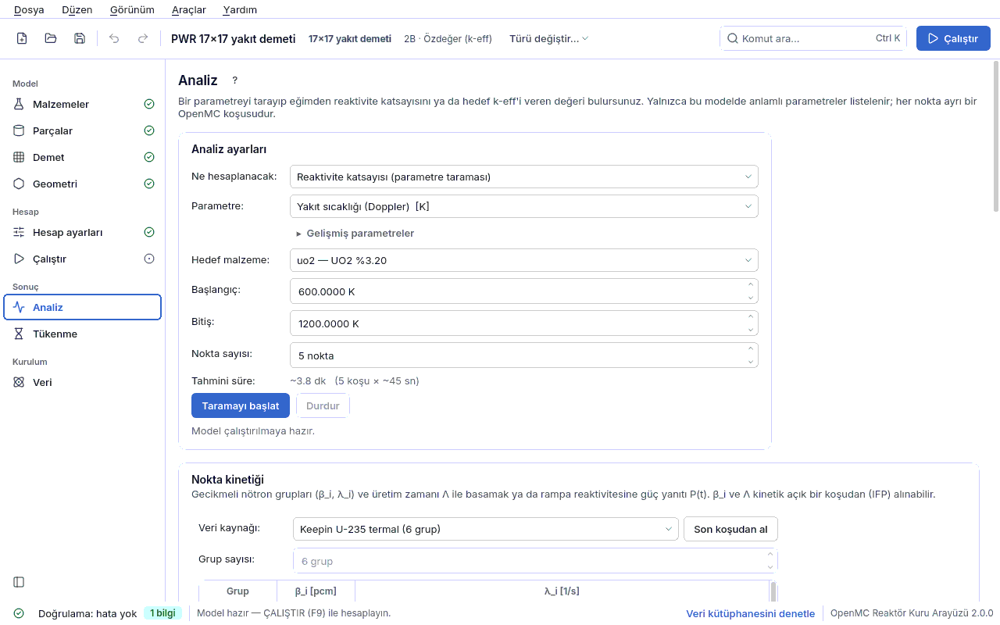

## 4.8 Analiz

Tek bir k-eff sayısı bir tasarım hakkında az şey söyler. **Analiz** sayfası bir parametreyi
değiştirerek iki soruyu yanıtlar:

- **Reaktivite katsayısı (parametre taraması):** parametre bir aralıkta adım adım değişir,
  her noktada k-eff ölçülür ve ρ(p) eğrisinin eğiminden katsayı çıkar (Doppler, moderatör
  sıcaklık, boşluk, bor değeri, çubuk/tambur değeri…).
- **Kritik arama (hedef k-eff'i veren değer):** hedef k-eff'i (çoğunlukla 1) veren parametre
  değeri bulunur (kritik bor, kritik çubuk konumu, kritik tambur açısı…).

Sayfanın altındaki ek kartlar: [Dal tablosu](04h4-dal-tablosu.md#dal) (tükenme sonucunun yanma
adımlarında sabit bileşimle T_yakıt × C_bor × T_mod koşulları),
[Grup sabitleri](04h3-grup-sabitleri.md#mgxs) ve [nokta kinetiği](04h2-kinetik.md).

Her nokta **ayrı bir OpenMC koşusudur**; iş arka planda yürür, arayüz donmaz ve **Durdur**
ile istenildiği an kesilebilir. Noktalar modelin [Hesap ayarları](04f-hesap-ayarlari.md#hesap-ayarlari)
sayfasındaki parçacık/çevrim değerleriyle koşulur. Analiz ayarları spec'e **yazılmaz**;
proje kaydedilince kaybolmaz ama modelin bir parçası da sayılmaz. Sayfa yalnızca özdeğer
hesabında ve geometride fisil malzeme varken görünür.

### Analiz ayarları kartı

| Alan | Anlamı | Birim | Tipik aralık | Yaygın yanlış kullanım | Spec anahtarı |
|---|---|---|---|---|---|
| **Ne hesaplanacak** | **Reaktivite katsayısı (parametre taraması)** ya da **Kritik arama (hedef k-eff'i veren değer)**. Kritik aramada yalnızca denetim parametreleri sunulur (`uygunluk.KRITIK_PARAMETRELER`). | — | — | Bir katsayıyı kritik aramayla bulmaya çalışmak (kritik arama eğim vermez, kök verir). | (spec'e yazılmaz) |
| **Parametre** | Değişecek büyüklük; listede yalnızca **bu modelde modeli gerçekten değiştiren** parametreler bulunur (aşağıdaki tablo). Birimi adın yanında köşeli parantezdedir. | — | — | Listede olmayan bir taramayı elle dosyada istemek: arayüzün sunmadığı tarama modeli değiştirmez ve "katsayı = 0 ± gürültü" verirdi — bu yüzden sunulmaz. | tarama türü (ör. `yakit_sicaklik`) |
| **Gelişmiş parametreler** | Açılınca listeye tasarım etütleri de eklenir: `kafes_adim`, `kor_adim`, `cubuk_yaricap`, `malzeme_yogunluk`. | — | kapalı | — | — |
| **Hedef malzeme** / **Hedef demet** / **Kontrol çubuğu** / **Hedef bölge** / **Hedef** | Parametrenin uygulanacağı nesne; etiket parametreye göre değişir (malzeme, demet, kontrol çubuğu, çubuk bölgesi). Kor ayarı olan parametrelerde (ör. tambur dönmesi) hedef seçimi yoktur ve satır gizlenir. Hedef değişince aralık o hedefin **mevcut** değerinden yeniden önerilir. | — | — | Bor taramasında boru suyu değil zarf malzemesini aramak: bor yalnızca hafif (borlu) su malzemelerine sunulur. | — |
| **Başlangıç** / **Bitiş** (kritik aramada **Alt sınır** / **Üst sınır**) | Taranan aralığın uçları; kritik aramada kökün aranacağı parantez. Birim parametrenin birimidir (K, ppm, %, °, cm, g/cm³). | parametre birimi | varsayılanlar: yakıt sıcaklığı 600–1200 K, soğutucu ±40 K (su tablosu 280–620 K içinde), void %0–50, bor 0–2000 ppm, zenginlik %2–5, çubuk %0–100, tambur 0–180° | Kritik aramada kökü içermeyen bir parantez vermek: arama **yapılmaz** ve aralığı genişletmeniz söylenir — ekstrapolasyon yapılmaz. Su için S(α,β) 284–800 K dışına çıkan sıcaklık aralığı (koşu ortasında patlar). | — |
| **Nokta sayısı** | Taramadaki nokta (koşu) sayısı; yalnızca taramada görünür. | nokta | 5 (2–50) | 2–3 nokta ile eğrisel bir ilişkiden (çubuk S eğrisi) tek eğim çıkarmak. | — |
| **Hedef k-eff** | Kritik aramanın hedefi; yalnızca kritik aramada görünür. | — | 1.0 (alt-kritik tasarım için ör. 0.95) | — | — |
| **Tahmini süre** | Başlamadan önceki süre tahmini: "~toplam (N koşu × ~tek koşu)". Tek koşu süresi ölçülen hızdan (parçacık/s) gelir ve ilk nokta bitince gerçek ölçüme göre düzelir. Kritik arama genellikle 4–8 koşu sürer. | s | — | Hassas ön ayarla 10 noktalık tarama başlatıp süreye şaşırmak. | — |

### Parametreler (tarama türleri)

Tanımlar `cekirdek/tarama.py` (`TURLER`) içindedir; hangisinin sunulacağına
`uygunluk.gecerli_taramalar` ve `uygunluk.gecerli_hedefler` karar verir.

| Tarama türü | Ne değişir | Hedef | Birim → katsayı birimi | Ne zaman sunulur |
|---|---|---|---|---|
| `yakit_sicaklik` | Yakıt sıcaklığı (Doppler); yoğunluk sabit (katı yakıt). | yakıt malzemesi | K → pcm/K | yakıt rolündeki malzemeler |
| `sogutucu_sicaklik` | Soğutucu sıcaklığı **ve** yoğunluğu birlikte (su: doymuş sıvı tablosu; LBE: Sobolev; Na: Fink & Leibowitz). Moderatör sıcaklık katsayısını verir. | soğutucu | K → pcm/K | korelasyonu olan soğutucular (ağır su sunulmaz: hafif su tablosuna düşerdi) |
| `void_orani` | Soğutucu yoğunluğu ρ₀·(1 − α). | soğutucu | % → pcm/%void | korelasyonu olan sıvı soğutucular |
| `bor_ppm` | Suda çözünmüş doğal bor (kütlece ppm). | hafif su | ppm → pcm/ppm | yalnızca hafif (borlu) su |
| `zenginlik` | U-235'in ağırlıkça yüzdesi. | uranyum içeren malzeme | % → pcm/% | bileşiminde zenginlikli U elementi olan malzemeler (açık izotoplarla yazılmış yakıtta sunulmaz) |
| `cubuk_daldirma` | Kontrol çubuğu daldırma oranı (%0 çekilmiş, %100 tam dalmış). | kontrol çubuğu | % → pcm/% | yalnızca 3B modelde, geometride kontrol çubuğu varken |
| `tambur_donme` | Kontrol tamburu dönmesi (0° emici kora bakar, en düşük k; 180° dışa bakar, en yüksek k). | kor | derece → pcm/derece | tamburlu korda tambur sayısı > 0 iken (gelişmiş geometride tek dönme grubu varsa onun takma adıdır) |
| `yansitici_kalinlik` | Yansıtıcı kuşağın radyal kalınlığı. | kor | cm → pcm/cm | yansıtıcı kuruluyken ve malzemesi boşluk değilken |
| `grup_donme` | Bir dönme grubunun değeri (tamburlar). | grup | derece → pcm/derece | gelişmiş geometride dönme grubu varsa |
| `grup_daldirma` | Bir daldırma grubunun (kontrol çubuğu bankası) değeri. | grup | % → pcm/% | gelişmiş geometride, 3B modelde daldırma grubu varsa |
| `kafes_adim` | Demetteki çubuk adımı (moderasyon oranı etüdü). | demet | cm → pcm/cm | Gelişmiş; geometride kullanılan demetler |
| `kor_adim` | Pin hücrede hücre adımı, kare tam korda demet adımı. | kor | cm → pcm/cm | Gelişmiş; kor türünde `adim` alanı varsa |
| `cubuk_yaricap` | Çubuğun seçilen bölgesinin dış yarıçapı (aralık komşu bölgelerle çakışmayacak biçimde önerilir). | çubuk bölgesi | cm → pcm/cm | Gelişmiş; geometrideki çubukların en dış bölgesi dışındaki bölgeleri |
| `malzeme_yogunluk` | Seçilen malzemenin yoğunluğu. | malzeme | g/cm³ → pcm/(g/cm³) | Gelişmiş; yoğunluğu g/cm³ verilmiş malzemeler (atom/b-cm verilmişse sunulmaz) |

Kritik aramada sunulan denetim parametreleri (`uygunluk.KRITIK_PARAMETRELER`): `bor_ppm`,
`cubuk_daldirma`, `tambur_donme`, `zenginlik`, `yansitici_kalinlik`, `grup_donme`,
`grup_daldirma`.

> ⚠ **Sıcaklık ve yoğunluk birlikte değişir.** Soğutucu ısınınca yoğunluğu düşer; yalnızca
> sıcaklığı değiştirirseniz etkinin en büyük parçasını kaçırırsınız. `sogutucu_sicaklik`
> yoğunluğu korelasyonla günceller; korelasyonu bilinmeyen malzemede yoğunluk sabit tutulur ve
> bu sonuçta **açıkça yazılır**.

### Parametre taraması: sonucu okumak

Bütün noktalar **aynı rastgele tohumla** koşulur: istatistik dalgalanmalar farkta kısmen
birbirini götürür (ilintili örneklem) ve katsayı daha az gürültülü çıkar. Raporlanan
belirsizlik noktaları bağımsız saydığı için **muhafazakârdır**. Sonuç kartında k(p) grafiği,
nokta tablosu (Değer, k-eff, ±, ρ [pcm]; ρ = (k − 1)/k, pcm = Δρ × 10⁵) ve eğimden çıkan
katsayı ± belirsizlik ile kısa bir fizik yorumu (ör. "Doppler katsayısı. Negatif olması
beklenir…") yazılır. Eğim 2σ içinde sıfırdan ayırt edilemiyorsa bu açıkça söylenir: daha çok
parçacık/çevrim ya da daha geniş aralık gerekir.

Ölçülen örnekler (`ornekler/pwr_17x17.json`, README):

| Tarama | Katsayı |
|---|---|
| Yakıt sıcaklığı 600 → 1200 K | Doppler −1.98 ± 0.17 pcm/K |
| Soğutucu sıcaklığı 540 → 620 K, 0 ppm bor | Moderatör sıcaklık −35.2 ± 1.0 pcm/K |
| Soğutucu sıcaklığı, 1300 ppm bor | Moderatör sıcaklık −2.6 ± 1.2 pcm/K |
| Bor 0 → 8000 ppm | Bor değeri −7.0 pcm/ppm |

İki MTC arasındaki fark gerçek fiziktir: bor suda çözünmüştür, yoğunluk düşünce soğurucu da
azalır ve iki etki birbirini götürür.

> ⚠ **Çubuk değeri eğrisinin şekli.** Klasik S eğrisi yalnızca sistem her konumda kritiğe
> yakınsa görülür. `ornekler/pwr_kontrol.json` yansıtıcı yan sınırlı tek bir demettir; değer
> geç toplanır ve diferansiyel değer tepesi tam daldırmaya yakın çıkar (ölçülen, örneğin kendi ayarı
> 8000 × 90 / 30 pasif, tohum 1, 01.10.2026: %0 → k = 1.18186 ± 0.00150, %50 → 1.16626 ± 0.00136,
> %100 → 0.59146 ± 0.00122). Eksenel uçlar vakum olduğu için bunlar k∞ değil k-eff'tir; çubuk
> modelinin basitleştirmeleri (zarfsız B4C, 25 konum tek grup, keskin uç) örneğin açıklamasında.

### Kritik arama: yöntem ve durma ölçütü

- **Yöntem:** parantez korumalı yanlış konum (regula falsi) + ikiye bölme. İlk iki nokta aralık
  uçlarıdır ve kökün aralarında olduğu doğrulanır; kiriş tahmini parantez dışına düşerse ya da
  daha önce ölçülen bir noktaya denk gelirse ikiye bölmeye geçilir. En çok 15 yineleme yapılır.
- **Durma ölçütü:** |k − hedef| ≤ 2σ. Sonuç kartı da bir sonucu |k − 1| ≤ 2σ iken "Kritik"
  sayar; iki yer aynı tanımı kullanır.
- **Kökün belirsizliği:** yerel eğimden δx = σ_k / |dk/dx| olarak tahmin edilir ve sonuçla
  birlikte yazılır ("Çözüm: … = x ± δx"). Parantez bu belirsizliğin altına inince daha fazla
  yineleme bilgi katmaz; arama durur ve bunu söyler. Daha dar bir cevap için çözüm daha çok
  yineleme değil, nokta başına **daha çok parçacıktır**.
- **Ekstrapolasyon yapılmaz:** hedef aralığın dışındaysa arama başlamaz; aralığı genişletin.

Ölçülen örnekler (README): 17×17 demet için kritik bor **3430 ppm** (7 koşu);
`ornekler/pwr_kontrol.json` kritik çubuk konumu **%87.85 ± 0.09** (13 koşu);
`ornekler/tamburlu_kor.json` kritik tambur konumu **122.46° ± 3.68** (4 koşu). Adım adım
örnek: [kritik arama dersi](05-dersler.md#ders-kritik-arama).

Analiz sırasında proje değişirse (başka bir model açılırsa) süren işin sonucu yeni projeye
yazılmaz; düğmenin altındaki satır bunu söyler.
