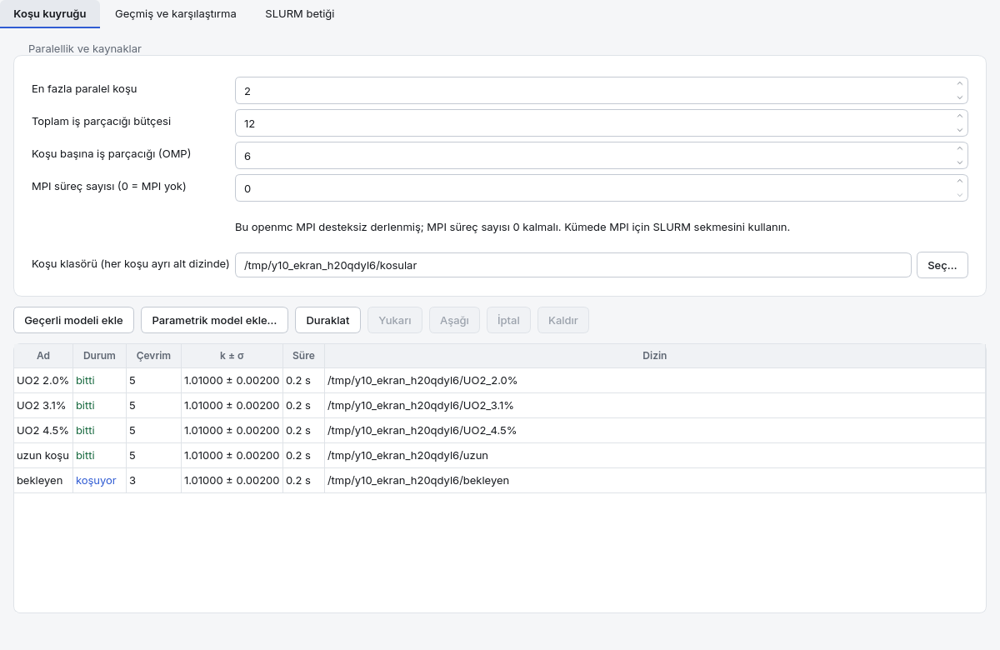
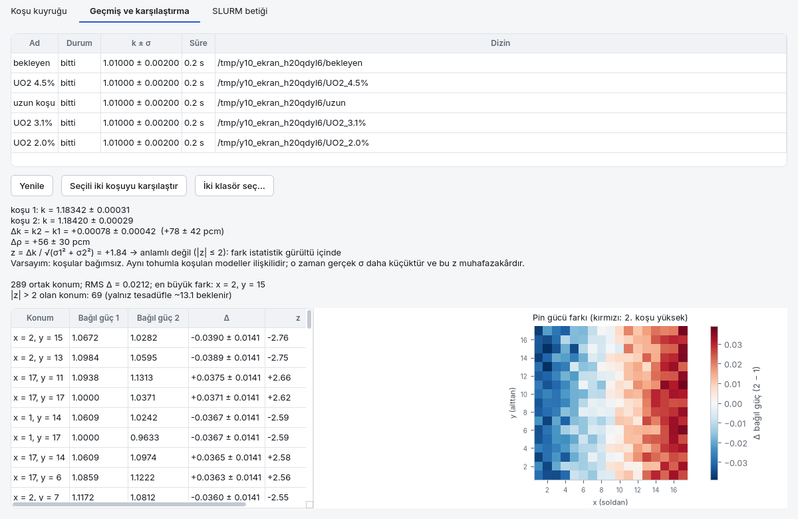
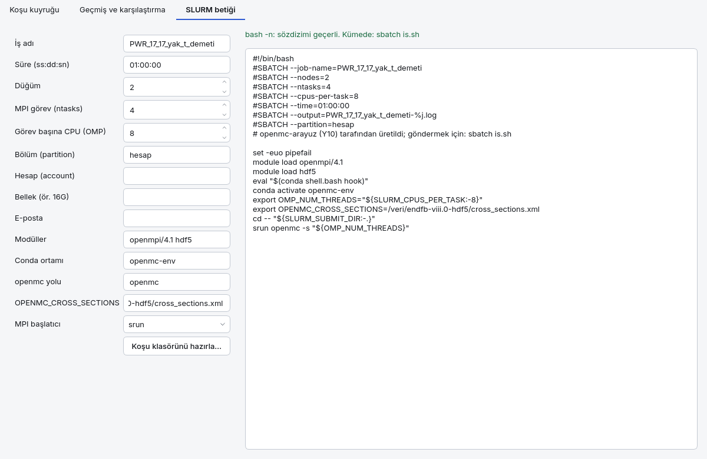

<a id="is-akisi"></a>
## 4.10 İş akışı: kuyruk, geçmiş, karşılaştırma, SLURM

**İş akışı** penceresi birden çok koşuyu tek seferde yönetir: koşuları bir **kuyruğa** dizer,
sırayla ya da sınırlı paralel çalıştırır, biten her koşuyu **koşu geçmişine** yazar, iki
koşunun k-eff ve pin gücü farkını istatistik anlamlılığıyla gösterir ve modeli bir hesaplama
kümesine (HPC) götürmek için **SLURM betiği** üretir. Pencere üç sekmedir: **Koşu kuyruğu**,
**Geçmiş ve karşılaştırma**, **SLURM betiği**. Ana pencerede **Araçlar → İş akışı…** ile açılır
(geçerli model kuyruğa ve SLURM formuna gelir); tek başına
`python -m arayuz.kuyruk model.json` ile de açılabilir.

Her koşu kendi **koşu dizininde** çalışır (`model.xml`, `spec.json`, `kapsul.json`,
`statepoint.*.h5`, `kosu.log` yan yana — Çalıştır sekmesindeki düzenle aynı); iki bitmemiş koşu
aynı dizini paylaşamaz.

<a id="is-akisi-kuyruk"></a>
### Koşu kuyruğu



- **En fazla paralel koşu** — aynı anda kaç koşu çalışır; 1 tam sıralı kuyruktur.
- **Toplam iş parçacığı bütçesi** — eşzamanlı koşuların iş parçacığı toplamı bunu aşmaz
  (varsayılan: işlemci çekirdek sayısı). Kuyruk sırası kesindir: sıradaki koşu bütçeye
  sığmıyorsa arkasındaki küçük koşu öne geçmez.
- **Koşu başına iş parçacığı (OMP)** — `OMP_NUM_THREADS` ve `openmc -s` değeri.
- **MPI süreç sayısı** — 0 MPI'sız koşudur; 2 ve üstü `mpiexec -n N openmc` ile başlar ve
  bütçeden N × iş parçacığı düşer. `mpiexec` önce `OPENMC_ARAYUZ_MPIEXEC` (mutlak yol), sonra
  Python'un yanındaki `bin/`, sonra `PATH`'in yalnız mutlak öğelerinde aranır. openmc MPI
  desteksiz derlenmişse (`openmc --version` → `MPI enabled: no`) koşu açık bir hatayla durur,
  sessizce tek süreçte koşmaz.
- **Koşu klasörü** — her koşu bunun altında modelin adından türetilmiş ayrı bir alt dizinde.

Düğmeler: **Geçerli modeli ekle** (ana penceredeki model; koşu başlamadan önce doğrulama
kapısından geçer), **Parametrik model ekle…** (aşağıda), **Başlat / Duraklat** (duraklatınca
koşanlar sürer, yenisi başlamaz), **Yukarı / Aşağı** (sıra), **İptal** (bekleyeni hemen,
koşanı SIGTERM ile sonlandırır), **Kaldır**. Tabloda durum (bekliyor, koşuyor, bitti,
başarısız, iptal), çevrim, kümülatif k ± σ ve süre canlı güncellenir.

<a id="is-akisi-gecmis"></a>
### Geçmiş ve karşılaştırma

Biten, başarısız ya da iptal edilen her kuyruk koşusu — ve Çalıştır sekmesinin tek koşuları —
`~/.local/share/openmc_arayuz/kosu_gecmisi.sqlite3` dosyasına yazılır (her yazma tek bir SQLite işlemidir; yarım kayıt
kalmaz). Geçmiş satırı koşu dizinini silmez; dizin yerinde kalır.



İki satır seçip **Seçili iki koşuyu karşılaştır**'a basın (ya da **İki klasör seç…** ile
herhangi iki koşu dizini). Daha eski koşu 1, yeni koşu 2'dir.

- **k farkı:** Δk = k₂ − k₁, σ = √(σ₁² + σ₂²), **z = Δk / σ**. |z| > 2 ise fark
  istatistiksel olarak anlamlıdır (~%95; projenin 2σ yöntemi). Δρ = (1/k₁ − 1/k₂)·10⁵ pcm.
  Varsayım iki koşunun bağımsız olmasıdır; aynı tohumla koşulan modeller ilişkilidir, o zaman
  gerçek σ daha küçüktür ve gösterilen z **muhafazakârdır**.
- **Pin gücü farkı:** iki koşuda da güç dağılımı açıksa ortak her konumda bağıl güç farkı,
  σ'sı ve z'si; tablo |z|'ye göre sıralıdır, kare kafeste fark haritası çizilir (kırmızı: 2.
  koşu yüksek, mavi: düşük). N pinde |z| > 2 olan konum yalnız tesadüfle ~%4.6·N beklenir;
  pencere bu sayıyı yanında yazar — tek bir "anlamlı" pin bir farkın kanıtı değildir.

<a id="is-akisi-parametrik"></a>
### Parametrik model

Parametrik model bir taban spec'e uygulanan **adlı değişkenler** ve onların **tarama**
değerleridir. Değişken türleri Analiz sekmesindeki tarama türleriyle aynıdır (yakıt sıcaklığı,
soğutucu sıcaklığı — yoğunluk korelasyonuyla —, bor, zenginlik, demet adımı, grup dönmesi …);
ek olarak `yol` türü spec'teki herhangi bir **sayısal** alanı noktalı yolla değiştirir
(`ayarlar.parcacik`, `ayarlar.entropi_mesh.boyut.0`). Tarama `kartezyen` (bütün bileşimler)
ya da `esli` (aynı uzunlukta listeler, sıra sıra) olur. Dosya JSON'dur ve gidiş-dönüşte
değişmez:

```json
{
  "bicim": "openmc-arayuz-parametrik", "surum": 1, "ad": "zenginlik-parcacik",
  "degiskenler": [
    {"ad": "zen", "tur": "zenginlik", "hedef": "uo2", "deger": null, "birim": "%"},
    {"ad": "n", "tur": "yol", "hedef": "ayarlar.parcacik", "deger": 5000, "birim": ""}
  ],
  "tarama": {"bicim": "kartezyen", "degerler": {"zen": [2.0, 3.1, 4.5], "n": [5000]}},
  "taban": { "...": "model spec'i" }
}
```

`deger: null` taramada olmayan noktalarda taban değerinin korunduğu anlamına gelir.
**Parametrik model ekle…** her noktayı `nokta_000`, `nokta_001` … dizinlerinde kuyruğa ekler.
Python'dan: `parametre.kuyruga_ekle(model, kuyruk, kok_dizin)`; mevcut tek değişkenli bir
tarama `tarama.parametrik_model(spec, tur, hedef, degerler)` ile parametrik modele çevrilir.

<a id="is-akisi-slurm"></a>
### SLURM betiği



Form `sbatch` betiğini üretir: iş adı, süre (`ss:dd:sn`), düğüm, MPI görev sayısı (`ntasks`),
görev başına CPU (OMP iş parçacığı), bölüm (`partition`), hesap, bellek, e-posta, `module load`
modülleri, conda ortamı, kümedeki openmc yolu ve `OPENMC_CROSS_SECTIONS`. Görev sayısı 1'den
büyükse komut `srun openmc -s …` (ya da `mpiexec`) olur; openmc kümede MPI ile derlenmiş
olmalıdır. Önizleme her değişiklikte `bash -n` ile denetlenir. **Koşu klasörünü hazırla…**
seçilen klasöre `model.xml`, `spec.json` ve `is.sh` yazar; klasörü kümeye kopyalayıp
`sbatch is.sh` ile gönderin. Betik bu makinede çalıştırılmaz.

Güvenlik: `#SBATCH` satırlarını kabuk değil `sbatch` okur ve tırnak kaçışı yoktur; bu yüzden
o alanlar katı desenle denetlenir, boşluk, yeni satır ya da kabuk karakteri içeren değer
**reddedilir** (alan kırmızı hata verir). Klasör yolu, openmc yolu ve ortam değişkeni değerleri
tek tırnakla kaçışlanır: `$(…)`, `` `…` `` ve `;` kabukta yorumlanmaz.

<a id="ders-is-akisi"></a>
### Ders: zenginlik taraması kuyrukla ve iki koşunun karşılaştırılması

Amaç: PWR pin hücresinde üç zenginliği kuyrukla sırayla koşmak, ardından aynı modelin iki
farklı tohumla koşusunu karşılaştırıp "fark gürültü mü?" sorusunu z ile yanıtlamak.

1. `ornekler/pwr_pinhucre.json`'u açın; Hesap ayarlarında parçacığı 2000, çevrimi 60, pasifi
   20 yapın (ders süresi kısa kalsın).
2. İş akışı penceresinde **En fazla paralel koşu** 1, **Koşu başına iş parçacığı** 6.
3. Parametrik dosyayı (yukarıdaki biçim; değişken `zen`, tür `zenginlik`, hedef `uo2`,
   değerler `[2.0, 3.1, 4.5]`) kaydedip **Parametrik model ekle…** ile yükleyin; üç satır
   görünür. **Başlat**'a basın: koşular sırayla biter, k zenginlikle artar.
4. Ana pencerede tohumu 1 → 2 yapıp **Geçerli modeli ekle** ile aynı modeli bir kez daha
   koşun (zenginlik 3.1, tohum 2).
5. **Geçmiş ve karşılaştırma**'da `zen=3.1` koşusunu ve tohum 2 koşusunu seçip
   karşılaştırın. Beklenen: |z| çoğunlukla 2'nin altında — fizik aynı, fark istatistiktir.
   Zenginliği 3.1 ile 4.5 olan iki koşuyu karşılaştırınca |z| çok büyüktür: fark gerçektir.

Sonuç bir sertifika değildir; anlamlılık yalnız istatistik belirsizliği kapsar, nükleer veri
ve modelleme belirsizliğini içermez.
