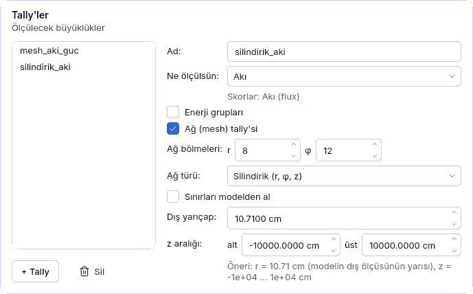

<a id="mesh-tally"></a>
## 4.10 Ağ (mesh) tally'si ve VTK

Ağ tally'si bir büyüklüğü (akı, fisyon, ısınma, soğurma …) modelin geometrisinden bağımsız bir
ağın hücrelerine böler: pin pin güç haritası, radyal akı profili, zırhta doz haritası. Ağ,
[Hesap ayarları](04f-hesap-ayarlari.md#ayar-tally) sayfasındaki **Tally'ler** kartında bir
tally'ye eklenir; sonuç [Çalıştır](04g-calistir.md#calistir) sayfasında **Ağ (mesh) haritası**
kartında 2B dilim olarak görünür ve ParaView için **VTK** dosyasına aktarılır. Hesap
`cekirdek/mesh_tally/` paketindedir; arayüzün kurduğu model ile **Betik** olarak dışa aktarılan
Python betiği aynı ağı kurar (aynı tanım işlevi; `testler/test_y1_mesh_tanim.py`).

Örnek: `ornekler/pwr_mesh_aki.json` (17 × 17 düzenli ağda iki grup akı ve kappa-fission,
8 × 12 silindirik ağda akı). Adım adım kullanım: [5.13 Ders](05c-ders-mesh.md#ders-mesh).



<a id="mesh-form"></a>
### Tally formundaki ağ alanları

| Alan | Anlamı | Birim | Tipik aralık | Yaygın yanlış kullanım | Spec anahtarı |
|---|---|---|---|---|---|
| **Ağ (mesh) tally'si** | Tally'ye ağ filtresi ekler (kapatınca filtre silinir). | — | kapalı | Çok ince ağ: hücre başına geçmiş azalır, bağıl hata büyür (bkz. haritadaki × işareti). | `tallyler[].filtreler[]` (`tur`: `mesh`) |
| **Ağ türü** | **Düzenli (x, y, z)** `RegularMesh`, **Silindirik (r, φ, z)** `CylindricalMesh`, **Küresel (r, θ, φ)** `SphericalMesh`. Altıgen ağ kapsam dışıdır: kurulu OpenMC 0.16.0'da `HexagonalMesh` sınıfı yoktur; altıgen demette düzenli ya da silindirik ağ kullanın. | — | düzenli | Kare demette silindirik ağ: köşeler ağın dışında kalır (öneri r = dış ölçünün yarısı). | `mesh_turu` (`duzenli` \| `silindirik` \| `kuresel`; yoksa düzenli) |
| **Ağ bölmeleri** | Üç eksenin bölme sayısı; etiketler türe göre değişir: x, y, z / r, φ, z / r, θ, φ. Silindirik ve düzenli ağda z bölmesi yalnız 3B modelde ve kürede görünür. Izgaralar eşit aralıklıdır (φ 0–2π, θ 0–π). | bölme | 17 × 17 × 1 (pin başına), r 5–20 | 2B modelde z bölmesi beklemek (2B'de ağ tek dilimdir). | `boyut` |
| **Sınırları modelden al** | Açıkken sınırlar model **kurulurken** modelin sınır kutusundan türetilir (`otomatik`); yansıtıcı eklenirse ağ da büyür. Kapatınca o anki öneri açık sınır olarak yazılır ve düzenlenebilir. | — | açık | Sınırları elle küçük girip sonra modeli büyütmek. | `otomatik` |
| **Alt sınır** / **Üst sınır** | Düzenli ağın köşeleri (x, y, z). | cm | sınır kutusu | Alt ≥ üst: "ağ alt sınırı her eksende üst sınırdan küçük olmalı". | `alt`, `ust` |
| **Dış yarıçap** | Silindirik ve küresel ağın dış yarıçapı (iç yarıçap 0). | cm | dış ölçünün yarısı | 0 ya da negatif: "ağ dış yarıçapı sıfırdan büyük olmalı". | `r_ust` |
| **z aralığı** | Silindirik ağın eksenel sınırları (alt, üst). | cm | kor yüksekliği | Alt ≥ üst. | `z_alt`, `z_ust` |
| **Grup yapısı** | Enerji grubu açıkken hazır grup sınırları: **Elle**, CASMO-2/4/8/16/25/40/70, XMAS-172, SHEM-361. Sınırlar OpenMC'den (`openmc.mgxs.GROUP_STRUCTURES`) alınır ve **Grup sınırları [eV]** kutusuna yazılır; kutu elle değişirse **Elle** görünür. | — | CASMO-2 (0.625 eV) | 172 grupta 17 × 17 ağ: 49 708 bin, her bine düşen geçmiş çok azalır. | `tallyler[].filtreler[].gruplar` |

Ağın merkezi `merkez` [x, y, z] (yalnız JSON'dan; varsayılan 0, 0, 0) silindirik ve küresel ağı
kaydırır; form bu alanı korur. Otomatik öneri:

* **x, y**: modelin sınır kutusu (yansıtıcı dahil).
* **z**: 3B modelde kor yüksekliği, kürede küre çapı. **2B modelde** (eksenel yönde sonsuz,
  z sınırsız) ±10⁴ cm (`Z_2B_YARI`): ağ bütün z kolonunu kapsar ve değer **z üzerinden
  integraldir** (kaynağın z'deki kaymasından bağımsız). v2'de ±1 cm idi; 2 cm'lik dilim iz
  uzunluğunun küçük bir kesrini sayıyordu. Ölçüldü (`pwr_mesh_aki`, 5000 parçacık × 40 aktif
  çevrim): kappa-fission bağıl hata medyanı ±1 cm'de %21, ±10⁴ cm'de %2.7. Bu yüzden 2B'de
  **hacim başına değerin mutlak anlamı yoktur** (ağın keyfi yüksekliğine bölünmüş olurdu):
  2B'de **Hacim başına** kipi hücre **alanına** böler (z integrali / cm²), mutlak kip çizgisel
  güç [W/cm] ister; bağıl haritada fark yoktur. Geometri spec'te yüksekliği olmadığı hâlde z'de
  sınırlıysa ağ bu sınırlara kırpılır (±10⁴ cm yalnız gerçekten sınırsız modelde).
* **r**: silindirik ve küresel ağda sınır kutusunun büyük kenarının yarısı. Yuvarlak modelde
  tam; **kare ya da altıgen** modelde köşeler ağın **dışında kalır** (kare demette alanın
  %21.5'i, 1 − π/4).

**v2 projeleri:** `mesh_turu` alanı olmayan, `otomatik: true` 2B ağ tally'leri artık
±10⁴ cm ile kurulur (v2.0 betiği ±1 cm yazıyordu; `testler/veri/y1_v2_mesh_betik.txt`).
Kaynak nötronu başına ham değerler ve z dilimleri değişir; bağıl harita aynı fiziği verir.
Ayrıntı: [CHANGELOG](../../../CHANGELOG.md).

Skorlar formdaki **Skorlar** listesinden seçilir: akı (`flux`), fisyon, soğurma, `heating`,
`heating-local` (yerel ısınma), `kappa-fission`, `fission-q-recoverable` …

<a id="mesh-harita"></a>
### Çalıştır sayfasında Ağ (mesh) haritası

Koşu bitince (ya da kayıtlı bir koşu dizini yüklenince) statepoint'teki ağ tally'leri okunur.
Bir ağ filtresi ve isteğe bağlı bir enerji filtresi dışında filtresi olan tally haritada
gösterilmez (uyarı satırı nedenini yazar). Kart ağ tally'si yoksa görünmez.


| Denetim | Anlamı |
|---|---|
| **Tally**, **Skor**, **Enerji grubu** | Gösterilen dizi. Enerji grubu **Toplam (bütün gruplar)** ya da tek grup; toplamda σ'lar bağımsız varsayılır (σ² toplanır) — gruplar pozitif ilişkili olduğundan bu **iyimser bir tahmindir**; kesin σ için enerji filtresiz ayrı bir tally tanımlayın. |
| **Dilim ekseni** ve kaydırıcı | Sabit tutulan eksen ve dilim numarası; etiket dilimin aralığını yazar. Silindirik ağda "z sabit" (r, φ) düzlemini kartezyen gösterir, "φ sabit" r–z kesitidir; küresel ağda "φ sabit" meridyen düzlemidir (ρ, z). |
| **Normalizasyon** | **Kaynak nötronu başına** (ham OpenMC değeri; sabit kaynakta OpenMC toplam kaynak şiddetiyle çarpar — ölçüldü: şiddet 1 → 30.48, şiddet 1000 → 30 478), **Hacim başına (/cm³)** (2B'de alan başına, z integrali), **Ortalamaya bağıl (1 = ortalama)** (hacim ağırlıklı ortalama: Σ değer / Σ hacim, skorlu hücreler), **Mutlak (toplam güçten)**. |
| **Toplam güç** / **Çizgisel güç** | Mutlak normalizasyonun gücü. 3B'de **Toplam güç** [W]: modelin kapsadığı bölgenin gücü, güç dağılımı **Toplam güç** değeriyle açılır (`guc.py` ile aynı tanım). 2B'de **Çizgisel güç** [W/cm]: aktif yükseklik biliniyorsa toplam güç / aktif yükseklik, bilinmiyorsa **boş** açılır ve siz girersiniz (ör. 17.6 MW / 366 cm = 48.1 kW/cm). |
| **Gösterim** | **Değer**, **Standart sapma (σ)**, **Bağıl hata (σ / değer)**. |
| **Güvenilmez hücreleri işaretle** | Bağıl hatası **Eşik**'i aşan ya da hiç skor almamış hücreler × ile işaretlenir; skorsuz hücre renk ölçeğine girmez (boş). |
| **Eşik** | Varsayılan %10 — **kaba yönerge (MCNP, tek tally için)**: MCNP5 kılavuzu (LA-UR-03-1987, Bölüm 2, "relative error R" yorum tablosu) R < 0.10'u "genellikle güvenilir" sayar (nokta dedektörleri hariç). Pin gücü haritasında hedef **%1–2**'dir. ± değerleri OpenMC'nin çevrimler arası korelasyonu hesaba katmayan, **iyimser** sapmalarıdır. |
| **VTK dışa aktar…** | Seçili tally'yi seçili normalizasyonla `.vtk` dosyasına yazar: her skor (çok nüklidli tally'de her nüklid: `<skor>_<nüklid>`) ve grup için `<skor>_g<n>` (+ `_toplam`), `_sigma` ve `_bagil_hata` alanları; skorsuz hücrenin bağıl hatası **−1**. Uzantısız ada `.vtk` eklenir; dosya varsa üzerine yazma sorulur; yazma atomiktir (yarım dosya kalmaz). |

**Mutlak normalizasyon** yalnız özdeğer hesabında anlamlıdır: kaynak hızı S = P / (H · e),
e = 1.602176634 × 10⁻¹⁹ J/eV (CODATA 2018, kesin). **H**, model kurulurken eklenen **filtresiz
genel ısınma tally'sinden** (`mesh_genel_isi`: `kappa-fission`, `heating-local`) okunur — ağ
fisil bölgeyi kapsamasa da S doğru çıkar (kare demette silindirik ağ ısınmanın yalnız ~%78'ini
görür; ağ içi toplam kullanılsaydı mutlak değerler ~%28 şişerdi). Isınma skoru gösteriliyorsa
H aynı skordur; akı ve tepkime için `heating-local` (yakalanma gamaları dahil; foton taşınımı
kapalıyken yerel bırakım). `kappa-fission` yakalanma gamalarını içermez: aynı güçle akı ve
tepkime ~%3–4 yüksek çıkar. `fission-q-prompt` H olarak kullanılmaz (gecikmiş enerji yok,
~%7 düşük). 3B'de değer · S / V (akı n/cm²·s, ısınma W/cm³); **2B'de** P çizgisel güç [W/cm]
ve payda hücre **alanı**: değer · S / A — ağın yüksekliği sonuca girmez. 2B'de elle dar bir z
dilimi tanımlanmışsa mutlak kip reddedilir (dilim değeri kolonun bilinmeyen bir kesridir).
Bu sürümden önceki koşularda genel tally yoktur: mutlak kip uyarıyla hacim başına gösterilir,
koşuyu yineleyin. Normalizasyon çarpanının kendi belirsizliği σ'ya katılmaz.

<a id="mesh-vtk"></a>
### VTK ve ParaView

Dosya legacy VTK biçimindedir (`DATASET STRUCTURED_GRID`, ASCII). Python `vtk` paketi
kuruluysa OpenMC'nin kendi yazıcısı (`Mesh.write_data_to_vtk`, hacim normalizasyonu kapalı)
kullanılır; değilse (varsayılan ortamda yok, yeni bağımlılık eklenmez) aynı nokta ve hücre
sırasıyla yerleşik yazıcı. Silindirik ve küresel hücreler düz kenarlı altıyüzlü olarak yazılır
(OpenMC'nin varsayılanı). ParaView'de: **File › Open** → `.vtk` → **Apply**; renklendirmede
alan seçin (ör. `kappa_fission_toplam`), **Threshold** ile `_bagil_hata` > 0.1 hücreleri
ayıklayın, **Slice** ile dilim alın.

Betikte aynı ağ (silindirik örnek):

```python
import numpy as np
tally_2_mesh_0 = openmc.CylindricalMesh(
    r_grid=np.linspace(0.0, 10.71, 9),
    phi_grid=np.linspace(0.0, 6.283185307179586, 13),
    z_grid=np.linspace(-10000.0, 10000.0, 2),
    origin=[0.0, 0.0, 0.0])
```

<a id="mesh-hatalar"></a>
### Sık bulgular

| Bulgu | Neden | Ne yapmalı |
|---|---|---|
| Haritada çok sayıda × | Hücre başına geçmiş az (ince ağ, çok grup) | Parçacık/çevrim sayısını artırın ya da ağı kabalaştırın; bağıl hata ≈ 1/√N. |
| "Mutlak normalizasyon yapılamadı …" | Güç kutusu boş; bu sürümden önceki koşu (genel ısınma tally'si yok); 2B'de dar z dilimi; sabit kaynak hesabı | Toplam/çizgisel gücü girin; koşuyu yineleyin; otomatik sınırları kullanın; sabit kaynakta "Kaynak nötronu başına" kullanın. |
| "Harita çizilemedi: bağıl normalizasyon: ağda skorlu hücre yok" | Ağ hiç skor almadı (ağ modelin dışında, skor uygun değil) | Sınırları ve skoru denetleyin. |
| "Haritada gösterilmeyen ağ tally'si: …" | Tally'de ağ ve enerji dışında filtre (malzeme, hücre) var | Ayrı bir ağ tally'si tanımlayın. |
| "bilinmeyen ağ türü: …" | JSON'da `mesh_turu` yanlış (ör. altıgen) | `duzenli`, `silindirik` ya da `kuresel` yazın. |
| "VTK dosya adı .vtk ile bitmeli" | Uzantı eksik | Dosya adına `.vtk` ekleyin (diyalog ekler). |
