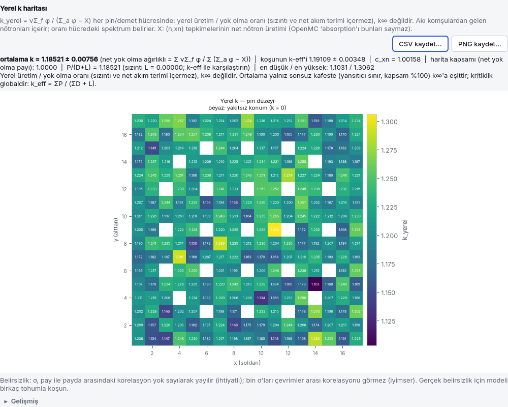
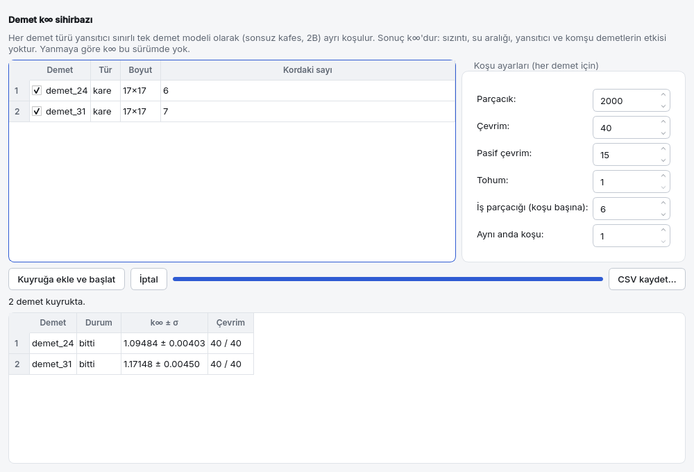

<a id="dersler"></a>
# 5. Rehberli dersler

Her ders bir örnek dosyayla başlar, arayüzde adım adım ilerler ve **beklenen sonuçla** biter.
Dersler kolaydan zora sıralıdır; 1. ders ötekilerin ön koşuludur. Örnekler başlangıç ekranının
örnek listesinden ya da **Dosya › Aç…** ile açılır ve **kopya** olarak açılır: `ornekler/`
altındaki dosyalar test referansıdır, üzerlerine yazılmaz. Kendi değişikliklerinizi saklamak
için **Dosya › Farklı kaydet…** kullanın.

| Ders | Konu | Örnek dosya | Seviye |
|---|---|---|---|
| [5.1](#ders-demet) | Demet k∞ | `ornekler/pwr_17x17.json` | giriş |
| [5.2](#ders-tam-kor) | Tam kor (kare harita) | `ornekler/pwr_smr_kor.json` | orta |
| [5.3](#ders-altigen-kor) | Altıgen demet ve altıgen kor | `ornekler/sfr_altigen.json`, `ornekler/vver1000_kor.json` | orta |
| [5.4](#ders-kare-altigen) | Kare çekirdek + altıgen halka | `ornekler/pwr_kare_altigen_halka.json` | ileri |
| [5.5](#ders-tambur) | Tamburu herhangi bir geometriye yerleştirmek | `ornekler/kafes_tamburlu_yansitici.json`, `ornekler/altigen_tambur_halkasi.json` | ileri |
| [5.6](#ders-tukenme) | Tükenme ve nüklid seçimi | `ornekler/pwr_tukenme.json` | ileri |
| [5.7](#ders-guc) | Güç haritası ve F_ΔH | `ornekler/pwr_3b.json` | orta |
| [5.8](#ders-benchmark) | Benchmark ve C/E | `ornekler/godiva_kriter.json` ve `kriter_*` | giriş–ileri |
| [5.9](#ders-kritik-arama) | Kritik arama | `ornekler/pwr_17x17.json`, `ornekler/pwr_kontrol.json`, `ornekler/tamburlu_kor.json` | orta |
| [5.10](#ders-rapor) | Rapor ve uygunluk eki | herhangi bir koşu | orta |
| [5.11](#ders-spektrum) | Spektrum ve dört faktör | `ornekler/pwr_pinhucre.json` | orta |
| [5.13](05c-ders-mesh.md#ders-mesh) | Ağ (mesh) akı ve güç haritası, ParaView | `ornekler/pwr_mesh_aki.json` | orta |
| [5.14](#ders-malzeme-asistani) | Malzeme asistanı ve kütüphanem | `ornekler/pwr_17x17.json` | giriş |
| [5.15](#ders-yerel-k) | Yerel k ve demet k∞ | `ornekler/pwr_17x17.json`, `ornekler/pwr_ceyrek_kor.json` | orta |
| [5.16](05d-ders-foton-sicaklik-yuzey.md#ders-foton-sicaklik-yuzey) | Foton ısınması, sıcaklık interpolasyonu, yüzey akımı | `ornekler/pwr_pinhucre.json`, `ornekler/zirh_kure.json` | orta |

**Beklenen sonuçlar nereden geliyor?** Her değer bir kaynağa dayanır: örnek dosyasının
`referans.olcum` alanı, [VV.md](../../VV.md), [ORNEKLER.md](../../ORNEKLER.md) ya da
[README.md](../../../README.md) ölçüm tabloları. Ölçüm koşulu (parçacık × çevrim / pasif çevrim)
her derste yazılıdır. Monte Carlo sonucu istatistiktir: aynı ayarla farklı tohum ya da farklı
iş parçacığı sayısıyla son hanelerde fark olur; **farklı ayarla 2–3σ fark olağandır**. Belirsizlik
her yerde 1σ standart belirsizliktir. Sonucun nasıl okunacağı:
[6. Sonuçları yorumlamak](06-sonuclar.md#sonuclar).

Kenar çubuğundaki sayfa adları: **Malzemeler**, **Parçalar**, **Demet**, **Geometri**,
**Hesap ayarları**, **Çalıştır**, **Analiz**, **Tükenme**. Yalnızca modelde anlamlı olan
sayfalar görünür ([4.0 Pencerenin düzeni](04-sekmeler.md#pencere-duzeni)).

---

<a id="ders-demet"></a>
## 5.1 Demet k∞: PWR 17×17

**Örnek dosya:** `ornekler/pwr_17x17.json` · **Seviye:** giriş · **Tahmini süre:** 15 dakika
(koşu 1–3 dakika)

**Amaç.** Bir yakıt demetinin modelini sayfa sayfa okumak, neden **k∞** (sonsuz ortam çoğaltma
katsayısı) hesaplandığını anlamak ve ilk koşuyu yapıp sonucu ölçülen değerle karşılaştırmak.
Arayüzü ilk kez kullanıyorsanız önce [2. 15 dakikada ilk hesap](02-ilk-hesap.md#ilk-hesap)
bölümünü izleyin; bu ders aynı modelin fiziğine odaklanır.

**Adımlar.**

1. Başlangıç ekranının örnek listesinden **PWR 17×17 yakıt demeti**'ni açın. Üstteki model
   başlığı türü söyler: tek yakıt demeti, 2B, özdeğer (k-eff).
2. **Malzemeler** sayfası: dört malzeme vardır (`uo2`, `helyum`, `zirkaloy4`, `su`). `su`'ya
   çift tıklayın; kütüphane malzemesidir ve sıcaklık, bor gibi üretim parametreleriyle saklanır
   ([4.1 Malzemeler](04a-malzemeler.md#malzemeler)). Hiçbir şeyi değiştirmeden **İptal** ile
   kapatın.
3. **Parçalar** sayfası: yakıt çubuğu ve kılavuz boru. Yakıt çubuğunu seçin; **Radyal bölgeler**
   kartında yakıt, boşluk (gap), zarf bölgeleri içten dışa sıralıdır. Bölgelerin dış yarıçapı
   artan sırada olmalı ve en dış bölge hücre adımından küçük kalmalıdır
   ([4.2 Parçalar](04b-parcalar.md#parcalar)).
4. **Demet** sayfası: 17×17 kare harita; renkli palet hangi hücrede hangi çubuğun olduğunu
   gösterir. **Adım** 1.26 cm'dir (çubuk merkezleri arası).
5. **Geometri** sayfası: düzenek şablonu tek demettir; **Yan sınır** `reflective`
   (yansıtıcı) ve model 2B'dir (sonsuz yükseklik). Sağdaki önizlemede demetin xy kesiti
   çizilir.
6. **Neden k∞?** Bütün dış sınırlar yansıtıcı olduğunda nötron dışarı kaçamaz; model sonsuz
   tekrarlanan bir demet ortamıdır. Sonuç kartı bu durumda **k∞** yazar ve kritiklik hükmü
   vermez: k∞ > 1 reaktörün süperkritik olduğunu değil, yakıtın reaktivite fazlası taşıdığını
   söyler ([6.1 İstatistik](06-sonuclar.md#istatistik)).
7. **Hesap ayarları** sayfası: **Hesap hassasiyeti** **Normal** olmalıdır (10 000 parçacık × 150
   çevrim, 40 pasif). Altındaki satır beklenen k-eff belirsizliğini yazar
   ([4.6 Hesap ayarları](04f-hesap-ayarlari.md#hesap-ayarlari)).
8. **Çalıştır** sayfasına geçin. Düğmenin altındaki satır "Model çalıştırılmaya hazır." ya da
   uyarı sayısını yazmalıdır; önizleme çizilmeden düğme etkinleşmez
   ([Önce çiz, sonra çalıştır](06-sonuclar.md#once-ciz)). **Çalıştır**'a basın (ya da **F9**).
9. Koşu sürerken yakınsama grafiğini izleyin: pasif çevrimlerden sonra kümülatif ortalama
   düz bir banda oturmalıdır. **Shannon entropisi** rozeti **Yakınsadı** olmalıdır.

**Beklenen sonuç.** k∞ = **1.18443 ± 0.00088** ([README.md](../../../README.md) "Ölçülen
referans sonuçlar" tablosu; örneğin kendi ayarı 10 000 × 150 / 40 pasif, tohum 1, 6 iş parçacığı,
01.10.2026). Sizin değeriniz bu aralığın 2–3σ
yakınında olmalıdır. Daha büyük bir fark ya da kayıp parçacık uyarısı bir sorun işaretidir
([9. Sorun giderme](09-sorun-giderme.md#sorun-giderme)).

**Ne öğrendik / kontrol soruları.**

- Bütün yan sınırlar `vacuum` olsaydı sonuç k∞ mu, k-eff mi olurdu? Tek bir demette değer büyür mü,
  küçülür mü? (Sızıntı → k-eff, küçülür.)
- σ'yı yarıya indirmek için parçacık × aktif çevrim sayısını yaklaşık kaç kat artırmak gerekir?
  (σ ∝ 1/√N → yaklaşık 4 kat.)
- Regresyon çıpası `ornekler/pwr_pinhucre.json` k∞ = 1.3570 ± 0.0020 verir. Bu demetle **aynı
  yakıt değildir**: pin hücre %3.0, bütün malzemeler 293.6 K, suda bor yok; bu demet %3.2, sıcak
  (yakıt 900 K, zarf 600 K, su 580 K) ve 1300 ppm borlu. k∞ farkının (~0.17) kaynağı ne? (Ölçüldü,
  bu demetin ayarıyla: borsuz 1.34300 ± 0.00085 → **bor ≈ −15 900 pcm (Δk × 10⁵)**; borsuz ve
  bütün malzemeler 293.6 K 1.37120 ± 0.00094 → **sıcaklık ≈ −2 800 pcm**. Kalan küçük fark
  zenginlik, pelet/zarf ölçüleri ve kılavuz borulardan gelir. Baskın neden bor ve sıcaklıktır,
  kılavuz borular değil.)

---

<a id="ders-tam-kor"></a>
## 5.2 Tam kor: kare SMR koru

**Örnek dosya:** `ornekler/pwr_smr_kor.json` (ayrıca `ornekler/pwr_ceyrek_kor.json`) ·
**Seviye:** orta · **Tahmini süre:** 30 dakika (Normal koşu 1–3 dakika)

**Amaç.** Demetleri bir kor haritasına yerleştirmek, sonlu bir korda sızıntının k-eff'i nasıl
düşürdüğünü görmek ve çeyrek kor simetrisini doğru sınır koşuluyla kurmak.

**Adımlar.**

1. **Kare SMR tam koru (52 demet)** örneğini açın. Model başlığında tür "Tam kor (kare harita)"
   görünür.
2. **Demet** sayfasında iki demet vardır: `demet_24` (%2.4) ve `demet_31` (%3.1); ikisi de
   PWR 17×17 demetidir.
3. **Geometri** sayfası, **Kor haritası** kartı: 12×12 harita, **Hücre adımı** (demet adımı)
   21.42 cm. Harfler: `A` → `demet_24` (iç bölge), `B` → `demet_31` (dış kuşak), `s` → `su`
   (çevredeki iki sıra su yansıtıcı). Paletten bir öge seçip hücrelere tıklayarak boyanır; sağ tık
   o hücrenin içeriğini seçer ([4.4.3 Kor haritası](04d-geometri.md#geo-harita)). Haritayı
   değiştirmeyin.
4. Aynı sayfada yükseklik **3B, katmanlı**dır: alt su 20 cm, aktif 200 cm, üst su 20 cm
   ([4.4.8 Eksenel katmanlar](04d-geometri.md#geo-katmanlar)). **Yan**, **Alt** ve **Üst sınır**
   `vacuum`'dur: nötron dışarı kaçar, sonuç **k-eff**'tir.
5. **Hesap ayarları**: örnek **Hızlı deneme** (1 000 × 60, 20 pasif) ile açılır; bu yalnızca
   modelin koştuğunu görmek içindir (σ birkaç yüz pcm). **Hesap hassasiyeti**'ni **Normal**'e
   alın.
6. **Çalıştır**. Sonuç kartının k-eff yorumuna bakın (kritik üstü / kritik / kritik altı;
   ölçüt |k − 1| ≤ 2σ). Entropi rozetini kontrol edin: tam korda 40 pasif çevrim kaynak
   yakınsaması için **sınırdadır** ([6.2 Kaynak yakınsaması](06-sonuclar.md#kaynak-yakinsamasi)).
7. (İsteğe bağlı) **Çeyrek kor:** `ornekler/pwr_ceyrek_kor.json`'u açın. Haritanın yalnızca
   çeyreği vardır; **Geometri** sayfasında **Yüz başına yan sınır** açıktır: −x ve +y yüzleri
   `reflective` (simetri düzlemleri), +x ve −y yüzleri `vacuum` (dış yüzler)
   ([4.4.6 Yükseklik ve sınır koşulları](04d-geometri.md#geo-yukseklik)).

**Beklenen sonuç.**

- Tam kor, **Normal** (10 000 × 150, 40 pasif): k-eff = **1.06005 ± 0.00086** ([ORNEKLER.md](../../ORNEKLER.md)
  "Hassasiyet ve koşu süreleri" tablosu; 6 iş parçacığıyla 81 s).
- Tam kor ile çeyrek kor, 20 000 × 160 çevrim / 60 pasif: **1.05881 ± 0.00059** ve
  **1.05922 ± 0.00066**; fark 41 pcm (Δk × 10⁵), yani 0.46σ ([ORNEKLER.md](../../ORNEKLER.md)
  "Çeyrek simetrik kor").

**Ne öğrendik / kontrol soruları.**

- Korun demetleri 5.1 dersinin demeti (%3.2, k∞ ≈ 1.18) **değildir**: %2.4 ve %3.1. Aynı
  geometri, sıcaklık ve 1300 ppm borla ölçülen sonsuz kafes değerleri k∞(%2.4) = 1.09772 ± 0.00090
  ve k∞(%3.1) = 1.17538 ± 0.00086 (`pwr_17x17` ayarı, 01.10.2026). Korun k-eff'i (1.06005)
  ikisinin arasında değil, altındadır — neden? (Sızıntı: yan, alt ve üst sınır vakum, su yansıtıcı
  yalnız 20 cm. İç bölgedeki %2.4 demetlerinin ağırlığı ve
  sızıntı birlikte k-eff'i düşürür.)
- Çeyrek kor neden **dama** desenli bir yüklemeyle kurulamaz? (Yansıtıcı simetri düzlemi çeyreği
  **aynalar**; dama deseninin ayna simetrisi yoktur, aynalanan kor başka bir yüklemedir —
  ölçülen fark +260 pcm. [ORNEKLER.md](../../ORNEKLER.md))
- Çeyrek kor aynı parçacık sayısında daha hızlı mı? (Hayır; kazanç demet başına istatistiktedir.)

---

<a id="ders-altigen-kor"></a>
## 5.3 Altıgen demet ve altıgen kor

**Örnek dosyalar:** `ornekler/sfr_altigen.json` (demet), `ornekler/vver1000_kor.json` (kor) ·
**Seviye:** orta · **Tahmini süre:** 40 dakika

**Amaç.** Altıgen kafesin halka düzenini ve **yönelim** kuralını öğrenmek; altıgen demetleri altıgen
bir kor haritasına yerleştirmek.

**Adımlar — altıgen demet.**

1. **SFR altıgen demet** örneğini açın. **Demet** sayfasında harita kare değil altıgendir:
   **Halka sayısı** 7 (merkez dahil; 1 + 6 + 12 + … = 127 çubuk), **Adım** 0.9 cm, **Yönelim**
   `y`. Altıgen haritada konumlar dıştan içe halka halka yazılır ([4.3 Demet](04c-demet.md#demet)).
2. **Geometri** sayfasında yan sınır yansıtıcıdır; sonuç yine k∞'dur. Bu demetin kılıfı (duct)
   yoktur; çubukların dışı **Demet dışı** dolgusuyla (`sodyum`) doludur.
3. **Hesap ayarları** dosyadaki gibi kalsın (10 000 × 120, 30 pasif). **Çalıştır**.

**Beklenen sonuç (demet).** k∞ = **1.46634 ± 0.00070** ([README.md](../../../README.md) "Ölçülen
referans sonuçlar"; 24 iş parçacığıyla 53 s). k∞'un PWR demetinden (~1.18) çok büyük olmasının
nedenleri: zenginlik **%19.75** (PWR demeti %3.2), yakıt **yoğun metal** (U-10Mo, 17 g/cm³; birim
hacimde UO₂'den çok daha fazla uranyum) ve soğurucu yok — suda çözünmüş **bor** ve hidrojenli
**moderatörün** soğurması bu demette bulunmaz. Hızlı tayf tek başına k∞'u büyütmez (hızlı tayfta
U-235 fisyon tesir kesiti termaldekinden çok küçüktür).

**Adımlar — altıgen kor.**

4. **VVER-1000 tam koru (163 demet)** örneğini açın. **Demet** sayfasında üç demet vardır
   (`tvs_a20`, `tvs_b30`, `tvs_c44`); her biri 11 halkalı, pin kafesi **`y`** yönelimlidir.
5. **Geometri** sayfası: tür "Tam kor (altıgen harita)", **Halka sayısı** 8 (169 konum),
   **Demet adımı** 23.6 cm, kor kafesinin yönelimi **`x`**. Haritada dış halkanın altı köşesi
   `R` (çelik-su yansıtıcı) ile doludur; geri kalan 163 konum demettir. Yansıtıcı kuşak 20 cm'dir.
6. **Yönelim kuralı:** demet pin kafesi `y` ise kor kafesi `x` olmalıdır (ikisi birbirine 90°).
   Denemek için kor yönelimini geçici olarak `y` yapın: doğrulama panelinde her demet için
   **hata** çıkar: "'tvs_a20' demetinin yönelimi ('y') kor yönelimiyle aynı — demet köşeleri komşu
   hücreye taşar". **Ctrl+Z** ile geri alın. Bu kuralın
   arkasındaki ölçüm ve `HexLattice`/`HexagonalPrism` yönelim tuzağı:
   [6.5 Bilinen tuzaklar](06-sonuclar.md#tuzaklar).
7. Örnek **Hızlı deneme** ile açılır. **Hesap hassasiyeti**'ni **Normal** yapıp **Çalıştır**.

**Beklenen sonuç (kor).** k-eff = **1.09907 ± 0.00097**, **Normal** (10 000 × 150, 40 pasif;
8 iş parçacığıyla 66 s; [ORNEKLER.md](../../ORNEKLER.md) "Hassasiyet ve koşu süreleri"). Yükleme
deseni eğitim amaçlıdır; gerçek bir VVER-1000 haritası değildir.

**Ne öğrendik / kontrol soruları.**

- 8 halkalı bir altıgen kafeste kaç konum vardır? (1 + 3·n·(n−1) = 169.)
- Altıgen kafeste **adım** neyi ölçer? (Düz yüzden düz yüze; köşeden köşeye değil.)
- Kılıflı bir altıgen demette kılıfın (duct) apotemi neden `(halka − 1)·adım·√3/2 + adım/2`'dir,
  `(halka − 0.5)·adım` değil? ([6.5 Bilinen tuzaklar](06-sonuclar.md#tuzaklar))

---

<a id="ders-kare-altigen"></a>
## 5.4 Kare çekirdek + altıgen halka

**Örnek dosya:** `ornekler/pwr_kare_altigen_halka.json` · **Seviye:** ileri · **Tahmini süre:**
45 dakika (Normal koşu ~1 dakika)

**Amaç.** Şablonların kuramadığı bir düzeneği (kare kafesli bir çekirdeği altıgen blok kafesiyle
çevirmek) **geometri ağacı** olarak okumak ve aynısını kendi modelinizde şablondan kurmak.
Kavramlar: [4.5 Gelişmiş geometri editörü](04e-geometri-gelismis.md#geometri-gelismis).

**Adımlar — örneği okumak.**

1. **Kare çekirdek + altıgen yansıtıcı halka** örneğini açın. **Geometri** sayfası doğrudan
   gelişmiş editörle açılır (ağaç + kesit + özellik formu); üstteki not şablon sihirbazının
   kapalı olduğunu söyler.
2. Ağacı yukarıdan aşağı okuyun:
   - **Kök — altıgen a=121.244 (x)**: kök kap, kesiti `x` yönelimli altıgen (apotem 121.24 cm).
   - **İç: Kafes blok_kafesi (altıgen, 5 halka)**: kökün iç bölgesi 5 halkalı, 30 cm adımlı altıgen
     kafestir; harfi `B` parça `yansitici_blok`'a gider (SS-304 blok + Ø6 cm su kanalı).
   - **Yerleşim: kare_cekirdek (liste, 1)**: kafesin ortasından **dikdörtgen** bir delik
     (107.1 × 107.1 cm) oyulur; içine **Kafes cekirdek_kafesi (kare 5×5)** konur (21.42 cm adımlı
     5×5 PWR demeti, dama deseni %2.4 / %3.1).
   - **Halka 1 (20 cm)**: en dışta 20 cm su kuşağı. Yan sınır `vacuum`; model 2B.
   - **Parçalar (1)**: `yansitici_blok` bir kez tanımlanıp her konumda aynı universe olarak kullanılır.
3. Yerleşim satırını seçin ve formu okuyun: **Mod** Liste, tek konum (0, 0), delik kesiti
   Dikdörtgen. Kesitte seçili düğüm renkli, diğerleri soluk görünür.
4. Alttaki şeride bakın: **16 kesik konum** uyarısı vardır. Kare delik bazı altıgen blokları keser;
   kare bir çekirdeği altıgen bir kafesle **kırpmadan** çevrelemek mümkün değildir. Bu bir hata
   değil tasarımın gereğidir: kesik blokların hacmi stokastik hesaplanır. Deliğin tamamen altında
   kalan bloklar haritada `.` ile gizlenmiştir (gizli konum, BİLGİ). Yakıt kesik değildir; yakıt
   hacmi analitiktir ([4.5.10](04e-geometri-gelismis.md#gg-kesik)).
5. **Hesap ayarları** Normal'dir (10 000 × 150, 40 pasif). **Çalıştır**.

**Beklenen sonuç.** k-eff = **1.06492 ± 0.00086** (örneğin `referans.olcum` alanı; Normal,
6 iş parçacığıyla 56 s). Bu değer dış bir referans değil, aracın kendi ölçümüdür (regresyon için).

**Adımlar — aynısını kendiniz kurmak.**

6. `ornekler/pwr_17x17.json`'u açın (şablon modundaki tek demet). İsterseniz önce
   **Malzemeler › Kütüphaneden ekle…** ile **SS-316 paslanmaz çelik** ekleyin; şablon blok
   malzemesi için modeldeki ilk yapısal malzemeyi önerir (eklemezseniz `zirkaloy4`).
7. **Geometri** sayfasında **Düzenek şablonu** listesinden **Kare çekirdek + altıgen halka**'yı
   seçin. Açılan pencerede alanlar modelin parçalarından doldurulur: **Çekirdek demeti A**,
   **Çekirdek demeti B (dama)** (bu modelde ikisi de `demet_17x17`), **Çekirdek boyutu (n×n)** 5,
   **Kafes adımı** 21.42 cm, **Blok adımı (düz–düz)** 30 cm, **Blok halka sayısı** 5, **Blok
   içeriği** "Yansıtıcı blok (malzeme + kanal)", **Blok malzemesi**, **Blok kanal yarıçapı** 3 cm,
   **Aralık dolgusu** `su`, **Dış yansıtıcı kalınlığı** 20 cm, **Yansıtıcı malzemesi** `su`,
   **Yükseklik** 2B. **Tamam**'a basın.
8. Model gelişmiş geometriye geçer ve ağaç örnekteki yapıyla aynı olur. Doğrulama yine **16 kesik
   konum** UYARISI verir (aynı geometri). **Ctrl+Z** şablondan önceki tek demete döner.
9. **Blok içeriği**'nde "Yakıt: …" seçeneği yalnız modelde bir **altıgen** demet varsa çıkar:
   altıgen halka bloklarının içeriği yansıtıcı blok ya da altıgen yakıt demeti olabilir
   ([GEOMETRI_MODELI.md](../../GEOMETRI_MODELI.md) §15 karar 3).

**Ne öğrendik / kontrol soruları.**

- Kesik konum neden HATA değil UYARI? Hangi durumda HATA olur? (Kesik yakıt örneği **Çubuk çubuk
  yanma** açıkken; [4.9 Tükenme](04i-tukenme.md#tukenme).)
- Aynı bloğu her konuma satır içi kopyalamak yerine neden **parça** kullanılır? (Tek universe;
  distribcell ve tükenme örnek sayımı bölünmez.)
- Kendi kurduğunuz modelin k-eff'i neden örnekten farklıdır? (Tek zenginlikli demet ve farklı
  blok malzemesi.)

---

<a id="ders-tambur"></a>
## 5.5 Tamburu herhangi bir geometriye yerleştirmek

**Örnek dosyalar:** `ornekler/kafes_tamburlu_yansitici.json`, `ornekler/altigen_tambur_halkasi.json`
(ve 5.4 dersinin modeli) · **Seviye:** ileri · **Tahmini süre:** 60 dakika

**Amaç.** Kontrol tamburunu yalnız "tamburlu kor" şablonunda değil, her geometride kullanmak:
yerleşim (delik + içerik), "kora bakan yön" kuralı ve tamburları birlikte döndüren **grup**.
Formların ayrıntısı: [4.5.8 Yerleşim formu](04e-geometri-gelismis.md#gg-yerlesim) ve
[4.5.9 Grup ve parça formları](04e-geometri-gelismis.md#gg-grup).

**Kural (bütün modlar).** Tamburun emici yayı yerel +x yönündedir; yerleşim bu yüzü bakış merkezine
çevirir. **Dönme = grup değeri + ofset**: **0° emici kora bakar** (daldırılmış, en düşük k),
**180° emici dışa bakar** (çekilmiş, en yüksek k).

**Adımlar — A. Kare kafesli kor + tamburlu yansıtıcı (okuma ve döndürme).**

1. **Kafesli kor + tamburlu yansıtıcı** örneğini açın. Ağaçta: **Kök — dikdörtgen 64.26×64.26**,
   **İç: Kafes kor_kafesi (kare 3×3)**, **Halka 1** (dış kesiti silindir, r = 80 cm; içeriği
   `berilyum`) ve onun altında **Yerleşim: tamburlar_yansitici (halka, 4)** → **İçerik: Bileşen:
   tambur_b4c**. En altta **Gruplar (1)** → **Grup: tamburlar (dönme = 180)**.
2. Yerleşim satırını seçin. Form: **Mod** Halka, **Sayı** 4, **Merkez yarıçapı** 42 cm,
   **Başlangıç açısı** 0°, **Doğal kesit (tambur dairesi)** işaretli, **Kora bakış** Merkeze
   (**Merkez x** 0, **Merkez y** 0), **Grup** `tamburlar`, **Ofset** 0. Tamburlar korun dört
   **yüzünün** karşısındadır.
3. Grup satırını seçin. **Değer** 180°'dir (tamburlar çekilmiş). Kesitte emici yayların dışa
   baktığını görün. Değeri **0** yapın: yaylar kora döner. Bir koşu 180°'de, bir koşu 0°'de yapın
   (Normal).
4. Tamburun **tanımı** (yarıçap 8 cm, gövde `berilyum`, emici `b4c`, emici iç yarıçapı 6 cm, 120°
   yay) yerleşimde değil kütüphanededir (`tamburlar[]`); yerleşim yalnız nereye ve kaç tane
   konduğunu söyler.

**Beklenen sonuç (A).** 180°: k-eff = **1.05046 ± 0.00097** (örneğin `referans.olcum`; Normal,
10 000 × 150, 40 pasif). Toplam tambur değeri kaba bir ölçümde (2 000 × 40) ~**3000 pcm**
(Δk × 10⁵); aynı tamburlar korun **köşelerine** bakacak biçimde (merkez 60 cm, 45°) konunca yalnız
~600 pcm verdi ([ORNEKLER.md](../../ORNEKLER.md)). Bu iki sayı kaba ölçümdür; kendi Normal
koşularınızın farkı bu mertebede olmalıdır.

**Adımlar — B. Altıgen kor + tambur halkası (grup taraması).**

5. **Altıgen kor + tambur halkası** örneğini açın: 19 SFR demeti (3 halkalı kor, kafes `x`, pin
   kafesi `y`), altıgen berilyum halka (dış apotem 48.7 cm), içinde 6 B₄C tambur: **Sayı** 6,
   **Merkez yarıçapı** 36 cm, **Başlangıç açısı** 30° (tamburlar korun düz yüzlerine bakar).
6. **Analiz** sayfasında **Ne hesaplanacak**: Reaktivite katsayısı (parametre taraması);
   **Parametre**: Dönme grubu (`grup_donme`, derece); **Başlangıç** 0, **Bitiş** 180, **Nokta
   sayısı** 5. **Tahmini süre**'ye bakıp **Taramayı başlat** ([4.8 Analiz](04h-analiz.md#analiz)).

**Beklenen sonuç (B).** Sıkı ölçüm ([ORNEKLER.md](../../ORNEKLER.md) "Tambur etkileşimi",
20 000 × 230 çevrim, 100 pasif): hepsi dışarı (180°) **1.04766 ± 0.00056**, hepsi içeri (0°)
**0.95286 ± 0.00051**; toplam değer Δk = **9480 ± 75 pcm** (Δk × 10⁵), Δρ = **9497 ± 76 pcm**
(Δρ × 10⁵). G-4 ölçümü 0° / 60° / 120° / 180° için 0.95139 / 0.97516 / 1.02525 / 1.04533
(σ 0.0015–0.0019) verdi: k dönme açısıyla **monoton** artar. Normal ayarla 180°'de örneğin
`referans.olcum` değeri **1.04745 ± 0.00084**'tür.

**Adımlar — C. Kare çekirdek + altıgen halkaya tambur yerleştirmek.**

Bu bölüm 5.4 dersinin geometrisine (kare çekirdek, altıgen blok halkası, en dışta 20 cm su kuşağı)
4 tambur ekler. Her adım doğrulamayla denetlendi; bütün adımlar arayüzde yapılır.

7. `ornekler/pwr_kare_altigen_halka.json`'u açın (ya da 5.4'te kurduğunuz modeli) ve
   **Dosya › Farklı kaydet…** ile kendi dosyanıza kaydedin (ör. `kare_altigen_tambur.json`).
8. **Malzemeler › Kütüphaneden ekle…**: **Berilyum (Be)** (Ad: `berilyum`) ve
   **B₄C — bor karbür** (Ad: `b4c`) ekleyin. **Dosya › Kaydet**.
9. **Tambur tanımı.** **Parçalar > Tamburlar** sayfasındaki tambur formuyla yeni bir tambur
   tanımı ekleyin (`ornekler/kafes_tamburlu_yansitici.json`'daki tanımın aynısı): **Ad**
   `tambur_b4c`, yarıçap 8 cm, gövde malzemesi `berilyum`, emici malzemesi `b4c`, emici iç
   yarıçapı 6 cm, emici yay açısı 120°. Tanım `tamburlar[]` bölümüne yazılır (`ad`, `yaricap`,
   `govde_malzeme`, `emici_malzeme`, `emici_ic_yaricap`, `emici_aci`); yerleşim alanları
   (sayı, merkez, dönme) tanımda değil yerleşim ve gruptadır.
10. **Geometri** sayfasında ağaçta **kök** kabını (en üst satır) seçin ve araç çubuğunda
    **+ Yerleşim**'e basın. Modelde bir tambur tanımı olduğu için yeni yerleşimin içeriği
    kendiliğinden **Bileşen: tambur_b4c** olur ve **Doğal kesit (tambur dairesi)** işaretlidir.
11. Yerleşim formunu doldurun: **Ad** `tambur_halkasi`, **Mod** Halka, **Sayı** 4, **Merkez
    yarıçapı** 63 cm, **Başlangıç açısı** 0°, **Kora bakış** Merkeze (**Merkez x** 0, **Merkez y**
    0), **Ofset** 0.
    *Sayılar nereden?* Tambur, değeri ölçülebilsin diye **çekirdeğin hemen yanında** olmalıdır.
    Kare çekirdeğin yüzü merkeze 53.55 cm uzaktadır; 8 cm yarıçaplı tamburun merkezi 63 cm'de
    olunca tambur 55–71 cm arasını kaplar (yüzle arasında 1.45 cm su). 0°, 90°, 180°, 270°
    yüzlerin ortasıdır; köşelere (45°) yer yoktur (köşe 75.7 cm uzaktadır). Tamburlar çelik
    blokları oyar (kesik konum uyarısı).
    *Neden su kuşağı (Halka 1) değil?* Dersin ilk sürümü tamburları en dıştaki su kuşağına
    (merkez yarıçapı 131.2 cm) koyuyordu. Aradaki ~70 cm çelik yansıtıcıdan oraya nötron
    neredeyse ulaşmaz: ölçülen k(0°) = 1.06613 ± 0.00097, k(180°) = 1.06504 ± 0.00085 —
    fark −109 ± 129 pcm (Δk × 10⁵), istatistik olarak sıfır.
12. Doğrulama panelinde yalnız iki **uyarı** kalmalıdır: "20 kesik konum…" (5.4 dersindeki 16 ve
    tamburların oyduğu bloklar) ve "2B modelde kontrol tamburu: eksenel sızıntı yok; tambur
    değeri fazla çıkar." Deneyin: **Merkez yarıçapı**'nı 60 yapın; her tambur için **hata** çıkar:
    "'kare_cekirdek#0' ve 'tambur_halkasi#0' delikleri örtüşüyor." 63'e geri alın.
13. Araç çubuğunda **+ Grup**'a basın; **Gruplar** altında yeni bir dönme grubu çıkar (değer 0).
    Grubu seçin: **Ad** `tamburlar`, **Tür** Dönme, **Değer** 180, **Üyeler**'de
    `tambur_halkasi`'yı işaretleyin. (Aynı bağlantı yerleşim formundaki **Grup** kutusundan da
    kurulur.)
14. Kesitte (xy) emici yayların dışa baktığını görün. **Dosya › Kaydet**. Normal ayarla bir koşu
    180°'de, bir koşu 0°'de yapın.

**Beklenen sonuç (C).** Ölçülen (01.10.2026; Normal 10 000 × 150 / 40 pasif, tohum 1, 6 iş
parçacığı): k(0°) = **1.06255 ± 0.00090**, k(180°) = **1.06627 ± 0.00083** → toplam tambur değeri
Δk = **372 ± 122 pcm** (Δk × 10⁵), yaklaşık 3σ. Denetleyin: k(0°) < k(180°) ve
|k₁₈₀ − k₀| > 2·√(σ₁₈₀² + σ₀²). Fark 2σ'yı geçmezse (başka tohumda olabilir) çevrim başına
parçacığı artırıp yineleyin. Değer küçüktür: tamburların arkası çelik/su, önü yalnız çekirdeğin
bir yüzüdür. Model 2B olduğu için tambur değeri olduğundan büyük çıkar (eksenel sızıntı yoktur;
doğrulama bunu uyarır). Daha gerçekçi bir değer için kökün formunda **2B (sonsuz yükseklik)**
işaretini kaldırıp **Yükseklik** verin ve **Alt**/**Üst** sınırı `vacuum` yapın.

**Ne öğrendik / kontrol soruları.**

- Tamburu daha büyük yapmak (ör. r = 12 cm) neden doğrulama hatası verir? (Delik çekirdek
  yerleşimiyle örtüşür: 63 − 12 = 51 cm < 53.55 cm; doğrulama "delikleri örtüşüyor" der.)
- Tamburların kora bakan yönünü ne belirler? (Halka modunda ψᵢ = φᵢ + 180 + D; bakış merkezdeyken
  emici yay her örnekte merkeze döner, D = grup değeri + ofset.)
- Tambur değerini Δk ve Δρ ile vermek neden farklı sayılar üretir? (Δρ = Δk/(k₁·k₂); k'lar
  1'den uzaklaştıkça fark büyür. pcm'in hangi büyüklüğe uygulandığı her zaman yazılmalıdır.)

---

<a id="ders-tukenme"></a>
## 5.6 Tükenme ve nüklid seçimi

**Örnek dosya:** `ornekler/pwr_tukenme.json` · **Seviye:** ileri · **Tahmini süre:** tam örnek
~50 dakika koşu; kısaltılmış sınıf koşusu ~5–10 dakika

**Amaç.** Yakıtın zamanla değişimini hesaplamak, Xe-135 / Sm-149 zehirlenmesini görmek, izlenecek
nüklidleri seçmek ve sonucu CSV olarak almak. Sayfanın her alanı:
[4.9 Tükenme](04i-tukenme.md#tukenme).

**Adımlar.**

1. **PWR pin hücre — tükenme** örneğini açın: `pwr_pinhucre` ile aynı pin hücresi (k∞ modeli).
2. **Tükenme** sayfası: **Tükenme (yanma) hesabını etkinleştir** işaretlidir.
   - **Güç yoğunluğu** 40 W/gHM (mutlak güç değil: 2B modelde "cm başına" olmak zorunda kalırdı).
   - **Adım birimi** gün; **Adımlar** 0.5, 1.5, 3, 5, 10, 30, 100, 350 (toplam 500 gün =
     20 MWd/kg). İlk iki adım bilerek kısadır: Xe-135 yaklaşık 2 günde dengeye gelir; uzun bir ilk
     adım bu düşüşü tek çizgiye ezer. Altındaki satır adım sayısını, toplam yanmayı ve transport
     sayısını yazar.
   - **Zincir** Otomatik (spektrumdan) → bu modelde ENDF/B-VIII.0 termal; **Entegratör** CECM
     (adım başına 2 transport) → 8 × 2 + 1 = 17 transport.
3. **İzlenen nüklidler** kartı: arama kutusuna `xe` yazın; ağaçta Xe-135'i bulun. **Hazır
   setler**'den **Zehirler**'i ve **Pu vektörü**'nü ekleyin. Seçili nüklidler çip olarak görünür;
   × ile kaldırılır. Zincirde olmayan bir ad **kırmızı çip** olur. Nüklid seçimi fizik değildir:
   koşudan sonra değiştirmek sonucu eskitmez.
4. **Hesap ayarları** 5 000 × 60 çevrim (10 pasif). **Tükenmeyi başlat**. İlk transport bitince
   kalan süre o transportun **ölçülen** süresinden hesaplanır.
5. **Kısaltılmış sınıf koşusu (isteğe bağlı).** Zaman yoksa **Farklı kaydet**'ten sonra
   **Zincir**'i "CASL basit termal (228 nüklid, ~3 kat hızlı)" ve **Adımlar**'ı `0.5, 1.5` yapın
   (5 transport). CASL zinciri yalnız ön inceleme içindir; sayılar tam zincirden biraz farklı
   çıkabilir.
6. Koşu bitince **Sonuç** kartında grafik (k-eff ve seçili nüklidler – zaman) ve tablo (gün,
   MWd/kg, k-eff, ρ [pcm]) görünür. **CSV olarak dışa aktar** ile zaman, yanma, k, σ ve seçili
   her nüklidin atom sayısı ve yoğunluğunu kaydedin.
7. Modelde bir şeyi değiştirin (ör. **Güç yoğunluğu** 38): önceki sonuç satırı kırmızı
   **Eski sonuç** olur ve hangi bölümün değiştiğini yazar. **Ctrl+Z** ile geri alın.

**Beklenen sonuç** ([README.md](../../../README.md) "Örnek: pwr_tukenme"; tam ENDF/B-VIII.0 termal
zincir, CECM, 5 000 × 60 parçacık, ~50 dakika):

| gün | MWd/kg | k∞ |
|---|---|---|
| 0 | 0 | 1.35930 ± 0.00184 |
| 0.5 | 0.02 | 1.32788 ± 0.00179 |
| 2 | 0.08 | 1.31232 ± 0.00211 |
| 50 | 2 | 1.27547 ± 0.00175 |
| 500 | 20 | 1.06545 ± 0.00168 |

- 0 → 2 gün (Xe-135 + erken Sm-149): Δρ = **−2634 ± 158 pcm** (Δρ × 10⁵) — tam güç PWR için
  yayımlanan ~2500–3000 pcm bandında.
- 0. gündeki değer regresyon çıpasıyla (k∞ = 1.3570 ± 0.0020) 1σ içindedir.
- 20 MWd/kg'da U-235'in yaklaşık %40'ı kalır; Pu-239 ağır metalin ~%0.5'idir.

**Ne öğrendik / kontrol soruları.**

- Neden "hızlı zincir seçmek yetmez"? (Fisyon ürünü verimi ayrı bir ayardır; hızlı sistemde verim
  enerjisi 500 keV'e çekilir — [6.5 Bilinen tuzaklar](06-sonuclar.md#tuzaklar).)
- Yanabilir malzeme hacmi f kat yanlış olsaydı ne olurdu? (Malzemedeki atom sayısı N·V f kat
  büyük sayılır, tally'deki toplam reaksiyon hızı ise aynı kalır: **atom başına reaksiyon hızı
  1/f** kat olur ve malzeme o oranda yanlış hızda yanar — ilk adımın k-eff'inde iz bırakmadan.
  Hacimler bu yüzden analitik hesaplanır.)
- **Çubuk çubuk yanma** bu modelde neden bir şey değiştirmez? (Pin hücrede yakıtın tek örneği vardır.)

---

<a id="ders-guc"></a>
## 5.7 Güç haritası ve F_ΔH

**Örnek dosya:** `ornekler/pwr_3b.json` · **Seviye:** orta · **Tahmini süre:** 30 dakika
(koşu ~2–5 dakika)

**Amaç.** Çubuk çubuk güç dağılımını hesaplamak, **F_ΔH** ve **F_q** tepe faktörlerini okumak ve
bu sayıların istatistik sınırlarını öğrenmek. Alanlar: [4.6 Hesap ayarları](04f-hesap-ayarlari.md#hesap-ayarlari),
yorum: [6.3 Güç dağılımını yorumlamak](06-sonuclar.md#guc-dagilimi-yorum).

**Adımlar.**

1. **PWR 17×17 demet — 3B** örneğini açın: 366 cm yüksekliğinde tek demet; yan sınır
   `reflective`, alt ve üst sınır `vacuum`.
2. **Hesap ayarları** sayfasında güç dağılımı kartı açıktır: **Çubuk bazlı güç dağılımı hesapla
   (F_ΔH, F_q)** işaretli, **Hedef çubuk** `yakit_cubugu`, **Skor** `kappa-fission`,
   **Eksenel dilim** 20, **Toplam güç** 17.6e6 W (`guc_dagilimi.toplam_guc`).
3. **Toplam güç neden 17.6 MW?** Bu alan **modelin kapsadığı bölgenin** gücüdür, bütün korun
   değil: 3400 MWth / 193 demet ≈ 17.6 MW. Tek demetlik bir modele bütün korun gücünü girmek
   lineer gücü 193 kat büyük gösterir.
4. Örnekteki parçacık sayısı 20 000 × 150 çevrimdir (40 pasif). **Çalıştır**.
5. Koşu bitince **Çalıştır** sayfasında güç haritası çıkar: 264 yakıt çubuğu renkli, kılavuz
   borular boş. **Değerleri haritaya yaz** ile her hücrede bağıl güç yazar. Özet satırları F_ΔH,
   F_q, ortalama ve en yüksek lineer gücü verir.
6. Aynı modeli **Hızlı deneme** ile koşup F_ΔH'yi karşılaştırın: az istatistikle F_ΔH **yukarı**
   çıkar.

**Beklenen sonuç** ([README.md](../../../README.md) "Güç dağılımı ve tepe faktörleri"; örneğin
kendi ayarı 20 000 × 150 / 40 pasif, 20 eksenel dilim, 6 iş parçacığı, 01.10.2026; tohum 1–5):
tek koşuda **F_ΔH ≈ 1.06–1.08**, **F_q ≈ 1.63–1.75** (tohum 1: 1.0732 ve 1.6264); 5 tohumun
saçılması (1σ) F_ΔH için 0.0071, F_q için 0.051. Haritaların ortalaması alınıp sonra en büyüğü
bulunursa **F_ΔH = 1.0620 ± 0.0055**, **F_q = 1.600 ± 0.032** (σ: tohumlar arası saçılma / √5).
Ortalama lineer güç **182 W/cm**.

- **Belirsizlikler iyimserdir.** Raporlanan bin başına σ 0.003–0.008 iken üç bağımsız tohum arasındaki
  gerçek saçılma 0.07–0.17 ölçüldü (~20 kat): özdeğer hesabında çevrimler arası ilinti tally
  σ'sını küçümser. Gerçek belirsizlik için birkaç tohumla koşun.
- **F_ΔH bir maksimumdur ve yukarı yanlıdır:** tohum maksimumlarının ortalaması (1.0718) harita
  ortalamasının tepesinden (1.0620) büyüktür; bu modelde 31 çubuk tepeden istatistik olarak ayırt
  edilemez (yorum satırı bunu ve beklenen yanlılığı yazar). Az istatistikte fark büyür: 3 000
  parçacıkla 1.1455 ölçülmüştü (eski ölçüm, He 0.0001785).
- **F_q eksenel çözünürlüğe bağlıdır:** kaba dilimler tepeyi ortalar; en az 10–20 dilim kullanın
  (saf kosinüs limiti π/2 = 1.571).

**Ne öğrendik / kontrol soruları.**

- Lineer güç ~182 W/cm değil de ~35 000 W/cm çıksaydı hangi alan yanlıştır? (**Toplam güç**:
  bütün kor gücü girilmiş.)
- Çubuk güçlerinin toplamı neden filtresiz tally'ye eşit olmalıdır? (Korunum denetimi;
  haritalama hatasını yakalar.)
- Eksenel katmanlı `ornekler/pwr_eksenel.json`'da F_ΔH neden aynı, F_q neden küçüktür?
  (Katmanlama radyal dağılıma dokunmaz; su yansıtıcı eksenel profili düzleştirir.)

<a id="ders-guc-yanma"></a>
### 5.7.1 Pin gücü tablosu ve yanmaya göre pin gücü

**Örnek dosya:** `ornekler/pwr_3b.json` (tablo), `ornekler/pwr_17x17.json` (yanma) ·
**Seviye:** orta. Alanlar: [pin gücü tablosu](04g-calistir.md#calistir-pin-tablosu),
[yanmaya göre pin gücü](04i-tukenme.md#tukenme-pin-gucu).

**A. Tablo (5.7'nin koşusu).**

1. Güç haritasının altındaki **Pin gücü tablosu**nda 264 satır vardır (kılavuz/ölçüm boruları
   tabloda yoktur). **Bağıl güç** başlığına tıklayıp azalan sıralayın: ilk satır en sıcak
   çubuktur ve değeri özetteki F_ΔH ile aynıdır (tablo = harita).
2. Haritada bir çubuğa tıklayın: satırı seçilir, tablonun üstünde değerleri yazar.
3. **Çeyrek katla**: tek demet ayna simetrik olduğu için etkindir; 264 çubuk 72 yörüngeye iner
   (çeyrekte 81 konum − 9 kılavuz/ölçüm konumu). **Asimetri** sütunu aynı yörüngedeki çubukların
   farkıdır: simetrik modelde bu fark yalnız istatistik gürültüdür.
4. Katlamayı **kapatıp** **Tabloyu kaydet…** ile CSV yazın; `W` sütununun toplamı Toplam güç ×
   hedef payıdır (bu modelde bütün fisyon enerjisi hedef çubuklarda: 17.6 MW). Katlı tabloda
   her satır m üyenin ortalamasıdır (`katlanan_m` sütunu): toplam Σ m·W'dir.
5. İtalik satırlar en sıcak çubuktan istatistik olarak **ayırt edilemez** (birleşik 2σ içinde):
   "en sıcak çubuk" tek bir çubuk değil, bir gruptur.

**B. Yanmaya göre.**

1. `pwr_17x17` örneğini açın; **Tükenme** sayfasında hesabı etkinleştirin. Güç dağılımını Hesap
   ayarlarında açmanız gerekmez: tükenme koşusu her adımda pin gücünü kendiliğinden sayar.
   Süreyi kısaltmak için Gelişmiş'te **CASL basit termal** zincirini seçebilirsiniz.
2. Koşu bitince sonuç kartının altında **Adım** seçicisi çıkar. Adım değiştikçe tablo o adımın
   değerlerini gösterir; tablodan seçtiğiniz çubuklar soldaki grafikte bağıl güç – yanma olarak
   izlenir, sağda adım başına F_ΔH çizilir.
3. **Adım × pin kaydet…** her adımın pin tablosunu tek CSV'de verir.

**Ne öğrendik / kontrol soruları.**

- Bağıl güç her adımda o adımın ortalamasına göredir: bir çubuğun bağıl gücü düşüyorsa mutlak
  gücü de düşmüş olmak zorunda mıdır? (Evet, aynı oranda — toplam güç ve hedef payı sabitse.)
- `pwr_17x17`'de **Çubuk çubuk yanma** kapalıdır: bütün çubuklar aynı ortalama bileşimle yanar.
  Bu yüzden sıcak çubukların daha hızlı yanıp dağılımı düzleştirmesi neden **görülmez**?
  (Pin başına yanma geri beslemesi yok; görmek için Gelişmiş'te **Çubuk çubuk yanma**'yı açın —
  her çubuk ayrı malzeme olur, bellek ve süre çubuk sayısıyla artar.) Farkları tek koşu
  σ'sıyla (iyimser) değil tohum saçılmasıyla değerlendirin.
- Gösterilen dağılım neden adımın **başındaki** dağılımdır? (OpenMC adım statepoint'ini
  öngörücü transporttan sonra yazar.)

**Ölçülen (B, küçük ayar).** 02.10.2026, `pwr_17x17` + Tükenme: **2000 × 30 / 10 pasif**
(örneğin kendi 10 000 × 150 ayarı ölçülmedi), CASL basit termal, CECM, 40 W/gHM, adımlar 1, 4, 5,
10 MWd/kg (9 transport, 6 iş parçacığı, 518 s). Ortalama q′ **193.3 W/cm** (2B: 1 cm yükseklik
başına). Adım başına F_ΔH: 1.222, 1.207, 1.258, 1.262, 1.240 (tek koşu σ 0.06–0.10); en sıcak
çubuk her adımda başka bir konumda (x = 5, y = 6 → x = 14, y = 9 → …). Bu istatistikte adımlar
arası fark gürültüden **ayırt edilemez** ve F_ΔH maksimum yanlılığıyla yukarı çıkar (5.7):
yanmaya göre eğilim okumak için parçacık sayısını artırın ve birkaç tohum kullanın. k-eff
1.1773 → 0.9648 (20 MWd/kg).

Bu sayılar bir tasarım ya da lisans değerlendirmesi değildir; sınırlar için
[6.6 Bilinen sınırlar](06-sonuclar.md#bilinen-sinirlar).

<a id="ders-benchmark"></a>
## 5.8 Benchmark ve C/E

**Örnek dosyalar:** `ornekler/godiva_kriter.json`, `ornekler/kriter_jezebel.json`,
`ornekler/kriter_flattop25.json`, `ornekler/kriter_lct008.json` · **Seviye:** giriş–ileri ·
**Tahmini süre:** Godiva 10 dakika; LCT-008 uzun (referans koşusu ~450 s)

**Amaç.** Hesabı ölçülmüş bir kritik düzenekle (ICSBEP) karşılaştırmak ve **C/E** ile
**C − E** değerlerini doğru okumak. Arka plan: [7.4 V&V](07-uygunluk.md#vv).

**Adımlar.**

1. **Godiva kritik küresi** örneğini açın: çıplak HEU metal küresi (ICSBEP HEU-MET-FAST-001).
   Kor türü `kuresel`; kabuklar yalnız JSON'dan düzenlenir.
2. **Hesap ayarları**: dosyadaki ayar 20 000 parçacık × 160 çevrim (40 pasif) σ ≈ 0.0005 verir.
   Aşağıdaki tablonun referans ölçümü **100 000 × 150 çevrim (50 pasif)** ile yapıldı (σ = 0.00025);
   aynı σ için bu değerleri girin. Süre kısıtlıysa dosyanın ayarıyla koşun ve σ'nın büyüdüğünü hesaba
   katın. **Çalıştır**.
3. Sonucu deney değeriyle karşılaştırın: E ± σe = 1.0000 ± 0.0010. Özet satırları referanslı
   örneklerde bunu kendisi yazar (referans, C/E, C − E pcm, |C − E| / σ;
   [4.7 Sonuç kartı](04g-calistir.md#calistir)). Elle hesap:
   C − E [pcm] = (C − E) × 10⁵ (**Δk × 10⁵**, reaktivite farkı değildir), fark/σ =
   |C − E| / √(σc² + σe²), C/E = C / E.
4. Aynısını Jezebel ve Flattop-25 için yapın. LCT-008 (LEU UO₂ kafes, borlu su) uzun sürer;
   yalnız sonucu okuyun.

**Beklenen sonuç** ([VV.md](../../VV.md) "Deney kriterleri" tablosu):

| Örnek | Kriter | E ± σe | C ± σc | C − E [pcm] | fark/σ |
|---|---|---|---|---|---|
| `godiva_kriter.json` | HEU-MET-FAST-001 | 1.0000 ± 0.0010 | 1.00038 ± 0.00025 | +38 | 0.37 |
| `kriter_jezebel.json` | PU-MET-FAST-001 | 1.0000 ± 0.0020 | 0.99996 ± 0.00023 | −4 | 0.02 |
| `kriter_flattop25.json` | HEU-MET-FAST-028 | 1.0000 ± 0.0030 | 1.00106 ± 0.00026 | +106 | 0.35 |
| `kriter_lct008.json` | LEU-COMP-THERM-008/1 | 1.0007 ± 0.0012 | 1.00067 ± 0.00021 | −3 | 0.02 |

Kabul ölçütü |C − E| ≤ 3·√(σc² + σe²) ve σc ≤ 30 pcm **projenin kendi ölçütüdür**; bir standarttan
gelmez.

**Ne öğrendik / kontrol soruları.**

- Regresyon çıpası (pin hücre k∞) ile Godiva testi arasındaki fark nedir? (Çıpa "kod kendiyle
  tutarlı" der; kriter "sonuç ölçümle uyumlu" der.)
- E = 1.0007 olan bir kriterde neden k_norm = C/E kullanılır? (NUREG/CR-6698 normalleştirmesi; K9.)
- Dört kriter bir LWR tasarımının hesap yanlılığını kanıtlar mı? (Hayır: LWR/LEU kafes için yeterli
  bağımsız vaka yoktur, USL hesaplanamaz — [7.4](07-uygunluk.md#vv).)

<a id="ders-kritik-arama"></a>
## 5.9 Kritik arama

**Örnek dosyalar:** `ornekler/pwr_17x17.json`, `ornekler/pwr_kontrol.json`,
`ornekler/tamburlu_kor.json` · **Seviye:** orta · **Tahmini süre:** her arama 5–30 dakika

**Amaç.** Hedef k-eff'i veren parametre değerini (kritik bor, kritik çubuk konumu, kritik tambur
açısı) bulmak ve sonucun belirsizliğini okumak. Yöntem: [4.8 Analiz](04h-analiz.md#analiz).

**Adımlar.**

1. `ornekler/pwr_17x17.json`'u açın. **Analiz** sayfasında **Ne hesaplanacak**: **Kritik arama
   (hedef k-eff'i veren değer)**.
2. **Parametre**: bor derişimi (`bor_ppm`); **Hedef malzeme** `su`; **Başlangıç** 0, **Bitiş**
   5000 ppm; **Hedef k-eff** 1.0. **Tahmini süre**'ye bakıp **Kritik aramayı başlat**.
3. Arama aralık uçlarını koşar, sonra parantez korumalı yanlış konum + ikiye bölme ile daralır.
   Durma ölçütü |k − hedef| ≤ 2σ'dır. Kök aralıkta değilse **ekstrapolasyon yapmaz**; aralığı
   genişletmenizi söyler.
4. `ornekler/pwr_kontrol.json`: **Parametre** çubuk daldırma (`cubuk_daldirma`, %), aralık 0–100.
5. `ornekler/tamburlu_kor.json`: **Parametre** tambur dönmesi (`tambur_donme`, derece), aralık
   0–180.

**Beklenen sonuç** ([README.md](../../../README.md) "Reaktivite katsayıları ve kritik arama"):

| Model | Parametre | Kritik değer | Koşu sayısı |
|---|---|---|---|
| `pwr_17x17` | bor | **3430 ppm** | 7 |
| `pwr_kontrol` | çubuk daldırma | **%87.85 ± 0.09** | 13 |
| `tamburlu_kor` | tambur dönmesi | **122.46° ± 3.68** | 4 |

Kökün belirsizliği yerel eğimden δx = σ_k / |dk/dx| olarak raporlanır.

**Ne öğrendik / kontrol soruları.**

- `pwr_17x17` k∞ modelidir; 3430 ppm bir **sonsuz kafesin** kritik borudur, bir korun değil. Neden?
  (Yansıtıcı sınır: sızıntı yok.)
- Kontrol çubuğu eğrisi neden klasik S şeklinde değil? (Tek demet, yüksek k∞: rodlanmamış alt
  bölge tek başına süperkritik kalır; değer geç toplanır.)
- Durma ölçütü neden 1σ değil 2σ? (Sonuç panelinin "kritik" dediği konfigürasyonu aramanın
  reddetmemesi için aynı tanım.)

<a id="ders-rapor"></a>
## 5.10 Rapor ve uygunluk eki

**Örnek dosya:** herhangi bir tamamlanmış koşu (ör. 5.1 ya da 5.8 dersinin koşusu) · **Seviye:** orta ·
**Tahmini süre:** 10 dakika

**Amaç.** Bir koşudan PDF/HTML rapor üretmek, raporun **uygunluk ekini** okumak ve ekin neyi
kanıtladığını, neyi kanıtlamadığını ayırmak. Arka plan: [7. Uygunluk denetimi](07-uygunluk.md#uygunluk-denetimi).

**Adımlar.**

1. Bir koşu bitirin (ör. `ornekler/godiva_kriter.json`). **Çalıştır** sayfasındaki uygunluk
   kartında profilleri seçin: **A · Monte Carlo iyi uygulaması** ve **D · Raporlama** her koşu
   için; kriter düzeneğinde **B · Kritiklik güvenliği**, kor hesabında **C · Reaktör kor tasarımı**.
2. **Dosya → Rapor oluştur…** (**Ctrl+R**). Dosya adı ve biçimi (`.pdf` ya da `.html`) seçin.
   Bildirimdeki **Aç** raporu açar.
3. Terminalden aynısı:

   ```bash
   openmc-arayuz-kosu rapor kosu/ -o rapor.pdf
   openmc-arayuz-kosu uygunluk kosu/ --profil A,B,D
   ```

4. Raporda sırayla okuyun: model özeti, sonuçlar (k ± 1σ, "standart belirsizlik" etiketiyle),
   tekrarlanabilirlik bloğu (OpenMC sürümü, kütüphane, sha256, tohum — `kapsul.json`) ve
   **uygunluk eki**: her kural için **karşılandı / karşılanmadı / uygulanamadı**, etiketi
   (iyi uygulama / standart / proje ölçütü / kullanıcı sınırı) ve kaynağı.

**Beklenen sonuç.** Godiva koşusunda A ve D profillerinin kuralları çoğunlukla **karşılandı**;
B profilinde USL için V&V kümesi gerekir; uygulamanın alt kümesinde yeterli bağımsız vaka yoksa ek
"USL hesaplanamadı" yazar ([9.3](09-sorun-giderme.md#usl-hesaplanamadi)). "Uygulanamadı" satırları
bir başarısızlık değildir (`--siki` verilmedikçe).

**Ne kanıtlar, ne kanıtlamaz.**

- **Kanıtlar:** koşunun girdisinin ve verisinin izlenebilir olduğunu, belirsizliğin doğru
  bildirildiğini, kaynak yakınsamasının ve istatistiğin iyi uygulama eşiklerini geçtiğini; varsa
  yanlılık/USL hesabını.
- **Kanıtlamaz:** modelin gerçek tesisi doğru temsil ettiğini, sonucun lisanslamaya uygun
  olduğunu, aracın bir standarda "uygun" ya da sertifikalı olduğunu. Bunlar kullanıcı kuruluşun
  kalite güvence programı, bağımsız gözden geçirmesi ve kendi doğrulama raporu ister
  ([7.3](07-uygunluk.md#ne-kanitlar)).

**Ne öğrendik / kontrol soruları.**

- "Karşılandı" ile "uygulanamadı" arasındaki fark nedir? (İkincisinde kuralı değerlendirecek veri
  yoktur, ör. kullanıcı sınırı girilmemiş F_ΔH.)
- `uygunluk` komutunun çıkış kodu CI'da neden işe yarar? (0 hata yok, 1 hata var, 2 kullanım hatası,
  3 `--siki` ile değerlendirilemeyen kural.)

<a id="ders-spektrum"></a>
## 5.11 Spektrum, dört faktör ve spektral indeksler

**Örnek dosya:** `ornekler/pwr_pinhucre.json` · **Seviye:** orta · **Tahmini süre:** 15 dakika

**Amaç.** Yansıtıcı sınırlı (sonsuz kafes) bir PWR pin hücresinde nötron enerji spektrumunu
çizmek, k∞'u dört faktöre (ε, p, f, η) ayırmak, ε·p·f·η·c_xn çarpımının k∞'a eşit olduğunu
görmek ve CSEWG spektral indekslerini okumak.

**Tanımlar (hangi tally oranı).** Hepsi aynı koşunun tally'leridir; νF = `nu-fission`,
A = `absorption`, _th = E < E_c, F = yakıt (fisil nüklid içeren malzemeler), X = Σ (x−1)·R_x
((n,xn) türü kanallar, aşağıya bakın). Tanımlar OpenMC'nin resmî tally-arithmetic örneğiyle
(openmc-notebooks, `tally-arithmetic.ipynb`) **sızıntısız sınırda aynıdır**; p farklıdır: örneğin
p'si termal sızıntıyı da içerir. Ders kitabı çerçevesi: Lamarsh & Baratta, *Introduction to
Nuclear Engineering*, Bölüm 6; Duderstadt & Hamilton, *Nuclear Reactor Analysis* (1976), nötron
yaşam döngüsü ve dört faktör formülü — ama **iki grup tanımı** ders kitabından farklıdır:
ders kitabındaki ε yalnız U-238 eşiği üstündeki hızlı fisyonu sayar (tipik 1.02–1.08); burada
"hızlı" = E > 0.625 eV olduğundan ε epitermal ve rezonans bölgesindeki U-235 fisyonunu da içerir
(bu pin hücrede 1.225) ve buna karşılık p daha küçüktür. Çarpım değişmez.

| Simge | Ad | Tally oranı |
|---|---|---|
| ε | hızlı fisyon çarpanı | νF / νF_th |
| p | rezonanstan kaçma olasılığı | A_th / A |
| f | termal yararlanma | A_F,th / A_th |
| η | termal soğurma başına nötron | νF_th / A_F,th |
| ε·p·f·η | çarpım | νF / A (ara tally'ler sadeleşir) |
| c_xn | (n,xn) düzeltmesi | A / (A − X) |
| P_NL | sızmama olasılığı (P_FNL·P_TNL) | (A − X) / (A − X + L) |
| k | tally'lerden k | νF / (A − X + L) = ε·p·f·η·c_xn·P_NL |

- **Termal kesim E_c = 0.625 eV:** OpenMC örneğinin değeri, CASMO-2 iki grup sınırı ve
  CSEWG/ENDF-202 TRX hesaplarının **hesap** kesimi; deneydeki etkin kadmiyum kesimi kadmiyum
  kalınlığına bağlıdır (~0.4–0.5 eV). Kesim değişirse dört faktörün hepsi değişir (tanım gereği);
  yalnızca çarpım değişmez.
- **Sızıntısız varsayım:** p = A_th/A, k∞ tanımıdır. OpenMC örneğinin p'si termal sızıntıyı da
  içerir; burada termal sızıntı tally'si yoktur. Sızıntı varsa L, statepoint'in global `leakage`
  tally'sinden alınır ve **tek** çarpan P_NL olarak verilir; P_FNL ile P_TNL'yi ayrı vermek enerjiye
  bağlı yüzey akımı tally'si ister (kapsam dışı).
- **(n,xn):** OpenMC'nin `absorption` skoru (n,2n) ile doğan nötronları saymaz; bu yüzden ε·p·f·η
  = νF/A, k∞'u X/A kadar (pin hücrede ≈ %0.14) küçük verir. c_xn bunu düzeltir. Klasik dört faktör
  formülünde bu etki ε'nin içinde varsayılır. X yalnız MT 11, 16, 17, 24, 25, 30, 37, 41, 42
  kanallarını sayar; daha yüksek kanallar (MT 152+, (n,5n) …) sayılmaz. Be ya da D₂O içeren
  modellerde (n,2n) önemlidir. **c_xn yalnız analitik (el hesabı) testle doğrulandı;** X/A ≈ %0.14,
  A'nın MC belirsizliğinden (~%0.2) küçük olduğundan k üzerindeki etkisi Monte Carlo ile
  ayrıştırılamaz. MC ile doğrulanan: filtresiz nu-fission tally'si = global k-tracklength (~1e-6
  bağıl); Y3 tally'leriyle nötron dengesi A − X + L = 1 (3σ, korelasyon yok sayıldığından); analog
  tahminciyle aynı denge **tam** (1e-9) tutar — bu, L ile tally'lerin aynı normalizasyonda olduğunu
  ve X'in kanal kümesinin bu modeller (pin hücre, Godiva) için eksiksiz olduğunu gösterir.
- **Spektral indeksler (CSEWG benchmark tanımları; BNL-19302/ENDF-202, TRX-1/2 kafesleri):**
  ρ28 = U-238 yakalama epitermal/termal, δ25 = U-235 fisyon epitermal/termal, δ28 = U-238
  fisyon / U-235 fisyon, C* = U-238 yakalama / U-235 fisyon. Deneyler merkez çubukta ölçer;
  burada **tüm yakıt malzemelerinin** ortalamasıdır. Homojen bir modelde (yakıt ve moderatör aynı
  malzeme) f = 1 olur ve η yakıt + moderatör karışımına ait olduğundan ders kitabı anlamını yitirir.
- **Belirsizlik:** birinci derece, tally'ler arası **korelasyon yok sayılır**: r = a/b için
  (σ_r/r)² = (σ_a/a)² + (σ_b/b)². Pay paydanın alt kümesiyken (p, f) gerçek korelasyon pozitiftir,
  bu yüzden verilen σ **büyük tahmindir** (ihtiyatlı). Çarpımın σ'sı νF/A oranından hesaplanır.
- **Spektrum:** OpenMC `flux` skoru hacim üzerinden integraldir (φ·V, kaynak nötronu başına cm);
  grafik bunu letarji aralığına böler: φ_g·V / ln(E_g,üst / E_g,alt).

**Adımlar.**

1. `ornekler/pwr_pinhucre.json`'ı açın. **Hesap ayarları › Spektrum ve dört faktör** kartında
   **Spektrum ve dört faktörü hesapla** kutusunu işaretleyin; **Enerji grup yapısı**: XMAS-172.
2. **Çalıştır**. Koşu bitince **Spektrum ve dört faktör** kartı açılır.
3. Grafikte termal tepeyi (≈ 0.05–0.1 eV; moderatör sıcaklığına bağlı), 1/E yavaşlama düzlüğünü ve U-238 rezonans çukurlarını
   (6.67 eV, 20.9 eV, 36.7 eV …) yakıt eğrisinde bulun; letarji başına fisyon tepesi ~1–2 MeV'dedir.
4. Tablodaki ε·p·f·η·c_xn çarpımını OpenMC'nin k değeriyle karşılaştırın.

**Beklenen sonuç** (kaynak koşu: örnek dosyanın kendi ayarları — 5 000 parçacık × 60 çevrim /
10 pasif, tohum 1 — ENDF/B-VIII.0, OpenMC 0.16.0, XMAS-172; kabul testi aynı modeli 15 pasif
çevrimle koşar, değerleri bu tablodan birkaç σ içinde farklıdır):

| Büyüklük | Değer ± 1σ |
|---|---|
| ε | 1.2250 ± 0.0048 |
| p | 0.6543 ± 0.0024 |
| f | 0.9276 ± 0.0040 |
| η | 1.8251 ± 0.0078 |
| ε·p·f·η | 1.3570 ± 0.0044 |
| c_xn | 1.0015 |
| k∞ (tally'ler) | 1.3589 ± 0.0044 |
| k∞ (OpenMC birleşik) | 1.3570 ± 0.0020 |
| ρ28 / δ25 / δ28 / C* | 2.795 ± 0.014 / 0.1528 ± 0.0006 / 0.0545 ± 0.0002 / 0.5109 ± 0.0020 |

İki k aynı geçmişlerden gelir ve 2σ içinde eşittir (test: `testler/test_y3_spektrum.py`,
`test_pin_hucre_dort_faktor_k_sonsuz`). Bu indeksler bu pin hücresine aittir; TRX ölçümleriyle
karşılaştırılmaz (farklı kafes: zenginlik %3 ve su 0.70 g/cm³ spektrumu sertleştirir, bu yüzden
ρ28 ve δ25 TRX/BAPL kafeslerindekinden belirgin biçimde büyüktür — kabaca iki kat mertebesinde;
bu oran ENDF-202 tablolarından doğrulanmadı, referans değer verilmez). Örnek dosya bir ders modelidir: kesitler 293.6 K'de
alınmış ama su yoğunluğu 0.70 g/cm³ (sıcak koşul) verilmiştir; bu tutarsızlık bilinçlidir ve
sonuçları bir tasarım değeri yapmaz.

**Ne öğrendik / kontrol soruları.**

- Neden f < 1 ve η < ν (≈ 2.43)? (f, zarf ve suyun termal soğurmasını dışarıda bırakır; η yakıttaki
  her termal soğurma başına üretimdir ve U-235 yakalaması ile U-238 soğurması da paydadadır.)
- Termal kesimi 1 eV'a çekmek hangi faktörleri değiştirir? (Hepsini; çarpım νF/A sabit kalır.)
- Godiva'da (`ornekler/godiva_kriter.json`) ε, p, f, η neden anlamsızdır ve P_NL neden ≈ 0.43'tür?
  (Termal fisyon yok ya da ihmal edilebilir: ε = νF/νF_th ya tanımsız ya da aşırı büyük çıkar;
  dört faktör termal reaktör tanımıdır. Çıplak küre, büyük sızıntı.)
- Bu sonuç bir doğrulama ya da sertifika değildir; yalnızca tanımların tutarlılığını gösterir.

<a id="ders-malzeme-asistani"></a>
## 5.14 Malzeme asistanı ve kütüphanem

**Örnek dosya:** `ornekler/pwr_17x17.json` · **Seviye:** giriş · **Tahmini süre:** 15 dakika
(Monte Carlo koşusu yok)

**Amaç.** Bir yakıtı ve bir soğutucuyu asistanla kurmak, türetilmiş değerleri el hesabıyla
karşılaştırmak, geçersiz bir girdinin nasıl durdurulduğunu görmek ve malzemeyi bu bilgisayardaki
kütüphaneye kaydetmek. Arka plan: [Malzeme asistanı](04a-malzemeler.md#malzeme-asistani).

**Adımlar.**

1. `ornekler/pwr_17x17.json`'u açın. **Malzemeler** sayfasında **Asistan…**.
2. **Ne tasarlıyorsun?** → **Yakıt**. **Malzeme türü** UO₂; **U-235 ağırlıkça %** 3.2;
   **Yoğunluk** "doğrudan g/cm³", 10.40; **O/M oranı** 2.000; **Sıcaklık** 900 K.
3. **Türetilmiş değerler** panelini okuyun ve aşağıdaki el hesabıyla karşılaştırın.
4. **İleri**. Doğrulama listesinde tesir kesiti kütüphanesi tanımlıysa eksik nüklid yoktur;
   tanımlı değilse "eksik nüklid denetimi atlandı" uyarısı görünür. **Ad** `uo2_2` önerilir
   (örnekte `uo2` var). **Kütüphaneme de kaydet**'i işaretleyip **Bitir**.
5. Yeniden **Asistan…** → **Moderatör / soğutucu** → **Hafif su**: 580 K, 15.5 MPa, 1000 ppm bor.
   Sonra basıncı 5 MPa'ya, sıcaklığı 600 K'e çekin.
6. **Kütüphanem…**: 4. adımda kaydettiğiniz malzeme listededir; **Projeye ekle** onu `_2` ekli
   bir adla yeniden ekler.

**Beklenen sonuç** (el hesabı; `testler/test_k6_hesap.py` ve `testler/test_k6_sogutucu.py`):

| Değer | El hesabı | Panel |
|---|---|---|
| M_U (3.2 %, ORNL/CSD/TM-244 vektörü) | 1 / Σ(w_i/M_i) = 237.9519 g/mol | — |
| N_toplam = 3 · ρ N_A / (M_U + 2 M_O) | 3 · 10.40 · 0.602214 / 269.9505 = 0.069602 atom/b-cm | 6.9602e-02 |
| N(U-235) | 0.023201 · 0.032396 = 7.5161e-04 atom/b-cm | 7.5161e-04 |
| Ağır metal | 10.40 · 237.9519 / 269.9505 = 9.1672 gHM/cm³ | 9.1672 |
| Su ρ(580 K, 15.5 MPa), IAPWS-IF97 | 0.71187 g/cm³ (NIST IAPWS-95: 0.711869) | 0.71187 |
| 600 K, 5 MPa | p_s(600 K) = 12.34 MPa > 5 MPa: buhar bölgesi | kırmızı hata, **İleri** kapalı |

Asistanın UO₂'si kütüphanedeki UO₂ ile aynı bileşimdir (U, zenginlik 3.2; O 2; 10.40 g/cm³;
900 K); aynı tohumla k da aynıdır.

**Ne öğrendik / kontrol soruları.**

- Neden U-235 dışında U-234 ve U-236 da çıkıyor? (Zenginleştirme U-234'ü de zenginleştirir;
  ORNL/CSD/TM-244 bağıntısı U-234 = 0.0089·e, U-236 = 0.0046·e ağırlıkça. U-236 terimi geri
  kazanılmış uranyum karışmış ticari LEU'ya uydurulmuş ampiriktir; doğal beslemeden
  zenginleştirmede U-236 yoktur ve bağıntı yalnız düşük zenginlikte geçerlidir.)
- Doymuş su tablosu (kütüphanedeki **Hafif su**) 580 K, 15.5 MPa koşulunda neden %2.2 düşük kalır (0.6965 g/cm³)? (%2.0'si basınçtır:
  IF97 doymuş sıvı 0.69763 g/cm³; kalan %0.17 tablonun doğrusal interpolasyonudur.)
  (15.5 MPa'da sıvı sıkıştırılmıştır; asistan IF97 ile basıncı da hesaba katar.)
- Kütüphanem neden ağa bağlı değil? (Kullanıcı kararı: malzeme verisi yalnız bu bilgisayarda
  kalır; dosya atomik yazılır, bozulursa silinmez.)
---

<a id="ders-yerel-k"></a>
## 5.15 Yerel k ve demet k∞

**Örnek dosya:** `ornekler/pwr_17x17.json`, `ornekler/pwr_ceyrek_kor.json` · **Seviye:** orta ·
**Tahmini süre:** 30 dakika (koşular ~1–2 dakika)

**Amaç.** Pin/demet başına **yerel k** haritasını okumak, haritanın ortalamasının hangi
ağırlıkla k∞'a eşit olduğunu sayıyla görmek ve her demet türünün **k∞**'unu sihirbazla
hesaplamak. Yorum: [6.7 Yerel k ve demet k∞](06-sonuclar.md#yerel-k).

**Adımlar.**

1. **PWR 17×17 demet** örneğini açın. **Hesap ayarları** › **Yerel k haritası (pin/demet)**
   kartında **Düzey** = **Pin** seçin. Modele iki tally eklenir: `yerel_k_pin` (pin
   hatvesine hizalı 17×17 mesh; `nu-fission`, `absorption` ve (n,xn) skorları) ve
   `yerel_k_toplam` (filtresiz, aynı skorlar). Terminalden aynısı:
   `python -m cekirdek.yerel_k ekle ornekler/pwr_17x17.json pin -o pwr_17x17_yk.json`.
2. 3 000 parçacık × 40 çevrim / 15 pasif yapın ve **Çalıştır**.
3. **Çalıştır** sayfasında **Yerel k haritası** kartı açılır. Beyaz hücreler kılavuz
   borulardır (yakıt yok, k = 0); fare imleci hücrenin k ± σ değerini ve (n,xn)
   düzeltmesiz oranı gösterir.
4. Özet satırında **ortalama k**, **koşunun k-eff'i** ve **P/(D+L)** değerlerini
   karşılaştırın. Sonra **CSV kaydet…** ile tabloyu alın ve yalnız `fisil = 1` satırlarının
   düz (ağırlıksız) ortalamasını hesaplayın.
5. Demet k∞ sihirbazı: **Çeyrek simetrik PWR koru** örneğini açın, **Araçlar › Demet k∞
   sihirbazı…**. İki demet türü (`demet_24`, `demet_31`) kordaki sayılarıyla listelenir.
   2 000 parçacık × 40 / 15, tohum 1, **Kuyruğa ekle ve başlat**. Her tür ayrı bir koşu
   olarak koşu kuyruğuna ([4.10](04j-is-akisi.md#is-akisi)) girer; tablo biten koşuların
   k∞ ± σ değeriyle dolar, **CSV kaydet…**.
6. Aynı kora **Demet** düzeyinde yerel k ekleyip 4 000 × 40 / 20 koşun. İç demetlerin
   yerel k'sını (± σ) sihirbazın k∞'larıyla karşılaştırın.





**Beklenen sonuç** (02.10.2026, ENDF/B-VIII.0, 6 iş parçacığı):

- **17×17, 3 000 × 40 / 15, tohum 1.** Yerel k ortalaması **1.18521**, koşunun birleşik
  k-eff'i **1.19109 ± 0.00348**. İkisi **korelasyonlu iki tahmindir** (aynı geçmişler);
  farkı (−590 pcm) şöyle ayrışır: ΣP = global k-tracklength = **1.18941** (aynı tahminci,
  birebir), ΣD_model = **1.0035 ± 0.0040** (beklenen değer 1: sızıntı yok, kaynak nötronu
  başına). k_harita = k_tl / D_model → D'nin 1'den sapması −420 pcm (≈ 0.9 σ_D), birleşik
  tahminci ile tracklength farkı −170 pcm. Harita kapsamı 1.0000, c_xn = 1.00158.
- **Düz ortalama** (yalnız yakıtlı 264 pin) **1.2108**: 2 500 pcm kaymanın neredeyse
  tamamı kılavuz boruların soğurmasının (D'nin %2.1'i) dışarıda kalmasıdır — yakıtlı
  pinlerin ΣP/ΣD'si de 1.2107'dir. Pinler arası saçılma (1.10–1.31) bu istatistikte
  çoğunlukla gürültüdür.
- **Sihirbaz** (2 000 × 40 / 15, tohum 1): `demet_24` **k∞ = 1.0948 ± 0.0040**,
  `demet_31` **1.1715 ± 0.0045**. Elle kurulan tek demet modeli (kor türü **tek demet**,
  bütün sınırlar `reflective`) **fiziksel olarak özdeştir** (malzeme bileşimi, yüzey, hücre
  ve kafes imzası testle sabit); sihirbaz kütüphaneyi kullanılan parçalara budadığı için
  rastgele gerçekleşme farklı olabilir: `demet_24` 1.0948 (birebir aynı), `demet_31` elle
  1.1756 ± 0.0045 — fark 0.65 σ_fark (σ_fark = √(σ₁² + σ₂²)).
- **Çeyrek kor, demet düzeyi** (4 000 × 40 / 20): iç `demet_24`'ler 1.085–1.088 (± 0.02–0.03),
  `demet_31`'ler 1.16–1.20 (± 0.02–0.06). Bin σ'ları korelasyon yok sayıldığı için büyüktür
  (ihtiyatlı). Harita ortalaması 1.0644, P/(D+L) = 1.0628, k-tracklength 1.0633, birleşik
  k-eff 1.0595 ± 0.0025. Sızıntı yalnız L = 0.00155'tir (1 − ℓ = 0.9985: −155 pcm):
  su yansıtıcı hücreler haritanın içindedir ve nötronların çoğu orada soğurulur. Ortalama
  ile k-eff arasındaki farkın çoğu sızıntı değil, tahminci farkıdır (birleşik − tracklength
  −380 pcm). 3B modelde demet binleri eksenel su katmanlarını da içerir (±h/2); yalnız aktif
  bölge için kartta **Eksenel kapsam** = **yalnız aktif (fisil) bölge** seçin (kapsama < 1
  olur).

**Ne öğrendik / kontrol soruları.**

- Sonsuz kafeste yerel k'ların hangi ortalaması k∞'a eşittir? (Net yok olma — Σ_aφ − X —
  ağırlıklı aritmetik ortalama. Üretim ağırlıklı harmonik ortalama ancak bütün binler
  fisilse eşdeğerdir; kılavuz boru gibi P = 0 binlerin D'si paydaya ayrıca eklenir.)
- Yerel k neden k∞ değildir? (Yerel üretim / yok olma oranıdır; bin sınırlarındaki net akım
  ve sızıntı tanıma girmez. Akı komşulardan gelen nötronları içerir; oranı bindeki spektrum
  belirler: iç demetin yerel k'sı, kor içi spektrumdaki k∞'una yakındır. Kritiklik
  globaldir: k_eff = ΣP / (ΣD + L) = k_harita (1 − ℓ).)
- (n,2n) düzeltmesi olmasa ne değişirdi? (OpenMC `absorption`'ı (n,xn)'i saymaz; P/A ile k∞
  arasında c_xn − 1 ≈ %0.16 fark kalırdı.)
- BEAVRS korunda pin düzeyi neden reddedilir? (Demet adımı 21.50 cm, 17 × 1.26 = 21.42 cm:
  demetler arası su aralığı tek düzgün mesh'e hizalanamaz; demet düzeyini kullanın.)
