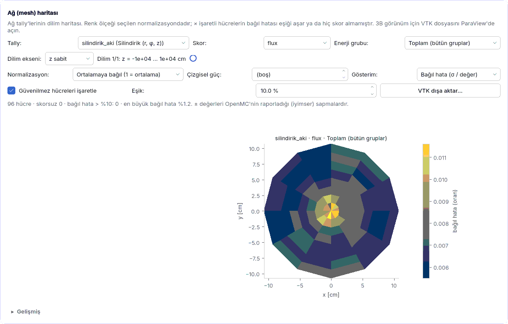

## 5.13 Ağ (mesh) akı ve güç haritası, ParaView

**Örnek:** `ornekler/pwr_mesh_aki.json` · **Seviye:** orta · **Ön koşul:** [5.1](05-dersler.md#ders-demet)
· **Başvuru:** [4.11 Ağ (mesh) tally'si](04k-mesh-tally.md#mesh-tally)

Amaç: 17 × 17 PWR demetinde pin pin güç haritası ve iki grup akı haritası çıkarmak, istatistiğin
yeterli olup olmadığını σ haritasıyla sınamak ve sonucu ParaView'e aktarmak.

### Adım 1: ağı incele

1. Başlangıç ekranından **PWR 17×17 demeti: mesh akı ve güç haritası** örneğini açın.
2. **Hesap ayarları › Tally'ler** kartında `mesh_aki_guc` tally'sini seçin: skorlar akı ve
   kappa-fission, **Enerji grupları** açık ve **Grup yapısı** CASMO-2 (0.625 eV sınırı),
   **Ağ (mesh) tally'si** açık, **Ağ türü** Düzenli, **Ağ bölmeleri** 17 × 17.
   **Sınırları modelden al** açıkken öneri satırı ±10.71 cm yazar: ağ hücresi = 21.42 / 17 =
   1.26 cm = çubuk adımı, yani her hücre bir çubuk hücresidir. Ağ çubuk adımıyla örtüşmeseydi
   bir hücre iki çubuğun parçasını toplardı. Model 2B'dir (eksenel sonsuz): ağ z'de ±10⁴ cm,
   yani bütün z kolonunu kapsar ve değerler z üzerinden integraldir.
3. `silindirik_aki` tally'sini seçin: **Silindirik (r, φ, z)**, 8 halka × 12 dilim. Kare demette
   silindirik ağ köşeleri kaçırır (r = 10.71 cm iç teğet daire; alanın %21.5'i dışarıda);
   radyal profili görmek için yine de işe yarar.

### Adım 2: koş ve haritayı oku

**Çalıştır**'a basın. Ölçüm (5000 parçacık × 60 çevrim / 20 pasif, 6 iş parçacığı, ENDF/B-VIII.0,
OpenMC 0.16.0): ~35–45 s, k∞ = 1.1829 ± 0.0024. **Ağ (mesh) haritası** kartında:

* **Skor** kappa-fission, **Normalizasyon** Ortalamaya bağıl: 25 hücre boş ve × işaretli —
  24 kılavuz boru ve 1 enstrüman borusu, fisyon yok. Tepe ≈ 1.10, kılavuz boruların yanındaki
  çubuklarda (suyun fazla olduğu yerde moderasyon ve termalleşme artar); en düşük ≈ 0.88, demet
  kenarına yakın. Bağıl hata medyanı %2.7, en büyüğü %4.2: kaba %10 eşiğini hiçbir yakıt hücresi
  aşmaz, ama pin gücü için hedef **%1–2**'dir; bunun için geçmiş sayısını yaklaşık 4–7 kat
  artırın (bağıl hata ∝ 1/√N).
* **Skor** flux, **Enerji grubu** Grup 1 (termal) ve Grup 2 (hızlı): termal/hızlı akı oranı
  kılavuz boruda ≈ 0.20, köşe yakıt çubuğunda ≈ 0.16 — kılavuz borudaki fazla su nötronları
  termalleştirir.
* **Gösterim** Bağıl hata: termal grubun bağıl hata medyanı %2.4, hızlı grubun %1.0.
* Silindirik tally'de halka ortalamaları 0.994–1.003: sonsuz kafeste (yansıtıcı sınır) beklenen
  düz radyal profille tutarlıdır.

Aynı ayarla farklı tohum ±1–2σ fark verir; daha az parçacıkla (ör. 1000 × 20) çok sayıda ×
görürsünüz.

### Adım 3: mutlak güç yoğunluğu

**Normalizasyon** Mutlak (toplam güçten) seçin. Model 2B olduğundan kutunun adı **Çizgisel güç**
[W/cm] olur ve boş açılır (aktif yükseklik yok): 3400 MWth / 193 demet / 366 cm = 48.1 kW/cm,
yani **48 100** girin. Ölçüm: model geneli ısınma tally'si H = 9.38 × 10⁷ eV / kaynak nötronu
(`kappa-fission`); yakıt hücrelerinin ortalaması 114.7 W/cm³ = 48.1 kW/cm / 264 çubuk /
1.5876 cm² (çubuk hücresi alanı), tepe 126 W/cm³.

**Tutarlılık denetimleri:** (1) H / (k∞/ν̄) ≈ 9.38 × 10⁷ / (1.1829 / 2.43) ≈ 193 MeV, U-235'in
ENDF/B-VIII.0 MT458 geri kazanılabilir fisyon enerjisi 194.1 MeV ile tutarlı (ν̄ ≈ 2.43 varsayıldı).
(2) `heating-local` / `kappa-fission` = 1.030: yakalanma gamalarının payı ~%3. (3) **Skor** flux
ile ortalama toplam akı ≈ 3.0 × 10¹⁴ n/cm²·s — PWR mertebesi.

### Adım 4: ParaView

**VTK dışa aktar…** ile `mesh_aki_guc.vtk` yazın, ParaView'de açın (**File › Open**, **Apply**).
Renklendirmede `kappa_fission_toplam`, **Threshold** ile `kappa_fission_toplam_bagil_hata`
> 0.1 hücreleri ayıklayın (bu örnekte yakıtta boş kalır; skorsuz hücrelerde değer −1). 3B
modelde (ör. `pwr_3b`) z bölmesi ekleyip **Slice** ile eksenel dilim alabilirsiniz.

**Kontrol listesi:** ağ çubuk adımıyla örtüşüyor; × işaretli yakıt hücresi yok; bağıl tepe değeri
beklenen aralıkta; tutarlılık denetimleri geçiyor. Bu bir eğitim hesabıdır; lisanslama ya da
sertifika amacıyla kullanılamaz.
